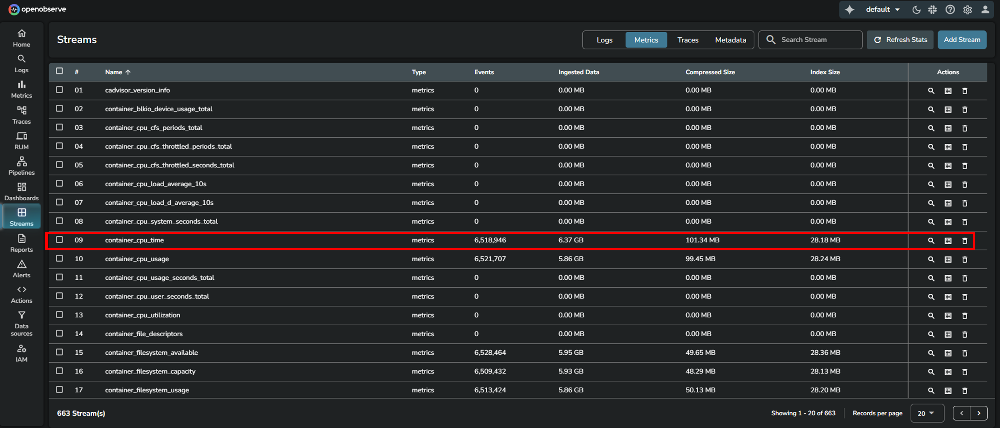
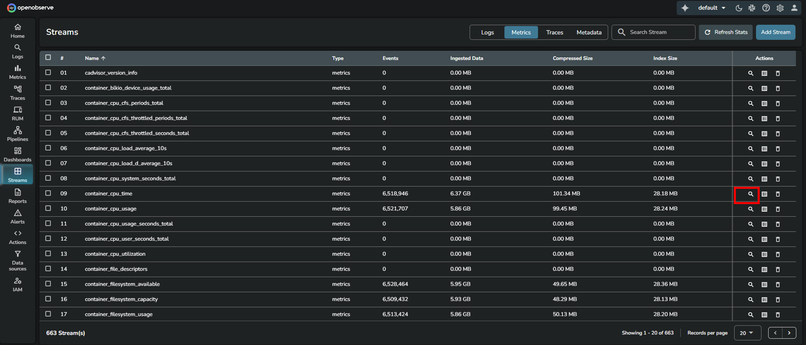
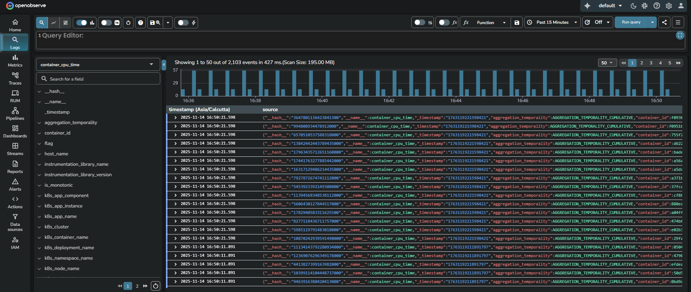
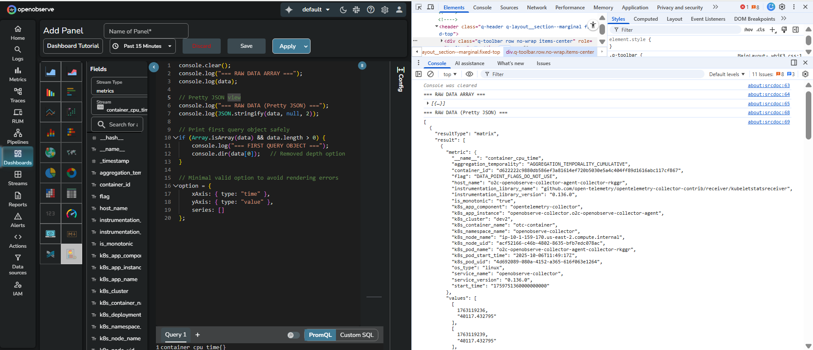
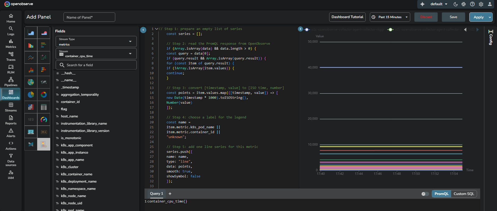

This guide explains how to build custom charts for metrics in OpenObserve using PromQL. The goal is to help new and advanced users understand how raw metrics data transforms into a fully rendered chart through predictable and repeatable steps.

## How metric data flows into a chart
Metrics data in OpenObserve follows a fixed transformation flow:

`Metrics data in OpenObserve > PromQL query > Matrix JSON > Transform into timestamp-value pairs > Render chart`

This data flow never changes. Only two things vary:

- The **PromQL query**
- The **JavaScript transformation logic** that prepares data based on the chart you want to build

The example uses the `container_cpu_time` metric and builds a time-series line chart.

## How to build the custom chart for metrics using PromQL

??? "Prerequisites"
    ### Prerequisites

    Before building a custom chart, ensure the following:

    - You have metrics data available in a metrics stream.
    - You know the basics of PromQL.
    - You know basic JavaScript because custom charts require writing JavaScript inside the editor.
    - You know the chart type you want to create and the data structure that chart expects.

??? "Step 1: Explore the metrics data"
    ### Step 1: Explore the metrics data

    OpenObserve stores metrics as time series with labels and values. To understand how your metrics look, explore them directly:

    1. Go to **Streams**.  
    2. Click the **Metrics** tab.
    3. Navigate to the metrics stream. For example, `container_cpu_time`  
    
    4.Click **Explore.**
    
    This takes you to the **Logs** page and shows a time-series view:  
    
    <br>
    
    The two most important fields for charting are:

    - `timestamp`
    - `value`
    
    All charts ultimately use these two fields.

??? "Step 2: Decide the chart you want to build"
    ### Step 2: Decide the chart you want to build

    Before you write a query or JavaScript, you must decide the chart type because every chart expects a specific structure.

    For example:

    - A line chart requires `[timestamp, value]` pairs
    - A bar chart requires `[category, value]` pairs
    - A multi-series chart requires an array of datasets

    Knowing the expected structure helps you prepare the right PromQL query and the right JavaScript transformation.


??? "Step 3: Create a dashboard and select the metrics dataset"
    ### Step 3: Create a dashboard and select the metrics dataset

    1. In the left navigation panel, select **Dashboards** and open or create a dashboard.
    2. Add a panel and go to **Custom Chart** mode.
    3. In the **Fields** section on the left, set **Stream Type** to **metrics**.
    4. Select your metrics stream from the dropdown. For example: `container_cpu_time`

    This ensures that the PromQL query will run against the correct metrics dataset.

??? "Step 4: Query and view your PromQL data"
    ### Step 4: Query and view your PromQL data
    Before building any chart, you must query the required metric. You can view the raw PromQL response to understand the structure that your JavaScript code must transform.

    1. Navigate to the bottom of the panel editor.
    2. The query editor section appears with two modes, **PromQL** and **Custom SQL**.
    3. Click **PromQL** to switch the editor into PromQL mode.
    4. In the PromQL editor, enter a PromQL expression. For example: `container_cpu_time{}`
    5. To understand the data structure returned by the PromQL query, paste the following JavaScript in the code editor:
    ```js linenums="1"
    console.clear();
    console.log("=== RAW DATA ARRAY ===");
    console.log(data);

    // Pretty JSON view
    console.log("=== RAW DATA (Pretty JSON) ===");
    console.log(JSON.stringify(data, null, 2));

    // Print first query object safely
    if (Array.isArray(data) && data.length > 0) {
        console.log("=== FIRST QUERY OBJECT ===");
        console.dir(data[0]);   // Removed depth option
    }

    // Minimal valid option to avoid rendering errors
    option = {
        xAxis: { type: "time" },
        yAxis: { type: "value" },
        series: []
    };
    ```
    6. Select the time range in the time range selector.  
    7. Open your browser developer tools. Right-click anywhere inside the dashboard and select **Inspect**.  
    7. Open the **Console** tab.  
    8. In the panel editor, click **Apply**.
    
    You get to see the complete raw PromQL response.  

    !!! note "How to interpret it"  
        OpenObserve returns PromQL data in the following structure: 
        ```js linenums="1" 
        [
            {
            resultType: "matrix",
            result: [
                {
                metric: { ...labels... },
                values: [
                    [timestamp, value],
                    ...
                        ]
                    }
                ]
            }
        ]
        ```
        Here,

        - The outer array represents all PromQL queries in the panel. If you run one query, the array contains one item.
        - `resultType`: "matrix" indicates that PromQL returned time-series data.
        - The `result` array contains one entry for each time series in the query result. 
        - Each metric object contains the labels that identify the series, such as `k8s_pod_name`, `container_id`, or `service_name`.
        - The `values` array contains the actual time-series datapoints. Each entry is `[timestamp, value]` where:

            - `timestamp` is in Unix seconds
            - `value` is the metric value at that moment

        This structure does not change. All metric visualizations in custom charts follow this same model. This is the starting point for all PromQL-based custom charts.

??? "Step 5: Understand how to transform the data and render the chart"
    ### Step 5: Understand how to transform the data and render the chart
    Now that you have inspected the raw PromQL response, you can prepare the data and build a chart.
    Every PromQL-based custom chart in OpenObserve follows the same flow:
    `data > transform > series > option > chart`
    The following subsections explain each part in the correct order.

    #### `data`: The raw PromQL matrix
    This is the starting point. `data` object is automatically available inside your custom chart editor. It holds the raw response from your PromQL query.

    As shown in step 4, you will see the `data` object in the following structure:
    ```js linenums="1"
    [
        {
        "resultType": "matrix",
        "result": [
            {
            "metric": {
                        "k8s_pod_name": "o2c-openobserve-collector-agent-collector-rkggr",
                        "container_id": "d622222c9880db586ef3a81614ef720b5030e5a4c404ff89d1616abc117cf867"
                        },
            "values": [
                        [1763035098, "39370.53"],
                        [1763035101, "39370.53"],
                        ...
                    ]
                }
            ]
        }
    ]
    ```
    Here:

    - Each object inside result represents one metric series.
    - The `metric` object holds all identifying labels.
    - The values array holds the actual time-series data as `[timestamp, value]`.


    #### Transformation: Convert raw datapoints into chart-friendly points
    This is where you prepare the data for visualization. The chart that you want to build expects the data in a specific format, where each point is `[x, y]`. 

    - `x` > time (in ISO format)
    - `y` > numeric value

    Perform the following conversion in JavaScript:
    ```js linenums="1" 
    const points = item.values.map(([timestamp, value]) => [
    new Date(timestamp * 1000).toISOString(),
    Number(value)
    ]);
    ```
    After this step, you have clean, chart-ready data such as:
    ```js linenums="1" 
    [
    ["2025-11-13T09:18:00Z", 39370.53],
    ["2025-11-13T09:18:03Z", 39370.80]
    ]
    ```
    !!! note "Note"
        Every chart type, whether line, bar, or scatter, starts with this transformation. Only how you display it changes later.

    #### `series`: Build one chart series per metric
    `series` is an array you create in your JavaScript code. Each entry in series describes one visual line, bar set, scatter set, and so on. 

    Each entry has:

    - A name for the legend
    - A type such as line
    - A data array with the points you want to plot

    For example: 

    ```js linenums="1"
        series.push({
        name: item.metric.k8s_pod_name || "default",
        type: "line",
        data: points,
        smooth: true,
        showSymbol: false
    });
    ```

    #### `option`: Define the final chart configuration
    `option` defines how the chart looks and behaves. It tells the system what axes to use, whether to display tooltips or legends, and how to organize the visual elements.
    ```js linenums="1"
    option = {
    tooltip: { trigger: "axis" },
    legend: { type: "scroll" },
    xAxis: { type: "time", name: "Time" },
    yAxis: { type: "value", name: "CPU Time" },
    series
    };
    ```
    The `series` array you built earlier is now linked here.  

??? "Step 6: Transform the data and render the chart"
    ### Step 6: Transform the data and render the chart

    Here is the complete JavaScript code example that combines all steps mentioned in Step 5. 
    <br>

    **PromQL query:**
    ```
    container_cpu_time{}
    ```
    <br>

    **JavaScript code:**

    ```js linenums="1"
    /// Set the chart type you want
    // Supported examples: "line", "scatter", "bar"
    const chartType = "bar";

    // Step 1: prepare an empty list of series
    const series = [];

    // Step 2: read the PromQL response from OpenObserve
    if (Array.isArray(data) && data.length > 0) {
    const query = data[0];

    if (query.result && Array.isArray(query.result)) {
        for (const item of query.result) {
        if (!Array.isArray(item.values)) {
            continue;
        }

        // Step 3: convert [timestamp, value] to [ISO time, number]
        const points = item.values.map(([timestamp, value]) => [
            new Date(timestamp * 1000).toISOString(),
            Number(value)
        ]);

        // Step 4: choose a label for the legend
        const name =
            item.metric.k8s_pod_name ||
            item.metric.container_id ||
            "unknown";

        // Step 5: add one series entry for this metric
        series.push({
            name: name,
            type: ,
            data: points
        });
        }
    }
    }

    // Step 6: define how the chart should be drawn
    option = {
    xAxis: { type: "time", name: "Time" },
    yAxis: { type: "value", name: "Value" },
    legend: { type: "scroll", top: "top" },
    tooltip: { trigger: chartType === "scatter" ? "item" : "axis" },
    series: series
    };
    ```

    The line chart uses `[timestamp, value]` pairs and plots each metric as a line across time.

??? "Step 7: View the result"
    ### Step 7: View the result
    
    Select the time range from the time range selector and click **Apply** to render your chart.  

    Each unique metric label combination will appear as a separate line.

!!! note "Note" 
    You can use the same JavaScript code to create other charts that use [timestamp, value]. For example, bar charts or scatter charts. Only change the **type** in the above JavaScript code:
    ```
    type: "bar"
    ```
    or

    ```
    type: "scatter"
    ```