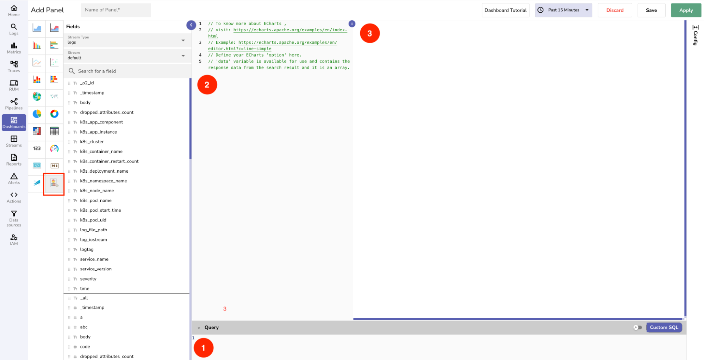

Custom charts in OpenObserve let you create visualizations by using SQL to query the data and JavaScript to define how the chart appears. 
Custom charts are ideal when you need advanced visualizations or more flexibility than built-in chart types provide.

This guide introduces the fundamentals of custom charts in OpenObserve, including how to access custom charts in the UI, how to choose the right chart type, and prepare and reshape data based on chart requirements.

**Note**: This guide is for users comfortable writing SQL and JavaScript who want full control over how their charts appear.

> If you are already familiar with how Custom Charts work and are looking for use case examples, see the following guides:
>
> - [Custom Charts: Flat Data](custom-charts-flat-data.md)  
> - [Custom Charts: Nested Data](custom-charts-nested-data.md)  
> - [Custom Charts: Event Handlers and Reusable Function (CustomFn)](custom-charts-event-handlers-and-custom-functions.md) 

## How to Access Custom Charts

1. Go to **Dashboards** from the left-hand navigation menu.  
2. Do one of the following:   

    - **To add the chart to a new dashboard:** Click **Create Dashboard**, enter a dashboard name, description, select folder, and click **Save**.  
    - **To use an existing dashboard:** Select the dashboard from the list. You can optionally add a new tab to organize your panels.  

3. Click **Add Panel**.  
4. Enter a name for the panel.  
5. In the **Add Panel** page, select **Custom Chart** from the list of charts.



After selecting **Custom Chart**, the screen displays: 

1. A SQL editor to write your query
2. A JavaScript editor to define how the chart should be displayed
3. A chart preview panel to preview the output


## How Does Custom Charts Work

Creating a custom chart involves these high-level steps:

1. [**Choose the Chart**](#choose-the-chart): Choose the right chart type and check whether it expects flat or nested data. 
2. [**Know Your Data**](#know-your-data): Choose the stream that contains the data you want to visualize. Review the structure of the ingested data. Knowing what fields are available and how they are organized will help you write your query.
3. [**Build the Chart**](#build-the-chart):

    - Write a SQL query to fetch data from the selected stream and prepare the required fields. The result is stored in `data[0]`.
    - (Optional) Use JavaScript to reshape `data[0]` if the chart expects a nested structure.
    - Use `data[0]` or the reshaped data to define the `option` object that renders the chart.

6. **Preview**: Preview the chart and adjust your SQL or JavaScript as needed.

> **Note**: Using custom charts, you can create and configure any chart supported by [ECharts](https://echarts.apache.org/examples/en/).  


## Choose the Chart

Use the following table to choose an appropriate chart for your use case and note the data structure expected by the chart: 

=== "Charts That Expect Flat Data"

    | Chart Type         | Usage                                                                 | Data Structure Expected                                |
    |--------------------|-------------------------------------------------------------------------------------|-----------------------------------------------------|
    | **Bar Chart**          | Count and compare things like number of errors per service                         | `{"service": "auth", "count": 30}`                  |
    | **Stacked Bar Chart**  | Break down each bar by another field, like error types within services             | `{"service": "auth", "type": "500", "count": 20}`   |
    | **Line Chart**         | Track how something changes over time, like CPU usage or latency                   | `{"timestamp": "10:00", "value": 75}`               |
    | **Multi-Line Chart**   | Compare time trends across multiple sources, like CPU usage by server              | `{"timestamp": "10:00", "server": "A", "value": 75}`|
    | **Area Chart**         | Visualize total usage or growth over time                                          | Same format as Line Chart                           |
    | **Stacked Area Chart** | Show cumulative trends grouped by source, like traffic by region                   | Same format as Multi-Line Chart                     |
    | **Pie Chart**          | Show the share of each category, like how logs are split by type                   | `{"type": "INFO", "count": 120}`                    |
    | **Funnel Chart**       | Visualize drop-offs through steps, like how many logs reached each stage           | `{"step": "filtered", "count": 8000}`               |
    | **Gauge Chart**        | Display one key value in real time, like current queue length or uptime            | `{"value": 98.5}`                                   |
    | **Heatmap**            | Spot hotspots by comparing values across two fields, like errors per host per hour | `{"host": "A", "hour": "10AM", "errors": 12}`       |
    | **Histogram**          | Group values into ranges to see distribution, like response times in buckets       | `{"bucket": "0–100ms", "count": 150}`               |
    | **Box Plot**           | Understand value spread and outliers, like latency ranges per API                  | `{"api": "/login", "values": [10, 25, 60, 100]}`    |
    | **Timeline Chart**     | Show when events started and ended, like deployments or outages                    | `{"start": "10:00", "end": "10:15", "label": "deployment"}` |
    | **Waterfall Chart**    | Break down total time into phases, like each stage of a request                    | `{"step": "SQL", "duration": 40}`                   |
    | **Radar Chart**        | Score and compare multiple aspects of something, like API performance              | `{"api": "getUser", "latency": 30, "cpu": 40, "errors": 2}` |
    | **Scatter Plot**       | Spot relationships between two metrics, like payload size vs. response time        | `{"x": 3000, "y": 150}`                              |
    | **Step Line Chart**    | Show when something changed, like a feature flag turning on/off                    | `{"timestamp": "10:00", "state": "on"}`             |
    | **Table**              | Show raw results in a tabular format, like the top 10 slowest queries              | List of records like `{"query": "...", "duration": 1200}` |


=== "Charts That Expect Nested Data"

    | Chart Type           | Usage                                                                 | Data Structure Expected                                      |
    |----------------------|-------------------------------------------------------------------------------------|-----------------------------------------------------------|
    | **Sunburst Chart**       | Explore categories within categories, like org → service → error type              | `{"name": "org", "children": [...]}`                      |
    | **Treemap**              | Compare sizes inside nested groups, like log size by team and service              | Nested structure with `value` at each level               |
    | **Flame Chart**          | Visualize execution steps with duration, like function or trace spans              | Nested objects with `name`, `start`, `end`, `value`, `children` |
    | **Nested Pie Chart**     | Show a main category split into subcategories, like env → service → log type       | Nested `children` with `name` and `value`                 |
    | **Icicle Chart**         | Show categories in a top-down layout, like service → module → function             | Same as sunburst but vertically arranged                  |
    | **Partition Chart**      | Show side-by-side hierarchy splits, like service trees                             | Same nested format                                        |
    | **Organization Chart**   | Show ownership or team structures in a hierarchy                                   | Nested `children` structure with `label` fields           |
    | **Collapsible Tree**     | Let users expand/collapse nested items, like trace paths or nested logs            | Nested structure, same as flame chart                     | 

## Know Your Data

Before you build a custom chart, you need to know:

- **What data you already have**: This is the structure of your ingested data, which is usually flat.
- **What the chart expects**: Each chart type needs data in a specific format. Some charts expect flat data, while others require nested data.

> **Note**: Understanding both is important because it helps you write the right SQL query, [prepare](#prepare-and-reshape-data) the data through grouping or aggregation, [reshape](#prepare-and-reshape-data) the results to match the chart’s structure, and map them correctly in the JavaScript code that renders the chart.

## Build the Chart

The chart building stage involves the following steps: 

1. **Fetch and prepare your data using SQL**: Data fetching and preparation is done using SQL. It includes filtering, aggregating, and converting values (e.g., durations to seconds). The output gets stored into the [data object](#the-data-object).  
2. **Reshape the data (if needed) using JavaScript**: If the chart expects a nested structure, convert data[0] into a new variable (e.g., treeData). For charts that expect flat data, no reshaping is needed. 
3. **Use the `data` object or the reshaped variable in your chart config**: Flat charts can use data[0] directly; nested charts require the reshaped data.
4. **Pass the final dataset to the [`option` object](#the-option-object)**: Use the selected data source to configure how the chart appears and behaves.


## Key Concepts

### The `data` Object 

OpenObserve stores the query result in a global object called ``` data` ``. This is always an **array of an array**:

```linenums="1"
data = 
[
  [ /* all queried data for the selected time range */ ]
]
```

- `data[0]` contains the result set of your query which is an array of rows.  
- Each item in `data[0]` is an object representing a single row.

### The `option` Object

In the JavaScript editor, you must construct an object named `option`. 

Key Points: 

- This `option` object defines how the chart looks and behaves. 
- To feed data into the chart, use the query result stored in `data[0]`. `data[0]` is an array of records returned from your SQL query. 
- Use `data[0]` to build the series, `xAxis`, `yAxis`, and other chart parts inside the `option` object.

#### Components of the `option` Object

Here are the main components of the `option` object:

**1. `title`: Sets the chart’s title.**

``` linenums="1" 
option.title = { text: "My Chart" };  
```  
**Note**: You can also include subtitles, alignment, and styling.

**2. `tooltip`: Enables hover-over tooltips.**  
```linenums="1"  
option.tooltip = { trigger: 'axis' }; // for line/bar charts  
option.tooltip = { trigger: 'item' }; // for pie or treemap charts  
```  
**Note**: Use 'axis' to show tooltips along axes and 'item' to show them per slice or node.

**3. `legend`: Displays the list of series (or categories) in the chart.**

```linenums="1"  
option.legend = {   
  data: ['Series 1', 'Series 2'],  
  orient: 'horizontal'   
};  
```  
**Note**: The legend helps users toggle visibility for multi-series charts.

**4.`xAxis` and `yAxis`:** Configure the axes for charts like bar or line.

```linenums="1"  
option.xAxis = { type: 'category', data: [...] };  
option.yAxis = { type: 'value', name: 'Count' };  
```  
**Note**: 

- Use `type: 'category'` for named groups like days or statuses.  
- Use `type: 'time'` for timestamps.  
- Use `type: 'value'` for numeric values.  
- Some charts (like pie or sunburst) do not use axes. In those cases, omit these fields.

**5. `series`: Defines what data to plot and what type of chart to use.**  
```linenums="1"  
option.series = [{  
  type: 'bar',  
  name: 'My Values',  
  data: [ /* values go here */ ]  
}];  
```  
**Note:** 

- Use `type: 'line'` for line charts.  
- Use `type: 'bar'` for bar charts.  
- Use `type: 'pie'`, `'treemap'`, or `'sunburst'` for hierarchical charts.  
- You can add multiple series to show multiple lines or bars in one chart. Use your query result (data[0]) to build each series. For example:

```linenums="1"  
option.series[0].data = data[0].map(row => row.count);  
option.series[0].name = 'Errors';

```

## Next Steps

- [Custom Charts: Flat Data](custom-charts-flat-data.md)  
- [Custom Charts: Nested Data](custom-charts-nested-data.md)  
- [Custom Charts: Event Handlers and Reusable Function (CustomFn)](custom-charts-event-handlers-and-custom-functions.md)  
