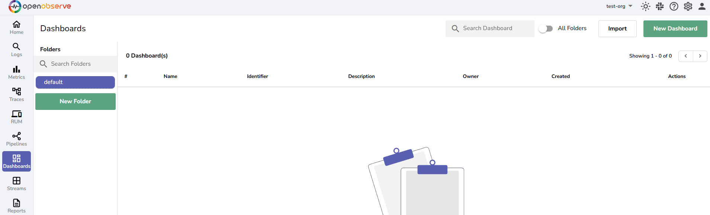
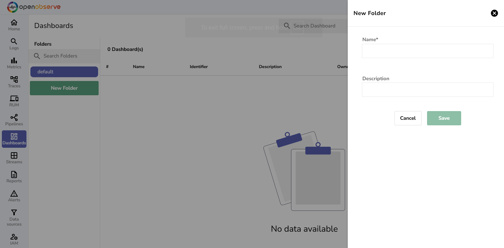
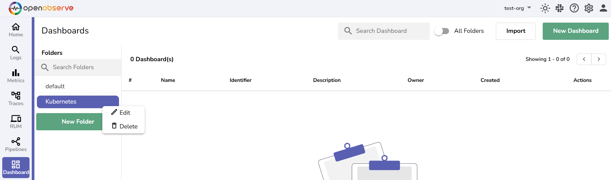
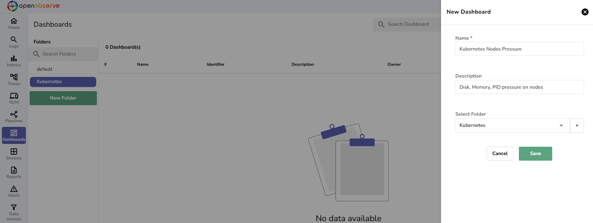
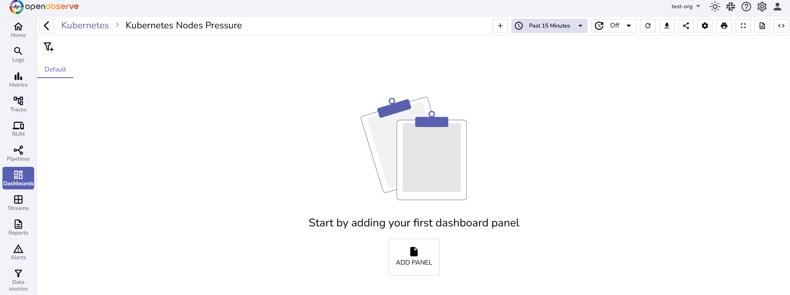
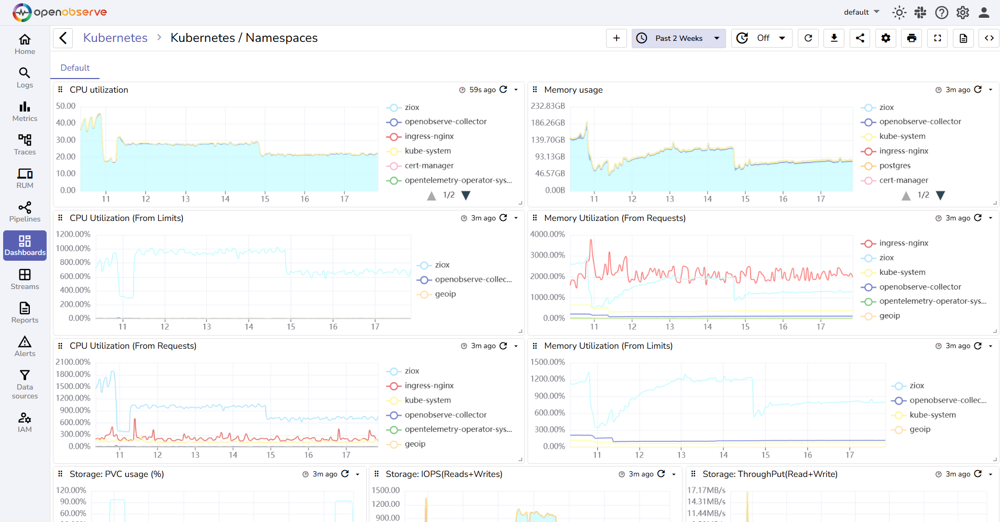
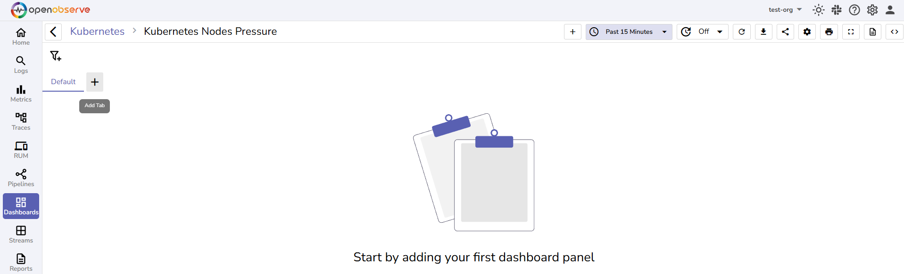
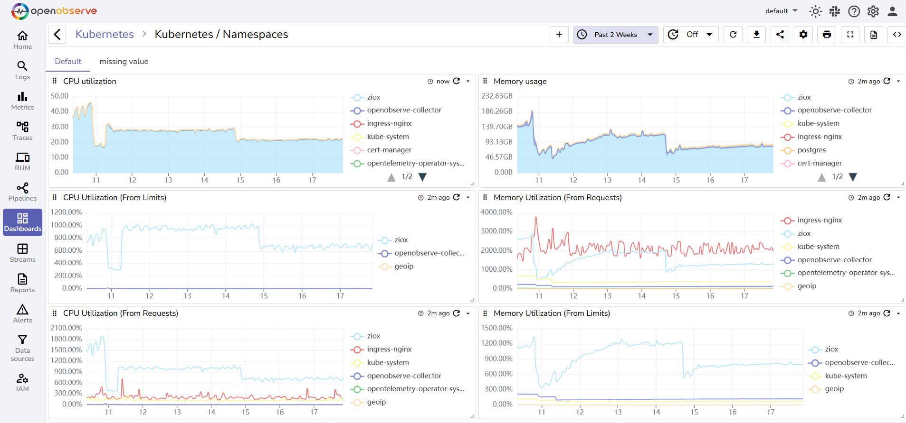
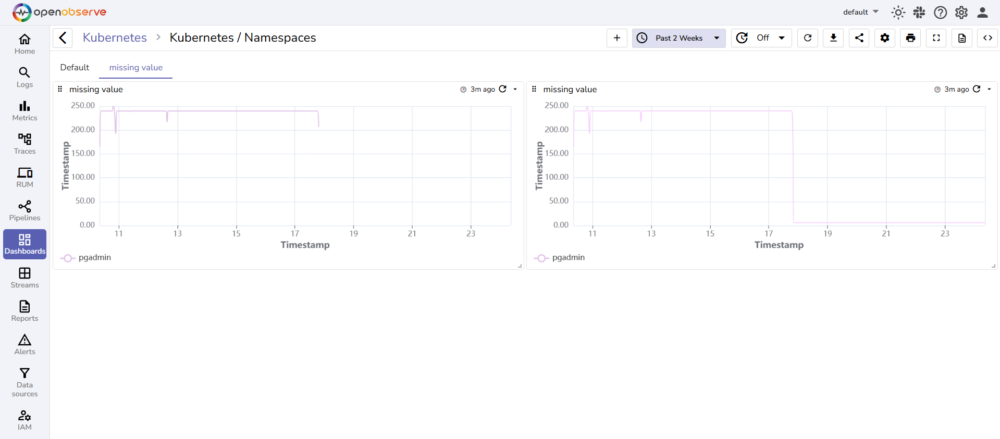

This guide introduces you to the **Dashboards** in OpenObserve, including what they are, how to access them, and how to create a new dashboard.

## Introduction to Dashboards

In OpenObserve, **Dashboards** are central to data visualization and monitoring. They provide a way to display real-time and historical data in an interactive, easy-to-understand format. 

The purpose of **Dashboards** is to offer an intuitive, at-a-glance view of your data, helping you:

- **Visualize trends**: Track performance over time with charts and graphs.  
- **Monitor systems**: Keep an eye on critical systems or services in real-time.  
- **Analyze errors**: Detect and analyze errors or issues that need attention.  
- **Facilitate collaboration**: Share and discuss insights with team members through dynamic and interactive data visualizations.

## How to Access Dashboards

On the left-hand side menu, click **Dashboards** to access the dashboard management section.

## Dashboard Structure in OpenObserve

**Folders**: Dashboards are stored in folders. By default, the **default** folder is created. However, you can create additional folders to organize **Dashboards** based on your requirements.

- **Creating New Folders:** To create a new folder, click the **New Folder** button, and provide a folder name and description.

- **Editing or Deleting Folders**: To edit or delete a folder, click the vertical ellipsis (three dots) menu next to the folder name in the folder list. This allows you to rename or remove the folder as needed.

**Dashboards**: Inside each folder, you can create one or more **Dashboards**. Dashboards hold Panels, which represent visualizations of your data.

- **Creating Dashboards**: To create a new Dashboard, click the **New Dashboard** button, add Name and Description for the Dashboard, and select an existing folder or create a new folder to organize the Dashboard. Use the **Import** button to import an existing Dashboard.  
 **Note**: Dashboards can contain one or more Panels for visualizing various data points or metrics.

**Panels**: A Panel contains a single visualization (e.g., a line chart, bar chart, table, etc.) representing specific data.

- **Adding Panels**: To add a Panel inside a Dashboard, click the **Add Panel** button.   
 **Note**: Each Panel displays one type of visualization. You can add multiple Panels to a Dashboard to represent different data.

Example of a Dashboard with Panels:

**Tabs:** **Tabs** help organize your Panels into different sections within a **Dashboard**. For example, you might have one Tab for Performance, another for Errors, and another for Traffic Analysis.

- **Default Tab**: By default, Panels are added to the default Tab.  
- **Creating New Tabs**: To create a new Tab, click the + icon next to the default Tab and enter a Tab name. You can create new Tabs from the **Tabs** menu under the **Dashboard Settings**.

Example of a Dashboard with Panels in different Tabs:

[**Next Step: Manage Dashboards**](manage-dashboards.md)