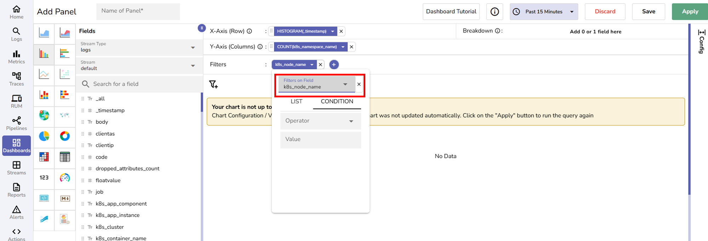
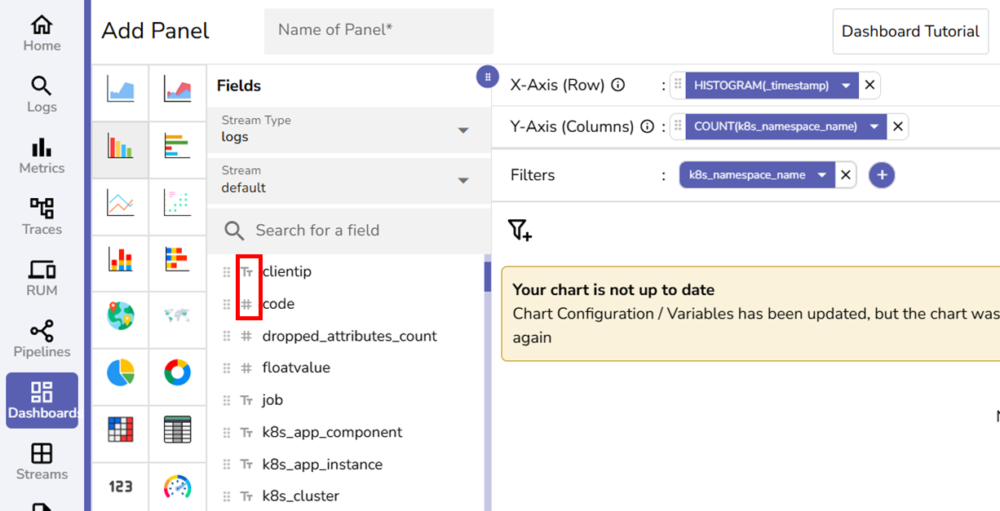
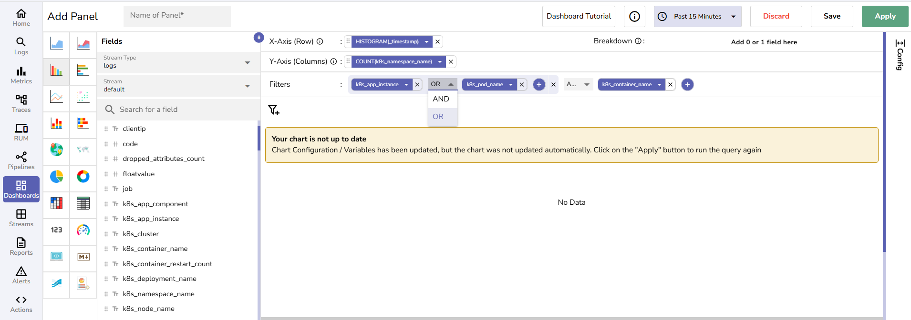

This guide provides instructions on how to apply filters to narrow the data shown in a dashboard panel by using fixed values, referencing dynamic variables, or combining multiple conditions with logical operators.

## When to Use Filters

Use filters to:

- View only specific logs, metrics, or trace data
- Make dashboards interactive using variables
- Apply logic-based filtering for complex scenarios

## How to Add Filters
The following section explains how to add different types of filters, with examples.

### List: Static Filter

Use static filters when the filter values are known and do not change at runtime.

**To add a static filter to a panel:**

1. In the panel editor, select the **+** icon in the **Filters** section. 
2. Select **Add Condition**. 

Alternatively, hover over a field in the **Fields** section and select the **+F** icon to add a filter directly.
3. Click the filter and open the dropdown. 
3. Verify or change the selected field using the **Filters on Field** dropdown.

4. Choose the **List** tab. 
5. Select one or more values from the available list. 

This panel filters data strictly based on the selected values.

**Use Case:** View total log volume over time across two Kubernetes nodes. 

- X-axis: `HISTOGRAM(_timestamp)`
- Y-axis: `COUNT(k8s_namespace_name)`
- Filter:

    - Field: `k8s_node_name`
    - Value: i`p-10-2-45-217.us-east-2.compute.internal`, `ip-10-2-140-110.us-east-2.compute.internal` 

This panel displays the total log activity for the selected values.  

### Condition: Dynamic Filter

Use this when the value needs to be typed manually or passed dynamically using a variable.

To add a dynamic filter to a panel:

1. In the panel editor, select the **+** icon in the Filters section. 
2. Select **Add Condition**. 

Alternatively, hover over a field in the **Fields** section and select the **+F** icon to add a filter directly.
3. Click the filter and open the dropdown. 
3. Verify or change the selected field using the **Filters on Field** dropdown.

4. Choose the **Condition** tab. 
5. In the **Operator** section, choose an operator. For example, `=`, `>`, `IN`, `str_match`. 
6. In the **Value** section, you can provide a fixed value or a variable like `$my_variable`. Ensure that the variable named `my_variable` exists. See [Variables in OpenObserve](../../variables/variables-in-openobserve/) to learn how to create a variable.
7. Click **Save** to save the panel. 
!!! note "Important"
      Before you provide a fixed value, know the filed type associated with the value. This helps avoid syntax errors and ensures accurate query generation.

      The field type is indicated with `Tt` and `#` in the **Fields** list. 
      `Tt` represents string fields and `#` represents numeric fields. 
       

      When a filter is applied:

      - For string fields, values are automatically quoted in the SQL query. For example, `'123e'`. 
      - For numeric fields, values are treated as raw numbers. For example, `123e`. 

## Add Filter Groups
1. In the **Filter** section, click **+ > Add Group** to create nested filters. You can add multiple filter conditions inside the group and combine them using **AND** or **OR** operators. 

2. After configuring filters, click **Apply** to run the query. 
3. Click **Save** to save the panel. 

!!! note "Note"
      You can also combine static and dynamic filters.
