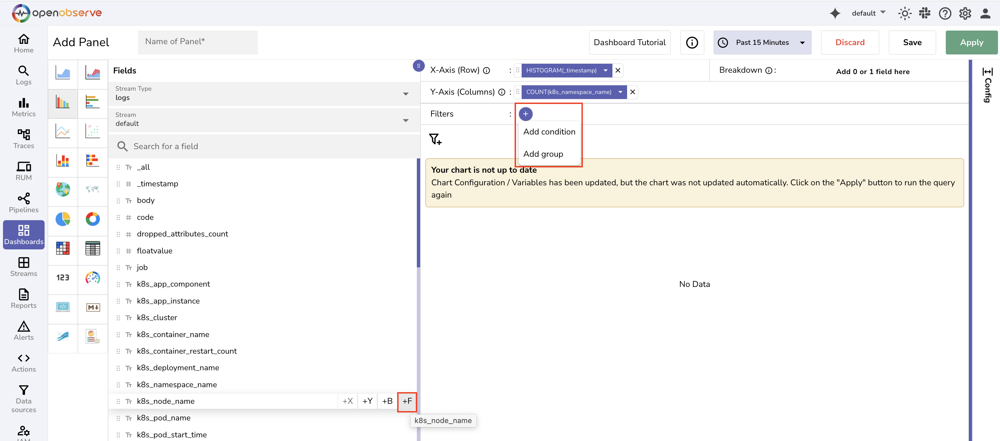
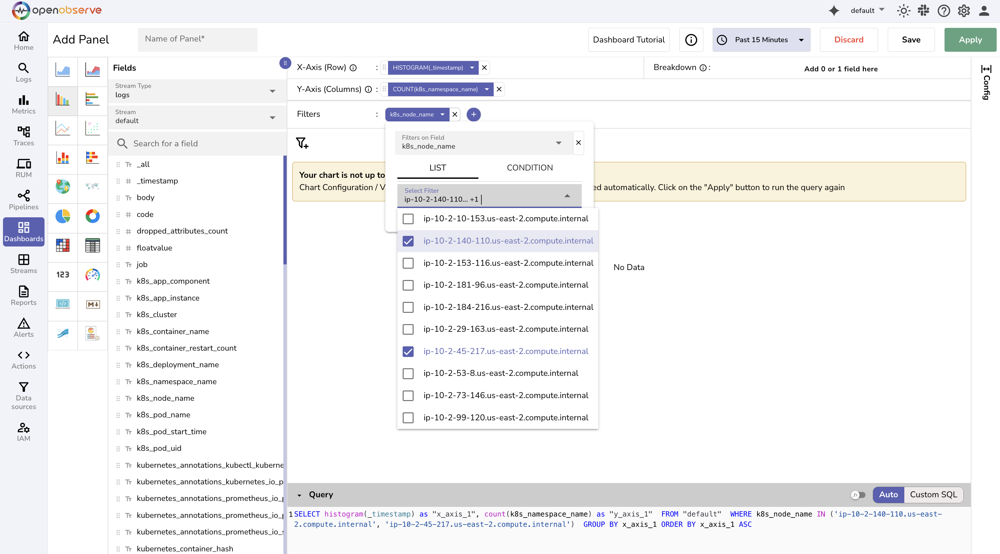
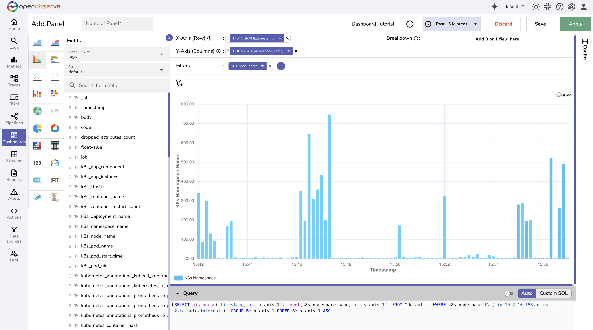

This guide provides instructions on how to apply filters to narrow the data shown in a dashboard panel by using fixed values, referencing dynamic variables, or combining multiple conditions with logical operators.

## When to Use Filters

Use filters to:

- View only specific logs, metrics, or trace data
- Make dashboards interactive using variables
- Apply logic-based filtering for complex scenarios

## How to Add Filters
The following section explains how to add different types of filters, with examples.

### List: Static Filter

Use static filters when the filter values are known and do not change at runtime.

**To add a static filter to a panel:**

1. In the panel editor, select the **+** icon in the Filters section. 
2. Select **Add Condition**. 

Alternatively, hover over a field in the **Fields** section and select the **+F** icon to add a filter directly.
3. Click the filter and open the dropdown. 
3. Verify or change the selected field using the **Filters on Field** dropdown.
4. Choose the **List** tab. 
5. Select one or more values from the available list. 

This panel filters data strictly based on the selected values.

**Use Case:** View total log volume over time across two Kubernetes nodes. 

- X-axis: `HISTOGRAM(_timestamp)`
- Y-axis: `COUNT(k8s_namespace_name)`
- Filter:

    - Field: `k8s_node_name`
    - Value: i`p-10-2-45-217.us-east-2.compute.internal`, `ip-10-2-140-110.us-east-2.compute.internal` 

This panel displays the total log activity for the selected values. <br>


### Condition: Dynamic Filter

Use this when the value needs to be typed manually or passed dynamically using a variable.

To add a dynamic filter to a panel:

1. In the panel editor, select the **+** icon in the Filters section. 
2. Select **Add Condition**. 

Alternatively, hover over a field in the **Fields** section and select the **+F** icon to add a filter directly.
3. Click the filter and open the dropdown. 
3. Verify or change the selected field using the **Filters on Field** dropdown.
4. Choose the **Condition** tab. 
5. Choose an operator (for example, `=`, `>`, `IN`, `str_match`)
* Provide a fixed value or a variable like `$my_var`

When you enter  values manually:
**Field Types and Values:**
* The field type is indicated in the Fields list:
   * `Tt` (Text): Represents string fields
   * `#` (Number): Represents numeric fields
* When a filter is applied:
   * For string fields, values are automatically quoted in the SQL query (for example, `'123e'`)
   * For numeric fields, values are treated as raw numbers (for example, `123e`)

This helps avoid syntax errors and ensures accurate query generation.

When you enter values dynaically using variables: 

Step 1: Create the Variable
Create a variable named pod to dynamically fetch all unique pod names from your log stream.

Variable Type: Query Values

Name: pod

Label: Pod

Stream Type: logs

Stream: default

Field: k8s_pod_name

After saving, the variable appears as a dropdown at the top of the dashboard.

Step 2: Configure the Panel
X-axis: HISTOGRAM(_timestamp)

Y-axis: COUNT(k8s_namespace_name)

Filter:

Field: k8s_pod_name

Type: Condition

Operator: =

Value: $pod


### Grouped Filters (AND/OR Logic)

Use this to create nested filters with logical combinations.

**Steps:**
* Click **+ > Add group**
* Add multiple filter conditions inside the group
* Define how the filters should be combined using **AND** or **OR**

**Example:**
```
(k8s_app_instance = "cert-manager" OR kubernetes_container_name = "nginx") AND level = "error"
```

### Combine Static and Dynamic Filters

You can mix static and dynamic filters in the same panel:
* Use **+** to add more filters
* Combine fixed values with variables or logic conditions
* All filters contribute to a single SQL query generated below the chart

## Apply and Save

After configuring filters:
* Click **Apply** to run the query
* Click **Save** to save the panel

If you change filters or variables later, click **Apply** again to refresh the panel.