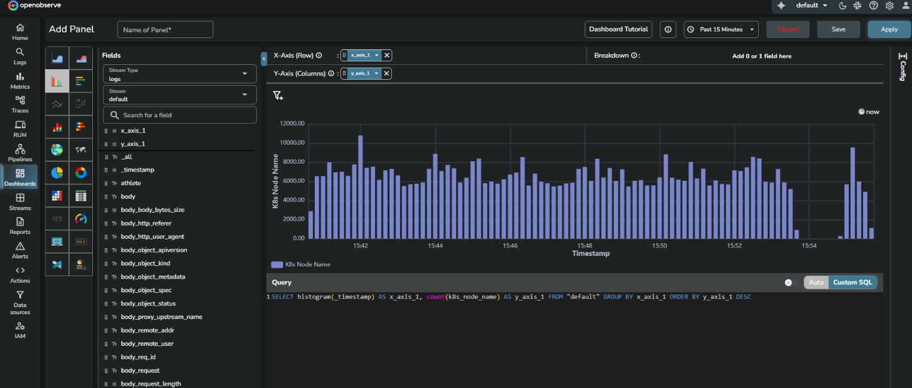
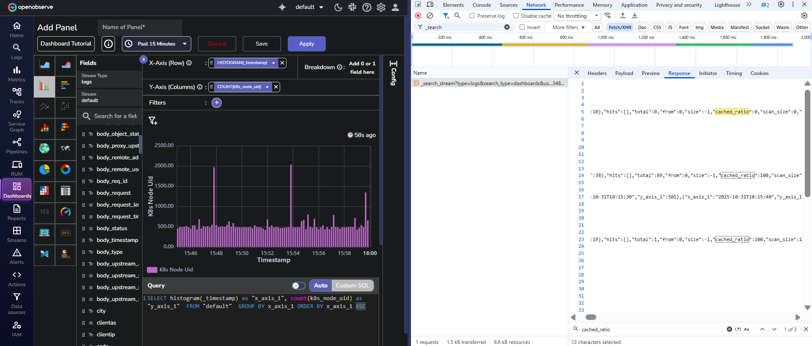

## Overview
When dashboard panels run queries over relative time ranges such as `Past 15 minutes` or `Past 1 hour`, the queried data often overlaps between refreshes.
To avoid scanning the same data repeatedly, OpenObserve uses **histogram caching**.

### Why caching is needed
Most dashboard queries overlap in time when refreshed.
<br>

**For example**:

- First query: `07:00` to `07:15`
- Next query: `07:01` to `07:16`

The two ranges share 14 minutes of the same data.
Only the one new minute from `07:15` to `07:16` needs fresh scanning.
Histogram caching reuses data for that overlapping part to prevent redundant processing.

### How caching works
Histogram caching operates automatically for dashboard panels that visualize time-series data.
When a new query overlaps with the previous time window, OpenObserve:

- Fetches the cached portion of results for the shared range.
- Scans and appends only the new slice of time.
- Updates metadata such as start and end timestamps.

### Example query
```sql
SELECT histogram(_timestamp) AS x_axis_1,
       count(k8s_node_name) AS y_axis_1
FROM "default"
GROUP BY x_axis_1
ORDER BY y_axis_1 DESC
```

In this query:

- `x_axis_1` represents time intervals on the X-axis, created by the `histogram()` function.
- `y_axis_1` represents the count of log entries for each interval.

When run repeatedly over relative time ranges, only the new data beyond the last cached timestamp is scanned, while older intervals are reused.


## Inspecting caching behavior
You can observe histogram caching in your browser’s developer tools by viewing the query metadata and response stream.

### View query response in the browser

Open the dashboard panel that already contains a runnable query.

1. Right-click anywhere on the page and select **Inspect**.
2. Select the **Network** tab.
3. Keep the **Network** tab open and click **Run query** in the OpenObserve dashboard.
4. Select the latest request.
5. Open the **Response** tab to see the event stream returned by the server.


### Key metadata fields
| Field name            | Meaning                                  | Typical observation                               |
| --------------------- | ---------------------------------------- | ------------------------------------------------- |
| `cached_ratio`          | Percentage of results fetched from cache | `0` for cold query, `100` for full cache reuse        |
| `order_by_metadata`     | Field and direction used for sorting     | `[["x_axis_1","asc"]]` or `[["y_axis_1","desc"]]` |
| `scan_records`          | Number of records read from disk         | Lower on cache hits                               |
| `took`, `took_detail`     | Total query time and breakdown           | Shorter when cache reuse occurs                   |
| `is_histogram_eligible` | Eligibility for histogram caching        | True for time-based histogram queries             |
| `search_response_hits`  | Actual rows returned                     | Sorted consistently with order metadata           |
| `progress`              | Query progress percentage                | Moves from `0` to `100`                               |


### Understanding cache ratios

`cached_ratio` indicates how much of a query’s output is reused.

- `0` > first run 
- `100` > complete cache reuse
- Partial value (`40`–`70`) > partial reuse for extended ranges
- Slightly less than `100` > recent data freshly scanned for accuracy



## Histogram caching scenarios

The following examples describe how histogram caching behaves across various query types and ordering patterns.
Each scenario includes the SQL query and what happens when executed in OpenObserve dashboards.

### Basic histogram with COUNT ORDER BY DESC

```sql
SELECT histogram(_timestamp) AS x_axis_1, count(_timestamp) AS y_axis_1 
FROM "default" 
GROUP BY x_axis_1 
ORDER BY y_axis_1 DESC
```

**What happens**: Results are cached with data ordered by count descending. Later queries reuse the cached data while preserving order.

### Basic histogram with COUNT ORDER BY ASC
```sql
SELECT histogram(_timestamp) AS x_axis_1, count(_timestamp) AS y_axis_1 
FROM "default" 
GROUP BY x_axis_1 
ORDER BY y_axis_1 ASC
```

**What happens**: Results are cached with data ordered by count ascending. A separate cache entry exists for ascending order.

### Histogram with SUM ORDER BY
```sql
SELECT histogram(_timestamp) AS time_bucket, SUM(bytes) AS total_bytes 
FROM "default" 
GROUP BY time_bucket 
ORDER BY total_bytes DESC
```

**What happens**: Results are cached with records ordered by the sum of bytes. Cache preserves both ordering field and direction.

### Histogram with AVG ORDER BY
```sql
SELECT histogram(_timestamp) AS time_bucket, AVG(response_time) AS avg_response 
FROM "default" 
GROUP BY time_bucket 
ORDER BY avg_response DESC
```

**What happens**: Results are cached with data ordered by average response time descending. Cached order metadata ensures correct sorting.

### Histogram with multiple aggregations, non-timestamp ORDER BY
```sql
SELECT histogram(_timestamp) AS time_bucket, 
       count(*) AS event_count,
       SUM(bytes) AS total_bytes
FROM "default" 
GROUP BY time_bucket 
ORDER BY total_bytes DESC
```

**What happens**: Results are cached with records ordered by total bytes. Both aggregations are stored; ordering follows total_bytes.

### Histogram with MAX ORDER BY
```sql
SELECT histogram(_timestamp) AS time_bucket, MAX(value) AS max_val 
FROM "default" 
GROUP BY time_bucket 
ORDER BY max_val DESC
```

**What happens**: Results are cached with data ordered by maximum value. Order metadata is preserved for consistent sorting.

### Multiple histogram columns with non-timestamp ORDER BY
```sql
SELECT histogram(_timestamp) AS time_bucket,
       status_code,
       count(*) AS request_count
FROM "default"
GROUP BY time_bucket, status_code
ORDER BY request_count DESC
```

**What happens**: Results are cached with grouping on both time_bucket and status_code. Cache preserves correct grouping and order.

### Standard histogram with timestamp ORDER BY (default ascending)
```sql
SELECT histogram(_timestamp) AS x_axis_1, count(_timestamp) AS y_axis_1 
FROM "default" 
GROUP BY x_axis_1 
ORDER BY x_axis_1 ASC
```

**What happens**: Results are cached in chronological order. Fast first-and-last logic improves reuse.

### Standard histogram with timestamp ORDER BY DESC
```sql
SELECT histogram(_timestamp) AS x_axis_1, count(_timestamp) AS y_axis_1 
FROM "default" 
GROUP BY x_axis_1 
ORDER BY x_axis_1 DESC
```

**What happens**: Results are cached in reverse chronological order. Cache reuse follows the same efficiency path.

### Histogram with no ORDER BY (default time order)
```sql
SELECT histogram(_timestamp) AS x_axis_1, count(_timestamp) AS y_axis_1 
FROM "default" 
GROUP BY x_axis_1
```

**What happens**: Results are cached in default ascending timestamp order. Overlapping time windows reuse cache data.

### Histogram with explicit _timestamp ORDER BY
```sql
SELECT histogram(_timestamp) AS time_bucket, count(*) AS cnt 
FROM "default" 
GROUP BY time_bucket 
ORDER BY _timestamp DESC
```

**What happens**: Results are cached using timestamp ordering identical to the default histogram order.

### Non-histogram aggregate query
```sql
SELECT count(*) AS total_count, SUM(bytes) AS total_bytes 
FROM "default" 
WHERE _timestamp BETWEEN '2025-10-01' AND '2025-10-06'
```

**What happens**: Cached using standard mechanisms, not histogram caching.

### Raw log query (no aggregation)
```sql
SELECT * FROM "default" 
WHERE _timestamp BETWEEN '2025-10-01' AND '2025-10-06'
ORDER BY _timestamp DESC
LIMIT 1000
```

**What happens**: Cached normally through standard query caching, not histogram caching.

### Non-histogram with non-timestamp ORDER BY
```sql
SELECT method, count(*) AS cnt 
FROM "default" 
GROUP BY method 
ORDER BY cnt DESC
```

**What happens**: Not eligible for histogram caching since no histogram function is used.

### Histogram with mixed ORDER BY (timestamp first, then count)
```sql
SELECT histogram(_timestamp) AS time_bucket, count(*) AS cnt 
FROM "default" 
GROUP BY time_bucket 
ORDER BY time_bucket ASC, cnt DESC
```

**What happens**: Treated as timestamp-ordered. Cache reuse continues for overlapping windows.

### Histogram with empty result set
```sql
SELECT histogram(_timestamp) AS time_bucket, count(*) AS cnt 
FROM "default" 
WHERE log_level = 'NONEXISTENT'
GROUP BY time_bucket 
ORDER BY cnt DESC
```

**What happens**: Cache handles empty results correctly and stores metadata for the query range.

### Very large time-range histogram
```sql
SELECT histogram(_timestamp) AS time_bucket, count(*) AS cnt 
FROM "default" 
WHERE _timestamp BETWEEN '2025-01-01' AND '2025-12-31'
GROUP BY time_bucket 
ORDER BY cnt DESC
```
**What happens**: Cache stores complete range metadata for long durations. Later queries reuse relevant parts efficiently.

### Histogram with recent data (within cache delay)
```sql
SELECT histogram(_timestamp) AS time_bucket, count(*) AS cnt 
FROM "default" 
WHERE _timestamp >= now() - INTERVAL '10 minutes'
GROUP BY time_bucket 
ORDER BY cnt DESC
```
**What happens**: Recent buckets within the cache-delay window are freshly scanned, older buckets are reused from cache.

### Histogram with multiple non-timestamp ORDER BY columns
```sql
SELECT histogram(_timestamp) AS time_bucket, 
       status_code,
       count(*) AS cnt,
       SUM(bytes) AS total_bytes
FROM "default"
GROUP BY time_bucket, status_code
ORDER BY cnt DESC, total_bytes DESC
```
**What happens**: Cache preserves ordering across both fields. Results are reused across refreshes with identical ordering.

### Large dataset histogram (test scan performance)
```sql
SELECT histogram(_timestamp) AS time_bucket, count(*) AS cnt 
FROM "default" 
WHERE _timestamp BETWEEN '2025-01-01' AND '2025-10-31'
GROUP BY time_bucket 
ORDER BY cnt DESC
```
**What happens**: Cache efficiently handles large scans. On later runs, reused buckets prevent redundant disk scans.

### High-cardinality histogram (many buckets)
```sql
SELECT histogram(_timestamp, '1m') AS time_bucket, count(*) AS cnt 
FROM "default"
WHERE _timestamp BETWEEN '2025-10-01' AND '2025-10-06'
GROUP BY time_bucket 
ORDER BY cnt DESC
```
**What happens**: Minute-level histograms are cached after the first scan. Future runs reuse cached buckets, minimizing scan time.

### First query (cold cache)
```sql
SELECT histogram(_timestamp) AS x_axis_1, count(*) AS y_axis_1 
FROM "default" 
GROUP BY x_axis_1 
ORDER BY y_axis_1 DESC
```

**What happens**: This initial query builds the cache. result_cache_ratio is 0 and cache files are created with correct timestamps.

### Second query (warm cache)
```sql
SELECT histogram(_timestamp) AS x_axis_1, count(*) AS y_axis_1 
FROM "default" 
GROUP BY x_axis_1 
ORDER BY y_axis_1 DESC
```
**What happens**: Cache is reused. result_cache_ratio rises to 100. Only new data is scanned, improving performance.

### Query with overlapping time range
```sql
SELECT histogram(_timestamp) AS x_axis_1, count(*) AS y_axis_1 
FROM "default" 
WHERE _timestamp BETWEEN '2025-10-01' AND '2025-10-05'
GROUP BY x_axis_1 
ORDER BY y_axis_1 DESC
```
**What happens**: Cache reuses overlapping results. Only the subset is returned with no duplicates.

### Query with extended time range
```sql
SELECT histogram(_timestamp) AS x_axis_1, count(*) AS y_axis_1 
FROM "default" 
WHERE _timestamp BETWEEN '2025-10-01' AND '2025-10-10'
GROUP BY x_axis_1 
ORDER BY y_axis_1 DESC
```
**What happens**: Cache partially reuses existing data and merges new results for the extended range. Duplicates are avoided, and ordering is preserved.