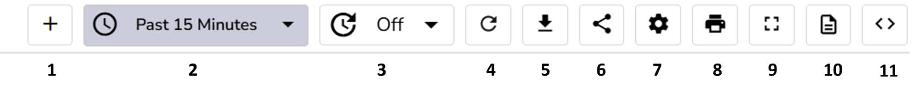
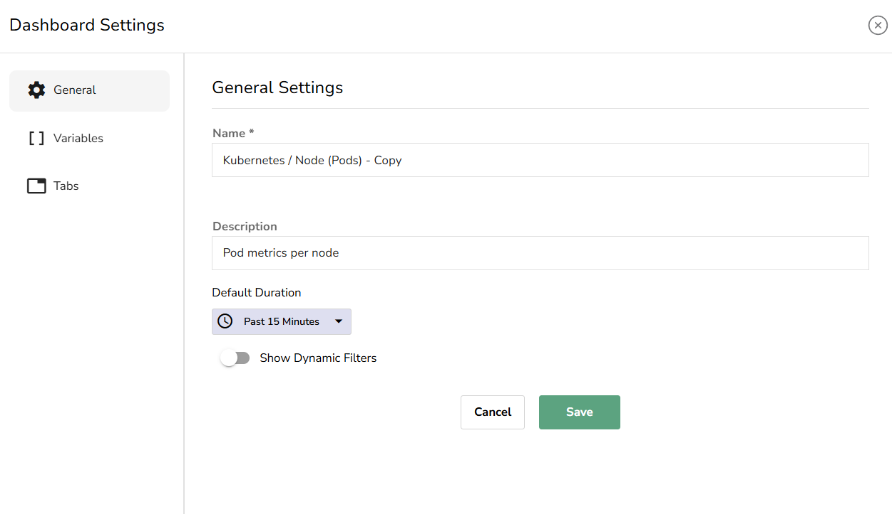
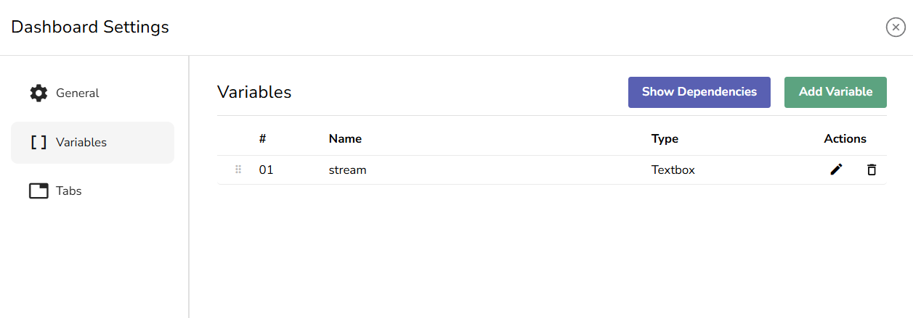
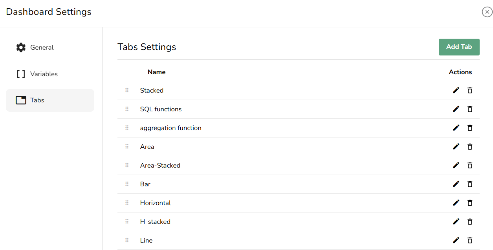

This guide explains how to manage Dashboards and use the Dashboard toolbar. 

## Manage Dashboards

OpenObserve offers the following options for viewing, searching, and performing actions on the Dashboards you have created or imported.

**View Dashboards**

The Dashboards table displays key details about each Dashboard, such as:

- **Name**: The name of the Dashboard.  
- **Identifier**: A unique identifier for each Dashboard.  
- **Description**: A brief description of the Dashboard.  
- **Owner**: The user who created the Dashboard.  
- **Created**: The timestamp showing when the Dashboard was created.

**Perform Actions on Dashboards**

From the **Actions** column, you can move a Dashboard to another folder, duplicate a Dashboard, and delete a Dashboard.

**Search Dashboards**

You can search for Dashboards by name, either within a specific folder or across all folders.

- **Search Within a Folder:** Use the **Search Dashboard** bar at the top of the list..  
- **Search Across All Folders:** Enable the **All Folders** toggle next to the **Search Dashboard** bar before performing a search.

## Dashboard Toolbar

The Dashboard toolbar provides several options for managing your Dashboard’s behavior and interactions:

1. **Add Panel:** Use the **Add Panel** button to add a new Panel to the selected Dashboard**.**  
2. **Time Range Selection**: You can adjust the time range for which you want to visualize the data on your Dashboard by selecting an **Absolute** or **Relative** time range based on your timezone.   
3. **Auto Refresh Interval**: Set the auto-refresh interval for your Dashboard. This is useful when you want the data to update automatically at specified intervals, such as every 5 minutes.  
4. **Manual Refresh**: Use the **Refresh** button to manually update the Dashboard and all its Panels with the latest data.  
5. **Export Dashboard**: Click the **Export** button to export your Dashboard as a JSON file. This is useful for sharing or backing up the Dashboard configuration.   
6. **Share Dashboard**: Use the **Share** button to share a link to the Dashboard with others.  
7. **Dashboard Settings**: Use the [**Dashboard Settings**](#dashboard-settings) to adjust **General Settings**, and manage **Variables** and **Tabs**.  
8. **Print Dashboard**: Use the **Print** button to print the Dashboard or export it as a PDF.  
9. **Go FullScreen:** Use this button to turn on the fullscreen mode.   
10. **Scheduled Dashboards**: Use the Scheduled Dashboards option to configure Scheduled and Cached Dashboards.  
11. **Edit Dashboard JSON**: This option allows you to directly edit the JSON configuration of your Dashboard, giving you advanced control over its structure and settings.

## Dashboard Settings 

In the Dashboard Settings, you can configure various options to customize the behavior of your Dashboard.

**General Settings**

- **Name**: Use it to modify the name of your Dashboard.  
- **Description**: Modify the description for the Dashboard.  
- **Default Duration**: You can adjust the time range for the entire dashboard by selecting an **Absolute** or **Relative** time range based on your timezone. This allows you to view the data for different periods.  
- **Show Dynamic Filters**: Enable or disable the dynamic filters for the Dashboard. This allows users to interactively filter data displayed in Panels.

**Variables**

In the Variables section, you can edit and delete existing variables, add new variables, and view variable dependencies.

**Tabs**

In the Tabs section, you can add, edit, and delete Tabs within the Dashboard.

