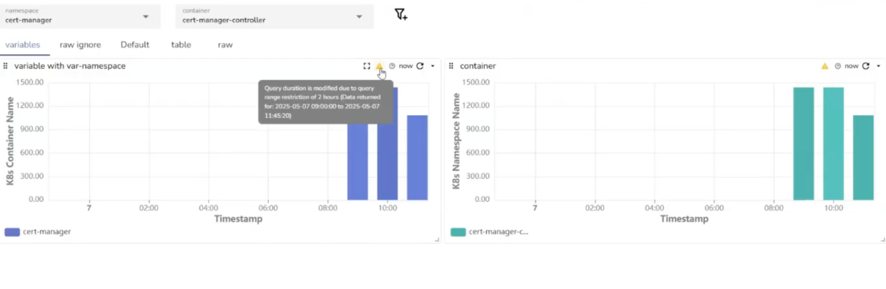
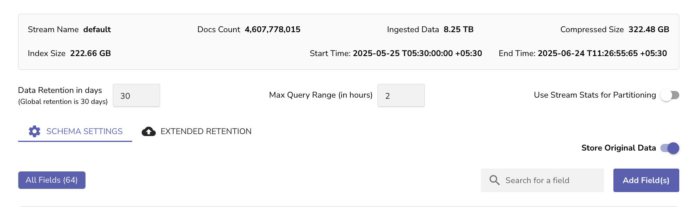
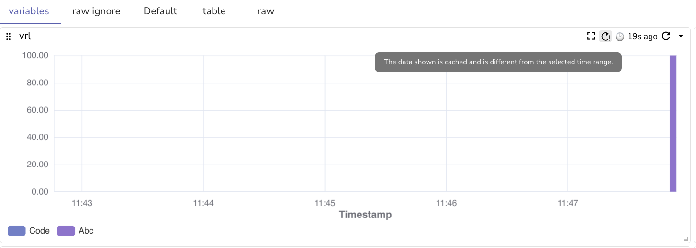
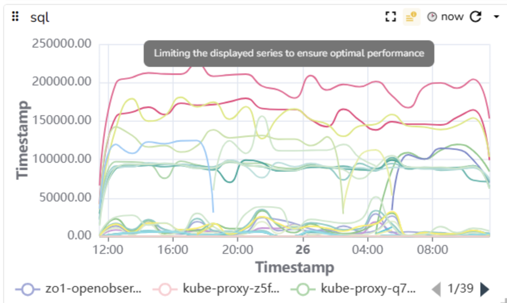

This page provides instructions on the warning or error icons displayed on the panel toolbar, explains how to identify and troubleshoot these warnings. 

??? "1. Error: When the query duration is modified due to the query range is restricted"
    ## Error: When the query duration is modified due to the query range is restricted   
     

    ### Cause
    This occurs when the time range of your query exceeds the limit set at the **Max Query Range (in hours)** field in the stream settings.   
    ### Resolution   
    1. Go to the **Streams** page.  
    2. Find the stream you are working with and select **Stream Details** under the **Actions** column.<br>
     

    3. In the stream settings, update the **Max Query Range (in hours)** to a value that supports your query duration. <br>  

??? "Warning: The data shown is cached and is different from the selected time range"

    ## Warning: The data shown is cached and is different from the selected time range 

    

    ### Cause
    This warning appears when the selected time range has changed, but the panel did not automatically refresh.  

    ### Resolution   
    Click the **Refresh** button in the panel toolbar (the circular arrow icon) to reload the panel with data that matches the current time range.

??? "Warning: Limiting the displayed series to ensure optimal performance"
    ## Warning: Limiting the displayed series to ensure optimal performance

     

    ### Cause
    When the `ZO_MAX_DASHBOARD_SERIES` variable is set, the panel will display only the specified number of series. A warning message will appear on the panel indicating that the displayed data has been limited for optimal performance.

    !!! Note
        - If a panel includes multiple Y-axes, the limit will apply **individually per Y-axis**.  
        - The **Compare Against** feature will not count toward the series limit. However, if enabled, it may not fully display its comparison results due to this cap. The exact behavior is subject to confirmation.

    ### Resolution  

    Update the following environment variable:   
    ```  
    ZO_MAX_DASHBOARD_SERIES=<number_of_series>  
    ```  
    Replace <number_of_series> with the maximum number of time series you want each panel to display.

    **Example**  <br>
    If you set ZO_MAX_DASHBOARD_SERIES=50:

    - A panel with a single Y-axis will display up to 50 series.  
    - A panel with two Y-axes will display up to 50 series on each axis.

??? "Warning: The data shown is incomplete because the loading was interrupted"
    ## Warning: The data shown is incomplete because the loading was interrupted
    

    ### Cause
    This warning appears when the query execution was interrupted or cancelled. It results in the panel displaying partial or no data while indicating that the data is not fully loaded.

    Typical causes include: 

    - Query cancellation due to user navigation or timeout
    - Backend failed to send the complete result set

    ### Resolution
    Refresh the panel toolbar to rerun the query. This will attempt to fetch the complete data and remove the warning.
