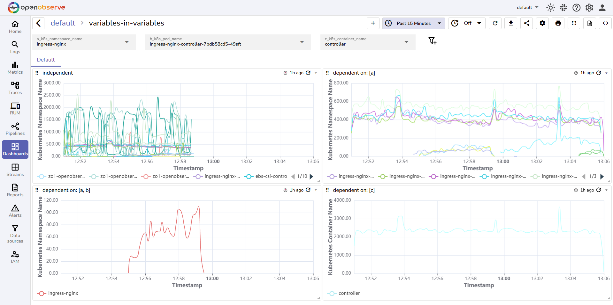
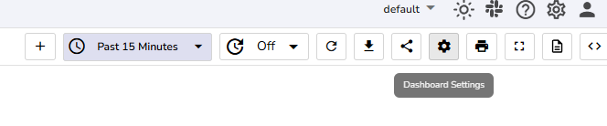
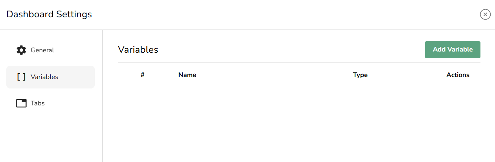
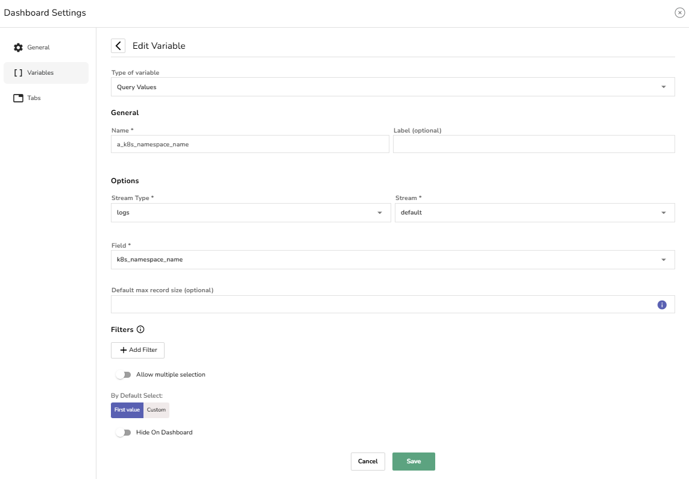
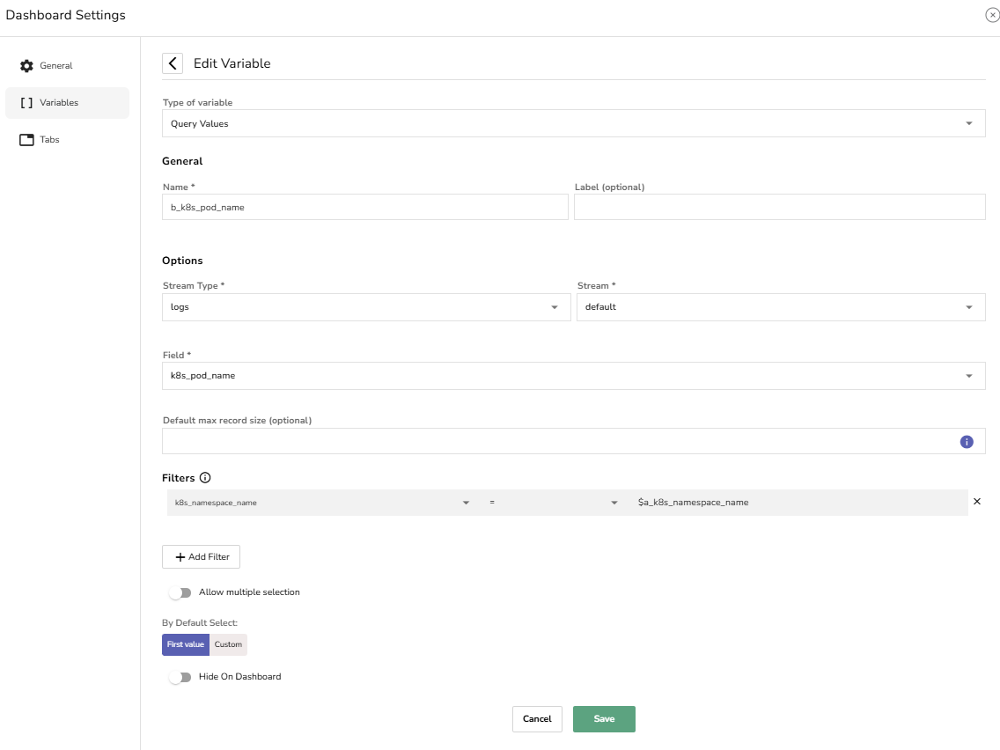
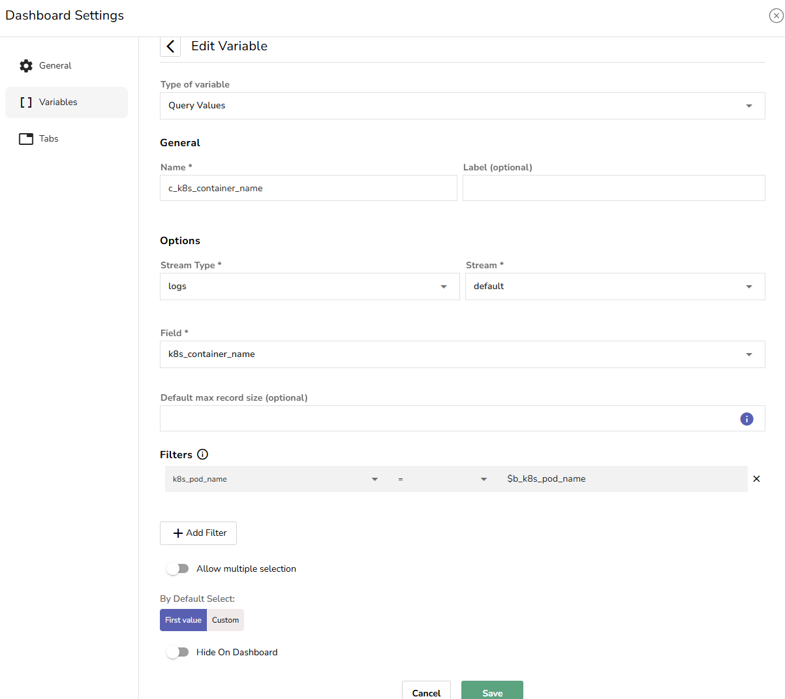
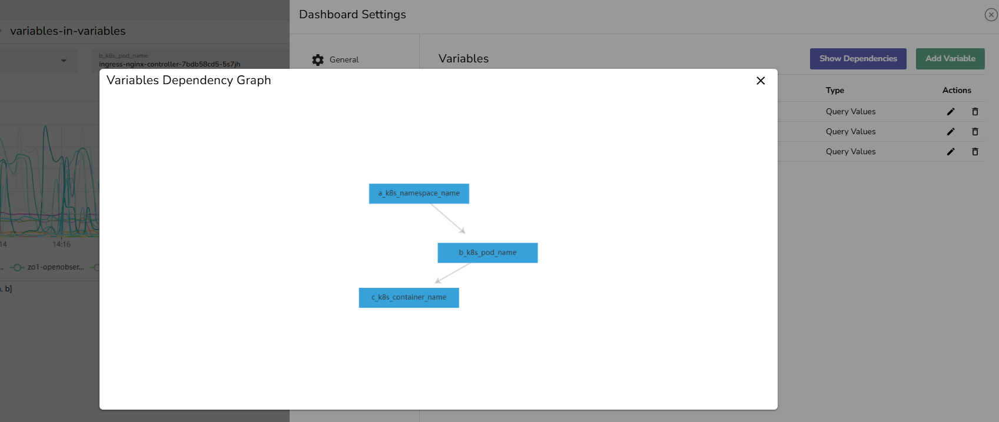

OpenObserve Dashboards support dynamic filtering through variables. Variables enable users to interactively select values that filter and control what data is displayed in Panels. 

Variable dependencies allow you to model parent-child relationships between variables. When a user selects a value for the parent variable, the child variable is updated to reflect only the relevant options associated with that selection.

This is useful when dealing with hierarchical data structures, where a logical relationship exists between fields, such as Kubernetes resources or application modules.

### Example: Kubernetes Monitoring
 

Consider an observability scenario involving Kubernetes:

- A `namespace` contains multiple `pods`.  
- Each `pod` hosts multiple `containers`.

To visualize and inspect `logs` at the `container` level, users must select:

- A `namespace`,  
- Then a `pod` within that `namespace`,  
- And finally, a `container` within that `pod`.

This forms a three-level dependency chain:

> **Namespace** > **Pod** > **Container**

In the above image: 

- `$a_k8s_namespace_name` (Namespace) is the top-level variable.  
- `$b_k8s_pod_name` (Pod) depends on the selected `namespace`.  
- `$c_k8s_container_name` (Container) depends on the selected `pod`.

### How to Configure Variable Dependencies

#### Step 1: Navigate to Variables Configuration Page

1. From the Dashboard toolbar, select **Dashboard Settings**. 

2. Click **Add Variable.**

#### Step 2: Define the Parent Variable

This is the top-level variable that other variables will depend on. For instance, Kubernetes Namespace.  
Configure the parent variable (`k8s_namespace_name`) in the **Add Variable** form:

- **Name**: `a_k8s_namespace_name`  
- **Type**: Query Values  
- **Stream Type**: logs  
- **Stream**: default  
- **Field**: `k8s_namespace_name`  
- **Filters**: None

#### Step 3: Configure the First-Level Dependent Variable

This variable uses the value of the parent variable to filter its own values. For instance, Kubernetes Pod.

Configure the dependent variable (`k8s_pod_name`) as shown below:

- **Name**: `b_k8s_pod_name`  
- **Type**: Query Values  
- **Field**: `k8s_pod_name`  
- **Filters**: 

    - **Field**: `k8s_namespace_name`  
    - **Value**: `$a_k8s_namespace_name`

This setup ensures that only pods from the selected namespace are shown.  

#### Step 4: Configure the Second-Level Dependent Variable

This variable depends on the first-level dependent variables. For example, Kubernetes Container.  
Configure the second-level dependent variable (`k8s_container_name`) as shown below:

- **Name**: c_k8s_container_name  
- **Type**: Query Values  
- **Field**: k8s_container_name  
- **Filters**:

    - **Field**: k8s_pod_name   
    - **Value**: $b_k8s_pod_name

**Note:**

- **`$` Prefix**: Use the `$` symbol when referencing other variables in the filter values.   
- Use the **Hide on Dashboard** toggle to hide the variable from the dashboard UI.

### Variable Dependency Graph  
The **Variable Dependency Graph** visually maps these relationships, showing how each variable is linked.  
