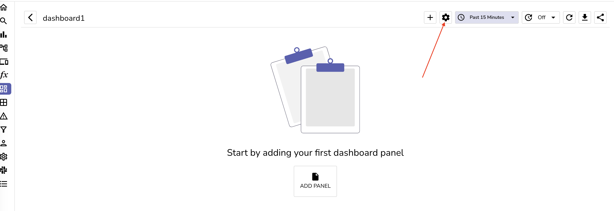
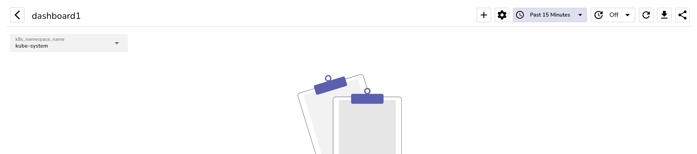
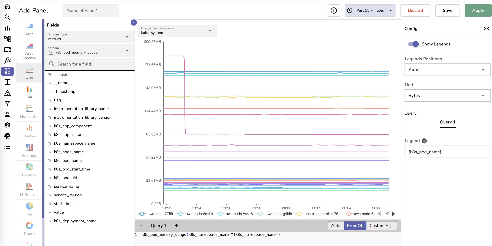

# Static variables

## Creating a variable

To create a variable, click on the `settings` icon on the top right corner of the dashboard.

The click on `Add variable` button.

You will see following options:

1. Query values
1. Dynamic variables
1. Constant
1. Text box
1. Custom

### 1. Query values

Query values are used to fetch distinct values from a field in a single stream. e.g. You can pick the `hostname` or `k8s namespace` from a stream and use it as a filter.

This will give you a drop down of all the distinct values from the field you selected.

You could then use this variable in a chart query. Below are 2 ways to use a variable in a query:

1. `'$variable_name'` - This will replace the variable with the value selected by the user in a filter either in `Auto` or `Custom SQL` mode.
1. `"$variable_name"` - This will replace the variable with the value selected by the user in PromQL mode.

SQL example:

PromQL example:

