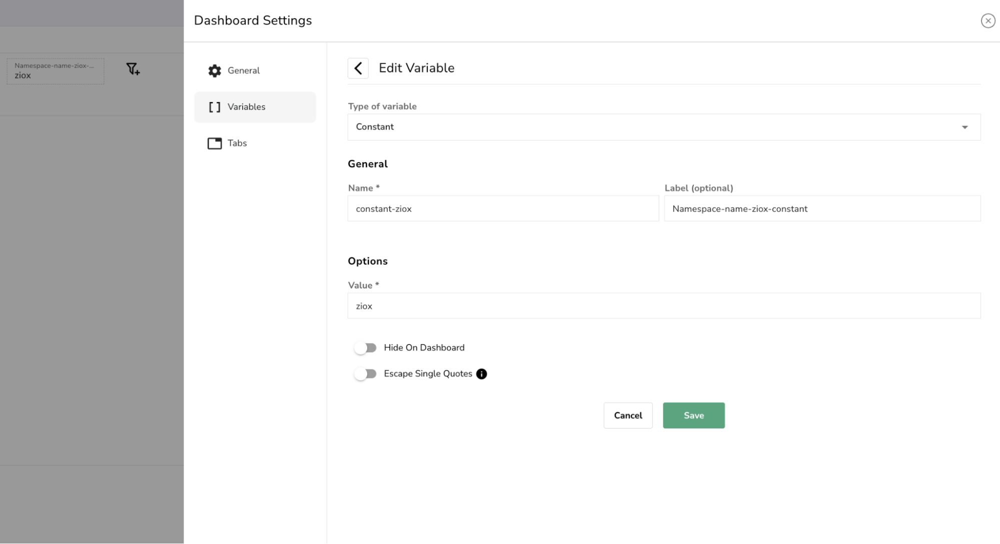
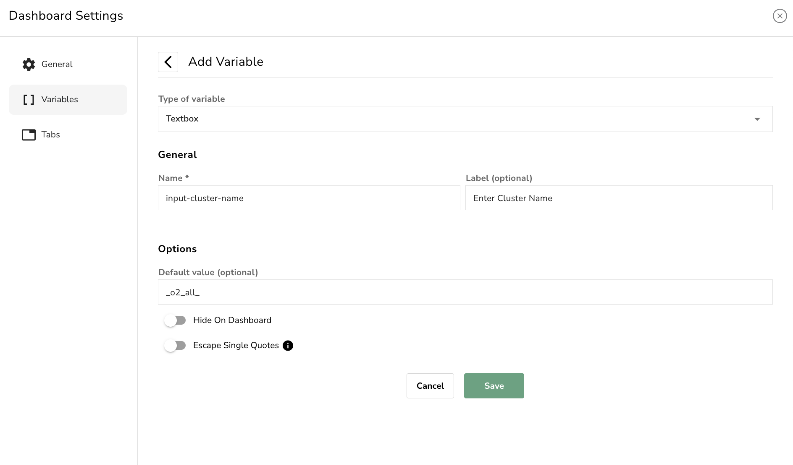
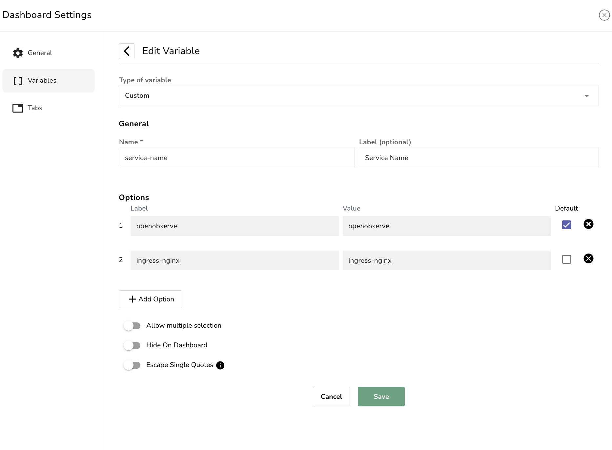

This page describes the types of [variables](variables-in-openobserve.md), their use cases, and the configuration required for each type.

OpenObserve supports the following variable types:

## 1. Query Values

This variable dynamically fetches values from a selected field in a stream. It supports both [single-select and multi-select options](variables-in-openobserve.md/#multi-select-and-single-select-variables).

**When to use:** When the available values depend on data already ingested, such as identifiers, names, or categories.

**Use Case:** Filter the dashboard panels by Pod name using values from logs.

!!! Configuration
    **Basic**:
    
    - **Type of Variable**: Query Values
    - **Name**: pod
    - **Label (optional)**: Pod 
    - **Stream Type**: Logs
    - **Stream**: `default`
    - **Field**: `k8s_pod_name`
    - **Default Max Record Size (optional)**: `20`

    **Advanced:**

    - **Allow multiple selection**: Enabled
    - **By Default Select**: First value
    - **Hide on Dashboard**: Disabled
    - **Escape Single Quotes**: Disabled

**Result**: 

- This configuration allows users to dynamically select one or more Kubernetes pod names from the logs stream to apply that selection across dashboard panels.
- The variable dropdown will display up to `20` pod names retrieved from the `k8s_pod_name` field in the default log stream. These values are based on the most recently ingested records. 
- The multi-selection option is enabled. Users can select more than one value, and all dashboard panels using `$pod` will update accordingly.

!!! Note
    Dropdown menu on the dashboard populated with live values from the data.

## 2. Constant

This variable allows you to set a fixed value that cannot be changed by dashboard users. The constant variables are shown on the dashboard as plain text.

**When to use:** When the value should always stay the same and must not be changed by anyone using the dashboard.

**Use case:** Building a dashboard that focuses only on logs from a specific Kubernetes namespace named ziox.

!!! Configuration
    **Basic**: 

    - **Type of variable**: Constant
    - **Name**: constant-ziox
    - **Label (optional)**: Namespace-name-ziox-constant 
    - **Value**: `ziox`

    **Advanced**:

    - **Hide on Dashboard**: Disabled
    - **Escape Single Quotes**: Disabled

**Result**: 

- After saving, this variable always uses `ziox` as the namespace value during query execution. Users cannot modify it from the dashboard interface. 
- All queries referencing `$constant-ziox` will consistently apply the `ziox` namespace filter.

## 3. Textbox

This variable provides a free-form text input field on the dashboard.

**When to use:** When users need to manually enter a value that may not exist in the dropdown, such as custom IDs or strings.

**Use Case:** You want users to manually enter the cluster name they want to filter logs by.

!!! Configuration
    **Basic**:

    - **Type of variable**: Textbox
    - **Name**: input-cluster-name
    - **Label (optional)**: Enter Cluster Name
    - **Default value (optional)**: `_o2_all_`

    **Advanced**:

    - **Hide On Dashboard**: Disabled
    - **Escape Single Quotes**: Disabled

**Result**: 

- Users will see a text input field labeled **Enter Cluster Name** on the dashboard. 
- The default value is `_o2_all_`, but users can replace it with any cluster name, such as `prod` or `dev`, at runtime. 
- All queries using `$input-cluster-name` will include the user-provided input when executed.

### What is `_o2_all_`?

- `_o2_all_` is a special keyword used to **match all values** during query execution.
- If this is set as the default value, the dashboard will include data from all clusters unless the user enters a specific one.

!!! Notes

    - No validation is performed on the input. The value is passed directly into the query.
    - To match all values, users must enter exactly `_o2_all_`. Writing `ALL`, `all`, or `<ALL>` will not match all values.

## 4. Custom

This variable lets you predefine a list of selectable values.

**When to use:** When values are known in advance and should not be fetched from data.

**Use Case:** You want to allow users to select a predefined service from a list, such as openobserve or ingress-nginx. This is useful when the possible values are known and limited, and you want to control what the user can select.

!!! Configuration

    **Basic**: 

    - **Type of variable**: Custom
    - **Name**: service-name
    - **Label (optional)**: Service Name

        - **Label**: `openobserve`
        - **Value**: `openobserve`
        - **Default**: Checked
    - **Label**: `ingress-nginx`

        - **Value**: `ingress-nginx`
        - **Default**: Unchecked

    **Advanced**:

    - **Allow multiple selection**: Disabled
    - **Hide on Dashboard**: Disabled
    - **Escape Single Quotes**: Disabled

**Result**: 

- Users will see a dropdown named **Service Name** with the default selection set to `openobserve`. 
- They can switch to `ingress-nginx` if needed. The multiple selection option is disabled, so only one option can be selected. 
- All queries using `$service-name` will include the selected value when executed.

!!! Note
    - One value must be selected as the default.
    - Labels are shown on the dashboard, while values are used in the query.
    - The values are injected into queries as-is. No validation or transformation is applied.

## Next Steps

- Learn how to [apply variables to a panel](variables-in-openobserve.md/#apply-the-variable-to-a-panel). 
- Learn about [variable dependencies](variable-dependencies.md).
