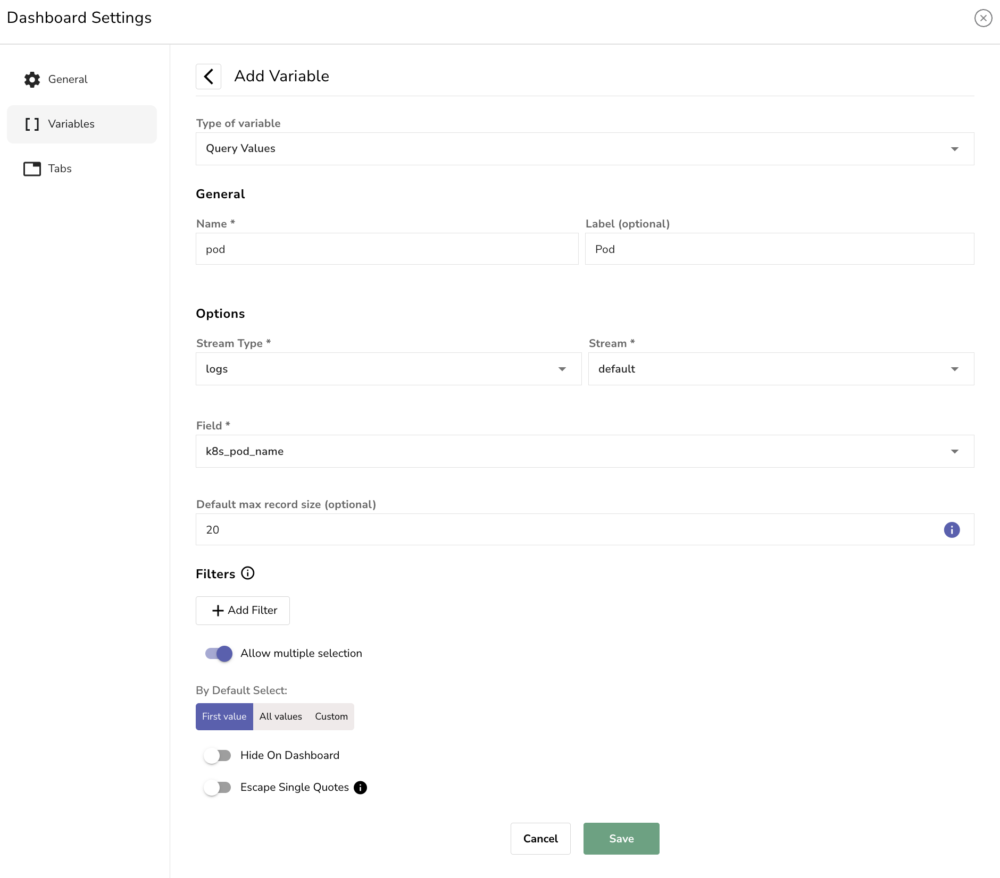
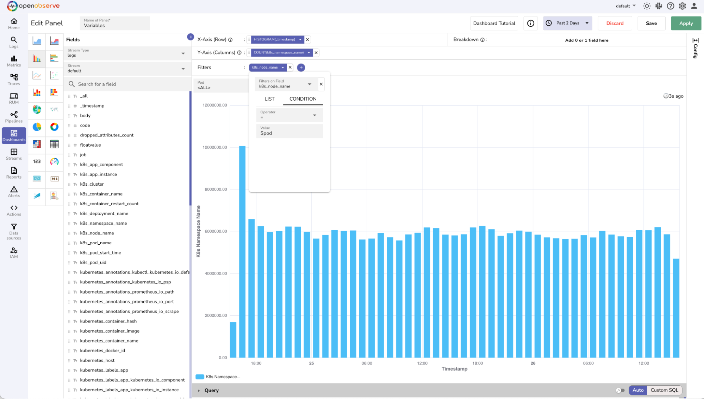
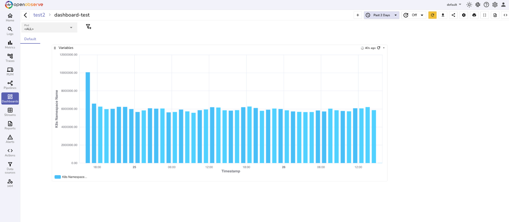

This page provides a comprehensive overview of variables in OpenObserve dashboards, including instructions on how to create your first variable, apply it to panels, and configure different variable options. 

## What Are Variables?

Variables in OpenObserve dashboards let users filter data dynamically. You can use variables to select values from a list or input them manually.

When a value is selected, the variable updates, but the panels do not refresh automatically. To view updated panels, users must click the **Refresh** button manually.

## Why Use Variables

Use variables to:

- Filter data without editing queries
- Pass the same selected value into multiple panel queries
- Switch between values
- Support multi-value selections when needed


## Create a Variable
**Use case:** Create a variable that will automatically fetch values from a specific field in your log data. This allows dashboard viewers to select a value from a dropdown menu to filter the panels accordingly.

To create a variable: 

1. Go to the **Dashboard** where you want to add the variable.
2. Click the gear icon at the upper-right corner to go to **Dashboard Settings**.
3. Select **Variables** from the left navigation.
4. Click **Add Variable**.
5. Configure the variable with the following values:
    

    - **Type of Variable**: Query Values
    - **Name**: pod
    - **Label**: Pod
    - **Stream Type**: logs
    - **Stream**: `default`
    - **Field**: `k8s_pod_name`

6. (Optional) Modify the **Default max record size**.
7. (Optional) Modify the **Filter** settings or **By Default Select** options.
8. Click **Save** to add the variable to the dashboard.

Variables appear as dropdowns at the top of the dashboard.

## Apply the Variable to a Panel

To apply the variable to a panel: 

1. Go to the same dashboard where you created the variable.
2. Create a new panel or open an existing panel to edit it.
3. In the **Fields** section of the panel editor:

    - First, select the appropriate **Stream Type** and **Stream** to ensure the correct dataset is loaded.
    - From the **Fields** panel inside the panel editor, hover over the field you want to use as the X-axis or Y-axis and click the corresponding button (for example, **+X** or **+Y**) to add it. You can also add **Breakdown** if needed.
    
        For example:

        - **X-axis**: `timestamp`
        - **Y-axis**: count(`k8s_namespace_name`)

4. Add a filter. Hover over the field used when creating the variable. For this example, hover over `k8s_pod_name` and click **+F** to add it as a filter.

5. Click the filter dropdown and switch from **LIST** to **CONDITION**. 

    - Set the appropriate **Operator**. For example, `=`.
    - In the **Value** field, type the variable name using the dollar symbol. For example, `$pod`.

6. Click **Save** to save the panel. <br>


The panel is now dynamically filtered using the **Pod** variable. When users select a value from the **Pod** dropdown on the dashboard, the panel updates to display data for that pod only.


## Advanced Configuration
After creating and applying a variable, you can further refine its behavior using advanced settings.

### Default Max Record Size

The **Default max record size** limits how many records appear in the dropdown list. 

- For example, if set to `100`, only the first `100` unique values from the field will be shown.
- If your required value is not among them, you can enter it manually as a custom value.

This allows users to select valid values that may not be included in the default list due to the limit.

!!! Note

    Default max record size is 10. 

### Filters
You can optionally configure [variable dependencies](variable-dependencies.md) using the **Filters** option.

### Default Select

**Default Select** controls what values are selected automatically when the dashboard loads.

Available options:

- **First value**: Selects the first listed value from the dropdown.
- **All values**: Selects all values from the dropdown.
- **Custom**: Specify one or more default values.

To configure this select one of the options under **By Default Select** when adding or editing a variable.


### Hide on Dashboard

If enabled, the variable dropdown will not be shown in the dashboard interface. This is useful for variables that are meant to work in the background or should not be modified by users.

### Escape Single Quotes

If enabled, single quotes in user input will be escaped automatically.

**Example:**

- Input: O'Reilly
- Escaped as: O''Reilly

This prevents syntax errors in SQL queries that include user inputs with special characters.

### Single-Select and Multi-Select 

When creating variables, you can enable support for multiple selections.

- **Single Select**: Only one value can be selected from the list.
- **Multi-Select**: Multiple values can be selected at once.

To enable multi-select, toggle the **Allow multiple selection** switch when configuring the variable.


## Variable Input Behavior

### Custom Values 

You can enter custom values manually when the desired option is not available in the variable dropdown. These values work if they exist in the underlying data.

- In **single-select**, you can select a custom value and refresh the panels to view related data.
- In **multi-select**, custom values cannot be combined with other dropdown values. You you select the custom value, you cannot select any other value.

!!! Note
    If a custom value is entered that does not exist in the data, dashboard panels will display no results.

### Type-Ahead 

The type-ahead input feature allows users to search and select values by typing into the variable dropdown. This feature supports both exact value selection and partial match-based filtering.

- **The search is case sensitive.** For example, typing `zo` will not match `ZO` or `Zo`.
- When you type into the dropdown, the system filters values based on the input string. If matching values exist within the fetched list (as limited by **[Default Max Record Size](#default-max-record-size)**), they appear as selectable options.
- You can select any of the listed values to filter dashboard panels accordingly.

**For example:**

If you type `zo`, the dropdown may return the following options:
```
zo1-nats
zo2-nats
zo3-nats
```
You can then:

- Select `zo1-nats` to display panel data only for that value.
- Select the input string `zo` as a **custom value**, which applies the filter for all values that contain `zo`. In this case, the panels will reflect data for all of the following:
```
zo1-nats
zo2-nats
zo3-nats
```

!!! Note
    If the input string is not present in the fetched list but exists in the data, you can still select it as a custom value. However, if the input does not match any values in the data, the panel will return no results.


The type-ahead input feature allows users to search for a value by typing in the dropdown and select.

- If the value exists within the fetched list (as per the [**Max Record Limit**](#default-max-record-size)), it will appear in the filtered results and can be selected directly.
- If the value exists in the data but is not included in the fetched list, you will see an option to select it as a custom value.

## Next Steps

- Learn about different [types of variables](variable-types.md). 
