# Logs

This page explains how to run your first log search in OpenObserve, set a time range, execute a query, apply VRL transformations, adjust display settings, and save or export the results. 

!!! note "Before you begin"
    Make sure you have the required access to use the **Logs** page. Ensure that at least one stream with data is available in your organization. Learn more about [streams](../../data-processing/streams/streams-in-openobserve.md).

## Get Started with Logs
To start using the **Logs** page:

1. Select the **organization** from the dropdown at the top.
2. In the **Logs** page, choose a log stream using the stream selector.
3. Set the time range using the time range selector.
4. Click **Run query** to view the logs for the selected time range.


This is the minimum setup required to explore log data for the selected time range. 


## Use the Query Editor
The **Query Editor** allows you to define filters, expressions, and transformations on your log data.

Use the **SQL mode** toggle to switch between two editor modes, non-SQL mode and SQL mode.

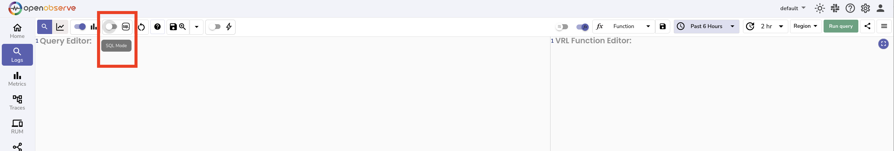

**Non-SQL mode**: When the toggle is off. Use this mode to apply filters, functions such as `match_all`, or other field-based conditions without writing full SQL. Learn more about [SQL functions](../../../reference/sql-functions/index.md).

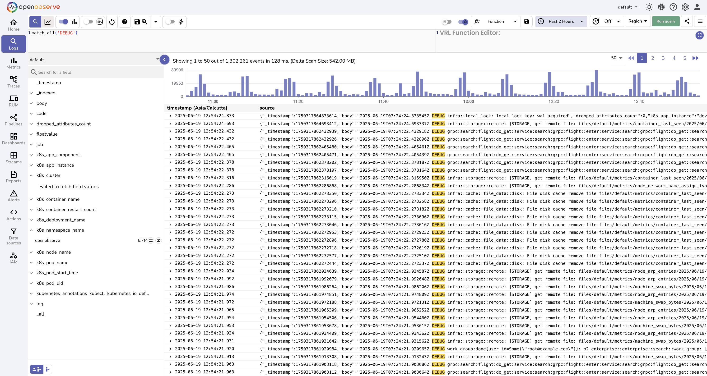

**SQL mode**: When the toggle is on. It enables full SQL syntax. You can write complete SQL queries to control the selection, filtering, and ordering of log records.

For example,

```sql
SELECT * FROM "default" where k8s_namespace_name = 'openobserve'
```

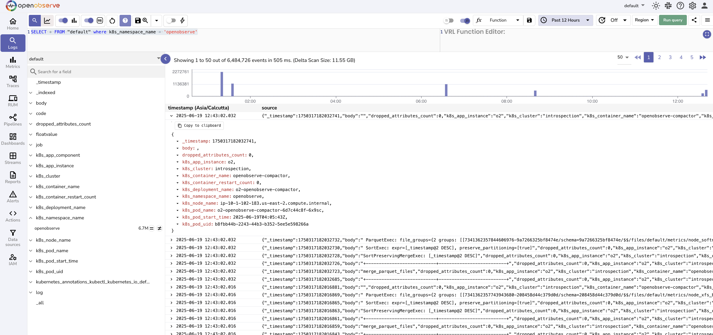

Toggling between these modes updates the behavior and syntax of the query editor.


## Set Time Range
Click the time range selector to define a time window for your query:

1. Choose a relative range such as **Past 1 hour** or **Past 7 days**. Or select an absolute range using the calendar.
2. Click **Apply**.

**Relative:**

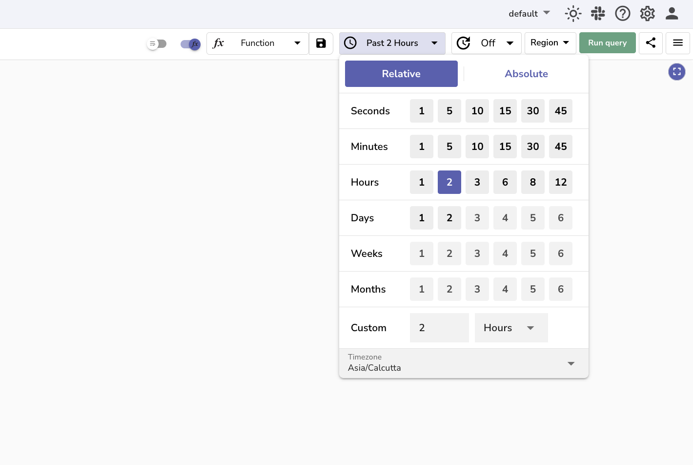

**Absolute:**

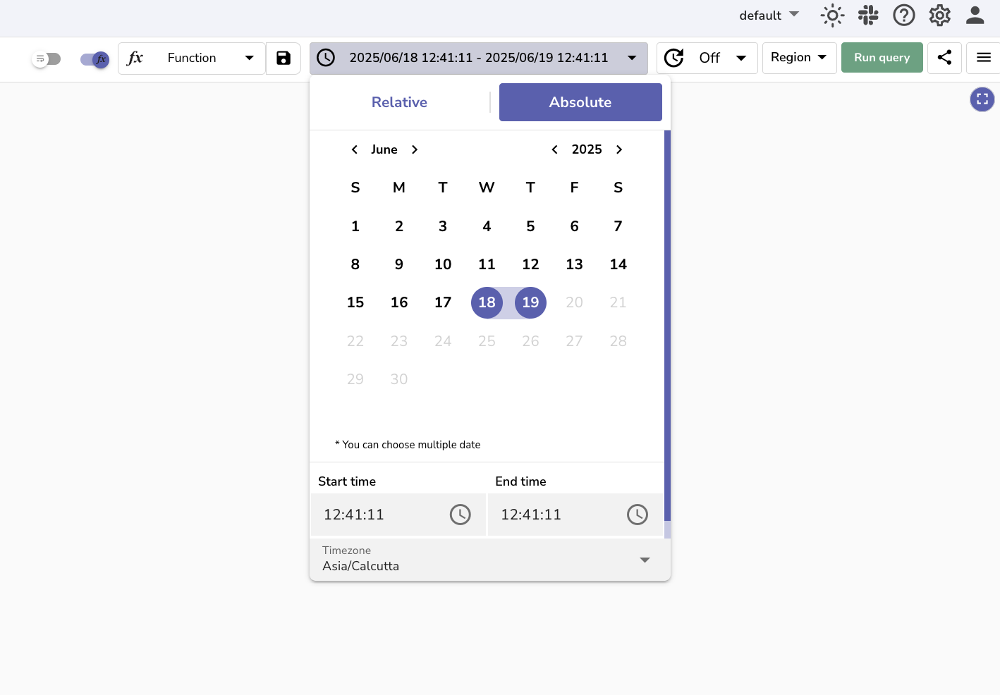

This setting limits the query to logs that fall within the selected time range, which helps reduce the amount of data scanned and improves query speed.

### Copy and Paste Time Ranges

The time range picker includes **Copy** and **Paste** buttons so you can transfer a time range between browser tabs, share it with a teammate, or reuse a saved time window.

<kbd>

</kbd>

**Copy a time range**

Click the **Copy** (content-copy) icon in the time range picker toolbar. The selected range is copied to your clipboard as a JSON object containing start and end epoch timestamps in microseconds, which avoids any timezone ambiguity when pasted.

**Paste a time range**

Click the **Paste** (content-paste) icon. If your clipboard contains a valid date range, the picker switches to the **Absolute** tab and applies it. Supported paste formats include:

| Format | Example |
|--------|---------|
| **Copy-emitted JSON** | `{"start_date":1721557986000000,"end_date":1721565186000000}` |
| **ISO 8601 range** | `2026-07-21T13:33:06Z - 2026-07-21T15:33:06Z` |
| **Human log format** | `Jul 21, 2026 13:33:06.000 +0000 - Jul 21, 2026 15:33:06.000 +0000` |
| **Absolute date range** | `2026/07/21 13:33:06 - 2026/07/21 15:33:06` |
| **Epoch timestamps** | `1721557986000000 - 1721565186000000` (µs, ms, or seconds) |

You can also paste a **single date-time value** (any of the above formats without the ` - second_value` part). The picker applies it to whichever side of the current range it sits closer to — adjusting the start or end accordingly.

If the pasted text cannot be parsed, an error toast appears with the message **Could not parse date range**.

## View and Explore Logs
After the query runs successfully, the results table shows all log entries that match the selected stream, time range, and query conditions.
Click a row to expand the full log record.

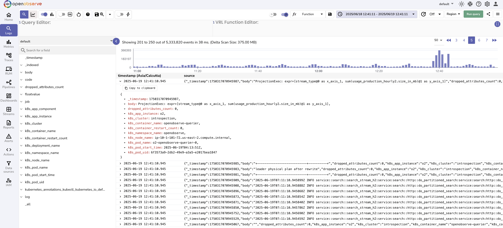

## Use the Histogram and Chart
- The histogram displays log event distribution over time. Use the **Histogram** toggle to hide it when not needed.

    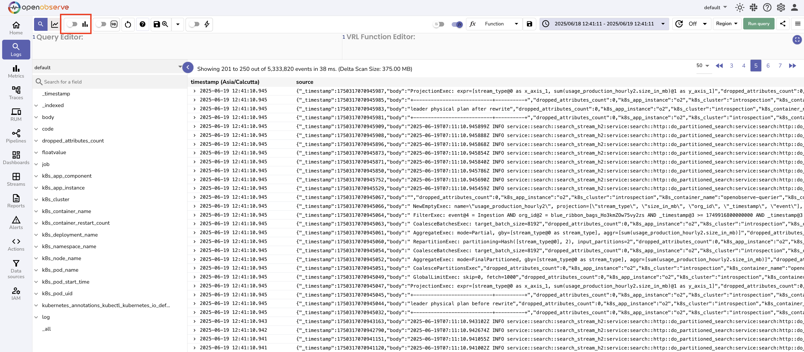

- The **Visualize** toggle enables or disables the chart panel, which allows you to plot logs using the available chart options for visual analysis.

    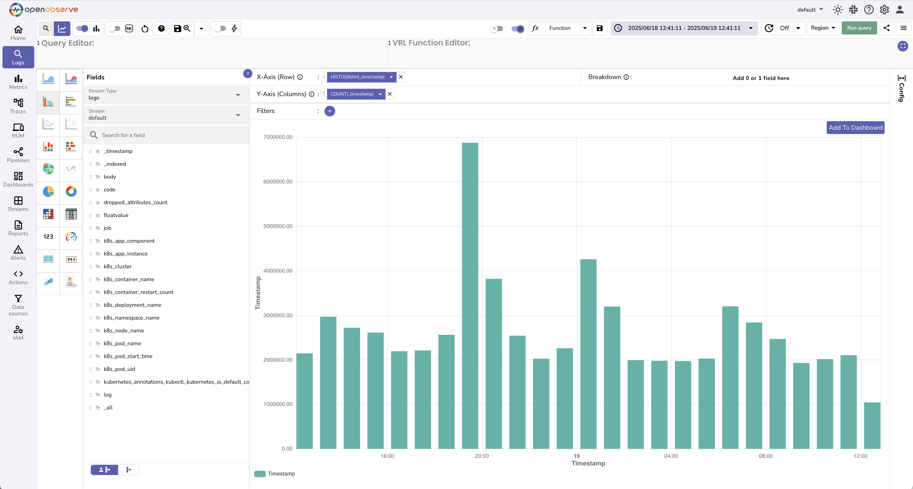

These tools help you quickly identify trends or activity spikes within the selected time range.


## Transform Logs with VRL
Click the **VRL Function Editor** toggle to write and apply a VRL function to the query output.

1. Go to the VRL Function Editor.
2. Select a saved function or write one manually. Learn more about [VRL functions](../../data-processing/functions/index.md).
3. Run the query to apply the transformation.

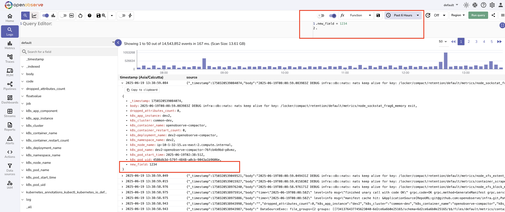

## Adjust Display Options

- **Wrap Table Content**: Toggle to enable word wrapping in the results table.

    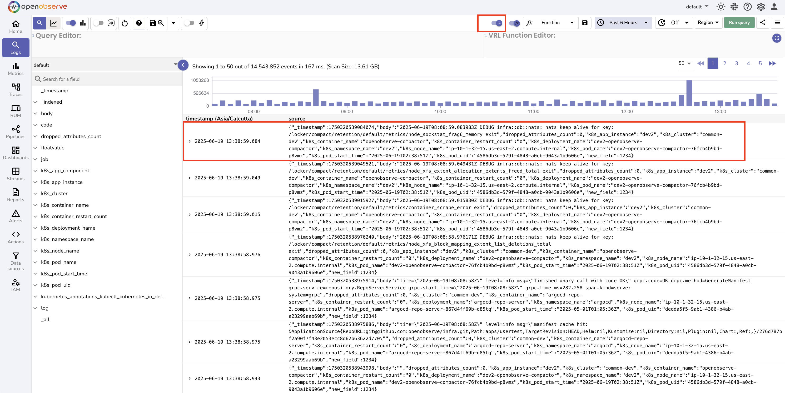

- **Auto Refresh**: Set a refresh interval to update query results continuously.

    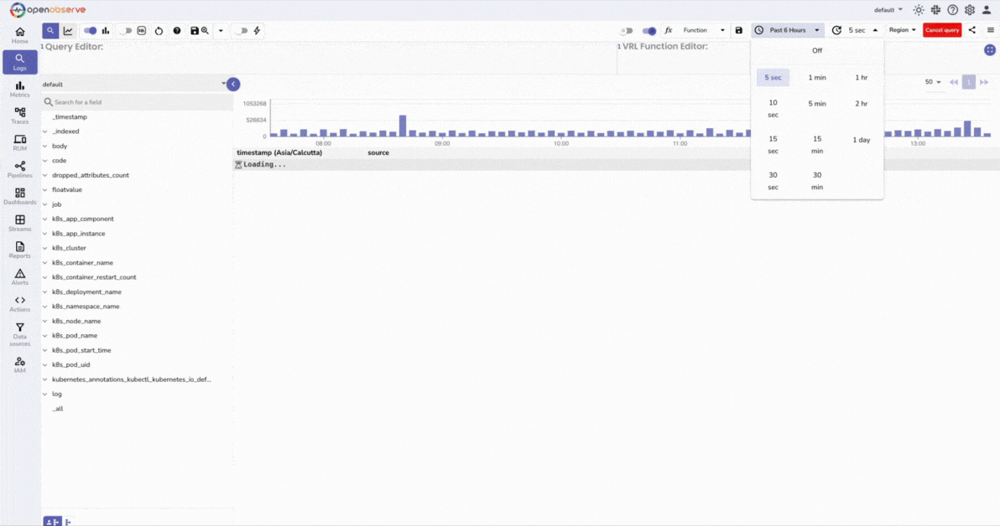

These options help customize the view for your analysis needs.


## Save and Reuse Views
To save a query and its configuration:

1. Click the **Save View** icon.
2. Enter a name in the dialog box.
3. Click **Save**.

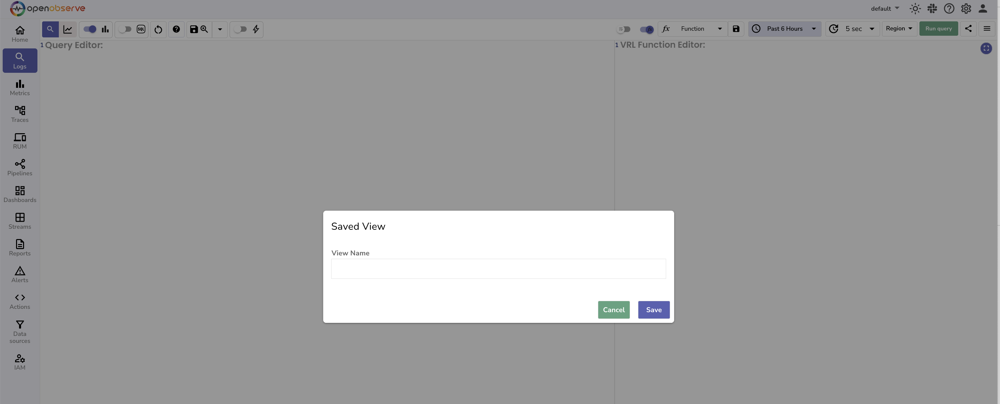

Use the dropdown next to the **Save** icon to reopen saved views at any time.

## Export and Schedule Searches

Click the more options menu or the three-bar icon to access:

1. **Search History**: View your recently executed queries.

    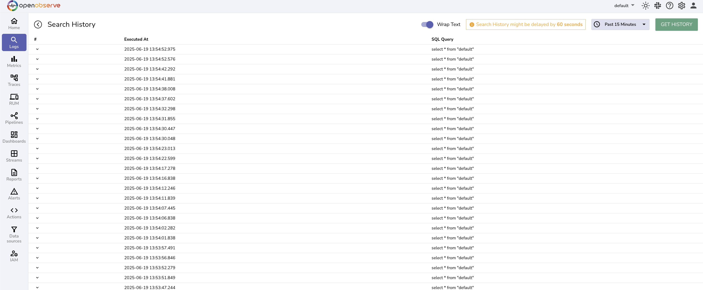

2. **Download results**: Export the results of the current query in CSV format.
3. **Download results for custom range**: Export logs for a different time range in CSV format, without modifying the active query.

    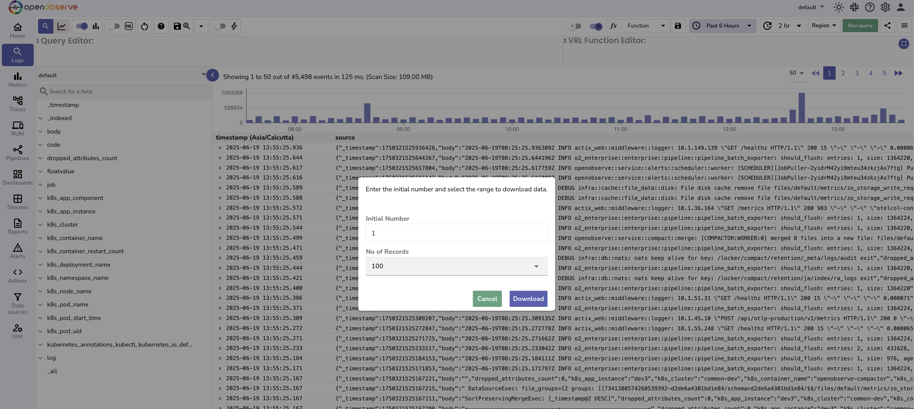

4. **Create Scheduled Search**: Set up recurring queries that run on a schedule.

    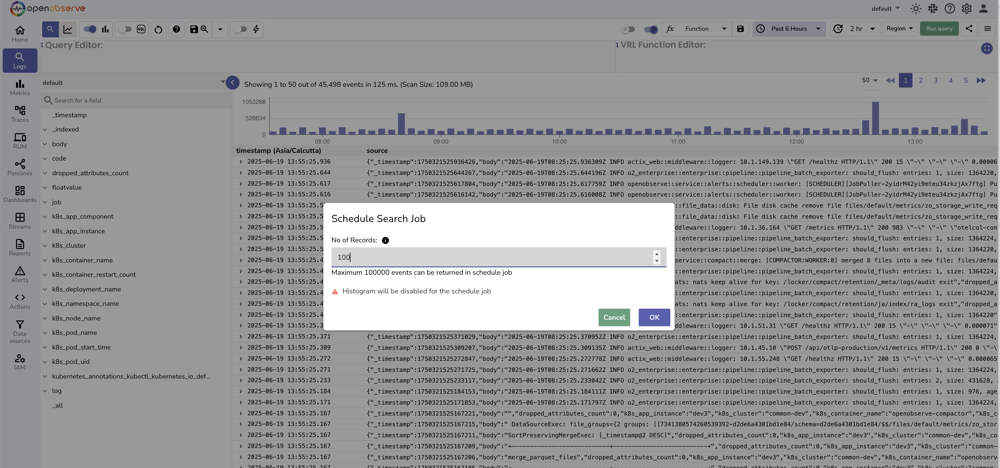

5. **List Scheduled Search**: View and manage scheduled searches.

    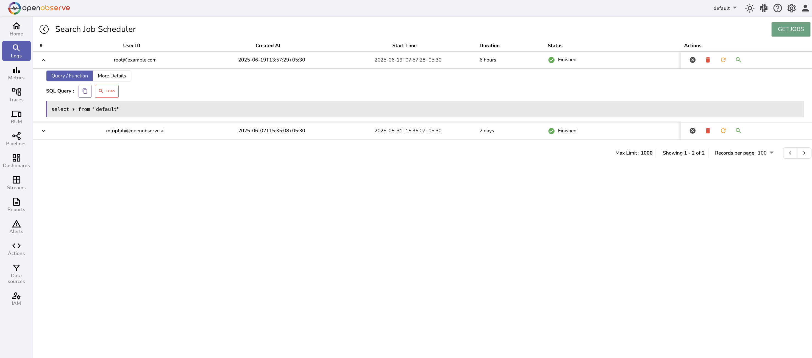

## Next Steps

- To learn how to visualize logs, refer to the [Dashboards](../../analytics/dashboards/dashboards-in-openobserve.md) documentation.
- To learn how to monitor logs continuously, refer to the [Alerts](../../analytics/alerts/index.md) documentation.

**Need some help?**

- Join our [Community Slack](https://short.openobserve.ai/community) 
- Or [Contact support](https://openobserve.ai/contactus/)
