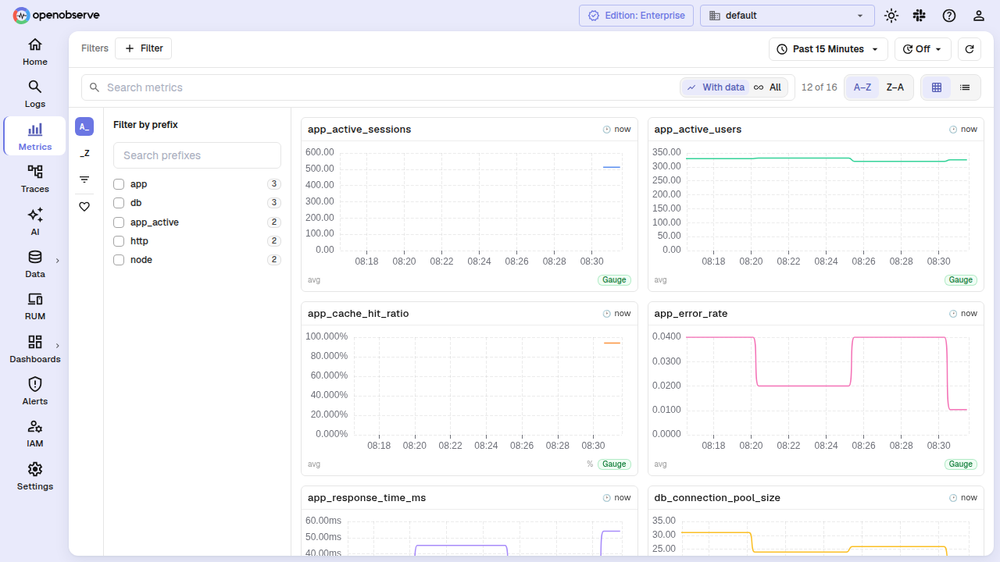
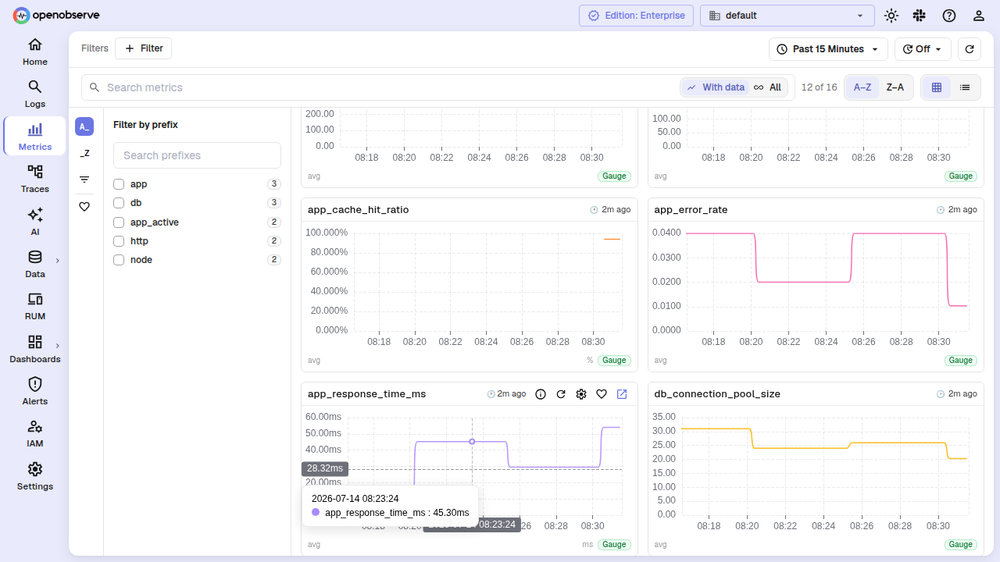
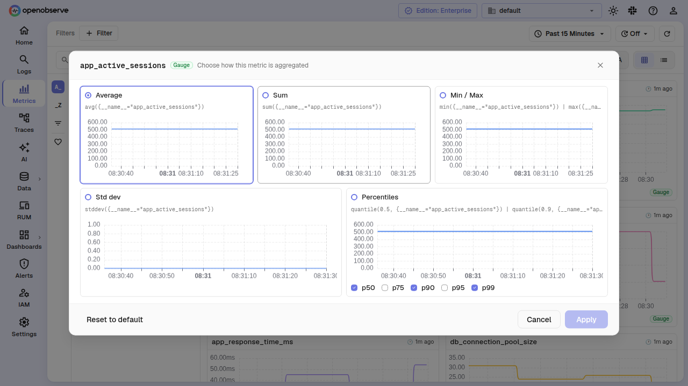
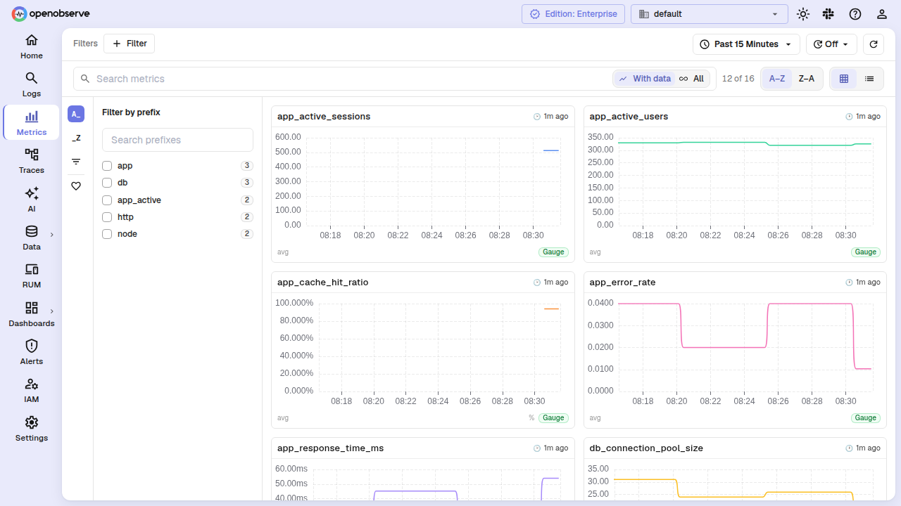
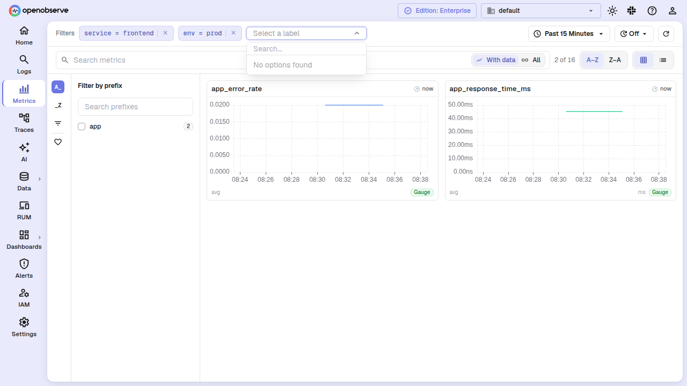
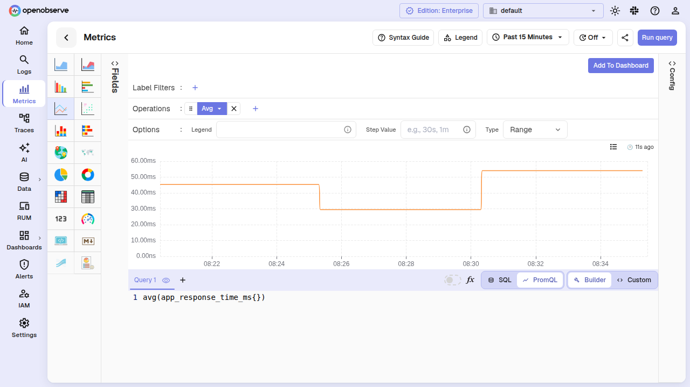
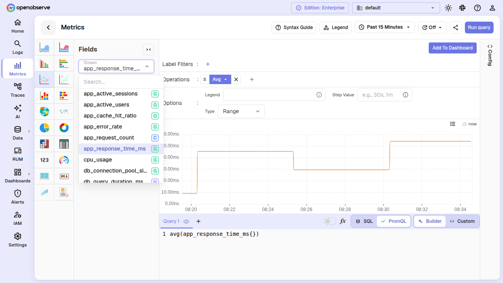
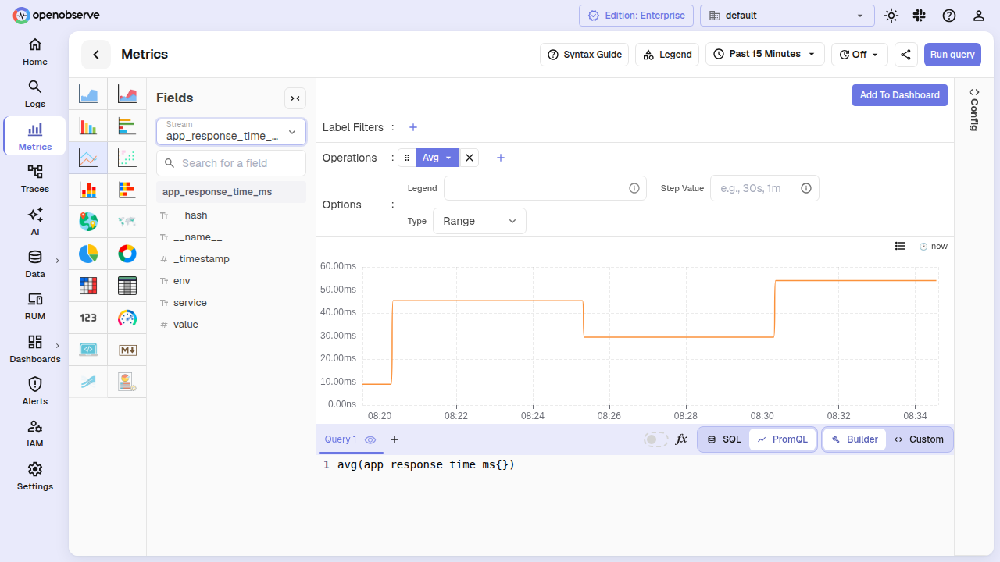
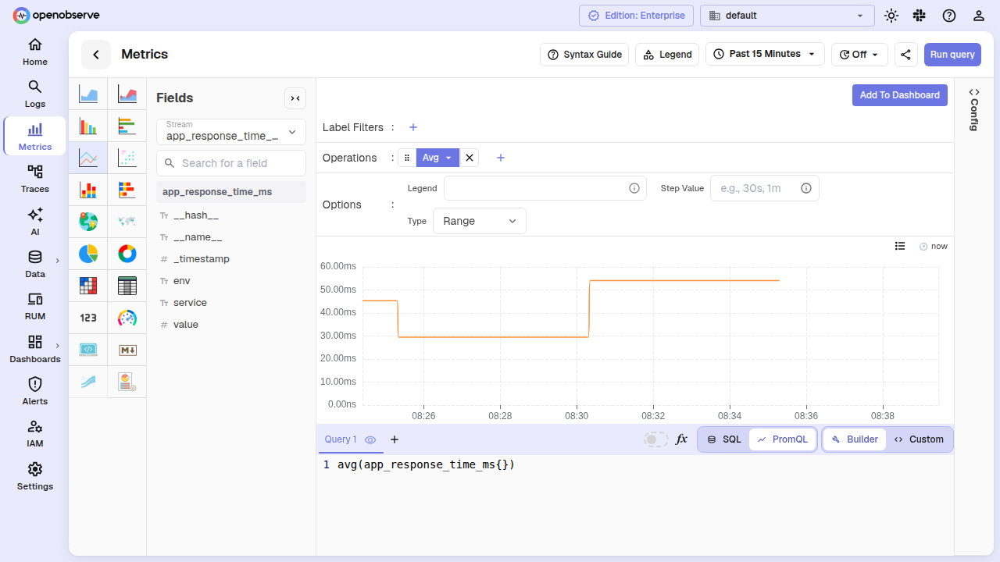

# Metrics Explorer

The Metrics Explorer provides two connected views for working with metrics data. Click **Metrics** in the sidebar to open the browse grid at `/metrics` — a visual overview of every metric family in your organization. Click any metric card or navigate to `/metrics/editor` to open the panel editor with PromQL input, chart visualization, and dashboard controls.

## Browse grid

The browse grid gives you a fast, visual overview of all metric families. Each card shows the metric name, its type (via a color-coded badge), the current charted value, and a mini sparkline.

### Metric cards

Cards are fetched lazily as you scroll. A card queries its default aggregation only when it enters the viewport, so opening the grid on a large org never fires hundreds of queries at once.

**Card defaults by type:**

| Metric type | Default query | Card chart |
|---|---|---|
| Counter | `sum(rate(metric[window]))` | Line chart |
| Gauge | `avg(metric)` | Line chart |
| Histogram | `histogram_quantile(0.95, sum(rate(metric_bucket[window]))) by (le)` | Heatmap |
| Summary | `avg(metric)` | Line chart |
| Info | — | Label table |

You can override a card's function for individual metrics via the **gear (⚙) icon** on the card. The override is saved per-browser and persists across sessions.

**Star a metric** to pin it. Use the **Favorites** toggle in the toolbar to narrow the grid to starred metrics only.

### Filtering

The left rail exposes three filter panels:

- **Prefix** — group by the first segment of the metric name. Useful in orgs that follow naming conventions like `node_cpu_*`, `node_memory_*`, `http_request_*`.
- **Suffix** — group by the last underscore-delimited segment. Surfaces common units (`_bytes`, `_seconds`, `_total`) alongside domain suffixes.
- **Type** — filter by metric type: Counter, Gauge, Histogram, Summary, or Other.

The **search bar** filters cards by name or help text. The **sort** toggle switches between A-Z and Z-A ordering. The **"With data" toggle** (on by default) hides cards whose queries returned no samples, keeping the grid clean of registered-but-unused metrics. A count below the grid shows how many cards are hidden; click the count to show them.

### Label filter chips

When the grid has loaded stream schemas (triggered by the first filter interaction), you can add label matchers via the **Label** chip input. Cards are then narrowed to metrics whose effective streams carry every selected label — so a `status=~"5.."` chip safely limits the grid to metrics that actually have a `status` label.

## Query editor

The panel editor at `/metrics/editor` is where you build queries, visualize results, and configure dashboard panels. It opens with the same layout as a dashboard panel editor.

### Stream selector

The stream dropdown shows metric names with **type badges** — a single letter (`C`, `G`, `H`, `S`, `O`) on a color-coded background:

| Badge | Type | Color |
|---|---|---|
| **C** | Counter | Blue |
| **G** | Gauge | Green |
| **H** | Histogram | Purple |
| **S** | Summary | Orange |
| **O** | Other | Grey |

The badge colors match the same palette used in the Metrics Explorer browse grid, so a type looks the same wherever you see it.

### Builder mode

The builder lets you construct PromQL queries step by step without writing raw PromQL. Select **Builder** from the mode toggle.

When you pick a metric, the builder auto-seeds a default query based on its type: `sum(rate(counter[4m]))` for a counter, `avg(gauge)` for a gauge, `histogram_quantile(...)` for a histogram. You can then add or remove operations (rate, sum, avg, topk, etc.) and label filters.

**Operations** are organized into groups: Rate & range, Aggregation, Math, and more. Each operation is rendered as a draggable chip. Drag to reorder; the query string updates live.

The builder **writes the full PromQL** into the query input, so you can switch to **Code** mode at any time to see or edit the raw query.

### Code mode

Select **Code** to write PromQL directly in the editor. The editor provides syntax highlighting, autocompletion for metric names and label keys, and inline error indicators.

Press **Ctrl+Enter** (or **Cmd+Enter** on macOS) to run the query from the editor without clicking **Apply**. The editor flushes any pending input before running, so the query that executes is always what is on screen.

### Date and time range

The **time picker** at the top of the editor supports relative ranges (Past 15 Minutes, Past 6 Hours, etc.) and absolute custom ranges. For dashboards (where auto-apply is off), the picker's trigger label shows the range that is **actually in force**, not your pending selection — so switching the picker to "Past 6 Hours" without clicking Apply leaves the trigger reading the previous range.

Click **Apply** to run the query against the selected range. The **refresh interval** dropdown schedules automatic re-runs.

### Visualizations

The editor supports the same chart types available for dashboard panels: line, bar, area, scatter, table, heatmap, and more. Switch the chart type from the dropdown above the chart.

### Add to Dashboard

After you have a query and chart you want to keep, click **Add to Dashboard**. Choose an existing dashboard and tab, or create a new one. The panel is inserted with the current query, chart type, time range, and PromQL builder state preserved.

## Sharing a metrics view

The **Share** button in the editor toolbar copies a URL that encodes your current panel configuration — chart type, query, stream, time range, and refresh interval. Anyone opening the link sees the same chart and data. The share URL carries the full state as a base64 blob in the `metrics_data` query parameter.

The editor also accepts lightweight deep-link parameters (`chart_type`, `query_type`, `stream_name`, `query`) for programmatic linking from alerts, dashboards, and other pages.

## Choosing a stream type auto-selects PromQL

When you create a new panel and set the stream type to **metrics**, the query mode automatically switches to PromQL. This saves you one click on exactly the new panels that need it. A panel that already has a written SQL query is never converted — so opening an existing SQL panel for editing keeps its query type intact, and SQL over metrics remains one click away.

## Next steps

- [Dashboards](../../analytics/dashboards/dashboards-in-openobserve.md): add metrics panels to dashboards
- [Downsampling](downsampling-metrics.md): reduce storage for long-term metrics
- [Prometheus ingestion](../../../ingestion/metrics/prometheus.md): send metrics via remote-write
- [Alerts](../../analytics/alerts/index.md): create alerts on metric thresholds
