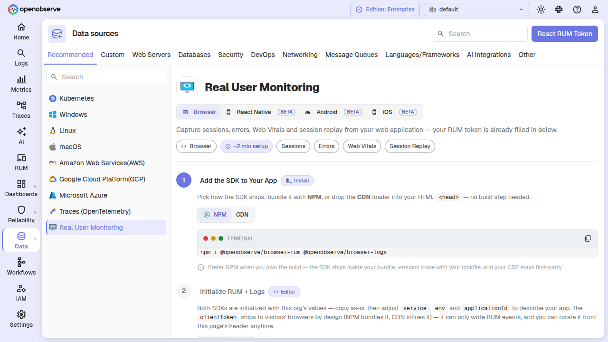
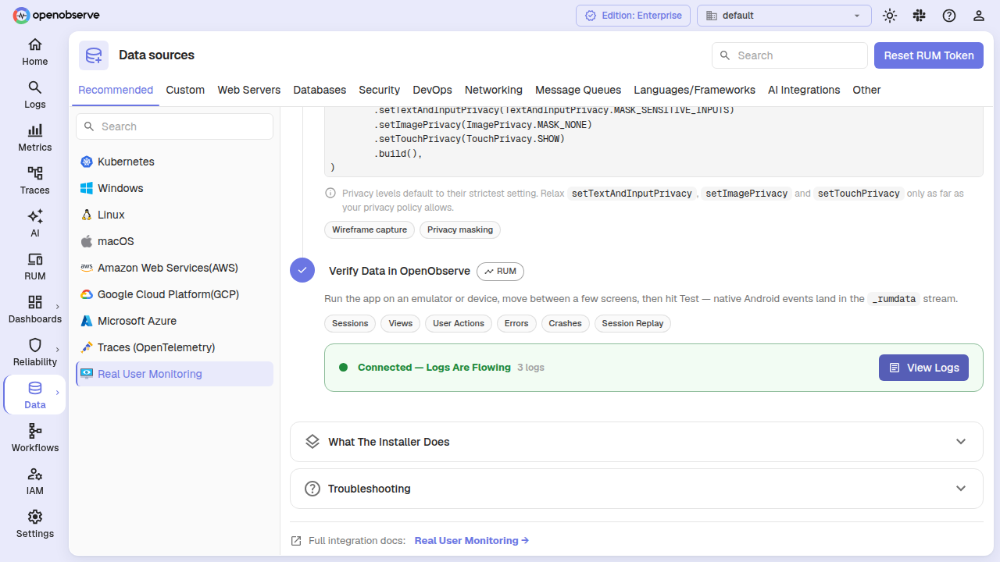

# RUM Setup Guide

This guide walks you through setting up OpenObserve RUM across all supported platforms: **Browser (Web)**, **React Native**, **Android**, and **iOS**.

OpenObserve provides an in-app guided setup. From the **Ingestion** menu, select **RUM** and use the platform switcher to pick your target. The UI fills in your endpoint, organization, and RUM token automatically.



## Prerequisites

- A running OpenObserve instance
- A RUM client token (generated from the **Ingestion** &rarr; **RUM** page in OpenObserve)
- The application you want to monitor

---

## Browser (Web) Setup

### Install the Packages

```bash
npm install @openobserve/browser-rum @openobserve/browser-logs
```

Or with yarn:

```bash
yarn add @openobserve/browser-rum @openobserve/browser-logs
```

### Initialize the SDK

Add the following code to your application's entry point (`main.js`, `index.js`, or `App.vue`):

```javascript
import { openobserveRum } from '@openobserve/browser-rum';
import { openobserveLogs } from '@openobserve/browser-logs';

const options = {
  clientToken: 'your-client-token-here',
  applicationId: 'web-application-id',
  site: 'localhost:5080',
  service: 'my-web-application',
  env: 'production',
  version: '0.0.1',
  organizationIdentifier: 'default',
  insecureHTTP: true,
  apiVersion: 'v1',
};

openobserveRum.init({
  applicationId: options.applicationId,
  clientToken: options.clientToken,
  site: options.site,
  organizationIdentifier: options.organizationIdentifier,
  service: options.service,
  env: options.env,
  version: options.version,
  trackResources: true,
  trackLongTasks: true,
  trackUserInteractions: true,
  apiVersion: options.apiVersion,
  insecureHTTP: options.insecureHTTP,
  defaultPrivacyLevel: 'allow',
});

openobserveLogs.init({
  clientToken: options.clientToken,
  site: options.site,
  organizationIdentifier: options.organizationIdentifier,
  service: options.service,
  env: options.env,
  version: options.version,
  forwardErrorsToLogs: true,
  insecureHTTP: options.insecureHTTP,
  apiVersion: options.apiVersion,
});

openobserveRum.setUser({
  id: "1",
  name: "Captain Hook",
  email: "captainhook@example.com",
});

openobserveRum.startSessionReplayRecording();
```

### Browser Configuration Options

#### RUM Configuration

| Option | Type | Required | Description |
|--------|------|----------|-------------|
| `applicationId` | string | Yes | A unique identifier for your application |
| `clientToken` | string | Yes | Your OpenObserve RUM client token |
| `site` | string | Yes | Your OpenObserve instance URL (e.g. `openobserve.example.com:5080`) |
| `organizationIdentifier` | string | Yes | Your organization identifier (usually `default`) |
| `service` | string | Yes | Name of your service/application |
| `env` | string | Yes | Environment (`production`, `staging`, `development`) |
| `version` | string | Yes | Version of your application |
| `trackResources` | boolean | No | Track loading of resources (images, scripts, CSS). Default: `false` |
| `trackLongTasks` | boolean | No | Track long-running JavaScript tasks. Default: `false` |
| `trackUserInteractions` | boolean | No | Track clicks, form submissions, etc. Default: `false` |
| `defaultPrivacyLevel` | string | No | Privacy level: `allow`, `mask-user-input`, or `mask`. Default: `mask-user-input` |
| `insecureHTTP` | boolean | No | Set to `true` for HTTP, `false` for HTTPS. Default: `false` |
| `apiVersion` | string | No | API version to use. Default: `v1` |

#### Logs Configuration

| Option | Type | Required | Description |
|--------|------|----------|-------------|
| `clientToken` | string | Yes | Your OpenObserve RUM client token |
| `site` | string | Yes | Your OpenObserve instance URL |
| `organizationIdentifier` | string | Yes | Your organization identifier |
| `service` | string | Yes | Name of your service |
| `env` | string | Yes | Environment |
| `version` | string | Yes | Application version |
| `forwardErrorsToLogs` | boolean | No | Automatically forward errors to logs. Default: `true` |
| `insecureHTTP` | boolean | No | Set to `true` for HTTP. Default: `false` |
| `apiVersion` | string | No | API version. Default: `v1` |

#### Privacy Levels

- **`allow`**: Record all content including user input
- **`mask-user-input`**: Mask form inputs but show other content (recommended)
- **`mask`**: Mask all user input and text content

### User Context

```javascript
openobserveRum.setUser({
  id: "user-123",
  name: "John Doe",
  email: "john.doe@example.com",
  plan: "premium",
  signup_date: "2024-01-15"
});
```

To clear:

```javascript
openobserveRum.clearUser();
```

### Session Replay

```javascript
// Automatic
openobserveRum.startSessionReplayRecording();

// Conditional
if (userEncounteredError) {
  openobserveRum.startSessionReplayRecording({ force: true });
}

// Stop
openobserveRum.stopSessionReplayRecording();
```

### Framework-Specific Integration

#### Vue.js

```javascript
import { createApp } from 'vue'
import App from './App.vue'
import { openobserveRum } from '@openobserve/browser-rum'
import { openobserveLogs } from '@openobserve/browser-logs'

openobserveRum.init({ /* ... configuration */ });
openobserveLogs.init({ /* ... configuration */ });

const app = createApp(App)
app.mount('#app')
```

#### React

```javascript
import React from 'react';
import ReactDOM from 'react-dom';
import App from './App';
import { openobserveRum } from '@openobserve/browser-rum';
import { openobserveLogs } from '@openobserve/browser-logs';

openobserveRum.init({ /* ... configuration */ });
openobserveLogs.init({ /* ... configuration */ });

ReactDOM.render(<App />, document.getElementById('root'));
```

#### Angular

```typescript
import { platformBrowserDynamic } from '@angular/platform-browser-dynamic';
import { AppModule } from './app/app.module';
import { openobserveRum } from '@openobserve/browser-rum';
import { openobserveLogs } from '@openobserve/browser-logs';

openobserveRum.init({ /* ... configuration */ });
openobserveLogs.init({ /* ... configuration */ });

platformBrowserDynamic().bootstrapModule(AppModule);
```

---

## React Native Setup <span class="beta-badge">Beta</span>

### Install the Packages

```bash
npm install @openobserve/mobile-react-native @openobserve/mobile-react-native-session-replay
```

Or with yarn:

```bash
yarn add @openobserve/mobile-react-native @openobserve/mobile-react-native-session-replay
```

### Initialize the SDK

```javascript
import {
  OpenObserve,
  O2Rum,
  O2Logs,
  RumConfiguration,
  LogsConfiguration,
  TrackingConsent,
} from '@openobserve/mobile-react-native';

await OpenObserve.initialize(
  clientToken: 'your-client-token-here',
  env: 'production',
  service: 'my-react-native-app',
  site: 'https://your-instance.example.com',
  trackingConsent: TrackingConsent.GRANTED,
);

await O2Rum.enable(
  RumConfiguration.builder('my-react-native-app')
    .useCustomEndpoint('https://your-instance.example.com/rum/v1/default/rum')
    .trackUserInteractions()
    .trackLongTasks()
    .build(),
);

await O2Logs.enable(
  LogsConfiguration.builder()
    .useCustomEndpoint('https://your-instance.example.com/rum/v1/default/logs')
    .build(),
);
```

### Navigation Tracking (Optional)

Track screen views automatically with React Navigation:

```bash
npm install @openobserve/mobile-react-native-navigation
```

```javascript
import { O2RumReactNavigationTracking } from '@openobserve/mobile-react-native-navigation';

<NavigationContainer
  ref={navigationRef}
  onReady={() => {
    O2RumReactNavigationTracking.startTrackingViews(navigationRef.current);
  }}
>
  {/* your screens */}
</NavigationContainer>
```

Without navigation tracking, you can record views manually with `O2Rum.startView()` / `O2Rum.stopView()`.

### Session Replay

```javascript
import { O2SessionReplay, SessionReplayConfiguration } from '@openobserve/mobile-react-native-session-replay';

O2SessionReplay.enable(
  SessionReplayConfiguration.builder(100)
    .useCustomEndpoint('https://your-instance.example.com/rum/v1/default/replay')
    .build(),
);
```

---

## Android Setup <span class="beta-badge">Beta</span>

### Install the SDK

Add the OpenObserve dependencies to your Gradle build file.

**Kotlin DSL** (`build.gradle.kts`):

```kotlin
dependencies {
  implementation("ai.openobserve:o2-sdk-android-rum:0.1.0")
  implementation("ai.openobserve:o2-sdk-android-logs:0.1.0")
  // Optional — screen recording.
  implementation("ai.openobserve:o2-sdk-android-session-replay:0.1.0")
}
```

**Groovy** (`build.gradle`):

```groovy
dependencies {
  implementation "ai.openobserve:o2-sdk-android-rum:0.1.0"
  implementation "ai.openobserve:o2-sdk-android-logs:0.1.0"
  // Optional — screen recording.
  implementation "ai.openobserve:o2-sdk-android-session-replay:0.1.0"
}
```

The session-replay dependency is optional — drop that line if you do not need screen recording.

### Initialize the SDK

Initialize in your `Application` subclass as early as possible:

```kotlin
import android.app.Application
import com.openobserve.android.OpenObserve
import com.openobserve.android.core.configuration.Configuration
import com.openobserve.android.log.Logs
import com.openobserve.android.log.LogsConfiguration
import com.openobserve.android.privacy.TrackingConsent
import com.openobserve.android.rum.Rum
import com.openobserve.android.rum.RumConfiguration
import com.openobserve.android.rum.tracking.ActivityViewTrackingStrategy

class SampleApplication : Application() {
    override fun onCreate() {
        super.onCreate()

        val configuration = Configuration.Builder(
            clientToken = "your-client-token-here",
            env = "production",
            service = "my-android-app",
        )
            .build()

        OpenObserve.initialize(this, configuration, TrackingConsent.GRANTED)

        // The native SDK does NOT append a path to a custom endpoint — give each
        // feature its own FULL intake URL.
        Rum.enable(
            RumConfiguration.Builder(applicationId = "my-android-app")
                .useCustomEndpoint("https://your-instance.example.com/rum/v1/default/rum")
                .trackUserInteractions()
                .trackLongTasks()
                .useViewTrackingStrategy(ActivityViewTrackingStrategy(trackExtras = true))
                .build(),
        )

        Logs.enable(
            LogsConfiguration.Builder()
                .useCustomEndpoint("https://your-instance.example.com/rum/v1/default/logs")
                .build(),
        )
    }
}
```

**Important**: The native Android SDK appends nothing to a custom endpoint — it posts to exactly the URL you pass. Each feature (RUM, Logs, Session Replay) needs its own full intake URL ending in `/rum`, `/logs`, or `/replay`.

If your ingestion endpoint uses plain HTTP (`http://`), allow cleartext traffic:

```kotlin
// Allow cleartext for the SDK
Configuration.Builder(...)
    .let { com.openobserve.android._InternalProxy.allowClearTextHttp(it) }
    .build()
```

Also set `android:usesCleartextTraffic="true"` in your manifest. Prefer HTTPS outside local development.

### Session Replay

```kotlin
import com.openobserve.android.sessionreplay.SessionReplay
import com.openobserve.android.sessionreplay.SessionReplayConfiguration
import com.openobserve.android.sessionreplay.TextAndInputPrivacy
import com.openobserve.android.sessionreplay.ImagePrivacy
import com.openobserve.android.sessionreplay.TouchPrivacy

SessionReplay.enable(
    SessionReplayConfiguration.Builder(sampleRate = 100f)
        .useCustomEndpoint("https://your-instance.example.com/rum/v1/default/replay")
        .setTextAndInputPrivacy(TextAndInputPrivacy.MASK_SENSITIVE_INPUTS)
        .setImagePrivacy(ImagePrivacy.MASK_NONE)
        .setTouchPrivacy(TouchPrivacy.SHOW)
        .build(),
)
```

### Android Emulator Networking

`localhost` inside an emulator refers to the emulator itself. Use `10.0.2.2` to reach your host machine:

```
https://10.0.2.2:5080/rum/v1/default/rum
```

On a physical device use your machine's LAN IP.

---

## iOS Setup <span class="beta-badge">Beta</span>

### Install the SDK

**Swift Package Manager** (`Package.swift`):

```swift
dependencies: [
    .package(url: "https://github.com/openobserve/openobserve-sdk-ios.git", from: "0.1.0"),
],
targets: [
    .target(
        name: "MyApp",
        dependencies: [
            .product(name: "OpenObserveCore", package: "openobserve-sdk-ios"),
            .product(name: "OpenObserveRUM", package: "openobserve-sdk-ios"),
            .product(name: "OpenObserveLogs", package: "openobserve-sdk-ios"),
            // Optional — screen recording.
            .product(name: "OpenObserveSessionReplay", package: "openobserve-sdk-ios"),
        ],
    ),
]
```

Or add the package in Xcode: **File** &rarr; **Add Package Dependencies...** and paste `https://github.com/openobserve/openobserve-sdk-ios.git`.

**CocoaPods** (`Podfile`):

```ruby
pod 'OpenObserveCore', '0.1.0'
pod 'OpenObserveRUM', '0.1.0'
pod 'OpenObserveLogs', '0.1.0'
# Optional — screen recording.
pod 'OpenObserveSessionReplay', '0.1.0'
```

Then run `pod install`.

### Initialize the SDK

```swift
import OpenObserveCore
import OpenObserveRUM
import OpenObserveLogs
import UIKit

@main
class AppDelegate: UIResponder, UIApplicationDelegate {
    func application(
        _ application: UIApplication,
        didFinishLaunchingWithOptions launchOptions: [UIApplication.LaunchOptionsKey: Any]? = nil
    ) -> Bool {
        let configuration = OpenObserve.Configuration(
            clientToken: "your-client-token-here",
            env: "production",
            service: "my-ios-app"
        )
        OpenObserve.initialize(with: configuration, trackingConsent: .granted)

        // The native SDK does NOT append a path to a custom endpoint — give each
        // feature its own FULL intake URL.
        RUM.enable(
            with: RUM.Configuration(
                applicationID: "my-ios-app",
                sessionSampleRate: 100,
                uiKitViewsPredicate: DefaultUIKitRUMViewsPredicate(),
                customEndpoint: URL(string: "https://your-instance.example.com/rum/v1/default/rum")
            )
        )

        Logs.enable(
            with: Logs.Configuration(
                customEndpoint: URL(string: "https://your-instance.example.com/rum/v1/default/logs")
            )
        )

        return true
    }
}
```

**Important**: The native iOS SDK appends nothing to a `customEndpoint` — it posts to exactly the URL you pass. Each feature (RUM, Logs, Session Replay) needs its own full intake URL ending in `/rum`, `/logs`, or `/replay`.

If your ingestion endpoint uses plain HTTP, iOS blocks cleartext traffic via App Transport Security (ATS). There is no SDK flag — add an `NSAppTransportSecurity` exception for your host in `Info.plist`:

```xml
<key>NSAppTransportSecurity</key>
<dict>
    <key>NSExceptionDomains</key>
    <dict>
        <key>your-instance.example.com</key>
        <dict>
            <key>NSExceptionAllowsInsecureHTTPLoads</key>
            <true/>
        </dict>
    </dict>
</dict>
```

Prefer HTTPS outside local development.

### Session Replay

```swift
import OpenObserveSessionReplay

SessionReplay.enable(
    with: SessionReplay.Configuration(
        replaySampleRate: 100,
        textAndInputPrivacyLevel: .maskSensitiveInputs,
        imagePrivacyLevel: .maskNone,
        touchPrivacyLevel: .show,
        customEndpoint: URL(string: "https://your-instance.example.com/rum/v1/default/replay")
    )
)
```

---

## Verify Installation

After deploying your application with RUM enabled:

1. Launch your application and perform interactions
2. Log in to OpenObserve and navigate to the **RUM** section
3. In the in-app setup guide, the **Verify** step auto-detects incoming data — look for the green checkmark
4. Explore your data across:
   - **Performance** tab — adaptive dashboards showing metrics your stream actually emits. Dashboards automatically remove panels whose columns do not exist in the stream schema (e.g. Web Vitals panels hide for mobile-only apps)
   - **Sessions** tab — user sessions from all platforms, filterable by `source = 'browser'`, `source = 'android'`, `source = 'ios'`
   - **Error Tracking** tab — errors and crashes from any platform
   - **Session Replay** — replay recordings of user sessions



## Troubleshooting

### No Data Appearing

1. **Check console / logcat / Xcode console** for initialization errors
2. **Verify the RUM client token**: ensure it matches the token on the **Ingestion** &rarr; **RUM** page
3. **Check network requests**:
   - Browser: DevTools &rarr; Network tab
   - Android: inspect with `adb logcat` or a network profiler
   - iOS: use Xcode's Network inspector or tools like Proxyman

### Browser-Specific

- **CORS**: ensure your OpenObserve instance allows requests from your application domain
- **Privacy settings**: `defaultPrivacyLevel` affects what is recorded

### Mobile: Endpoint URLs

The single most common reason one signal arrives while another does not is an incorrect endpoint URL. On native mobile SDKs (Android, iOS), `useCustomEndpoint` / `customEndpoint` is used verbatim — the SDK appends nothing. Pass the complete per-feature URL:

| Feature | URL suffix |
|---------|-----------|
| RUM | `/rum/v1/{org}/rum` |
| Logs | `/rum/v1/{org}/logs` |
| Session Replay | `/rum/v1/{org}/replay` |

For example: `https://your-instance.example.com/rum/v1/default/rum`

### Mobile: No Data from Emulator / Device

- **Android emulator**: use `10.0.2.2` instead of `localhost` or `127.0.0.1`
- **Physical devices**: use your machine's LAN IP on the same network

### Mobile: Plain HTTP (`http://`) Not Working

- **Android**: allow cleartext with `_InternalProxy.allowClearTextHttp(builder)` and set `android:usesCleartextTraffic="true"` in the manifest
- **iOS**: add an `NSAppTransportSecurity` exception for your host in `Info.plist`

### Session Replay Not Recording

- **All platforms**: ensure the session replay feature is enabled *separately* from RUM — it does not inherit RUM's endpoint
- **Browser**: call `startSessionReplayRecording()` after `openobserveRum.init()`
- **Mobile**: pass the full `/replay` endpoint to `SessionReplay.enable(...)`, not the RUM endpoint

### Requests Return 401 or 403

The `clientToken` is your org's **RUM token**, not the ingestion passcode. If it was rotated, regenerate it from the **Ingestion** &rarr; **RUM** page and rebuild your app.

### Views / Screens All Named the Same

View tracking may not be wired up:

- **Browser**: views are captured automatically from page navigation
- **React Native**: pass your navigation ref to `O2RumReactNavigationTracking.startTrackingViews()`, or call `O2Rum.startView()` / `O2Rum.stopView()` manually
- **Android**: pass `ActivityViewTrackingStrategy(trackExtras = true)` for Activities, or `NavigationViewTrackingStrategy(...)` for Jetpack Compose Navigation
- **iOS**: pass `uiKitViewsPredicate: DefaultUIKitRUMViewsPredicate()` for UIKit, or a `swiftUIViewsPredicate` for SwiftUI

### Package Resolution Fails (iOS)

Confirm the SPM URL `https://github.com/openobserve/openobserve-sdk-ios.git` and that the version `0.1.0` exists, then in Xcode go to **File** &rarr; **Packages** &rarr; **Reset Package Caches** and resolve again.

### Performance Impact

RUM is designed to have minimal impact:

- **Asynchronous**: data collection runs off the main thread
- **Batching**: events are batched before sending
- **Lightweight**: SDKs are small and tree-shaken where possible
- **Sampling**: configure sampling rates to control data volume

## Advanced Configuration

### Custom Sampling

Control which sessions are tracked:

```javascript
// Browser
openobserveRum.init({
  sessionSampleRate: 100,          // Track 100% of sessions
  sessionReplaySampleRate: 50,     // Record 50% of sessions
});
```

On native platforms, set the sample rate during `RUM.Configuration` or `SessionReplay.Configuration` construction.

### Manual Error Tracking

```javascript
try {
  // Your code
} catch (error) {
  openobserveLogs.logger.error('Custom error message', {
    error: error,
    context: 'additional context'
  });
}
```

On native platforms, use `Logs.logger.error(...)` or your platform's equivalent.

### Custom Actions

```javascript
openobserveRum.addAction('button_clicked', {
  button_name: 'subscribe',
  page: 'homepage'
});
```

### Cross-Platform Data Filtering

All platforms write to the `_rumdata` stream. Filter by `source` to isolate a specific platform:

```sql
SELECT * FROM "_rumdata" WHERE source = 'android'
SELECT * FROM "_rumdata" WHERE source = 'ios'
SELECT * FROM "_rumdata" WHERE source = 'browser'
```

The performance dashboards automatically adapt to your stream's schema — panels whose columns are absent are dropped, and platform-tagged panels flow to the platforms that have data.

## Next Steps

- [Performance Monitoring](./performance-monitoring.md) - Learn about performance metrics and adaptive dashboards
- [Session Tracking](./sessions.md) - Understand session data across platforms
- [Error Tracking](./error-tracking.md) - Track and debug errors and crashes
- [Session Replay](./session-replay.md) - Use session replay on web and mobile
- [Metrics Reference](./metrics-reference.md) - Complete metrics documentation
