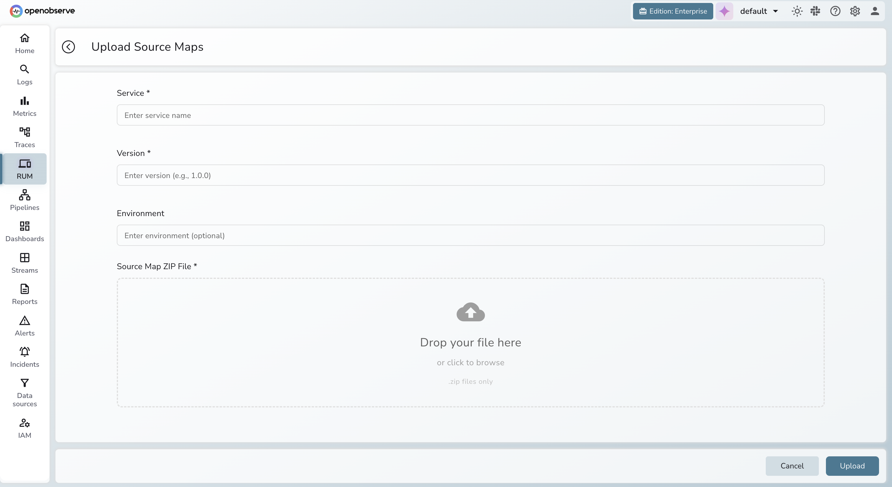

# RUM Source Maps

Translate minified JS error stack traces back to original source file paths, function names, and line numbers — automatically, in the Error Tracking UI.

> **Enterprise only.** Requires an API token with `sourcemaps` RBAC permissions.


## How it works

The OpenObserve RUM SDK captures errors from production, but minified stack traces (e.g. `main.abc123.js:1:186484`) are unreadable. You upload the `.map` files from your build, tagged with **service**, **env**, and **version**. OpenObserve matches these against incoming errors and resolves frames automatically.


## Quickstart

### 1. Enable source maps in your bundler

**Vite**
```ts
// vite.config.ts
export default { build: { sourcemap: true } };
```

**webpack**
```js
// webpack.config.js
module.exports = { devtool: 'source-map' };
```

### 2. Zip the `.map` files

```bash
cd dist/assets
zip sourcemaps.zip *.map   # .js files are not required
```

### 3. Upload to OpenObserve

```bash
curl -X POST "https://<host>/api/{org}/sourcemaps" \
  -H "Authorization: Basic <token>" \
  -H "Content-Length: $(wc -c < sourcemaps.zip)" \
  -F "file=@sourcemaps.zip" \
  -F "service=my-web-app" \
  -F "env=production" \
  -F "version=1.4.2"
```

**Success:** `HTTP 201` — `"successfully stored sourcemaps"`

> `service`, `env`, and `version` must **exactly match** your RUM SDK config (case-sensitive).

### 4. Verify in the UI

**RUM → Error Tracking → select an error** — stack frames now show original source locations (e.g. `src/components/Checkout.vue:42`).

## API Reference

### List source maps

```bash
# All
curl "https://<host>/api/{org}/sourcemaps" -H "Authorization: Basic <token>"

# Filtered
curl "https://<host>/api/{org}/sourcemaps?service=my-web-app&env=production" \
  -H "Authorization: Basic <token>"

# Distinct service/env/version combinations
curl "https://<host>/api/{org}/sourcemaps/values" -H "Authorization: Basic <token>"
```

**Response**
```json
[{
  "service": "my-web-app",
  "env": "production",
  "version": "1.4.2",
  "source_file_name": "main.abc123.js",
  "source_map_file_name": "main.abc123.js.map",
  "created_at": 1743000000
}]
```

### Delete source maps

```bash
curl -X DELETE \
  "https://<host>/api/{org}/sourcemaps?service=my-web-app&env=production&version=1.3.0" \
  -H "Authorization: Basic <token>"
```

Omitting a filter broadens the deletion scope. Omitting all three deletes **everything** — use with care.

### Resolve a stack trace via API

```bash
curl -X POST "https://<host>/api/{org}/sourcemaps/stacktrace" \
  -H "Authorization: Basic <token>" \
  -H "Content-Type: application/json" \
  -d '{
    "service": "my-web-app",
    "env": "production",
    "version": "1.4.2",
    "stacktrace": "TypeError: Cannot read properties of undefined\n    at main.abc123.js:1:186484"
  }'
```

**Response**
```json
{
  "stacktrace": {
    "frames": [
      { "file": "src/components/Checkout.vue", "function": "handleSubmit", "line": 42, "col": 8 }
    ]
  }
}
```

## Limits & matching

| Setting | Value |
|---|---|
| Max ZIP size | 100 MB |
| Max individual `.map` file | 5 MB |
| Memory cache | 10,000 entries |

Resolution requires an **exact match** on all three fields:

| Field | RUM SDK key | Upload param |
|---|---|---|
| Application | `service` | `service` |
| Environment | `env` | `env` |
| Build version | `version` | `version` |


## Permissions

| Role | Allowed operations |
|---|---|
| Viewer | List, resolve |
| Editor | Upload, list, resolve |
| Admin | Upload, list, resolve, delete |


## Best practices

- **Use a stable version** — git SHA or semver tag, never `latest`.
- **Upload before deploying** — source maps should be available before errors arrive.
- **Delete stale versions** — clean up retired builds to reduce storage clutter.
- **Keep `service` consistent** — same casing and format in both SDK and upload.
- **Never expose source maps publicly** — the upload endpoint requires authentication.


## Troubleshooting

**Stack trace still minified**
1. Run `GET /sourcemaps/values` — confirm the expected `service`/`env`/`version` is listed.
2. Compare values against RUM SDK config exactly (case-sensitive).
3. Re-upload if missing; check for a non-`201` response.
4. Confirm the `.map` file inside the ZIP corresponds to the file referenced in the trace.

**`400 file is too large`**
Split into multiple uploads using a version suffix (e.g. `1.4.2-chunk1`), or drop third-party/vendor maps you don't own.

**`400 Missing content-length header`**
Add `-H "Content-Length: $(wc -c < sourcemaps.zip)"` to your `curl` command, or use an HTTP client that reports file size automatically.

**`400` on `service` / `env` / `version` fields**
Fields must be plain ASCII multipart form fields — not JSON. Ensure none are empty strings.