# Browser tests

A browser test replays a multi-step user journey in a real browser from the locations you choose, asserting along the way that the application actually works.

Steps come from one of two places: the OpenObserve Recorder Chrome extension captures your clicks and inputs as you perform them, or you build steps by hand. Either way you end up in the same editor, where each step names an action, the element it acts on, and what should be true afterwards.

## How to create a browser test

### Step 1: Choose the check type

Click **New Check**, then select **Browser Test**. The dialog confirms which folder the check is created in.

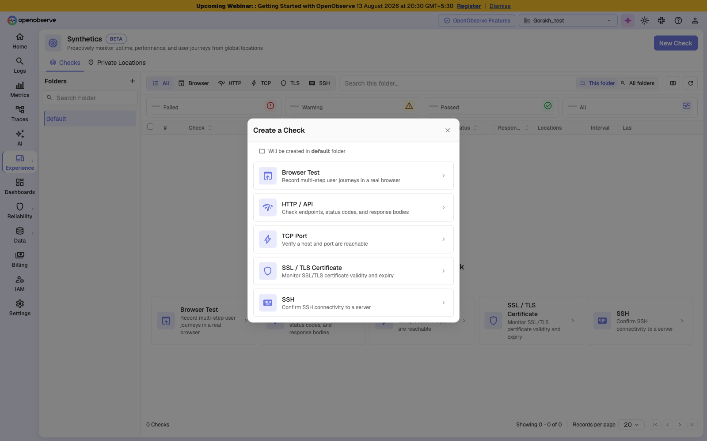

### Step 2: Set the starting URL

Enter the **Starting URL** where the journey begins. Optionally set a **Name** — OpenObserve fills this from the page if you leave it blank. The URL accepts variables such as `{{baseUrl}}`, defined under [Authentication and network](configuration.md#authentication-and-network).

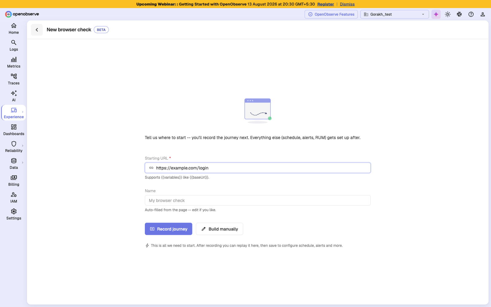

### Step 3: Connect the recorder

Click **Record journey**. If the OpenObserve Recorder extension is not connected yet, a setup screen walks you through installing it, allowing it in Incognito, and clicking its toolbar icon to activate it for the tab.

Click **Skip -- I'll build the steps manually** to write steps by hand instead.

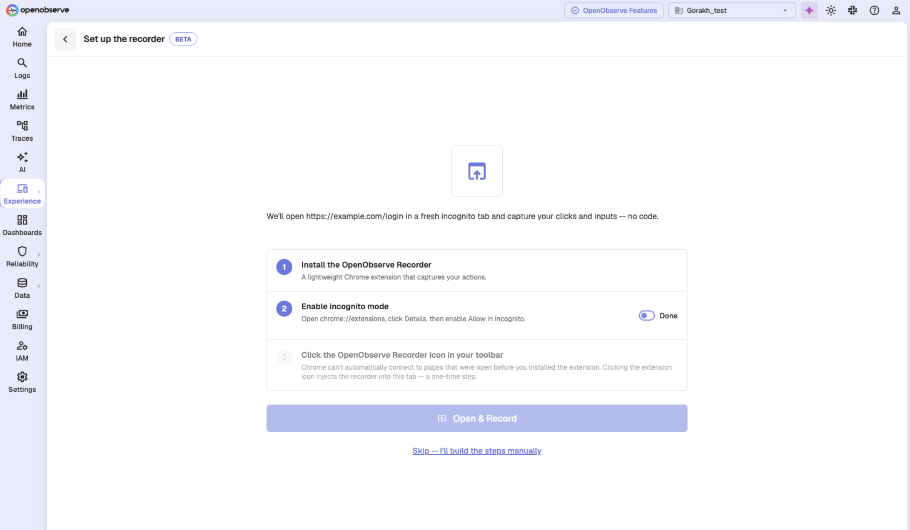

### Step 4: Record or build the journey

Recording opens your starting URL in a fresh incognito window and captures your clicks and inputs as steps. To build by hand, click **Add a step manually** and choose an action.

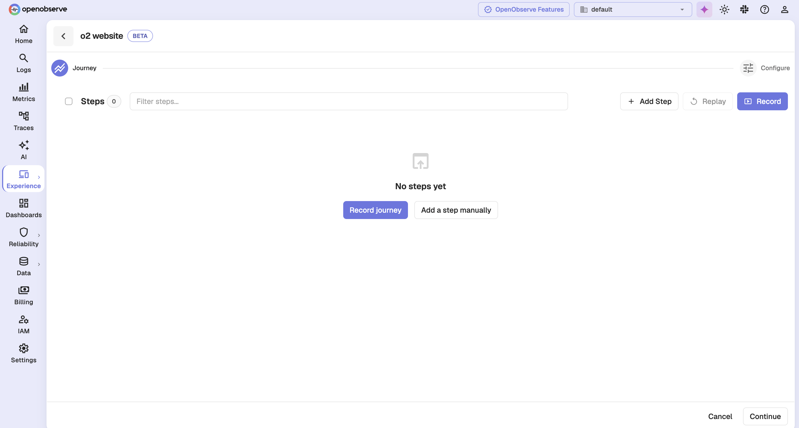

Every journey must begin with a **Navigate** step.

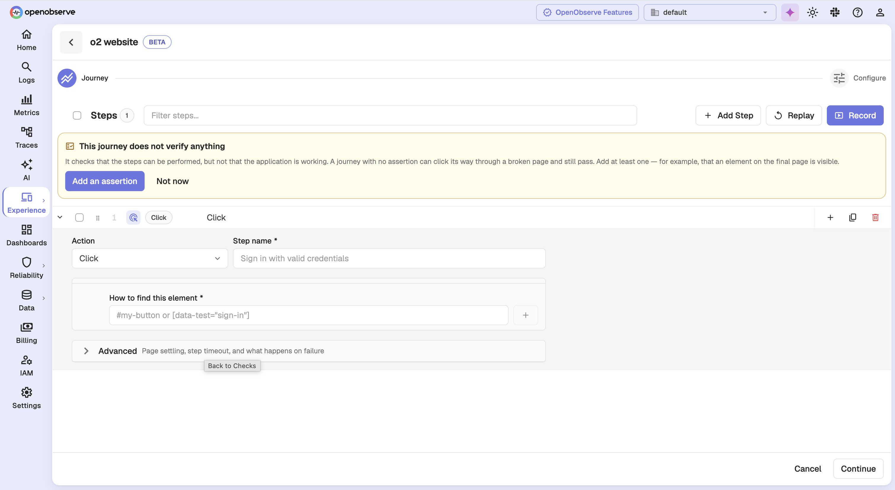

### Step 5: Add an assertion

A journey that only clicks can click its way through a broken page and still pass. OpenObserve warns you when a journey has no assertions. See [Assertions](#assertions) below.

### Step 6: Tune step behavior

Expand **Advanced** on any step to control timing and failure handling. See [Step timing and failure handling](#step-timing-and-failure-handling) below.

### Step 7: Continue to configuration

Click **Continue**. If the journey is not valid, OpenObserve blocks the move and highlights the step that needs fixing.

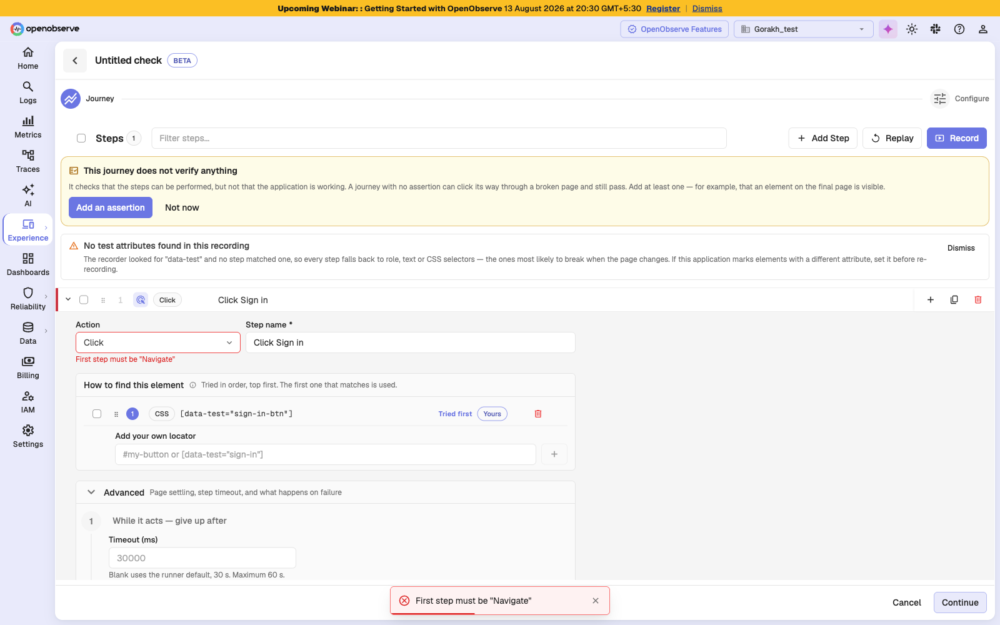

### Step 8: Configure and save

Complete the configuration cards described in [Configuration](configuration.md), then click **Save & Exit**.

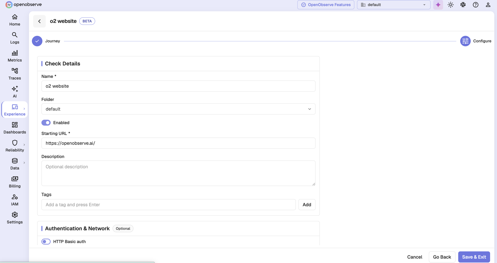

## Step actions

Each step performs one action. Nine are available:

| Action | Acts on an element | Carries a value |
|--------|--------------------|-----------------|
| **Navigate** | No | URL |
| **Click** | Yes | No |
| **Type** | Yes | Text to type |
| **Select** | Yes | Option |
| **Press** | Yes | Key |
| **Check** | Yes | No |
| **Uncheck** | Yes | No |
| **Upload** | Yes | File path |
| **Assert** | Depends on the assertion | Expected value |

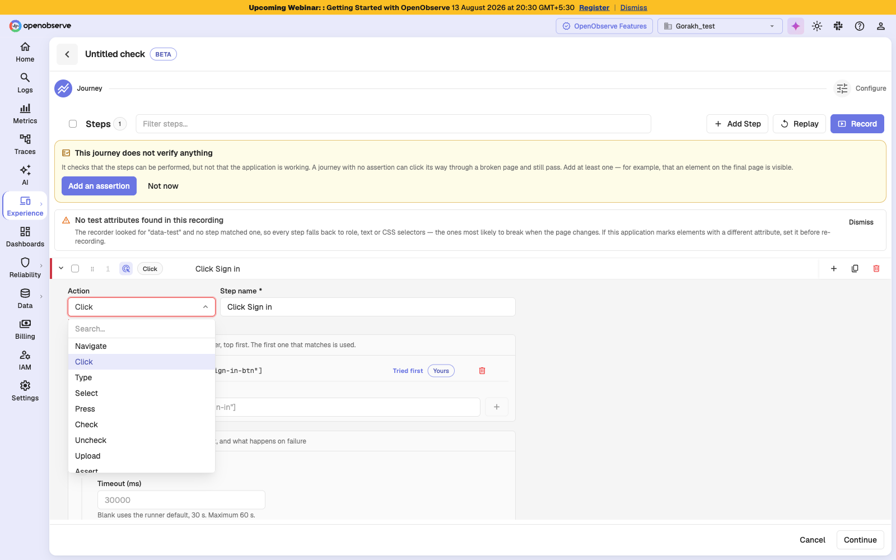

> **Note**: **Check** and **Uncheck** are distinct from **Click** on purpose. Clicking a checkbox toggles whatever state it starts in, so a page that renders it pre-ticked silently inverts the journey. Check and Uncheck state the intended result instead.

## Assertions

An assertion turns a sequence of interactions into a statement about an outcome. Add an **Assert** step and choose what to verify:

| Assertion | Verifies | Needs a locator |
|-----------|----------|-----------------|
| **Element is visible** | The element is present on the page | Yes |
| **Element is not visible** | The element is absent | Yes |
| **Element contains text** | The element's text matches the expected value | Yes |
| **URL matches** | The page URL matches a pattern | No |
| **Page title is** | The page title matches the expected value | No |
| **Attribute equals** | A named attribute matches the expected value | Yes |

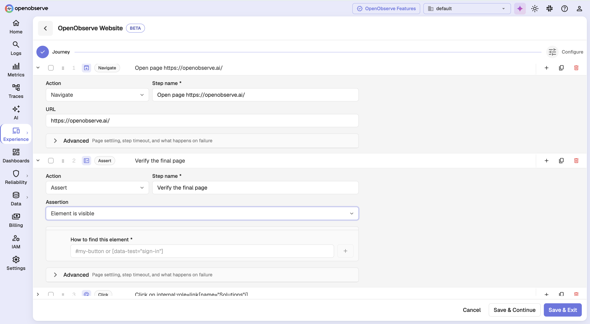

The two visibility assertions ask only whether the element is there, so they take no expected value. **Attribute equals** additionally needs the attribute name.

## Locators

A locator is how a step finds its element. Each step carries an ordered list of candidates, tried top to bottom — the first that matches is used. That fallback is what keeps a check alive through a cosmetic markup change.

Five locator kinds are available:

| Kind | Example | Durability |
|------|---------|------------|
| **Test attribute** | `[data-test="sign-in"]` | Highest — survives redesigns |
| **Role** | `role=button[name="Sign in"]` | Good, unless labels change |
| **Text** | `text=Sign in` | Breaks when copy changes |
| **CSS** | `#login-form .submit` | Breaks when structure or class names change |
| **XPath** | `//button[1]` | Most brittle, especially when positional |

Recording produces candidates automatically. You can drag to reorder them, add your own, delete ones you do not want, or combine several into one stricter locator.

> **Warning**: Ordering is not cosmetic. Candidates only agree while the markup is unchanged. Once it changes — the case fallback exists for — a later candidate may match a *different* element.

OpenObserve flags two fragile patterns as you author. A **by position** locator finds the element by counting siblings, so it breaks when the page reorders. A **generated id** locator uses an id minted on every render, so it changes on the next deploy.

If a recording produces no test-attribute candidates at all, OpenObserve warns that every step has fallen back to role, text, or CSS. The recorder looks for `data-test` by default; if your application marks elements with a different attribute, set it before re-recording.

## Step timing and failure handling

Expand **Advanced** on a step to reach these settings.

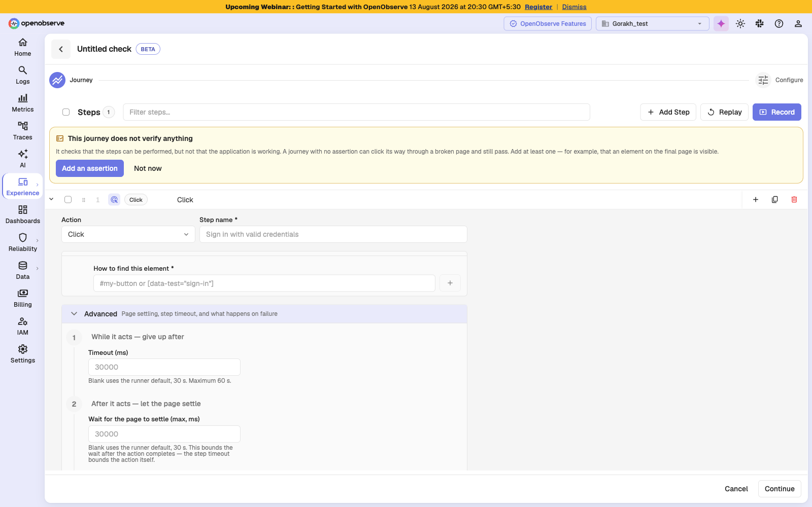

| Setting | Description | Default | Range |
|---------|-------------|---------|-------|
| **Timeout** | How long the step may spend acting | 30 s | 100 ms – 60 s |
| **Wait for the page to settle** | How long the step may spend waiting for the page to finish after the action | 30 s | 100 ms – 60 s |
| **Optional** | If this step fails, skip it and keep going. A skipped step never fails the run. | Off | — |
| **Always run** | Run this step during cleanup even after an earlier step failed | Off | — |

Use **Optional** for things that may not appear, such as a cookie banner or a one-time popup. Use **Always run** for teardown, such as signing out — its result never changes the run's verdict.

Recorded steps also carry **settle signals**: what the page demonstrably did after the step when it was recorded, such as navigating to a URL pattern or receiving a particular response. These are waited for again at run time, which is what replaces fixed sleeps. A recorded signal is advisory by default — if it never arrives the run carries on. Mark one **Required** to make its absence fail the step instead.

> **Note**: On **Navigate** and **Assert** steps the maximum timeout equals the default, so an explicit timeout there can only shorten the step.

## Editing a journey

Choosing **Edit** on a browser check reopens the journey with its steps collapsed, so you can find the one you want to change without scrolling through expanded editors.

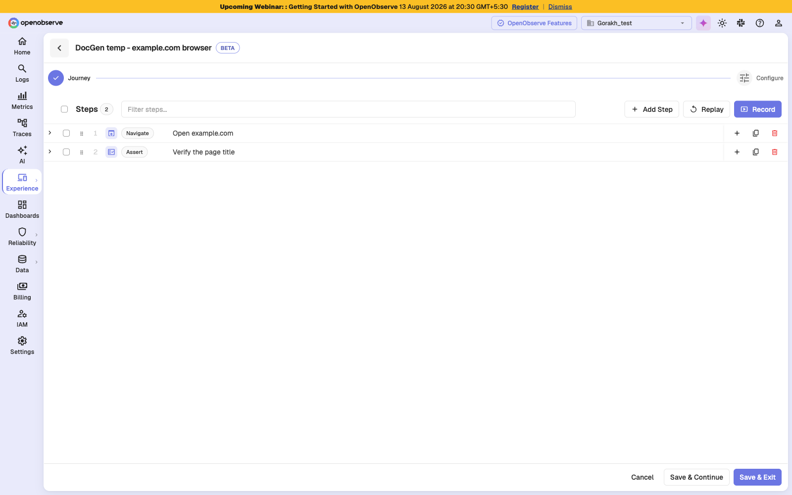

From the journey editor you can also **Replay** the journey locally through the extension, which reports per-step pass and fail without waiting for a scheduled run.

## Troubleshooting

### The recorder will not connect

**Problem**: You clicked **Record journey** but the setup screen never reports the recorder as connected.

**Solution**:

1. Confirm the OpenObserve Recorder extension is installed in Chrome.
2. Open `chrome://extensions`, click **Details** on the extension, and enable **Allow in Incognito**. Replays run in a clean incognito session and cannot start without this.
3. Click the extension icon in your toolbar to inject the recorder into the current tab. Chrome cannot connect automatically to pages that were open before the extension was installed.
4. If a previous replay is still running, wait for it to finish or reload the extension.

### Saving is blocked with "First step must be Navigate"

**Problem**: **Continue** or **Save** does nothing and a step is highlighted.

**Solution**: Every journey has to open a page before it can act on one. Change the first step's action to **Navigate**, or add a Navigate step above it. The same validation covers steps missing a name, a locator, or an expected value.

### A check reports failures the application never had

**Problem**: Runs fail intermittently but the application is healthy when you check by hand.

**Solution**:

1. Open the **Steps** tab on the results page to find which step fails most often.
2. Open a failed run and check the error. A timeout on an element that exists usually means the step timeout is shorter than the real response time.
3. Check the locator resolution on the failed step. If a fallback locator matched, the markup has changed and the primary locator needs updating.
4. If the step depends on something that is not always present, mark it **Optional**.
