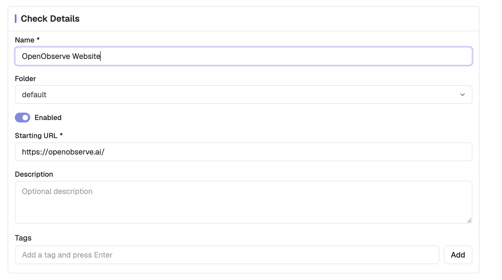
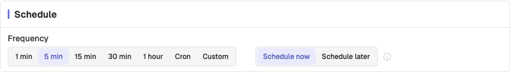
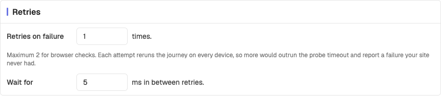
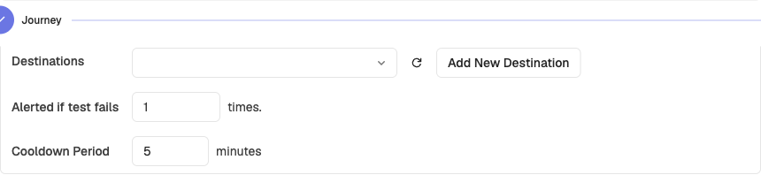
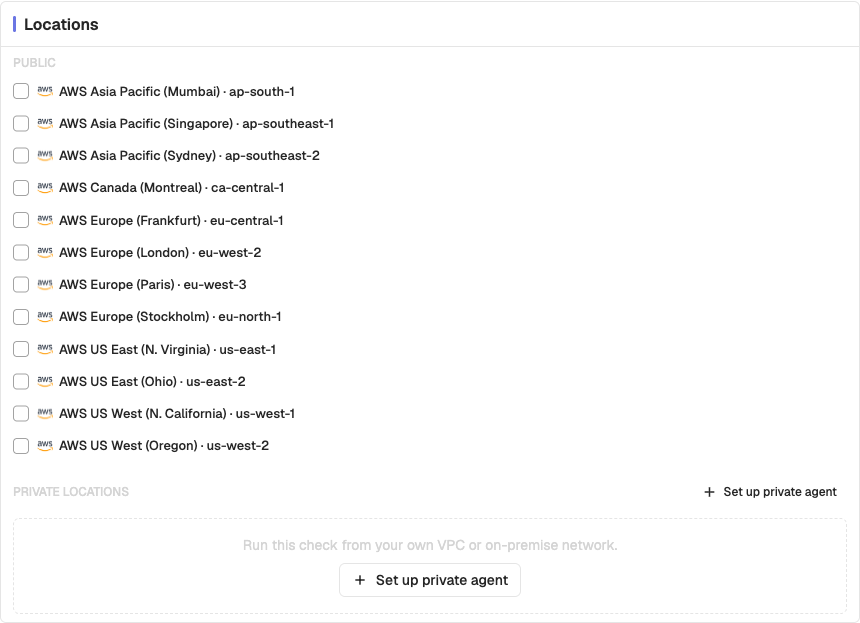
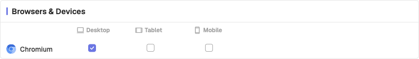
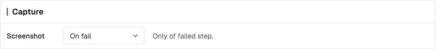
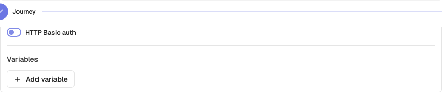

# Configuration

Every check, browser or protocol, is configured from the same set of cards. This page is the reference for each one.

Browser tests reach these cards from the **Configure** step of the create wizard. Protocol checks show them on their single configuration page.

## Check details

Identifies the check and says what it targets.

| Setting | Description | Default |
|---------|-------------|---------|
| **Name** | Identifies the check throughout the UI. Required. | — |
| **Folder** | The folder the check lives in. Also governs access. | `default` |
| **Enabled** | Whether the check runs on its schedule | On |
| **Starting URL** / **URL** / **Host** | What the check targets. Browser and HTTP take a URL; TCP, TLS, and SSH take a bare host. Required. | — |
| **Description** | Free text for your own reference | Empty |
| **Tags** | Labels for grouping and filtering | None |

> **Note**: The folder is not only organizational. Access to a check is granted through its folder, so moving a check between folders changes who can see it.

## Schedule

Controls how often the check runs and when it starts.

| Setting | Description | Default | Options |
|---------|-------------|---------|---------|
| **Frequency** | How often the check runs | 5 min | 1 min, 5 min, 15 min, 30 min, 1 hour, Custom, Cron |
| **Custom interval** | Used when Frequency is Custom | — | Minutes, Hours, Days, Weeks, Months |
| **Cron expression** | Used when Frequency is Cron, with a timezone | — | Any valid cron expression |
| **Start** | When the check becomes active | Schedule now | Schedule now, Schedule later |

**Schedule later** takes a date and time and activates the check then. The start time must be in the future — a duplicated check whose original start has passed reverts to **Schedule now**.

## Retries

Controls how many times a failing run is retried before it is reported as failed.

| Setting | Description | Default | Limit |
|---------|-------------|---------|-------|
| **Retries on failure** | Extra attempts before the run is called failed | 0 | 2 for browser checks, 3 for protocol checks |
| **Wait between retries** | Delay before the next attempt | 5 s | — |

Retries run inside the same job, so the whole sequence has to fit the check's run budget. If a configuration could exceed it, OpenObserve blocks the save and names the combination that is too large.

The browser limit is lower because each attempt reruns the whole journey on every selected browser and device combination. Three attempts across three combinations is nine journey executions in one job.

> **Tip**: Retries hide flakiness rather than fix it. The **Retry Rate** and **Flaky Rate** tiles on the results page exist so you can see how often they are saving a run — a high retry rate is a signal to fix the journey, not to raise the retry count.

## Alerts

Controls when a failing check notifies you.

| Setting | Description | Default |
|---------|-------------|---------|
| **Alerted if test fails** | Consecutive failures before notifying | 1 |
| **Cooldown period** | Minimum gap between notifications | 5 minutes |
| **Destinations** | Notification destinations to alert | None |

Destinations are the same ones used elsewhere in OpenObserve alerting, so a Synthetics check can notify the channels you already have configured.

> **Tip**: Raise **Alerted if test fails** to 2 or 3 for checks that run every minute against a service with occasional blips. The cooldown then keeps a sustained outage from flooding the channel.

## Locations

Select one or more probe locations. At least one is required.

Public locations cover twelve AWS regions:

| Area | Regions |
|------|---------|
| **North America** | N. Virginia, Ohio, N. California, Oregon, Montreal |
| **Europe** | Frankfurt, London, Paris, Stockholm |
| **Asia Pacific** | Mumbai, Singapore, Sydney |

Private locations appear once their agents register. OpenObserve only offers a private location for checks its live agents can run, so a browser test does not list a location served only by network agents. See [Private locations](private-locations.md).

> **Note**: Each location runs the check independently, so selecting three locations triples the runs. Choose locations that represent where your users actually are.

## Browsers and devices

Browser checks only. Each selected combination runs as a separate execution, and at least one must be selected.

| Device | Viewport |
|--------|----------|
| **Desktop** | 1440 x 900 |
| **Tablet** | 768 x 1024 |
| **Mobile** | 375 x 667 |

> **Tip**: Every combination multiplies the work in a run, and combines with retries and locations. A matrix that is too wide can push the check past its run budget and be rejected at save time.

## Capture

Browser checks only. Controls which artifacts each run keeps.

| Setting | Description | Default | Options |
|---------|-------------|---------|---------|
| **Screenshot** | When to capture step screenshots | On fail | Always, On fail, Off |

**Always** captures a screenshot at every step, which is what makes the run detail timeline fully visual. **On fail** keeps only the failing step's screenshot.

> **Note**: Evidence — console errors, page errors, and network events — is retained for failed runs only, independently of this setting.

## Authentication and network

Available on browser and HTTP checks.

| Setting | Description |
|---------|-------------|
| **HTTP Basic auth** | Username and password sent with requests |
| **Variables** | Reusable values referenced as `{{name}}`, optionally masked as sensitive |
| **Custom headers** | Headers added to every request |
| **Pre-set cookies** | Cookies set before the journey starts |

Variables are referenced anywhere the check accepts one, including the starting URL and step values. Mark a variable as secure to mask its value in the UI.

> **Warning**: Pre-set cookies and basic auth credentials are stored with the check. Use dedicated test accounts rather than real user credentials.
