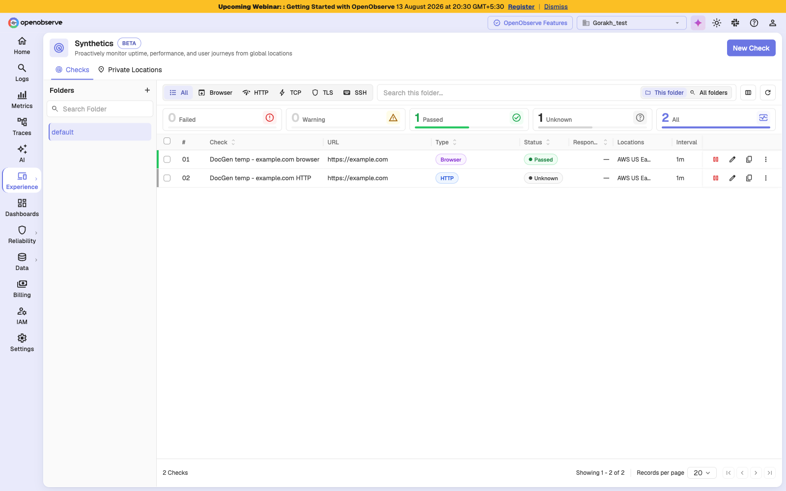
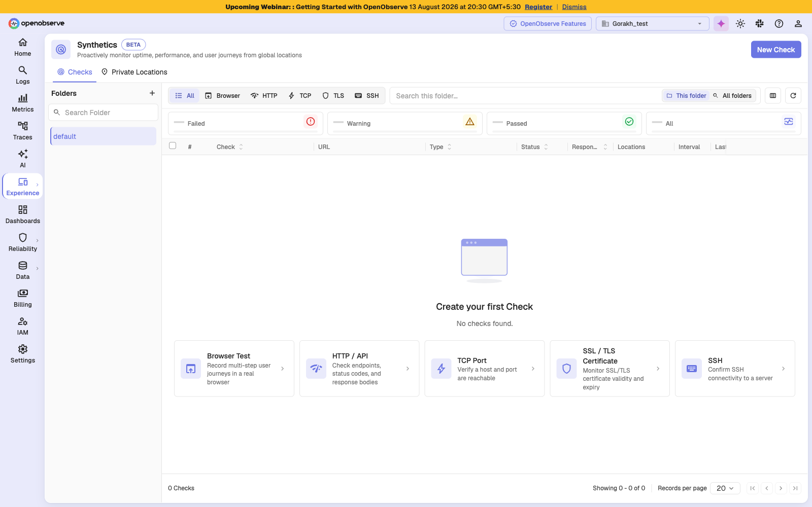

# Synthetics

Synthetics runs scripted checks against your applications and infrastructure on a schedule, from locations around the world, so you find outages and slowdowns before your users report them.

## Overview

Real user monitoring tells you what happened to the people who visited your site. Synthetic monitoring tells you what would happen if someone visited right now. OpenObserve Synthetics runs checks continuously from probe locations you choose, records every run, and keeps the evidence needed to explain a failure after the fact.

Synthetics serves two audiences. Site reliability and operations teams use protocol checks to confirm that endpoints answer, ports accept connections, and certificates have not expired. Product and QA teams use browser tests to confirm that a real user journey — sign in, search, add to cart, check out — still works end to end in a real browser.

Every check produces a run history you can slice by location, browser, and device, with pass rate, latency percentiles, retry and flakiness rates, and per-step timing. When a run fails, the run detail page names the step that broke, shows the screenshot taken at that moment, and reports which locator matched and what the page was doing at the time.

> **Note**: Synthetics is an enterprise feature and is currently in **Beta**. If you do not see it in the sidebar, ask your administrator to enable `O2_SYNTHETICS_ENABLED`.

## Check types

OpenObserve offers five check types, in two families.

| Type | Family | Verifies |
|------|--------|----------|
| **Browser Test** | Browser | A multi-step user journey in a real browser |
| **HTTP / API** | Protocol | Endpoints, status codes, and response bodies |
| **TCP Port** | Protocol | A host and port are reachable |
| **SSL / TLS Certificate** | Protocol | Certificate validity and expiry |
| **SSH** | Protocol | SSH connectivity to a server |

Browser tests have their own authoring flow, covered in [Browser tests](browser-tests.md). The four protocol types share a single configuration page, covered in [Protocol checks](protocol-checks.md). Both families share the same [configuration](configuration.md) options, [results](results.md) surfaces, and [probe locations](private-locations.md).

## Key capabilities

### Journeys that verify outcomes, not only clicks

A browser test replays a recorded journey and asserts what the application should show, so a journey that clicks its way through a broken page still fails. See [Assertions](browser-tests.md#assertions).

### Resilient element locators

Each step carries an ordered list of ways to find its element. The first that matches is used, so a cosmetic markup change does not break an otherwise healthy check. See [Locators](browser-tests.md#locators).

### Failure evidence

Failed runs keep the failing step, its error and stack trace, the screenshot taken at that moment, and the console, page, and network events captured around it. See [Diagnosing a failure](results.md#diagnose-a-failure).

### Public and private probe locations

Checks run from twelve OpenObserve-operated AWS regions, from agents inside your own network, or both. See [Private locations](private-locations.md).

## Getting started

### Prerequisites

- An enterprise or cloud OpenObserve organization with Synthetics enabled
- Permission to create checks in at least one folder
- For browser test recording: Google Chrome with the OpenObserve Recorder extension
- For private locations: a host in your network that can run Docker, Kubernetes, or a native binary

### Accessing Synthetics

1. Open **Experience** in the left sidebar.
2. Select **Synthetics**.

The page opens on the **Checks** tab. Use the **Private Locations** tab to manage your own probe locations.

Before you create anything, the Checks tab offers a shortcut into each check type.

### Creating your first check

Click **New Check** and pick a type. For a first check, an **HTTP / API** check against a health endpoint is the quickest way to see results, since it needs no recording and no browser.

## Managing checks

From the checks table you can:

- **Filter by folder** using the left sidebar, or search across all folders
- **Filter by type** using the All / Browser / HTTP / TCP / TLS / SSH toggle
- **Filter by status** by clicking a tile in the health summary
- **Edit**, **Trigger**, **Pause**, **Duplicate**, **Move**, or **Delete** a single check from its row
- Select multiple checks to pause, enable, trigger, move, or delete them together

> **Tip**: A paused check cannot be triggered. Enable it first.

## Best practices

- **Assert something on every journey.** A journey with no assertions only proves the steps could be performed, not that your application worked.
- **Prefer test attributes over CSS and text locators.** Attributes such as `data-test` survive redesigns; text and generated class names do not.
- **Keep more than one locator per step.** A step with a single locator and no fallback has nothing to try when the markup changes.
- **Mark genuinely optional steps as Optional.** Cookie banners and one-time popups appear inconsistently and will otherwise fail runs at random.
- **Set step timeouts to match your application, not to make runs fast.** A timeout shorter than the real response time is the most common cause of false failures.
- **Set Screenshot to Always while building a check**, then move it to On fail once it is stable, to keep storage in check.
- **Name steps for their purpose.** Run results show step names, so "Sign in with valid credentials" is far more useful than "Click".
- **Use folders and tags to scope access and reporting** as the number of checks grows.
- **Use a separate token per region** for private agents, so revoking one does not take down every location.

## Troubleshooting

### The Synthetics entry is missing from the sidebar

**Problem**: You cannot find Synthetics under **Experience**.

**Solution**:

1. Confirm your organization is on an enterprise or cloud plan.
2. Ask your administrator to enable `O2_SYNTHETICS_ENABLED`.
3. Reload the page. Navigating directly to the URL while the feature is off redirects you home.
