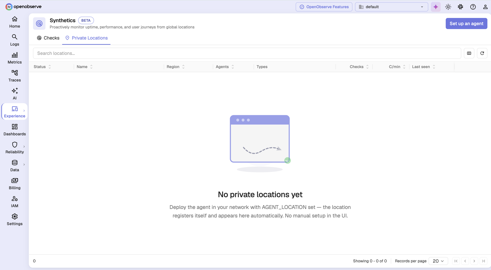
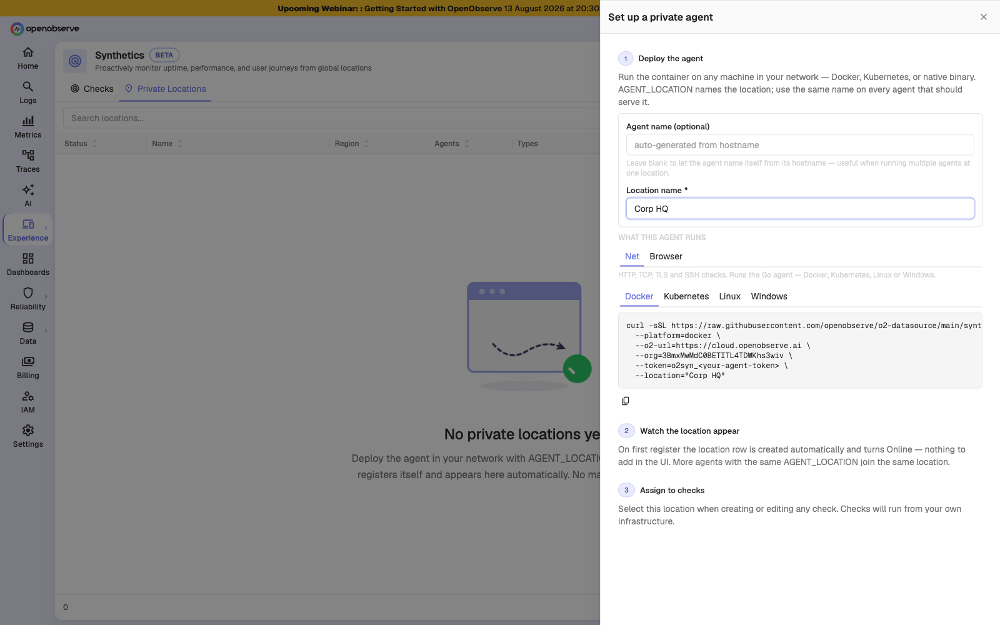
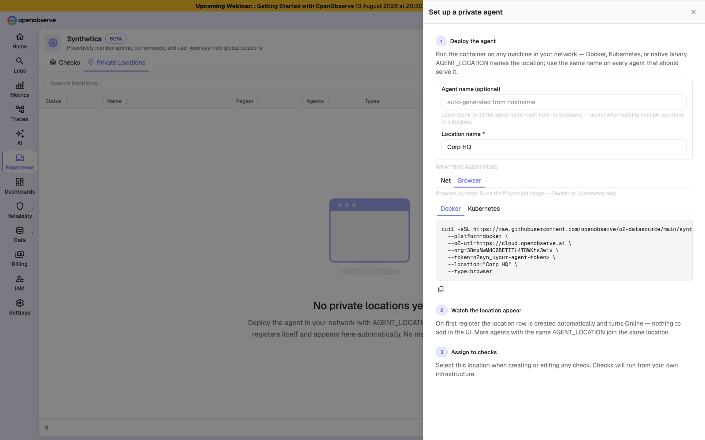
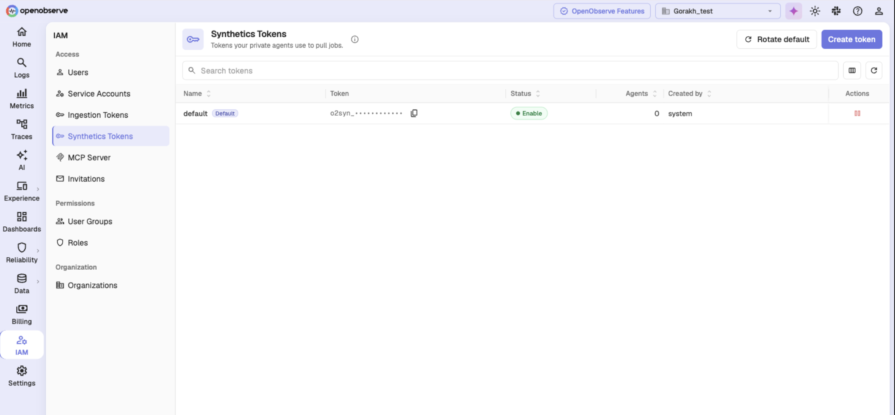

# Private locations

A private location runs checks from inside your own network, so they can reach systems that are not exposed to the internet — an internal API, a staging environment behind a VPN, a database host on a private subnet.

A location is a pool of interchangeable agents, not a single machine. Deploy several agents with the same location name and they all serve that location, sharing its work and surviving the loss of any one host.

## How private locations work

Private locations are not created in the UI. You deploy an agent with a location name, and the location registers itself the first time that agent connects.

1. You run the install command on a host in your network, naming the location.
2. The agent connects, authenticates with an `o2syn_` token, and registers.
3. The location row appears automatically and turns **Online**.
4. You select the location when creating or editing a check.

## How to set up a private agent

### Step 1: Open the setup drawer

Go to the **Private Locations** tab and click **Set up an agent**.

### Step 2: Name the location and choose the agent type

Enter a **Location name**. Reuse the same name on every agent that should serve that location. Optionally name the individual agent — left blank, it names itself from its hostname, which is useful when running several agents at one location.

Choose what the agent runs:

| Agent type | Runs | Platforms |
|------------|------|-----------|
| **Net** | HTTP, TCP, TLS, and SSH checks | Docker, Kubernetes, Linux, Windows |
| **Browser** | Browser journeys | Docker, Kubernetes |

Switching to **Browser** changes both the command and the available platforms, since browser agents run a container image.

### Step 3: Run the install command

Pick your platform tab, copy the command, and run it on a host in your network.

> **Warning**: The generated command embeds a live agent token. Treat it as a credential — do not paste it into shared documents, tickets, or chat.

### Step 4: Assign the location to checks

Once the location is **Online**, select it in the **Locations** card when creating or editing a check. See [Configuration](configuration.md#locations).

## Reading the locations table

| Column | Reports |
|--------|---------|
| **Status** | Online, Offline, or Pending |
| **Name** | The location name, with its pool beneath |
| **Region** | The region the agents report |
| **Agents** | Live agents over total registered, with the agent version |
| **Types** | Check types the live agents can run |
| **Checks** | How many checks are assigned here |
| **C/min** | Approximate checks per minute |
| **Last seen** | When an agent last reported |

**Pending** means the location exists but no agent has registered yet. **Offline** means no agent is currently live — checks assigned here do not run until one returns.

Click a row to open the location detail page, which lists the registered agents and the checks running from them. Agents are read-only there: they self-register, so there is nothing to add or edit by hand.

## Managing agent tokens

Agents authenticate with org-level `o2syn_` tokens, managed under **IAM > Synthetics Tokens**.

| Action | Use it to |
|--------|-----------|
| **Create token** | Mint a named token for a region or site |
| **Rotate default** | Replace the org default token |
| **Enable / disable** | Turn a token off without deleting it |

Public locations use the default token automatically. Create a named token per region and embed it in that region's agents to limit the blast radius if one is compromised.

> **Note**: A token is shown in full only once, when it is created. Copy it then — afterwards only its prefix is displayed.

> **Tip**: Rotating the default token leaves the old one valid until you explicitly disable it, so you can roll agents over gradually rather than taking every location down at once.

## Limitations

- **Browser tests cannot run from every private location.** A location only offers browser tests when it has a live agent running the browser image.
- **A location cannot be deleted while checks are assigned to it.** Reassign or delete those checks first.
- **Agents are read-only in the UI.** Configuration lives in the install command, so changing it means re-running that command on the host.

## Troubleshooting

### A private location will not accept checks

**Problem**: Your private location does not appear when selecting locations, or shows an offline warning.

**Solution**:

1. Confirm at least one agent is running and reachable. A location with no live agent does not run checks.
2. Confirm the agent type matches the check. Browser tests need an agent running the browser image; network agents cannot run them.
3. Confirm the agent's token is still enabled under **IAM > Synthetics Tokens**.
4. Check that every agent for the location was deployed with the same location name. A typo creates a second location rather than joining the existing one.

### A location cannot be deleted

**Problem**: The delete action on a private location is disabled.

**Solution**: Checks are still assigned to it. The tooltip reports how many. Reassign or delete those checks first, then delete the location.

### An agent registered as its own location

**Problem**: You deployed a second agent and a new location appeared instead of the agent joining the existing one.

**Solution**: The location name in the install command did not match. Names must match exactly. Re-run the command on that host with the correct name, then delete the stray location once no checks reference it.
