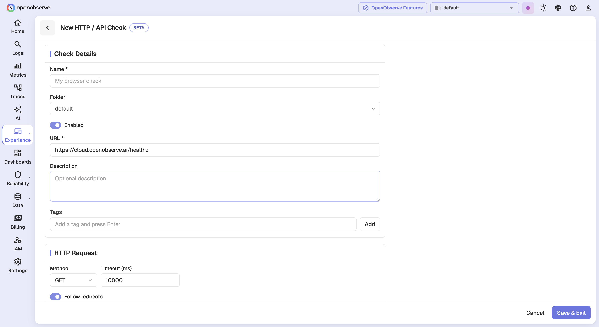
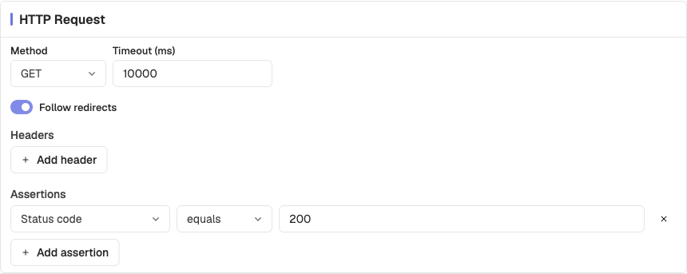
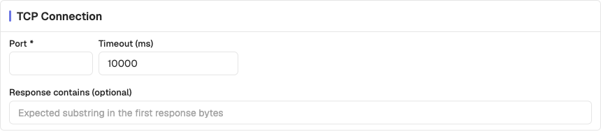
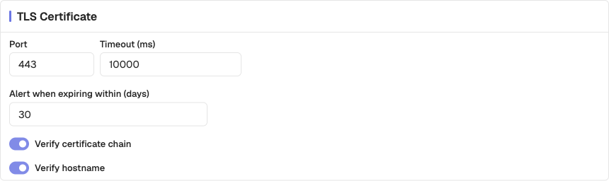
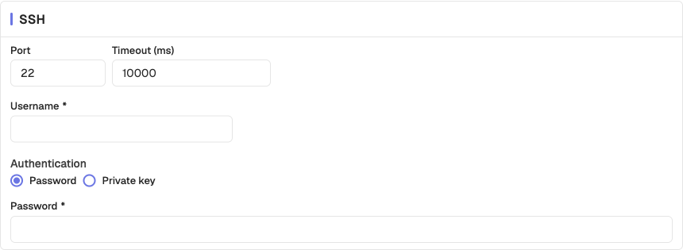

# Protocol checks

Protocol checks verify connectivity and correctness without a browser. They are cheaper and faster than browser tests, and they are the right tool when you want to know whether a service is answering rather than whether a user journey works.

Four types are available: **HTTP / API**, **TCP Port**, **SSL / TLS Certificate**, and **SSH**. All four skip the journey step entirely and open straight into a single configuration page.

## How to create a protocol check

### Step 1: Choose the type

Click **New Check** and select **HTTP / API**, **TCP Port**, **SSL / TLS Certificate**, or **SSH**.

### Step 2: Set the target

Enter a **Name** and the target. HTTP checks take a full **URL**; TCP, TLS, and SSH checks take a bare **Host** such as `example.com` or `example.com:8443`.

> **Note**: Entering a full URL on a TCP, TLS, or SSH check is rejected. Those types connect to a host and port, not to a path.

### Step 3: Configure the request

Fill in the per-type card described below.

### Step 4: Complete the shared configuration and save

Set the [schedule, retries, alerts, and locations](configuration.md), then click **Save & Exit**.

## HTTP / API

An HTTP check issues a request and asserts on the response.

| Setting | Description | Default |
|---------|-------------|---------|
| **Method** | HTTP method to send | `GET` |
| **Timeout** | How long to wait for the response | 10000 ms |
| **Follow redirects** | Whether to follow 3xx responses | On |
| **Headers** | Headers sent with the request | None |
| **Request body** | Body sent with the request | Empty |
| **Assertions** | What a healthy response looks like | `status_code equals 200` |

Assertions combine a field, an operator, and a value:

| Field | Operators |
|-------|-----------|
| **Status code** | equals, not equals, greater than, less than |
| **Response body** | contains, does not contain, equals, not equals |
| **Response time (ms)** | greater than, less than, equals, not equals |

> **Warning**: If the request never returns a response, assertions are reported as **Not evaluated** rather than passed. A check that cannot reach its target is a failure, not a pass.

## TCP Port

A TCP check confirms that a host accepts a connection on a port.

| Setting | Description | Default |
|---------|-------------|---------|
| **Port** | Port to connect to | — |
| **Timeout** | How long to wait for the connection | 10000 ms |
| **Response contains** | Optional substring expected in the first response bytes | Empty |

Leave **Response contains** empty to check reachability alone. Set it when the service announces itself on connect — an SMTP banner, for example — and you want to confirm it is the right service answering.

## SSL / TLS Certificate

A TLS check inspects the certificate a host presents, and can warn you before it expires.

| Setting | Description | Default |
|---------|-------------|---------|
| **Port** | Port to connect to | 443 |
| **Timeout** | How long to wait for the handshake | 10000 ms |
| **Alert when expiring within (days)** | Fail the check this long before expiry | 30 |
| **Verify certificate chain** | Reject a certificate whose chain does not validate | On |
| **Verify hostname** | Reject a certificate that does not match the host | On |

> **Tip**: The expiry threshold is what makes this check useful. A certificate that is valid today but expires in a week should be a problem you already know about, not one you discover at renewal time.

## SSH

An SSH check confirms that a server accepts an SSH connection and authenticates.

| Setting | Description | Default |
|---------|-------------|---------|
| **Port** | Port to connect to | 22 |
| **Username** | User to authenticate as | — |
| **Authentication** | Password or private key | Password |
| **Password** / **Private key** | The credential | — |
| **Timeout** | How long to wait | 10000 ms |

> **Warning**: The credential is stored with the check. Use a dedicated monitoring account with the least privilege that still proves the service is reachable.

## Differences from browser tests

Protocol checks share most configuration with browser tests, with these exceptions:

| Area | Protocol checks |
|------|-----------------|
| **Journey** | None — no steps to author |
| **Browsers and devices** | Not applicable |
| **Capture** | Not applicable — no screenshots or traces |
| **Authentication and network** | HTTP only; TCP, TLS, and SSH have no basic auth or cookies |
| **Retries** | Maximum 3, against 2 for browser checks |
| **Results** | No **Steps** tab; reports a timing breakdown instead |

See [Results](results.md#read-a-protocol-run) for how a protocol run is reported.
