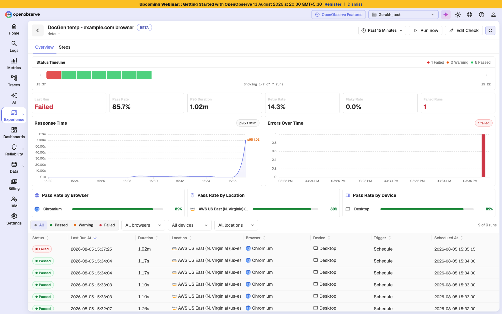
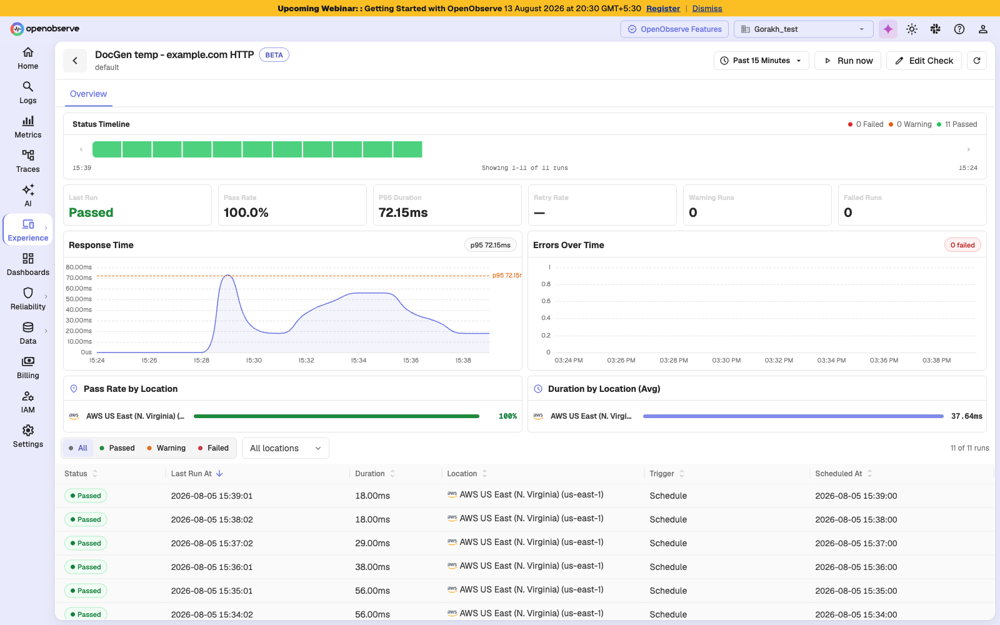
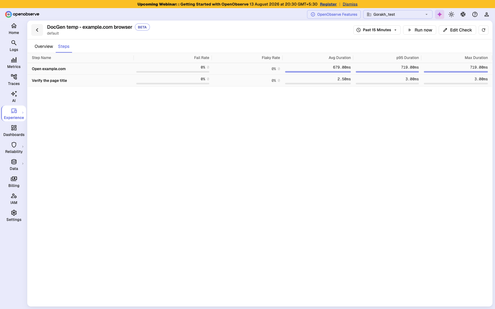
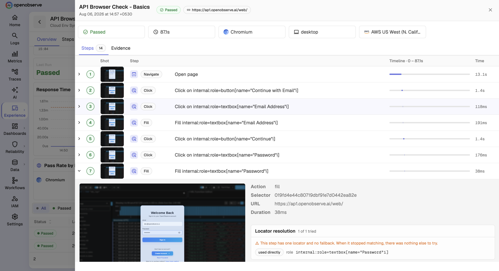
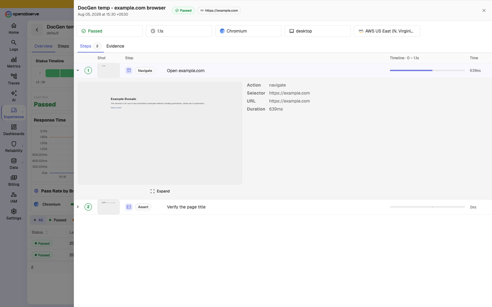
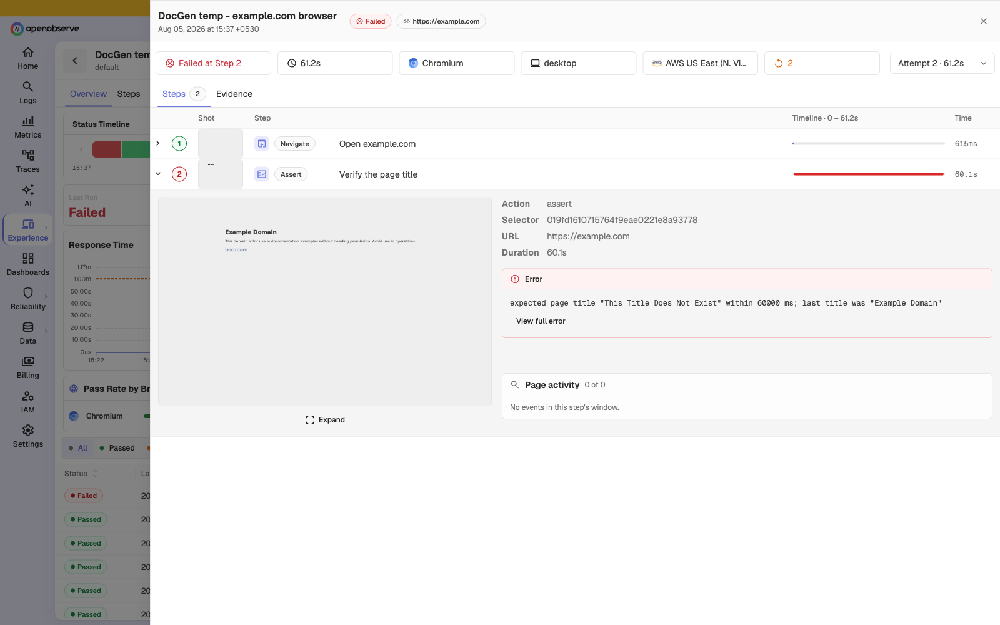
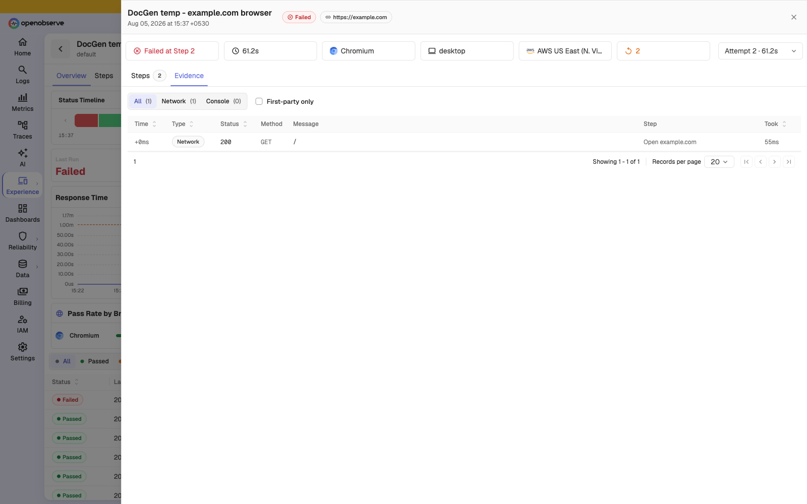
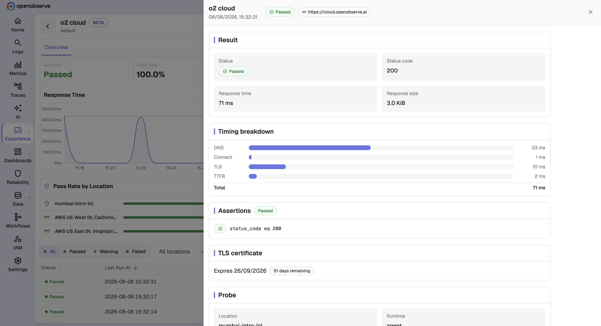

# Results

Every check keeps a history of its runs. The results surfaces answer three questions, at three levels of detail: is this check healthy, which step is the problem, and what exactly happened on this run.

## Open the results page

Click any row in the checks table. The results page opens on the **Overview** tab, scoped to the last 15 minutes by default.

Use **Run now** to trigger a manual execution, **Edit Check** to change the configuration, and the time range picker to widen the window.

The Overview tab reports:

- **Status Timeline** — every run in the window as a pass, warning, or fail band
- **KPI tiles** — Last Run, Pass Rate, P95 Duration, Retry Rate, Flaky Rate, and Failed Runs
- **Response Time** and **Errors Over Time** charts
- **Pass Rate by Browser**, **by Location**, and **by Device**
- The runs table, filterable by status, browser, device, and location

### Reading the tiles

| Tile | Means |
|------|-------|
| **Pass Rate** | Share of runs in the window that passed |
| **P95 Duration** | 95th percentile run duration — the slow tail, not the average |
| **Retry Rate** | Share of runs where at least one attempt failed and was retried |
| **Flaky Rate** | Share of runs that passed only after a retry |
| **Failed Runs** | Count of runs that failed after all attempts |

> **Note**: Flaky Rate is only meaningful when retries are configured. With retries set to 0, nothing can ever be observed as flaky and the tile has no answer to give.

### Protocol checks differ

Protocol checks show a slightly different Overview. They have no **Steps** tab, they report **Warning Runs** in place of **Flaky Rate**, and they show **Duration by Location** instead of the browser and device panels.

### Error patterns

Below the runs table, **Error patterns** groups failures by normalized error message across locations. Clicking a row filters the runs table to that error, which is the fastest way to tell one widespread failure from several unrelated ones.

## Find the step that is failing

Open the **Steps** tab on a browser check to compare steps across every run in the window. It ranks steps by fail rate, flaky rate, and duration, which is how you find both the step that breaks most often and the step that is slowing the journey down.

A step with a high **Fail Rate** is a correctness problem. A step with a high **Max Duration** but a low average is usually a timing problem — the step occasionally waits much longer than normal, which is what eventually trips its timeout.

## Inspect a single run

Click a run to open the run detail drawer. The **Steps** tab shows the journey as a timeline with a screenshot, action, and duration per step.

Expand any step for its full detail: the screenshot captured at that moment, the action, the selector used, the resolved URL, and the duration.

## Diagnose a failure

On a failed run, the header names the failing step and the attempt that decided the run. The failed step carries its error message and the screenshot taken at that moment.

Three things on this view do most of the diagnostic work:

- **Failed at Step N** — which step broke, not merely that the run broke
- **The attempt selector** — each retry is kept separately, so you can compare the attempt that failed with the one that decided the run
- **The error message** — states what was expected and what was actually found

Two further sections appear when they have something to report. **Locator resolution** shows which candidate matched; if a fallback matched rather than the primary, the markup has changed under that step even though the run may have passed. **Settle signals** flags a recorded signal that never arrived, which is often the real cause of a later step timing out.

> **Tip**: A failing assertion consumes its full timeout before reporting. A run that normally takes a second and suddenly takes a minute has usually not got slower — it has failed a wait.

## Evidence

Open the **Evidence** tab for what the application was doing: console errors, page errors, failed requests, and non-2xx responses, each attributed to the step whose window it fell in.

Filter by **Console errors**, **Page errors**, **Non-2xx**, or **Failed requests**, and use **First-party only** to hide third-party noise such as analytics and ad scripts.

> **Note**: Evidence is retained for failed runs only. On a passing run the Evidence tab explains this rather than showing an empty table.

## Read a protocol run

Protocol runs report a timing breakdown instead of a step timeline, so you can see whether latency came from DNS, connection setup, the TLS handshake, or the server itself.

| Section | Reports |
|---------|---------|
| **Result** | Status, status code, response time, response size |
| **Timing breakdown** | DNS, Connect, TLS, TTFB, and Total |
| **Assertions** | Each assertion and whether it passed |
| **TLS certificate** | Expiry date and days remaining |
| **Probe** | Location, runtime, probe ID, and what triggered the run |

A high **TTFB** with low DNS and Connect times points at the application. A high **TLS** time points at handshake or certificate chain cost. A high **DNS** time points at resolution, often outside your control.

## Troubleshooting

### The Evidence tab is empty

**Problem**: You opened Evidence on a run and there is nothing there.

**Solution**: Evidence is retained for failed runs only. On a passing run this is expected. If a failed run's evidence will not load, the bundle may have passed its retention window, or the download link may have expired — reload the run to get a fresh one.

### No runs appear for the selected time range

**Problem**: The results page reports no runs.

**Solution**:

1. If the check has never run, trigger one with **Run now**.
2. If it has run before, use **Jump to last run** to move the window to the most recent data.
3. Confirm the check is **Enabled**. A paused check does not run on its schedule.

### A run reports a probe infrastructure error

**Problem**: A run shows an error but no step data.

**Solution**: The probe failed before executing the journey, so there is nothing to attribute. This is infrastructure rather than your application. If it persists across locations, contact support; if it is limited to one private location, check that its agents are healthy.
