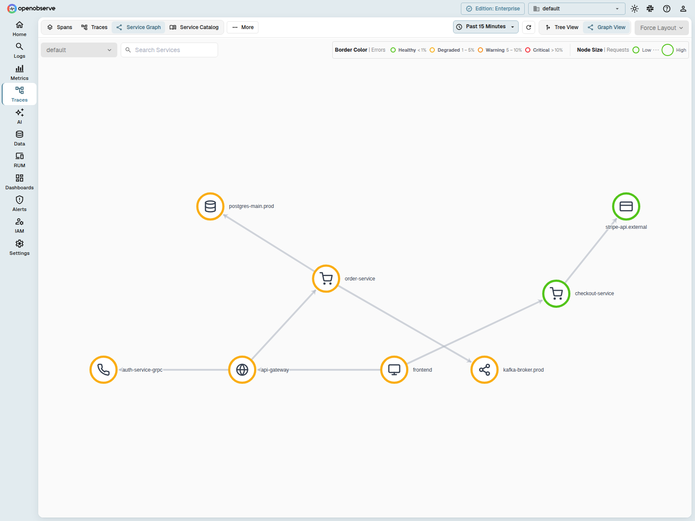
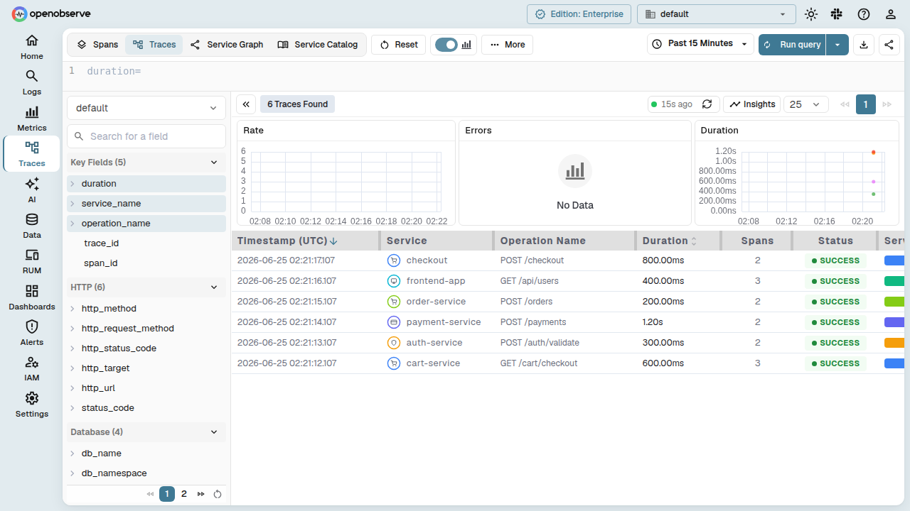

=== "Overview"
    Service graph provides a real time visual overview of how your services communicate with each other. It reads distributed traces and identifies which services call downstream services, how many requests flow between them, and how healthy those interactions are.

    !!! note "Note" 
        Service Graph is an Enterprise-only feature.

    **Key points**:

    - It helps you understand system behaviour at a glance. 
    - It highlights unusual behaviour so that you can quickly decide where to investigate next using Logs, Metrics, or Traces. 
    - It is not intended for detailed debugging. 
    - It helps you see the overall topology and identify the services that need closer attention.

    Service graph focuses on recent activity. When services are inactive for a period of time, they are removed from the graph to prevent unbounded growth and to keep the view relevant.

    !!! note "Where to find this"

        1. Sign in to OpenObserve.
        2. Select **Traces** in the left navigation panel.
        3. The **Service graph** icon that appears at the top-left corner of the page.

        The topology loads automatically when recent trace activity is available.
        If there is no trace activity, the section displays a message indicating that no service graph data is available.

    ## What service graph displays
    Service graph displays the services in your system and the communication observed between them.

    ??? "Services"
    ### Services
    Each service represents an application component discovered from distributed traces. The view displays:

    - The service name  
    - A summary of recent requests  
    - A colour that reflects the recent error behaviour  

    ??? "Colours"
    ### Colours
    Colours indicate the health of each service.
    
    - Green shows healthy behaviour  
    - Yellow and orange show increased errors  
    - Red shows repeated failures  

    ??? "Edges"
    ### Edges
    Edges represent calls from one service to another. They indicate downstream communication and help you identify where issues may originate.

    Edges to inferred dependencies (such as databases, queues, or external APIs) appear as dotted lines with a type icon. Instrumented service-to-service edges appear as solid lines.

    ??? "Topology behaviour"
    ### Topology behaviour
    Service graph displays only recent activity. When a service produces no trace data for a set duration, it is removed from the topology. This design focuses attention on the active state of your system.

    ??? "Inferred dependencies"
    ### Inferred dependencies

    OpenObserve automatically discovers uninstrumented dependencies — databases, message queues, RPC backends, and external APIs — from your trace spans and surfaces them in the service graph, even when those dependencies have no instrumentation of their own.

    When your application calls an uninstrumented dependency (such as a PostgreSQL database, a Kafka topic, or a third-party API), the OpenTelemetry SDK creates a CLIENT or PRODUCER span for that call. The dependency itself has no server span. OpenObserve derives a minimal identity for each dependency from the span's peer attributes and displays it alongside your instrumented services.

    **How derivation works**

    At ingestion time, OpenObserve examines every CLIENT and PRODUCER span. When the span carries peer attributes that identify the dependency, three fields are written into the span:

    | Field | Purpose | Example |
    |-------|---------|---------|
    | `infer_service_name` | Dependency identity | `orders-db`, `api.stripe.com`, `checkout-events` |
    | `infer_service_type` | Coarse category | `database`, `queue`, `rpc`, or `external` |
    | `infer_service_system` | Concrete system | `postgresql`, `kafka`, `grpc`, `http` |

    The naming logic follows OpenTelemetry semantic conventions and resolves attributes in priority order. The explicit `peer.service` attribute always wins — set it on your spans if you want a specific name for a dependency. If no host name is usable (for example, an IP address that would create a separate node per pod), the system redacts it and falls through to the next available name.

    **Supported categories**

    Inferred dependency nodes appear with a dotted border and a type icon that indicates the category. Edges connecting to inferred dependencies are also rendered as dotted lines.

    - **Database** — databases such as PostgreSQL, MySQL, Redis, and MongoDB. Recognized when the span carries `db.system` / `db.system.name` or `db.name` / `db.namespace`.
    - **Queue** — message queues such as Kafka, RabbitMQ, and NATS. Recognized when the span carries `messaging.system` or `messaging.destination.name`.
    - **RPC** — RPC backends such as gRPC services and AWS API. Recognized when the span carries `rpc.system` or `rpc.service`.
    - **External** — external HTTP APIs and generic network peers. Recognized by `server.address`, `net.peer.name`, `http.host`, or `url.full` / `http.url`.

    

    Because the dependency has no server span of its own, its latency is measured as the client span's duration (the time the instrumented service spent waiting on the dependency). The graph's anti-join logic ensures that a dependency that is instrumented elsewhere in the same time window is not double-counted — it appears only as its instrumented self.

    Inferred dependency metadata is stored with a `connection_type` field in the `_o2_service_graph` stream. This field is backward compatible — edges recorded before the `connection_type` field existed deserialize to `None` and are treated as instrumented service-to-service edges.

    **Supported span attributes**

    Inferred service derivation recognizes both current and legacy OpenTelemetry attribute names, in dotted and flattened (underscore) forms:

    - **Peer identity** — `peer.service` (explicit; wins naming for all types)
    - **Database** — `db.system`, `db.system.name`, `db.name`, `db.namespace`
    - **Messaging** — `messaging.system`, `messaging.destination`, `messaging.destination.name`
    - **RPC** — `rpc.system`, `rpc.service`
    - **Network** — `server.address`, `net.peer.name`, `http.host`, `url.full`, `http.url`, `http.request.method`, `http.method`

    !!! note "About CONSUMER spans"
        CONSUMER spans (span kind `5`) are deliberately excluded from inferred dependency derivation. Their duration represents processing time inside the instrumented service, not time spent in the queue.

    !!! note "Automatic and backward compatible"
        Inferred service derivation is fully automatic and requires no configuration. It activates when a trace stream's schema contains the `infer_service_name` field. Streams that predate the feature — or never call an uninstrumented dependency — continue to work unchanged.

    **Inferred services in the trace list**

    Inferred dependencies also appear in the per-service time and cost breakdown when you open a trace in the **Traces** list. Inferred entities are rendered with a dotted style and a type icon so you can visually distinguish them from instrumented services. Each inferred service in the trace summary shows its name, span count, duration, and type.

    

    ## Data source
    Service graph uses distributed traces as the single data source.  
    OpenObserve matches client spans and server spans belonging to the same request. This allows the system to identify service relationships, request patterns, and error behaviour.

    Service graph does not use logs or metrics directly.

    ## Main controls
    
    ??? "Stream selector"
    ### Stream selector
    Select a trace stream to build the topology from. You can choose a single stream or combine all streams.
    
    ??? "Search services"
    ### Search services
    Enter a service name to filter the view. The graph focuses on the selected service and the services connected to it.

    ??? "Refresh controls"
    ### Refresh controls
    Use manual refresh or enable automatic refresh. Auto refresh supports intervals between five seconds and three hundred seconds.

    ??? "View mode" 
    ### View mode
    Choose between Tree view and Graph view. Both views show the same information using different layouts.

    ??? "Layout options"
    ### Layout options
    Tree view supports horizontal, vertical, and radial layouts.  
    Graph view supports force directed and circular layouts.

    ## Tree view
    Tree view arranges services in a structured hierarchy. It is useful when you want to follow traffic from entrypoint services to downstream dependencies.

    ## Graph view
    Graph view arranges services as a network. It uses a physics based simulation to maintain stable spacing between services. Force directed layouts group related services together. Circular layouts arrange services around a circle.

    ## Interaction
    You can drag services to reposition them. You can zoom and pan to explore specific areas. Hovering over a service displays a summary of request and error behaviour. Filters and layouts can be combined to focus on specific sections of the topology.

=== "How-to"
    ## Filter the graph by service

    1. Enter a service name in the **Search services** field.  
    4. Review the focused view of the selected service.

    ## Change the view type

    1. Select Tree view or Graph view.  
    4. Select a layout.

    ## Investigate an issue

    1. In the **Service graph**, identify any services with warning or error colours.  
    3. Follow the edges to determine which downstream services may be affected.  
    4. Note the service name.  
    5. Switch to Logs, Metrics, or Traces and filter by that service for further analysis.
