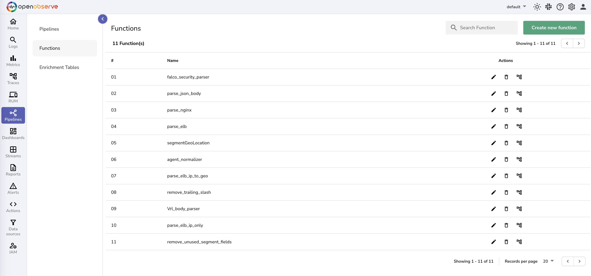
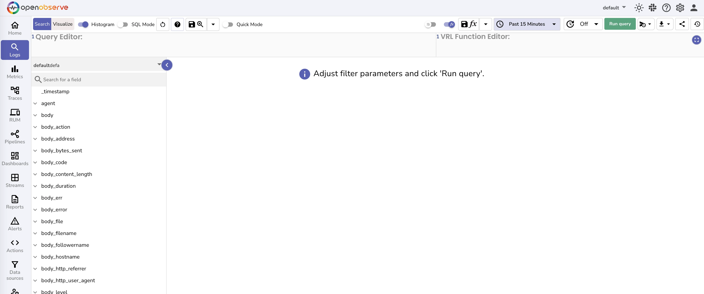

# Functions

## What are functions?

Functions in OpenObserve are defined using Vector Remap Language ([VRL](https://vrl.dev)) and can be used during ingestion or query to aid advanced capabilities like enrichment, redaction, log reduction, compliance, etc. 

There are also inbuilt query functions like `match_all` etc which can be used for full text search based on user's settings for stream or default settings. Please refer [SQL functions reference](../../../reference/sql-reference.md) for complete list of inbuilt functions.

To navigate to functions in OpenObserve, select preferred organization using organization selection control, then click on `Pipelines > Functions` menu, which will take you to functions list screen. This screen lists all the functions for selected organization.  

<kbd>

</kbd>

List screen details:

- Search in listed functions
- Create new function
- Import functions from a JSON file or URL
- Name of existing function
- Action — export, update, or delete a function

## Import and export functions

You can move function definitions between OpenObserve environments by exporting them to a JSON file and importing them back elsewhere. No backend change is involved — the functions API already returns function bodies and accepts create and update calls.

### Export functions

**Export a single function**

1. From the left navigation menu, go to **Pipelines** > **Functions**.
2. In the **Actions** column of the function you want to export, click the download icon. On narrow screens, open the row's overflow menu and click **Export**.

The function downloads as a `.json` file named after the function (for example `parse-nginx.json`). A single function is written as a JSON object with the `name`, `function` (the VRL or JavaScript body), `params`, and `transType` fields, so the file is hand-editable and can be pasted straight back into the import editor.

**Export multiple functions**

1. Tick the checkboxes of the functions you want to export.
2. In the bar that appears at the bottom of the list, click **Export**.

The bundle downloads as a single dated `.json` file (for example `functions-2026-10-01.json`) containing a JSON array of function objects. If a selected function is no longer in the list, OpenObserve re-reads the list once and names any functions it could not find rather than silently exporting a shorter file.


### Import functions

1. From the left navigation menu, go to **Pipelines** > **Functions**.
2. Click **Import** in the top-right corner (press `i` when no field is focused).

The import screen opens on `pipeline/functions/import`. Like the pipeline and alert import screens, it accepts a JSON document through file upload, a URL, or by typing into the JSON editor. The right-hand pane reports validation errors and import results.


3. Click **Import** to validate and write the functions.

Imported functions are validated against the same name rule the **Add Function** form enforces. Because the backend does not enforce this rule, import rejects names that no VRL call could resolve — such as `my-fn with space` — so you cannot create a function that its own edit form would refuse to save. Duplicate names within the same file are flagged in the same pass.

**Handle name conflicts**

If an imported function's name already exists in the organization, the import pauses on that function instead of failing or forcing a rename:

- **Use existing** (pre-selected) — leave the existing function untouched and skip writing this one.
- **Override** — replace the existing function. Overriding is organization-wide: it rewrites every pipeline that calls the function, so the prompt lists those pipelines by name before you confirm.

Nothing is written when the conflict first surfaces — only the next press acts on your choice. Conflicts are tracked per name, so a resolved conflict no longer holds up other items, and loading a different file drops every pending choice so an override can never land on a different function that now sits at the same position.


Under role-based access control (RBAC) the function list is filtered, so a taken name can be invisible in your list. In that case the server's `400` response is promoted into the same conflict prompt instead of a dead failure line.

**Fix validation errors**

Each validation error shows an inline control that fixes it in place, the same way the template and pipeline import screens do:

- **Name** — a rename box, checked live against the name rule, duplicate names in the file, and existing names.
- **Body** — the same VRL or JavaScript editor the Add form uses, in the language the item declares.
- **Language** — a VRL / JavaScript selector (JavaScript is available only when your organization is entitled to it).
- **Params** — the argument names, defaulting to `row`.

Edits are written straight back into the JSON on the left, so the document and the controls never disagree.

After a successful import the screen returns to the Functions list; any function that failed to write stays on screen with its error so you can fix it and import again. A retry updates functions this run already created rather than re-prompting for them.

### Keyboard shortcuts

The Functions list supports the following shortcuts:

| Shortcut | Action |
|----------|--------|
| `n` | Add a function |
| `i` | Import functions |
| `r` | Refresh the list |
| `/` | Focus the search box |
| `e` | Edit the focused row |
| `x` | Export the focused row |
| `del` / `⌫` | Delete the focused row |

There are two ways to use function during query:

- Function with row as input
- Function with specified input columns/fields


## Function with row as input

On logs search page, you can select existing function or write new function using vrl function editor to apply function on row. The returned results will be based on function being applied.

Please note that functions on rows can be used to experiment with result of function application on a specific stream , however applying functions at query time is costly operation .Hence if applicable, after exploration and desired outcome of function during query time , we encourage users to apply such function at ingest time by associating function with stream.

<kbd>

</kbd>

## Function with specified input columns/fields
These are like sql functions, which are defined by user and act on specified input columns/fields.

## Example
Let's try a function on logs page to parse vpc flow logs ,mentioned below is sample vpc flow log record in OpenObserve.

```json
{
  "_timestamp": 1683089619868496,
  "message": "2 058694856476 eni-03c0f5ba79a66ef17 10.3.166.71 10.3.35.163 443 53672 6 49 12973 1680838556 1680838578 ACCEPT OK"
}
```
Create a vrl function which retains the `_timestamp` field from original record and parses `message` field to multiple fields like `account_id`, `action` etc:

```ruby
ts = ._timestamp  # store value of _timestamp in ts
. = parse_aws_vpc_flow_log!(.message) # assign value of object resulting from parse_aws_vpc_flow_log to current record
._timestamp = ts #set value of _timestamp from ts
. # return record
```

The function outputs the record below:
```json
{
  "_timestamp": 1683097426943815,
  "account_id": 58694856476,
  "action": "ACCEPT",
  "bytes": 12973,
  "dstaddr": "10.3.35.163",
  "dstport": 53672,
  "end": 1680838578,
  "interface_id": "eni-03c0f5ba79a66ef17",
  "log_status": "OK",
  "packets": 49,
  "protocol": 6,
  "srcaddr": "10.3.166.71",
  "srcport": 443,
  "start": 1680838556,
  "version": 2
}
```

The function can be saved using save button on top of vrl function editor, additional one can select existing function to try.

The same function can be associated with a stream to get applied at ingestion. 
