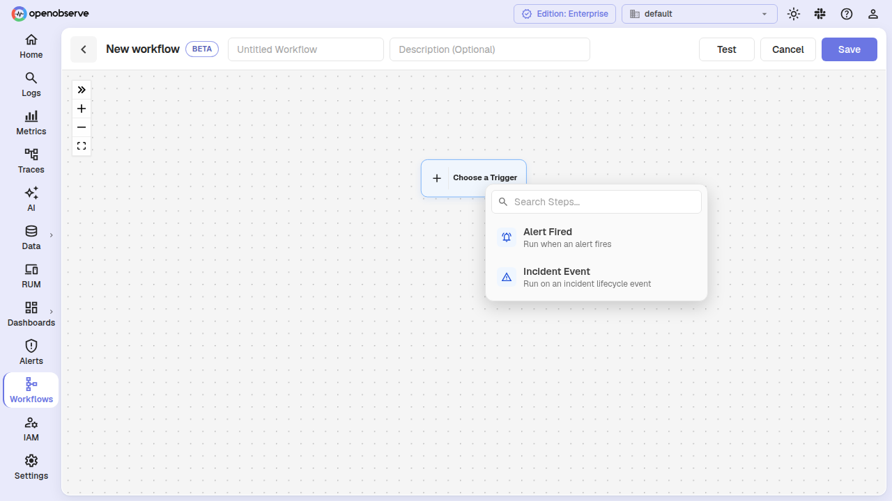
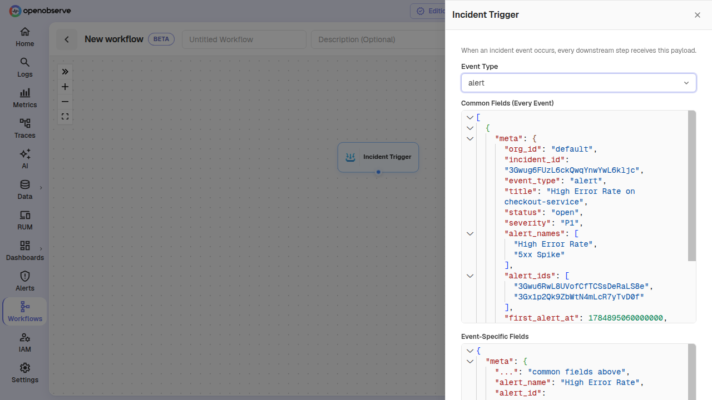
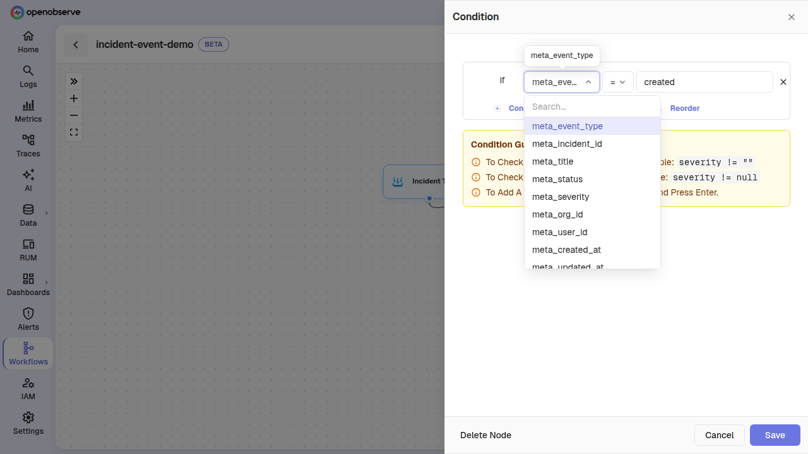
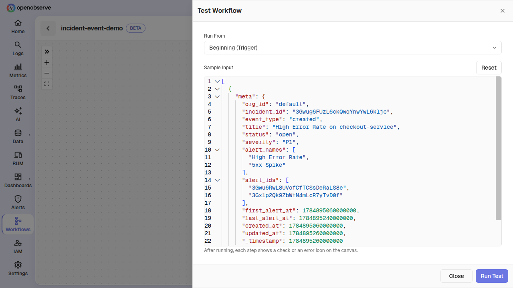
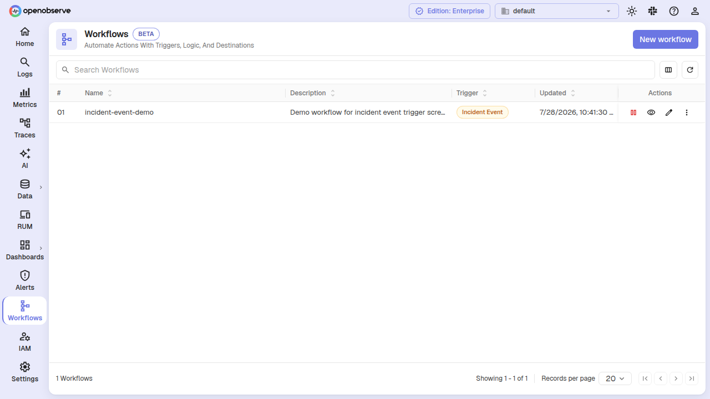

# Incident-Event-Triggered Workflows

A workflow can now start from an **Incident Event** trigger instead of an alert. When an incident lifecycle event occurs — an incident is created, an alert is added, a status changes, a severity upgrades, a user posts a comment, or AI analysis completes — OpenObserve fires the associated workflow, handing it a payload with the incident's common metadata plus event-specific fields.

This lets you build automations such as:
- Send a Slack notification every time a P1 incident is acknowledged or resolved
- Log every severity upgrade to an audit stream
- Trigger a webhook when an incident reaches a critical alert count
- Branch on `event_type` to run different destinations for different lifecycle stages

:::info[Availability]
This feature is available in Enterprise Edition.
:::

## How incident-event workflows differ from alert-fired workflows

| Aspect | Alert-Fired Workflow | Incident-Event Workflow |
|---|---|---|
| **Trigger** | A linked alert fires | An incident lifecycle event occurs |
| **Input payload** | Alert metadata (string values) + query result rows in `data[]` | Incident metadata (native-typed fields) + event-specific fields; `data[]` is always empty |
| **Payload prefix** | `meta_<field>` with stringified values | `meta_<field>` with native types (strings, integers, arrays) |
| **Associations** | Workflow linked from alert configuration | Workflow linked automatically on create; association stored in the `workflow_associations` table |
| **Condition fields** | Alert fields (stream type, alert name, threshold, count, etc.) | Incident fields (status, severity, event type, user, alert names/ids, timestamps, etc.) |
| **Alert linking** | Prompted after create | Not applicable; skipped automatically |

## Create an incident-event workflow



1. Navigate to **Pipelines > Workflows** and click **Add Workflow**.
2. When the empty canvas shows the **"Choose a Trigger"** start node, click it to open the trigger picker.
3. Select **Incident Event** from the available trigger kinds.
4. Build the rest of your node graph — add **Condition**, **Function**, and **Destination** nodes as needed.
5. Click **Save**.

The workflow is automatically associated with the **IncidentEvent** trigger type. No further linking is required — unlike alert-fired workflows, incident workflows do not need manual alert association.

## Incident event payload

When an incident event triggers a workflow, the trigger node emits a one-element array with a `meta` block and an empty `data` array:

```json
[
  {
    "meta": {
      "org_id": "default",
      "incident_id": "3Gwug6FUzL6ckQwqYnYwLw6kljc",
      "event_type": "created",
      "title": "High Error Rate on checkout-service",
      "status": "open",
      "severity": "P1",
      "alert_names": ["High Error Rate", "5xx Spike"],
      "alert_ids": ["3Gwu6RwL8UVofCfTCSsDeRaLS8e", "3Gx1p2Qk9ZbWtN4mLcR7yTvD0f"],
      "first_alert_at": 1784895060000000,
      "last_alert_at": 1784895240000000,
      "created_at": 1784895060000000,
      "updated_at": 1784895260000000,
      "_timestamp": 1784895260000000
    },
    "data": []
  }
]
```

The backend flattens the `{ meta: {...} }` envelope before passing data to downstream nodes, so every field is accessible as `meta_<field>` in conditions and `row.meta.<field>` in JavaScript functions.

### Common fields (every event)

These fields are present on every incident lifecycle event:

| Field | Type | Description |
|---|---|---|
| `meta_org_id` | Utf8 | Organization ID |
| `meta_incident_id` | Utf8 | Unique incident identifier |
| `meta_event_type` | Utf8 | The lifecycle event that occurred (see below) |
| `meta_title` | Utf8 | Current incident title |
| `meta_status` | Utf8 | Open, acknowledged, or resolved |
| `meta_severity` | Utf8 | P1 (Critical) through P4 (Low) |
| `meta_alert_names` | Array[Utf8] | Names of all alert rules correlated to the incident |
| `meta_alert_ids` | Array[Utf8] | IDs of all alert rules correlated to the incident |
| `meta_first_alert_at` | Int64 | Microsecond timestamp of the first alert firing |
| `meta_last_alert_at` | Int64 | Microsecond timestamp of the most recent alert firing |
| `meta_created_at` | Int64 | Microsecond timestamp when the incident was created |
| `meta_updated_at` | Int64 | Microsecond timestamp of the last incident update |
| `meta__timestamp` | Int64 | Microsecond timestamp of the event itself |

### Event-specific fields

Depending on the `event_type`, additional fields are present. Use the **Incident Trigger** node drawer to preview what each event type adds — it provides a split view with the common block on top and the event-specific block below.

[The event-type picker and split view are shown above in the trigger drawer screenshot.]

| Event Type | Description | Extra Fields |
|---|---|---|
| `created` | A new incident was created | (none) |
| `alert` | An alert was added to the incident | `meta_alert_name`, `meta_alert_id`, `meta_alert_count` |
| `severity_upgrade` | Severity changed automatically | `meta_old_severity`, `meta_new_severity`, `meta_reason` |
| `severity_override` | A user manually changed severity | `meta_old_severity`, `meta_new_severity`, `meta_user_id` |
| `acknowledged` | A user acknowledged the incident | `meta_user_id` |
| `resolved` | Incident was resolved | `meta_user_id` |
| `reopened` | Incident was reopened | `meta_user_id`, `meta_reason` |
| `dimension_upgraded` | Correlation dimensions expanded | `meta_from_key`, `meta_to_key` |
| `title_changed` | A user edited the title | `meta_old_title`, `meta_new_title`, `meta_user_id` |
| `assignment_changed` | Incident reassigned | `meta_from_user`, `meta_to_user` |
| `comment` | A user posted a comment | `meta_user_id`, `meta_comment` |
| `ai_analysis_begin` | AI root cause analysis started | (none) |
| `ai_analysis_complete` | AI analysis finished successfully | (none) |
| `ai_analysis_failed` | AI analysis failed | `meta_reason`, `meta_analysis_trigger_type`, `meta_error_details` |

## View the event payload



1. Click the **Incident Trigger** node on the canvas.
2. The drawer shows a read-only reference of the payload structure, split into:
   - **Common fields** — present on every event (always visible at the top).
   - **Event-specific fields** — select an event type from the dropdown to preview what each lifecycle event adds.
3. Events with no extra fields (such as `created` or `ai_analysis_begin`) show the note "This event adds no fields beyond the common ones."

## Branch on event type with a Condition node

You can use a **Condition** node to route different incident events to different destinations. The Condition builder offers the flattened `meta_*` fields as filterable column suggestions specific to the incident trigger.



**Example: route severity upgrades to Slack**

Create a condition with the rule `meta_event_type == "severity_upgrade"`. Records matching this condition flow through the **true** edge — connect it to a **Destination** node configured as your Slack webhook. Records that don't match flow through the **false** edge and are dropped.

**Example: escalate P1 incidents older than 30 minutes**

Set a condition like `meta_severity == "P1" AND meta__timestamp - meta_first_alert_at > 1800000000` to catch critical incidents that have been active for over 30 minutes.

> The Condition form also supports `allow-custom-columns`, so you can type any field not listed in the suggestions. Array fields (`meta_alert_names`, `meta_alert_ids`) are not offered as filterable columns but remain typeable manually.

## Transform the payload with a Function node

In a **Function** node, the entire trigger event arrives as `row`. Mutate `row.meta` in place — the payload uses native types (strings, numbers, arrays) unlike the stringified alert trigger metadata.

```javascript
// row is the incident event: { meta: {...}, data: [] }
// Example: add a custom field based on severity
if (row.meta.severity === "P1" || row.meta.severity === "P2") {
  row.meta.priority = "high";
} else {
  row.meta.priority = "low";
}
```

The Events panel in the Function node is seeded with the incident event's sample payload so you can see the exact shape while writing your function.

## Test an incident workflow



1. Open the incident workflow and click **Test**.
2. The test input is seeded with the incident-event sample payload (a `created` event by default).
3. Modify the payload if needed — change `event_type` or add fields to test a specific lifecycle stage.
4. Click **Run Test**.

You can also test at the API level with `POST /api/{org_id}/workflows/{id}/test`.

## View incident workflows in the list



In the workflow list, the **Trigger** column shows **Incident Event** for incident-triggered workflows and **Alert Fired** for alert-triggered ones. You can filter, search, enable, disable, or delete incident workflows just like any other workflow.

## Association lifecycle

Incident-event workflow associations are managed automatically:

- **On create**: Choosing "Incident Event" as the trigger creates a `workflow_associations` record linking the workflow to the `IncidentEvent` trigger type.
- **On delete**: Deleting a workflow removes its associations. A workflow associated with non-incident entities (alerts) cannot be deleted until those connections are removed.
- **On alert lifecycle**: When you link or unlink workflows to an alert, the `workflow_associations` table is updated automatically. Deleting an alert removes all its workflow associations.

In super cluster deployments, association changes are replicated to all nodes automatically.

## Restrictions

- An incident-event workflow's **trigger node cannot have a manual alert link** — associations are managed at the workflow create/delete level, not from the alert configuration side.
- The **trigger node is deletable** on the canvas; removing it brings back the "Choose a Trigger" start node so you can swap the trigger kind.
- The `data[]` array is always empty for incident events. Incident workflows receive metadata only, not query result rows.
