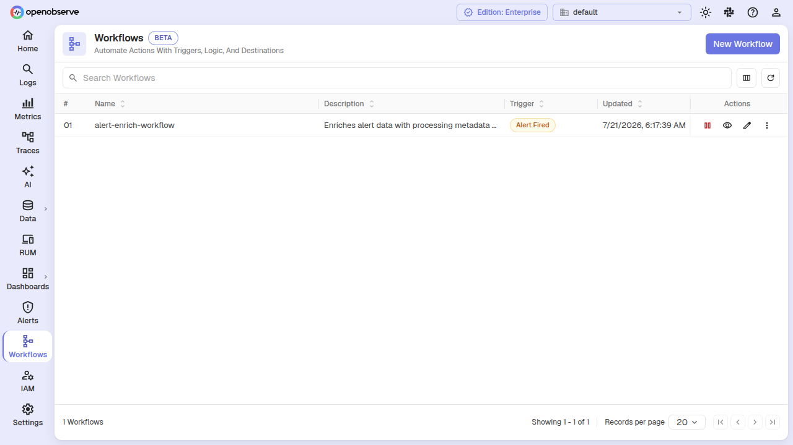
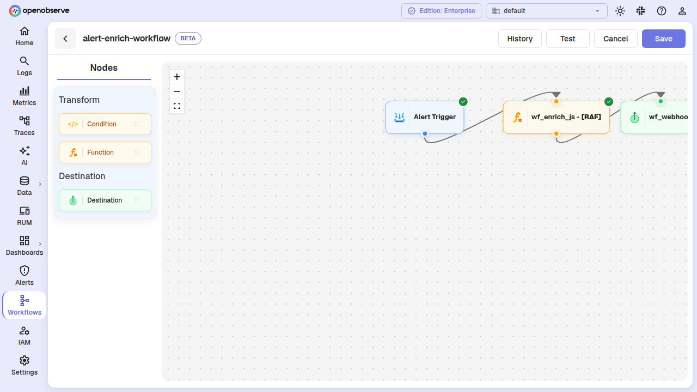
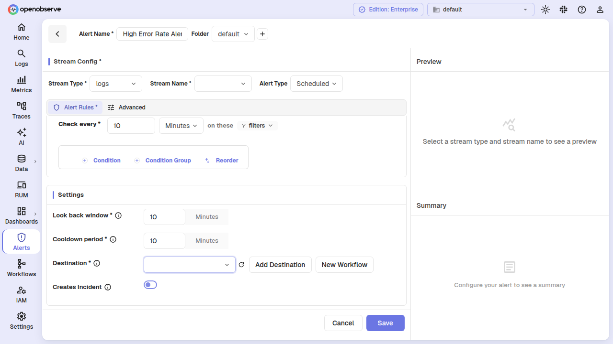
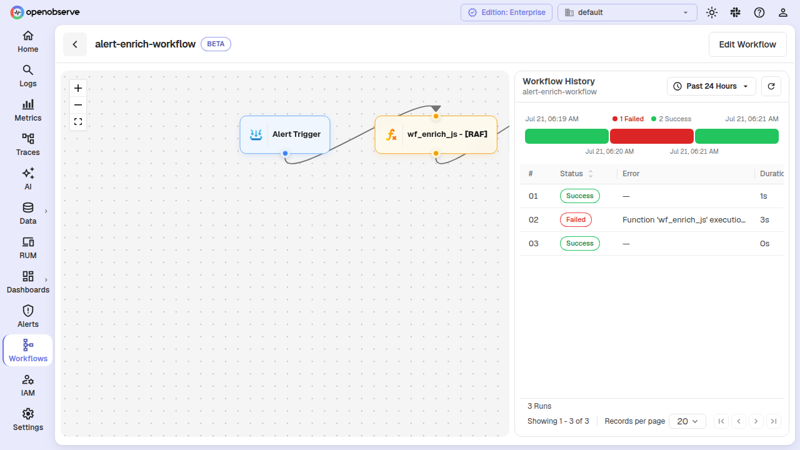
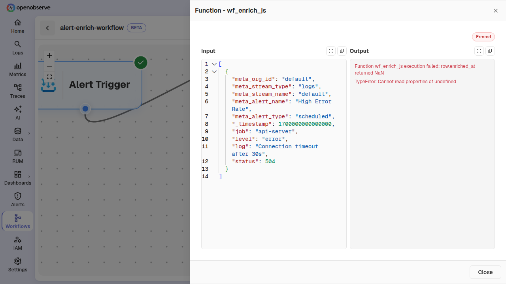

# Workflows

Workflows let you define automated chains of operations that execute in response to alert triggers. When an alert fires, the linked workflow runs through a sequence of nodes — querying data, transforming it with JavaScript functions, evaluating conditions, and routing results to a pipeline destination or back into a stream.

Workflows are an **enterprise** feature, gated by the `O2_WORKFLOWS_ENABLED` configuration flag (enabled by default in enterprise editions). They share the same visual node-edge builder as pipelines but introduce workflow-specific node types: **Trigger**, **Query**, **Function** (JavaScript only), **Condition**, and **Destination**.



To navigate to workflows, select your organization and click **Pipelines > Workflows** in the left navigation.

## Core concepts

### How workflows differ from pipelines

| Aspect | Pipelines | Workflows |
|---|---|---|
| **Trigger** | Real-time ingestion or scheduled | Alert fires |
| **Input** | Individual log/metric/trace records | Alert event payload with metadata and result rows |
| **Node types** | Stream, Query, Function, Condition, Remote Stream, LLM Evaluation | Workflow Trigger, Query, Function (JS only), Condition, Destination |
| **Functions** | VRL or JavaScript | JavaScript only |
| **Output** | Streams, remote streams | Pipeline destinations, stream nodes |

### Node types

A workflow graph is built from the following nodes connected by edges:

- **Workflow Trigger** — The entry point. Receives the alert trigger payload containing metadata (org, stream, alert name, trigger time) and the alert's result rows wrapped in a `data` array.
- **Query** — Runs a SQL query against a stream. Use this to enrich or filter the alert data.
- **Function** — Applies a JavaScript function to each record. VRL functions are not supported in workflows; use a JavaScript function with `trans_type = 1`.
- **Condition** — Evaluates each record against conditions and routes matching records along a **true** edge and non-matching records along a **false** edge.
- **Destination** — Sends data to a pipeline destination (HTTP webhook). Alert-type destinations are not supported.

## Create a workflow


1. Navigate to **Pipelines > Workflows** and click **Add Workflow**.
2. Enter a **Name** and optional **Description**.
3. Build the node graph:
   - Drag nodes from the palette onto the canvas.
   - Connect nodes by drawing edges between them.
   - The first node must always be a **Workflow Trigger**.
   - Leaf nodes must be either **Stream** nodes (to write results into a stream) or **Destination** nodes.
4. Configure each node's parameters (function name, query SQL, destination, conditions).
5. Click **Save**.

### Workflow validation rules

When you save a workflow, OpenObserve validates the following:

- Every node must be a workflow-compatible type.
- Condition nodes must have non-empty conditions.
- Edges must connect all nodes; the minimum number of edges is `nodes - 1`.
- Edge sources and targets must reference nodes that exist in the graph.
- All reachable nodes from the trigger must be valid; unreachable nodes are not allowed.
- Leaf/terminal nodes must be **Stream** or **Destination** nodes.
- Functions referenced in Function nodes must be JavaScript functions (VRL functions are rejected).
- Destinations referenced in Destination nodes must be **pipeline**-type destinations (alert destinations are not supported).

## Test a workflow

You can test a workflow without waiting for an alert to trigger it.

1. Open the workflow from the list and click **Test**.
2. Provide one or more sample JSON input records. These simulate the `data` portion of an alert trigger payload.
3. Optionally specify a **from node** ID to start execution from an intermediate node (useful for debugging a specific node).
4. Click **Run Test**. The results show per-node errors, if any.



The test endpoint is also available via the API at `POST /api/{org_id}/workflows/{id}/test`.

## Link a workflow to an alert

To have a workflow execute when an alert fires, link it in the alert configuration.



1. Open an existing alert or create a new one.
2. In the **Alert Rules** tab, find the **Workflows** field under destinations.
3. Select one or more workflows from the dropdown.
4. Save the alert.

When the alert fires, each linked workflow receives the alert's result rows and metadata as input. Metadata includes:

| Field | Description |
|---|---|
| `org_id` | Organization ID |
| `stream_type` | Stream type (logs, metrics, traces) |
| `stream_name` | Name of the monitored stream |
| `alert_name` | Alert name |
| `alert_type` | `realtime` or `scheduled` |
| `alert_period` | Trigger condition period in minutes |
| `alert_operator` | Trigger condition operator |
| `alert_threshold` | Trigger condition threshold |
| `alert_count` | Number of rows in the trigger batch |
| `alert_start_time` | Start of the alert evaluation window (microseconds) |
| `alert_end_time` | End of the alert evaluation window (microseconds) |

A workflow trigger payload looks like:

```json
{
  "meta": {
    "org_id": "default",
    "stream_type": "logs",
    "alert_name": "High Error Rate",
    "alert_count": "3"
  },
  "data": [
    { "_timestamp": 1711500000000000, "level": "error", "message": "..." },
    { "_timestamp": 1711500001000000, "level": "error", "message": "..." }
  ]
}
```

> **Note**: An alert must have at least one destination or at least one workflow linked. If both are empty, validation returns `"Alert destination or workflows is required"`.

## View execution history

The workflow history page shows every execution of a workflow triggered by alerts, with timing and status.



1. Open a workflow and click the **History** tab.
2. Use the time range picker to filter executions. The default range is the last 7 days (subject to the `max_query_range` setting on the `triggers` stream).
3. Each row shows:
   - **Timestamp** — When the execution started.
   - **Event type** — Currently `AlertFired`.
   - **Source** — The alert ID or name that triggered the workflow.
   - **Duration** — Total execution time in seconds.
   - **Status** — Success or errored.
   - **Run ID** — Unique identifier for this execution.

History data is stored in the internal `triggers` stream with `module = 'workflow'`.

## Handle errored runs

When a workflow run produces node-level errors, the errors and the input data that caused them are stored for debugging and retry.

### View errors

1. Open the workflow and navigate to a specific run from the **History** tab.
2. The error detail view shows:
   - Each errored node with its error messages.
   - The input data that reached each errored node.
   - The complete initial input data for the run.



### Retry a failed run

You can retry a failed workflow run from the error details page or via the API:

1. Click **Retry** on the error detail view.
2. Optionally specify a **from node** to resume execution from a specific node using the stored input data for that node.
3. The workflow re-executes and returns the new errors, if any.

The retry API is at `POST /api/{org_id}/workflows/{id}/retry`.

## Enable or disable a workflow

To temporarily stop a workflow from executing without deleting it, disable it:

1. Open the workflow from the list.
2. Toggle the **Enabled** switch.
3. When disabled, the workflow silently skips execution even when linked alerts fire.

Use the API directly at `PUT /api/{org_id}/workflows/{id}/enable?value=false` (or `true`).

## Delete a workflow

1. Open the workflow from the list.
2. Click the delete action and confirm.

> A workflow cannot be deleted while it is linked to any alert. Unlink the workflow from all alerts first.

## Configuration reference

| Environment variable | Default | Description |
|---|---|---|
| `O2_WORKFLOWS_ENABLED` | `true` | Master switch for the workflows feature. Set to `false` to disable all workflow APIs and trigger handling. |
| `ZO_WORKFLOW_ERROR_RETAIN_DURATION` | `2592000` (30 days) | Retention period for errored workflow input data, in seconds. Minimum value is 3600 (1 hour). |

The `workflows_enabled` flag is also exposed in the `/api/config` response so that the UI can hide or show workflows pages.

## RBAC permissions

Workflows use OFGA-based authorization. The following permissions are available on the `workflows` resource:

| Permission | Controls |
|---|---|
| `LIST` | List workflows in an organization |
| `POST` | Create a new workflow (no OFGA check) |
| `GET` | View workflow details, history, and errors |
| `PUT` | Update workflow configuration, enable/disable |
| `DELETE` | Delete a workflow |

Workflow permissions are scoped per organization and support self-parent hierarchy, allowing fine-grained access control through roles.

## API reference

| Method | Path | Description |
|---|---|---|
| `GET` | `/api/{org_id}/workflows` | List all workflows in the organization |
| `POST` | `/api/{org_id}/workflows` | Create a new workflow |
| `PUT` | `/api/{org_id}/workflows/{id}` | Update an existing workflow |
| `DELETE` | `/api/{org_id}/workflows/{id}` | Delete a workflow |
| `POST` | `/api/{org_id}/workflows/{id}/test` | Test a workflow with custom inputs |
| `GET` | `/api/{org_id}/workflows/{id}/history` | Get execution history for a workflow |
| `GET` | `/api/{org_id}/workflows/{id}/errors/{run_id}` | Get errors and input data for a specific run |
| `POST` | `/api/{org_id}/workflows/{id}/retry` | Retry a failed workflow run |
| `PUT` | `/api/{org_id}/workflows/{id}/enable` | Enable or disable a workflow (`?value=true\|false`) |
