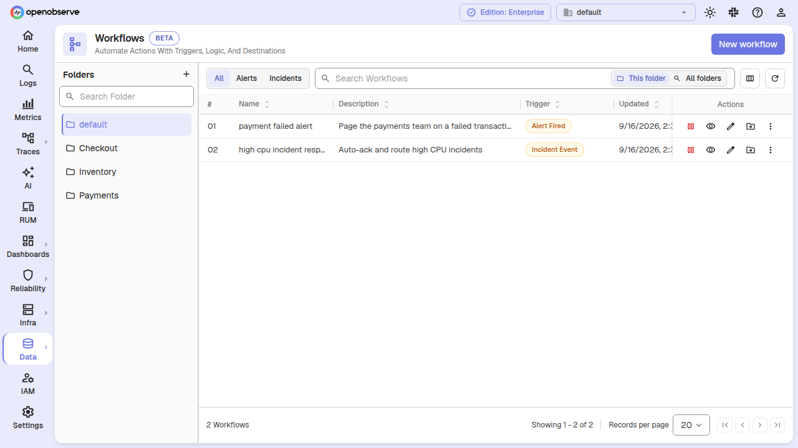
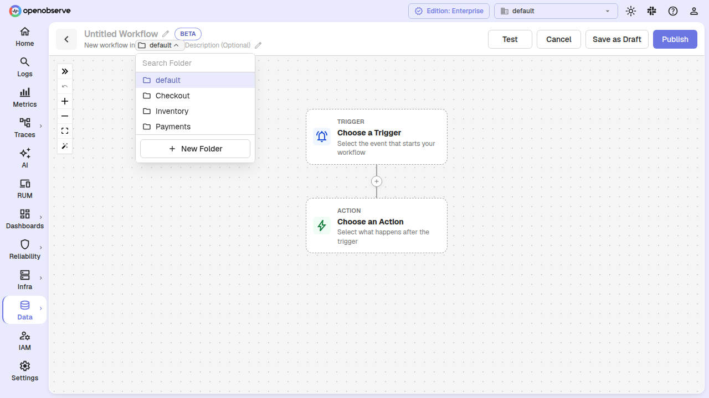
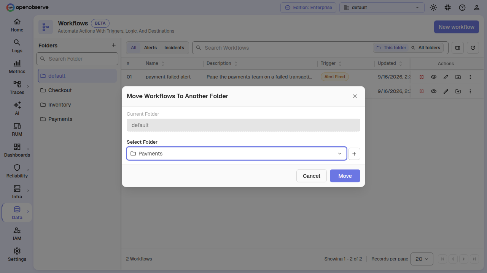
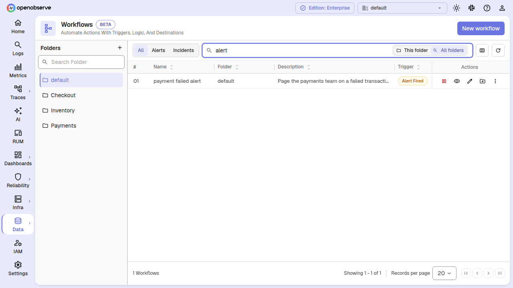
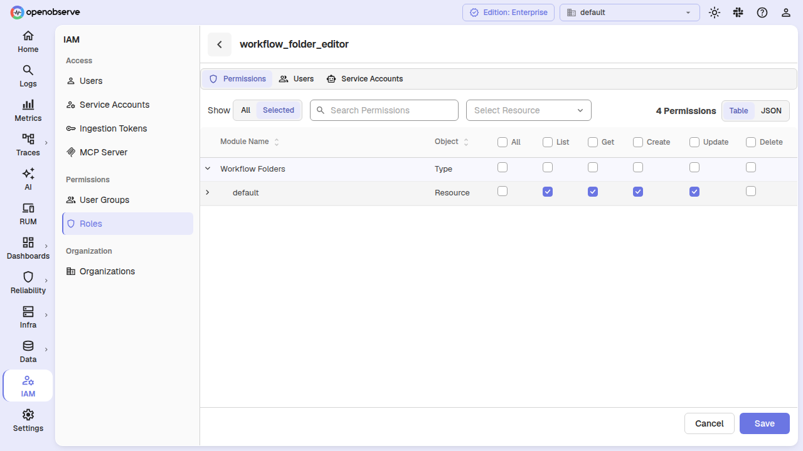

# Workflow Folders

Workflow folders let you group workflows the same way you group dashboards, alerts, reports, and synthetics. Each workflow (and each draft) lives in exactly one folder, and — with RBAC enabled — you can scope a role's workflow access to a single folder instead of granting it across the whole organization.

Every organization starts with a **default** folder. Existing workflows and drafts are automatically placed there when you upgrade, so you can adopt folders at your own pace without reorganizing anything first.

## Browse workflows by folder

The Workflows list page shows a folder rail on the left, alongside the workflow table.

1. Navigate to **Pipelines > Workflows**.
2. In the folder rail on the left, select a folder. The table lists only the workflows (and drafts) in that folder.
3. The active folder is carried in the URL as `?folder=`, so a folder view is linkable and survives a page reload.

Create a new folder by clicking the add action in the folder rail, then give it a **Name** and optional **Description**.

## Create a workflow in a folder

When you click **Add Workflow**, the editor opens scoped to the folder you were browsing, so a new workflow lands in that folder automatically.

1. On the **Workflows** list, select the folder you want to create into.
2. Click **Add Workflow**. The editor header shows a folder selector seeded with the folder you were browsing.
3. Change the folder with the selector if needed, then build and save the workflow.

The folder is saved with the workflow, and the workflow's authorization parent is set to that folder. Drafts are folder-scoped the same way — the folder a draft is created in is the folder it publishes into.

## Move workflows between folders

1. On the **Workflows** list, click the **Move to folder** action on the workflow's row.
2. Select the destination folder.
3. Confirm the move.

The workflow keeps its ID and history; only its folder (and therefore its permission scope) changes. With RBAC enabled, moving requires update access to every workflow being moved **and** write access to the destination folder, so a read-only role cannot relocate workflows between folders it cannot write to.

## Search within or across folders

The search box on the Workflows list has two scopes, and the toolbar has trigger-type tabs.

- **This folder** — search only within the folder selected in the rail. This is the default.
- **All folders** — search across every folder. This is a search mode, not a browse mode: with an empty search box the list stays in the selected folder, matching how the Alerts and Dashboards lists behave. When you switch to **All folders**, the table shows a **Folder** column naming each row's folder.

The tabs (**All**, **Alerts**, **Incidents**, and any other enabled trigger kinds) filter the table by the workflow's trigger type. The tabs come from the trigger registry, so enabling another trigger kind adds its tab automatically.

## Scope RBAC permissions to a folder

Workflow folders introduce a new authorization type, `workflow_folder`. In the **Roles** editor, workflow permissions are granted per folder instead of being all-or-nothing across the organization.

1. In the **Roles** editor, select the **Workflows** resource. You now choose a **Workflow Folder** to grant against.
2. Select the folder, then set the permissions (**List**, **Get**, **Create**, **Update**, **Delete**).
3. Save the role.

Key points about how folder scoping resolves:

- A role granted on a folder reaches the workflows in that folder through the folder's `parent` relation. An org-wide `_all_<org>` grant is re-pointed at the folder type, so per-folder grants are the model for update and delete.
- Individual per-workflow grants still work: a grant on a specific `workflows:<id>` keeps resolving regardless of folder.
- List and create are gated on `workflow_folder` with the folder taken from `?folder=`, so a role scoped to one folder lists only that folder and creates only into it.
- A user with access to one folder sees only that folder in the rail and only its workflows in the table.

## Default folder and upgrade behavior

When you upgrade to a version that supports workflow folders:

- A **default** folder is created for each organization.
- Every existing workflow and draft is backfilled into that folder.
- Any org-wide workflow grant (`workflows:_all_<org>`) is copied to `workflow_folder:_all_<org>` so existing roles keep working. Nothing is removed, so an interrupted upgrade over-grants briefly rather than locking anyone out.

A folder that still contains workflows or drafts cannot be deleted. Move or delete the workflows first; otherwise the delete returns an error telling you the folder contains workflows.

## API reference

| Method | Path | Description |
|---|---|---|
| `GET` | `/api/{org_id}/workflows` | List workflows in a folder (`?folder=`), across folders (`?all_folders=true`), and/or matching a substring (`?search_substring=`). |
| `POST` | `/api/{org_id}/workflows` | Create a workflow in a folder (`?folder=`); add `?draft=true` to save a draft. |
| `PATCH` | `/api/v2/{org_id}/workflows/move` | Move workflows to a folder. Body: `{ "workflow_ids": [...], "dst_folder_id": "..." }`. |
| `POST` | `/api/{org_id}/workflows/{id}/promote` | Publish a draft, optionally into a folder (`?folder=`). |
| `GET`/`POST` | `/api/v2/{org_id}/folders/workflows` | List or create workflow folders. |
| `GET`/`PUT`/`DELETE` | `/api/v2/{org_id}/folders/workflows/{id}` | Get, rename, or delete a workflow folder. |
| `GET` | `/api/v2/{org_id}/folders/workflows/name/{name}` | Get a workflow folder by name. |
