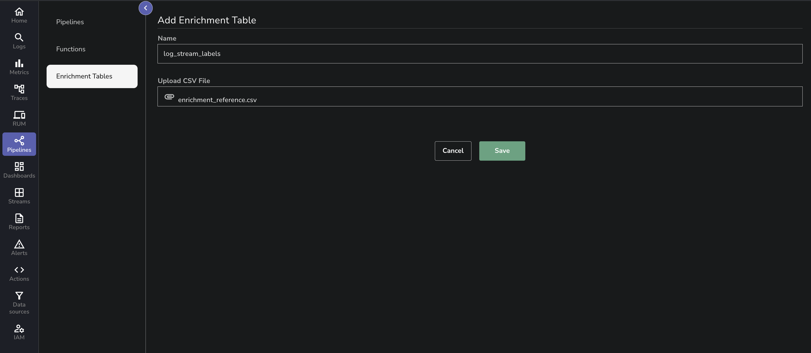
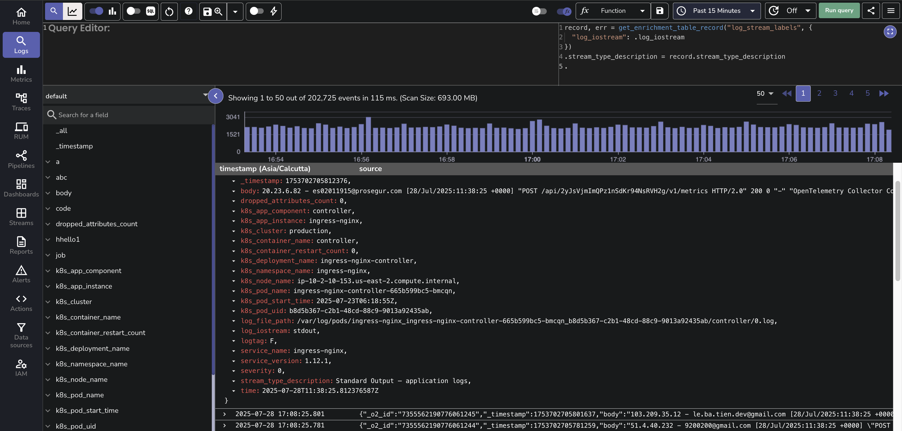

This page explains how to enrich incoming or queried log data in OpenObserve using enrichment tables. 

## What Is an Enrichment Table 
An enrichment table in OpenObserve is a reference table used to enhance your log data with additional context. It is typically a CSV file that maps keys from your logs to descriptive values.

You can use enrichment tables during:

- **Ingestion**: To add context as data is ingested.
- **Query time**: To enrich data dynamically while querying. 

**Enrichment is performed using Vector Remap Language or VRL functions.**

!!! note "Where to find"
    To access the enrichment table interface:

    1. Select the appropriate organization from the dropdown in the top-right corner.
    2. Navigate to the left-hand menu.
    3. Select **Pipelines > Enrichment Tables**.
    
    This opens the enrichment table management interface, where you can view, create, and manage enrichment tables available to the selected organization.

!!! note "Who can access"
    Access to enrichment tables is controlled via the **Enrichment Tables** module in the **IAM** settings, using **role-based access control (RBAC)**.

    - **Root users** have full access by default.
    - Other users must be assigned access through **Roles** in **IAM**.
    - You can assign access to the entire **Enrichment Tables** module.
    - You can also assign permissions to individual enrichment tables. This allows fine-grained control over who can use or modify specific enrichment tables.

## Common Use Cases for Enrichment

Enrichment tables are often used to add human-readable context or derived values to logs. Examples include:

- **Country code to country name**: Add a new field that maps `IN` to `India`, `US` to `United States`, etc.

- **Status code to status label**: Add a new field that maps status `1` to `success`, `2` to `failure`, and `3` to `unknown`.

- **Internal vs external IP**: Add a new field that classifies the IP address as `internal` or `external` based on private IP ranges.

- **Protocol number to protocol name**: Add a new field that maps `6` to `TCP` and `17` to `UDP` using a protocol lookup table.


## How to Create and Use an Enrichment Table

### Step 1: Identify the Field to Enrich
Review your log data and identify a field that contains codes or labels with limited context. <br>
**Example**  <br>
The `log_iostream` field in the logs has values such as:

```json
"log_iostream": "stdout"
"log_iostream": "stderr"
```
> The goal is to create a new field, for example `stream_type_description`, that provides a readable explanation like:
```json
"log_iostream": "stderr"
"stream_type_description": "Standard Error – error or diagnostic logs"
```

### Step 2: Prepare the Enrichment Table
Create a CSV file containing the original values and their corresponding descriptive meanings. Use clear and consistent column headers.
Example CSV (`enrichment_reference.csv`)  
```cs
log_iostream,stream_type_description
stdout,Standard Output – application logs
stderr,Standard Error – error or diagnostic logs
```

### Step 3: Upload the Enrichment Table

1. Go to **Pipelines > Enrichment Tables** in the OpenObserve UI.
2. Click **Add Enrichment Table**.
3. Set a name such as log_stream_labels.
4. Upload your CSV file.
5. Click **Save**.
<br>


The enrichment table is now available for use in VRL.

### Step 4: Use the Enrichment Table in a VRL Function
1. Go to the **Logs** page.
2. Select the relevant log stream.
3. In the **VRL Function Editor**, enter the following:

```js linenums="1"
record, err = get_enrichment_table_record("log_stream_labels", {"log_iostream": .log_iostream})
.stream_type_description = record.stream_type_description
.
```

!!! note "Explanation:"
    **Line 1:** <br>

    `record, err = get_enrichment_table_record("log_stream_labels", { "log_iostream": .log_iostream })`: 

    - This line searches the enrichment table named `log_stream_labels`.
    - It matches the field `log_iostream` in your log event with the `log_iostream` column in the enrichment table.
    - If a match is found, the corresponding row from the table is returned as record.
    - If no match is found or an error occurs, record will be empty and err will contain the error.

    **Line 2:** <br>
    `.stream_type_description = record.stream_type_description`:

    - This creates a new field called `stream_type_description` in your log event.
    - The value is taken from the `stream_type_description` column in the enrichment table row returned above.
    - If the enrichment table did not contain a matching entry, this field may not be added.

    **Line 3:** <br>
    `.`

    - This tells OpenObserve to return the modified log event, including the newly added field.

**Optional** <br>
If you prefer to replace the original value instead of adding a new field, you can do:

```js linenums="1"
record, err = get_enrichment_table_record("log_stream_labels", {"log_iostream": .log_iostream})
.log_iostream = record.stream_type_description
.
```
### Step 5: Run the Query and View the Results
Click Run Query. A new field (such as stream_type_description) will appear in the results, containing the enriched meaning of the original value. 
<br>



## Use Enrichment Tables in Pipelines 
In addition to enriching data at query time, you can apply the same enrichment logic during ingestion using **Pipelines**. This allows you to permanently transform log records as they arrive, ensuring that enriched fields are stored along with the original data.

### How it works

- You define a pipeline with a **Transform** step that uses a VRL function.
- The VRL function reads from an enrichment table, just like in the **Logs** UI.
- The enriched field is added before the data is written to storage.

!!! note 
    Use query-time enrichment when you want flexibility. Use ingestion-time enrichment when you want consistency and speed.

## Troubleshooting
- **Field not enriched:** Ensure the enrichment table column name matches the log field and that the data types are compatible. 
- **No result added:** Check that the enrichment table was uploaded and saved correctly, and that a matching row exists.
- **Permission denied:** Ensure the user has the correct permissions in the IAM role to access the enrichment table.