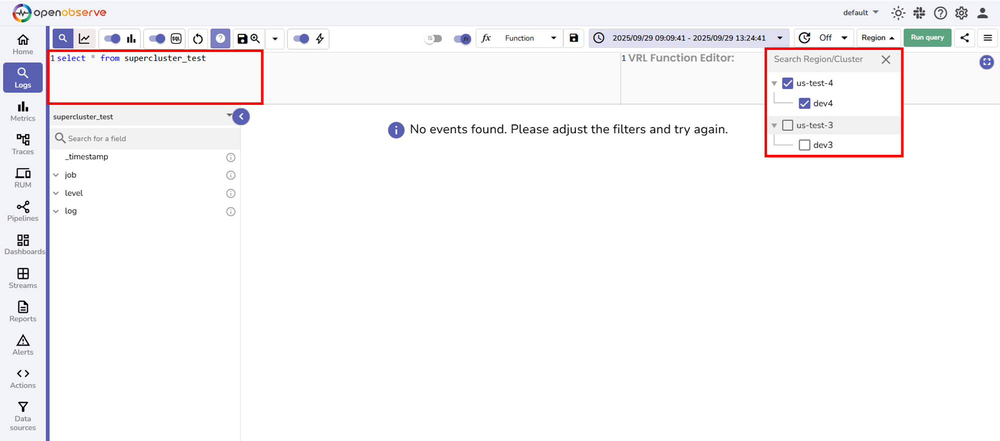

This document explains how to query your current cluster and how to perform [federated searches](../) across one or more different clusters in a supercluster setup.

!!! info "Availability"
    This feature is available in Enterprise Edition. Not available in Open Source and Cloud.

## How to query your current cluster in a supercluster

Query your current cluster when you know the data is in your cluster or when you need the fastest query performance.

!!! note "What you need to know:"

    - This is not federated search
    - You are querying the current cluster.
    - No cross-cluster communication occurs.
    - Results will include data from the current cluster only.
 
**Steps:**

1. Navigate to the **Logs** page.
2. Enter your query in the SQL Query Editor.
3. Select a time range.
4. Select one specific cluster from the **Region** dropdown.
5. Select **Run query**.

> For detailed explanation, see **Normal cluster query execution** in the [Federated Search Architecture](https://openobserve.ai/docs/user-guide/federated-search/federated-search-architecture/) page.
 

**Result** 
Data from the selected cluster only.

## How to query one or more different clusters in a supercluster

Use federated search when you need data from multiple clusters.

!!! note "What you need to know"

    - Multiple clusters will process your query simultaneously.
    - Results will combine data from all selected clusters.

**Steps**
 

1. Navigate to the **Logs** page.
2. Enter your query in the SQL Query Editor.
3. Select a time range.
4. Leave the **Region** dropdown unselected, or select multiple clusters.
5. Select **Run query**.

> For detailed explanation, see **Federated search for one different cluster** and **Federated search for multiple clusters** in the [Federated search architecture](https://openobserve.ai/docs/user-guide/federated-search/federated-search-architecture/) page.
 

**Result** 
Combined data from all selected clusters.

## Region selection reference

Use this quick reference to understand how region selection affects query execution:

| **Region/Cluster Selection** | **Behavior** | **Query Type** | **Communication** |
|------------------------------|--------------|----------------|-------------------|
| None selected | Queries all clusters | Federated search | Cross-cluster via gRPC |
| Your current cluster selected | Queries only your current cluster | Normal cluster query (NOT federated) | Internal only, no cross-cluster |
| One different cluster selected (same region) | Queries only that cluster | Federated search | Cross-cluster via gRPC |
| One different cluster selected (different region) | Queries only that cluster | Federated search | Cross-cluster via gRPC |
| Multiple clusters selected | Queries all selected clusters | Federated search | Cross-cluster via gRPC |

**Next step**

- [Federated search architecture](https://openobserve.ai/docs/user-guide/federated-search/federated-search-architecture/)