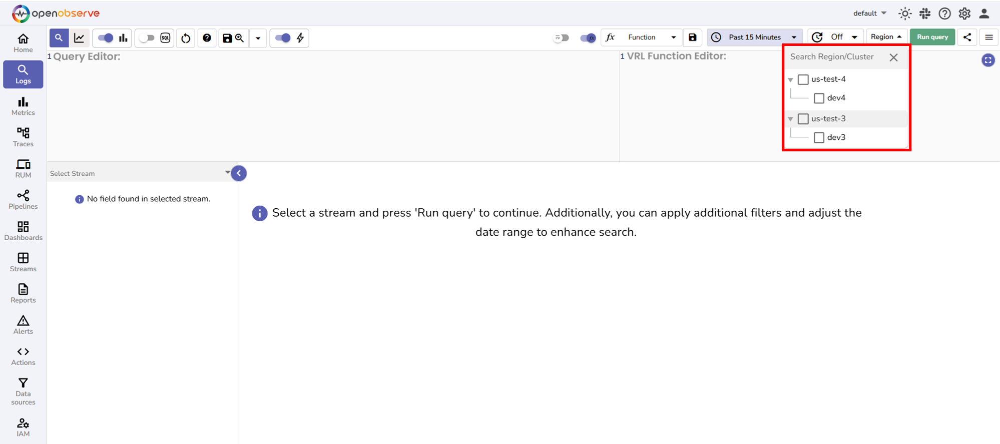

This document provides an overview of federated search in OpenObserve.

> This feature is available in Enterprise Edition.

## What is federated search?

Federated search enables querying across multiple OpenObserve clusters that are connected as a supercluster, all from one interface.
 

Without federated search, investigating issues across regions requires logging into each cluster separately, running the same query multiple times, and manually combining results. This wastes time during critical incidents.
With federated search, you query once and receive unified results from all clusters.

!!! note "Prerequisites"

    - OpenObserve Enterprise edition
    - Multiple clusters configured as a supercluster

## How to verify if your environment is in a supercluster
Check whether the Region dropdown appears on the Logs page. If visible, your clusters are configured as a supercluster.

## Key concepts in federated search

Before using federated search, understand these core concepts:

- **Node:** A single instance of OpenObserve running on one machine or server.
- **Cluster:** A group of OpenObserve nodes working together to handle data ingestion, storage, and querying. Each cluster has its own data storage.
- **Region:** A geographical location that contains one or more clusters. For example, Region us-east may contain cluster prod-east-1 and cluster prod-east-2.
- **Supercluster:** Multiple OpenObserve clusters across different geographical regions connected to work as a unified system. This enables federated search capability.
- **Data distribution:** Data ingested into a specific cluster stays in that cluster's storage. It is not replicated to other clusters. This ensures data residency compliance.
- **Metadata synchronization:** Configuration information such as schemas, dashboards, and alerts synchronize across all clusters in a supercluster. This allows unified management while keeping data distributed.
- **Federated search:** The capability to query data across different clusters in a supercluster. Federated search activates when you:

    - Select one or more different clusters, meaning clusters other than your current cluster: The selected clusters' data is searched via federated coordination.
    - Select none: All clusters search simultaneously via federated coordination and results are combined.

> **Important**: Querying your current cluster uses normal cluster query execution, not federated search architecture.

> For detailed technical explanations of deployment modes, architecture, and how queries execute, see the [Federated Search Architecture](../federated-search-architecture/) page.

## When to use federated search

| **Use case** | **Cluster selection** | **Reason** |
|--------------|----------------------|------------|
| Data is in one specific different cluster | Select that different cluster | Access only that cluster's data via federated search |
| Multi-region deployments | Select none or multiple clusters | Query all regions at once via federated search |
| Centralized search across teams | Select none or multiple clusters | Unified visibility across all clusters via federated search |

## When not to use federated search

| **Use case** | **Cluster selection** | **Reason** |
|--------------|----------------------|------------|
| Data is in your current cluster | Select your current cluster | Uses normal cluster query without cross-cluster communication |

**Next steps**

- [How to Use Federated Search](../how-to-use-federated-search/)
- [Federated Search Architecture](../federated-search-architecture/)