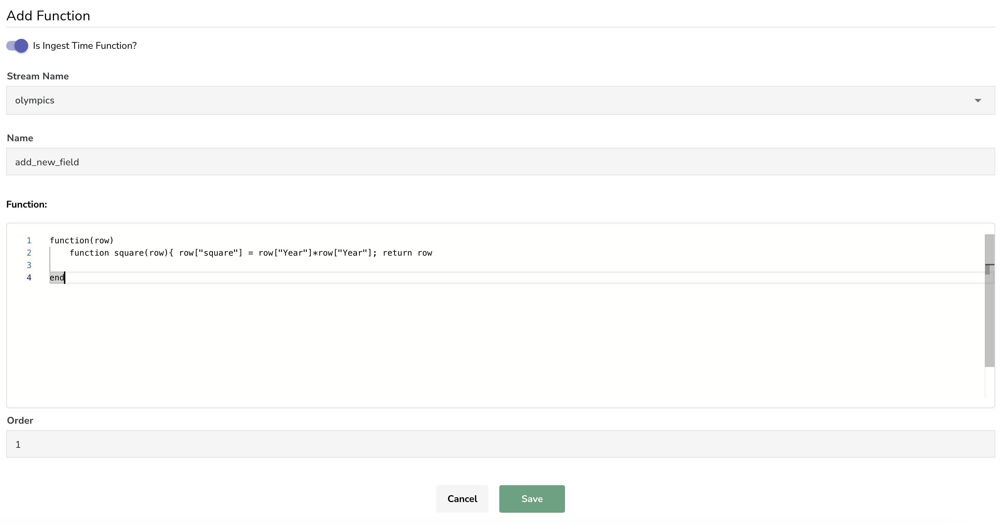

# Ingest Time Functions

** Ingest time functions ** are evaluated on a stream during ingestion & can be used for data enrichment, redaction, log reduction, compliance, etc. 

Ingest time function is defined using [lua script](https://www.lua.org/) & act on an individual record (row) , hence by default row is input to lua function being defined.

While defining ingest time function, one has to :

1. toggle ** On ** 'Is Ingest Time Function?' control 
1. select stream name , from listed streams
1. specify function name
1. provide script defining behaviour of function , as mentioned above row is input to lua script being defined
1. order of the function , the functions application be a stream are applied in order starting with lowest order to highest order.For eg: for a stream lets assume there are two ingest time functions : 
    - function 1 with order as 1
    - function 2 with order as 2

During ingestion function 1 will be applied to stream as it has lower order 1 , as compared to function 2 with order 2

Let's define a function which takes row/record as input acts on field named "Year" & calculates square of it, adds this field to the input row and returns modified row.

Please note one must return modified row/record when using ingest functions.

<kbd>

</kbd>
