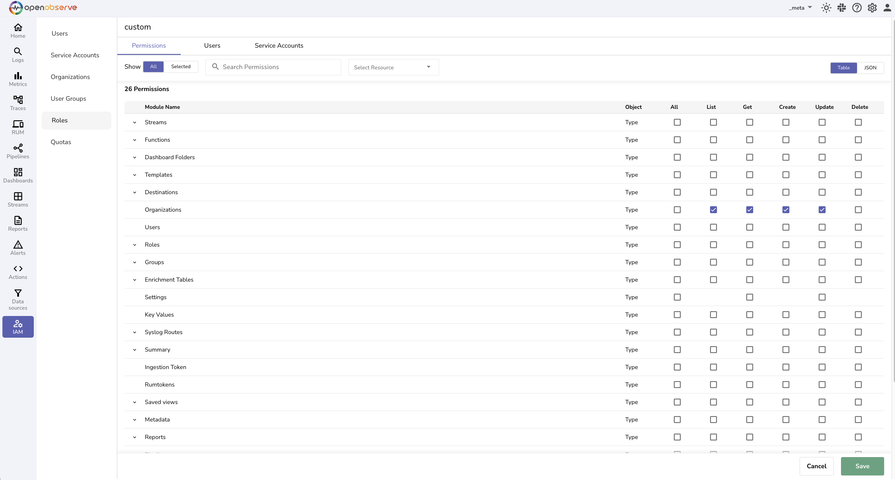

This guide explains how organizations work in OpenObserve. It covers organization types, creation methods, identifiers, access control, and switching behavior. 

## Overview   
Organizations provide logical boundaries for separating data, users, and access controls, enabling secure multi-tenant usage in a single OpenObserve deployment.

> You will encounter the concept of organization when you first log in or [ingest data into a stream](../streams/streams-in-openobserve.md/#ingest-data-into-stream). To send data into OpenObserve, you must specify the **organization identifier** in your ingestion endpoint. 


## Organization Types

OpenObserve supports two types of organizations:

- **Default organization:** Automatically created for each user upon account creation. Typically named **default** and owned by the user. The UI labels it as type **default**.
- **Custom organization:** Any organization other than the **default**. These are created manually using the UI or ingestion (if enabled). Displayed in the UI as type **custom**.

!!! Info "What Is **_meta** Organization?"
    **_meta Organization** is considered as a **custom** organization. It is a system-level organization that exists in both single-node and multi-node (HA) deployments. 

    - The **_meta** organization provides visibility into the health and status of the OpenObserve instance, including node metrics, resource usage, and configuration across all organizations. 

    - Only the root user and users explicitly authorized through role-based access control (RBAC) can access it.
    
    - Use the **IAM > Roles > Permission** in the **_meta** organization to manage users across all organizations and control who can list, create, update, or delete organizations.

## Access 

In OpenObserve, access to organization-level operations, such as listing, creating, updating, or deleting organizations, depends on the deployment mode.

### Open-Source Mode 
Any authenticated user can create new organizations using the Add Organization button in the UI.
### Enterprise and Cloud Mode with RBAC Enabled
- Access to organization management is strictly controlled through RBAC, which must be configured in the _meta organization.
- The **root** user always has unrestricted access to all organizations, including **_meta**.
- Only roles defined in **_meta** can include permissions for managing organizations.
- The **organization** module is available in the role editor only within the **_meta** organization. 

!!! Info "How to Grant Organization Management Access?"
    To delegate organization management to users in enterprise mode:

    1. Switch to the **_meta** organization.
    2. Go to **IAM > Roles**.
    3. Create a new role or edit an existing one.
    4. In the **Permissions** tab, locate the Organizations module.
    5. Select the required operations:

        - **List**: View existing organizations
        - **Create**: Add new organizations
        - **Update**: Modify organization details
        - **Delete**: Remove organizations
    6. Click **Save**. <br>
    

    Once this role is assigned to a user within the **_meta** organization, they will have access to manage organizations across the system.


## Create an Organization

### From the User Interface
To create a new organization:

1. Navigate to **IAM > Organizations**.
2. Click **Add Organization**.
3. Enter the organization name and save. <br>


This option is available to the **root** user by default. In enterprise deployments, additional users may create organizations if they are granted permission through the meta organization.

### During Ingestion
New organizations can also be created automatically during ingestion, depending on the environment variable setting and user role. 

To enable this feature, set:
```
ZO_CREATE_ORG_THROUGH_INGESTION=true
```
> By default, this variable is now set to true.

When enabled:

- Only the **root** user can create organizations by sending data to a non-existent organization.
- If a non-root user attempts to do so, a 403 Forbidden error is returned.

## Behavior and Limitations

- **Unique Identifiers and Duplicate Names**: Each organization is assigned a unique identifier that is separate from its name. This identifier is required in API requests and ensures internal uniqueness, allowing multiple organizations to have the same name.
- **Identifier Visibility in UI**: The organization list in the UI displays both the name and the identifier, helping you distinguish between organizations with the same name.
- **Switching Organizations**: Use the dropdown in the top navigation bar to switch between organizations you have access to. All actions, such as queries and configurations, apply only to the selected organization.
- **Search by Name**: You can search for organizations by name using the search bar on the Organizations page.
- **Rename and Delete Restrictions**: Organizations cannot be renamed or deleted. 

