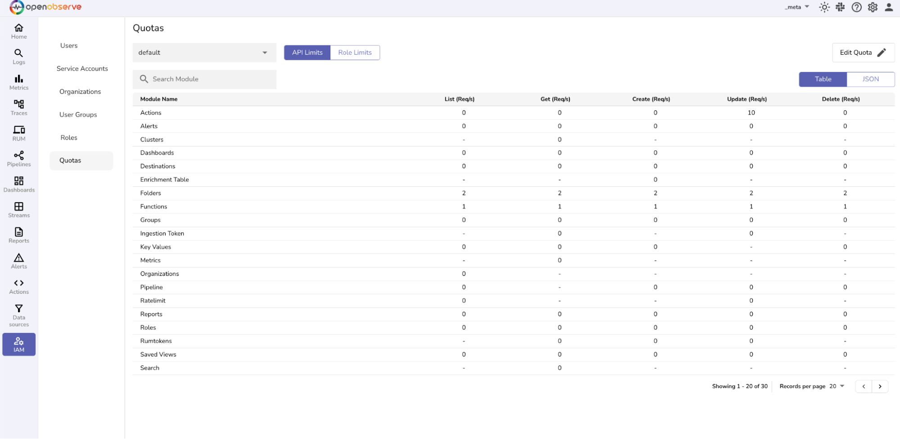
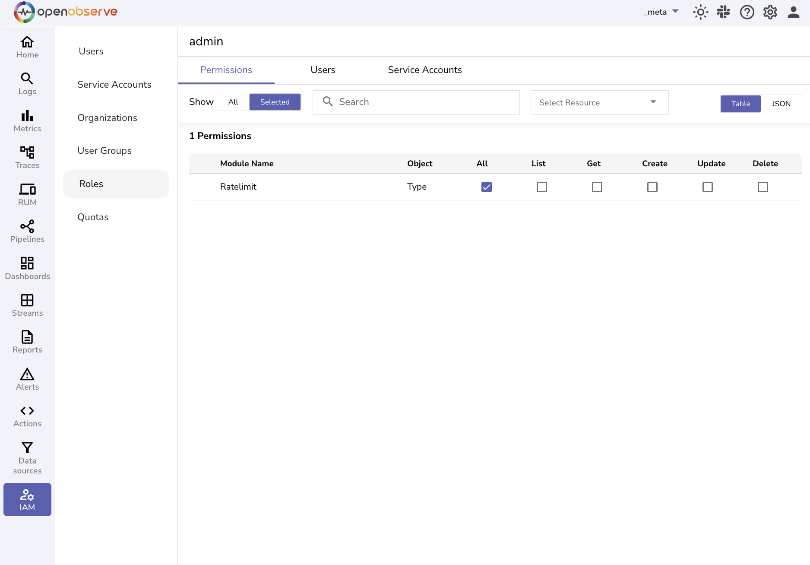
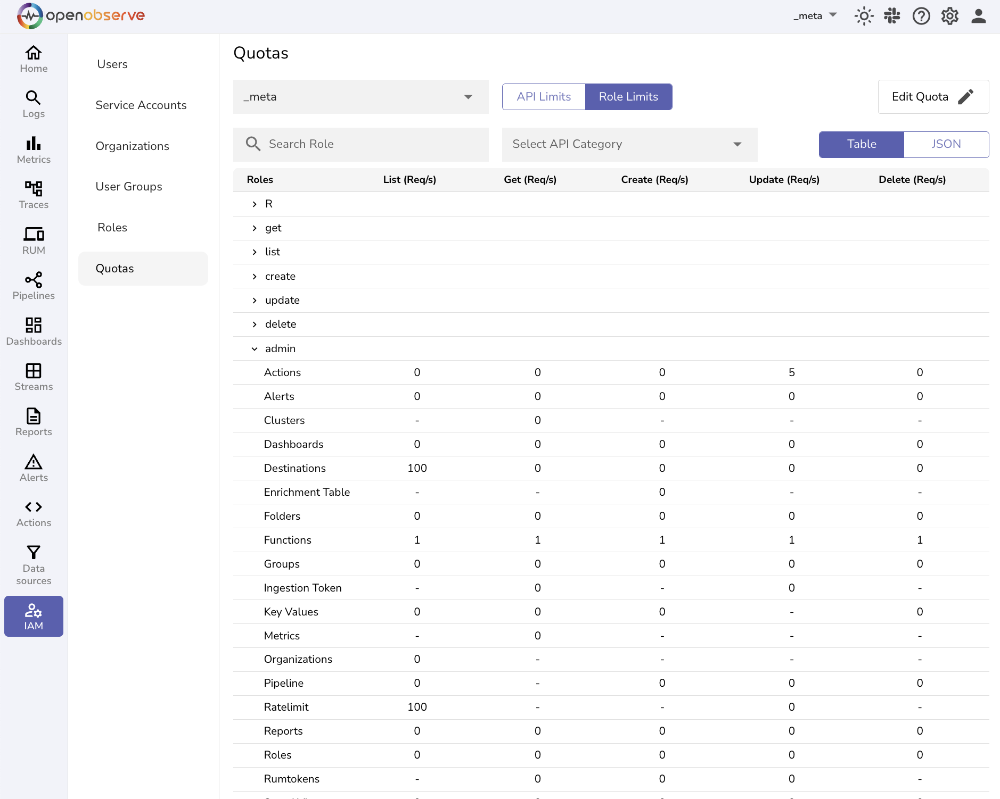

This guide explains what Quotas are, how to configure them, how to navigate the Quotas interface, and how to set quota limits.

## What Are Quotas

Quotas in OpenObserve are rate limiting mechanisms that let you control how many API requests users can make per second. 

You can use Quotas to define request-per-second (Req/s) limits for API operations such as **List**, **Get**, **Create**, **Update**, and **Delete**. 
These limits can be applied in two ways: 

- At org-level: Limit how many requests all users in an organization can make to a specific API, such as Logs or Alerts.
- At role-level: Limit how many requests all users in a specific role can make to an API.

> **Note**: If a user exceeds the defined quota, OpenObserve returns a `RateLimitExceeded` error.

### Availability
The Quotas feature is available only in high-availability (HA) deployments.


### Access
By default, only root users can access the Quotas settings from the `_meta` organization. You can grant access to other roles using Role-Based Access Control (RBAC).  

>To grant access to other user roles using RBAC: 
>
>1. Log in as a root user.  
>2. Switch to the `_meta` organization from the top navigation bar.  
>3. From the left navigation menu, go to **IAM**.  
>4. Select the **Roles** tab.  
>5. Click the edit icon next to the role you want to update.  
>6. In the **Permissions** tab:  
>   
>    - Locate the **Rate Limit** section.  
>    - Select the type of access you want to grant (e.g., read, write, etc.).  
>    - Review and confirm that the users assigned to the role are correct.  
>7. Click **Save** to apply the changes.  



## How to Configure Quotas Using Environment Variables

### Prerequisites

Before you use the Quotas feature, ensure that the following are true:

- You are using the Enterprise Edition in High-Availability mode. [Refer to the Enterprise Edition Installation Guide.](../../../openobserve-enterprise-edition-installation-guide.md)   
- You have access to **Quotas**.   
- You have switched to the `_meta` organization in the UI.

### Step 1: Enable Quotas

Set `O2_RATE_LIMIT_ENABLED` to true in the `enterprise.parameters` section of your `values.yaml` file, as shown below. This activates the Quotas feature in OpenObserve.

```bash linenums="1" 
enterprise:  

  enabled: true  

  parameters:

`O2_RATE_LIMIT_ENABLED` : “true”

```

### Step 2: Set the internal queue store to coordinate rate limiting

Set `ZO_QUEUE_STORE` to “nats”  in the `config` section of the values.yaml file. This enables internal queuing through NATS for coordinating rate limiting. 

```bash linenums="1" 
`config:

`ZO_QUEUE_STORE` : “nats”

```

## Quotas Interface

The Quotas page provides a tabbed interface with two views:

### API Limits

Use this to set **org-level** quotas for a specific API module. The limit applies to **all users in the selected organization**, regardless of their role.

You can also apply rules globally by selecting the **global rules** option under the organization selector dropdown. This applies the limit across all organizations and their respective user roles.


### Role Limits

Use this to set **role-level** quotas for specific API modules within an organization. This allows more granular control by assigning **different limits** to each role for the same API module.



Each tab displays a table with the following:

- **Module**: The API module (e.g., Alerts, Dashboards).  
- **Operations:** Columns for List, Get, Create, Update, and Delete.  
- **Values**: Request-per-second (Req/s) limits per operation.

> **Note:**
>
>- A dash **(–)** means rate limiting is not applicable.   
>- A value of **0** indicates no rate limit is enforced.

## How to Set Quotas

You can configure quotas in two ways:

- By organization using the **API Limits** tab
- By user role using the **Role Limits** tab

### Set API Limits

1. Go to the **API Limits** tab.  
2. Select the target organization from the dropdown.  
3. Click **Edit Quota**.  
4. Enter Req/s limits for each operation against the desired module.   
   Note: You can edit quotas in bulk in both **Table** and **JSON** formats.  
5. Click **Save Changes**.

> **Note**: API limits apply across all roles in the selected organization. <br>
> **Important:** Rate limiting for the Search module requires special consideration. [Learn more](#quota-consideration-for-search-module). 

### Set Role Limits

1. Go to the **Role Limits** tab.  
2. Select the organization and role from the dropdowns.  
3. Expand the role row to view its module list.  
4. Click **Edit Quota**.  
5. Enter limits (Req/s) for each operation.   
   Note: You can edit quotas in bulk in both **Table** and **JSON** formats.  
6. Click **Save Changes**.

>**Note**: Role limits override API limits if both are defined.

## Quota Consideration for Search Module

When you run a search query in OpenObserve, the search query is internally divided into multiple partition-level queries, one for each time-based partition that falls within the selected time range.

This means that a single search from the user can trigger multiple internal search calls, depending on how the data is partitioned.

### What is a Partition

A partition in OpenObserve is a time-based chunk of data. It is automatically determined based on:

- The time range selected for the query  
- The size of the data in that time range

### How to View Partitions for a Selected Time Range 

To check how your search query is internally split into partitions:

1. From the left navigation menu, go to the **Logs** page.  
2. Select the target stream from the stream selector.  
3. In the SQL editor, write a query to fetch data from the selected stream. For example:  
   ```sql linenums="1"   
   SELECT * FROM default  
   ```  
4. Select the desired time range from the time range selector (top-right corner).  
5. Right-click anywhere on the browser and select **Inspect** to open your browser’s developer tools.  
6. Go to the Network tab.  
7. Click **Run Query** in the OpenObserve UI.   
8. Look for a request named: `_search_partition?type=logs`  
9. Click the request and view its **Preview** tab.  
10. In the **Preview** tab, find the **partitions** section, which looks like the following:

``` linenums="1" 

partitions: [

  [timestamp_1_start, timestamp_1_end],

  [timestamp_2_start, timestamp_2_end]

]

```

Each pair of timestamps represents one partition.

> **Example:** 
> If your 15-minute query results in 2 partitions, the system makes 2 internal search calls. If your quota > for the Search module is set to 1 request per second (1 Req/s), only one request can be processed at a > time. The second request is blocked, and you may see:

`Request limit reached for ratelimit/_search`

### Quota Planning for Search Module

There is no standard recommendation for setting the minimum quota for the Search module. The appropriate quota depends on your:

- Average query time range  
- Expected number of partitions  
- Number of concurrent users running queries

To define an effective quota, consider testing the partition behavior for your typical query patterns using the method above.

## Next Step
Learn [how quotas work](how-quotas-work.md).

