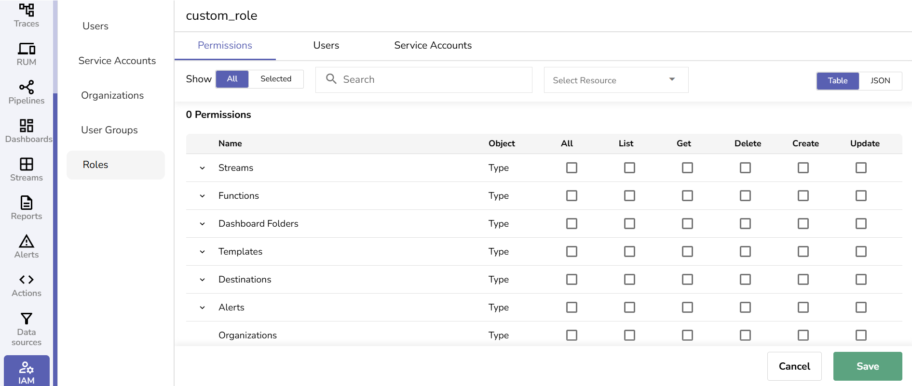
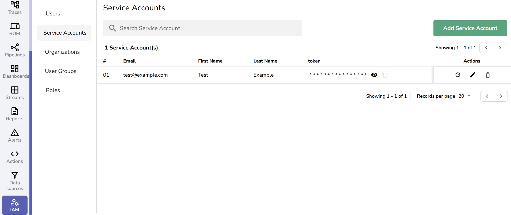
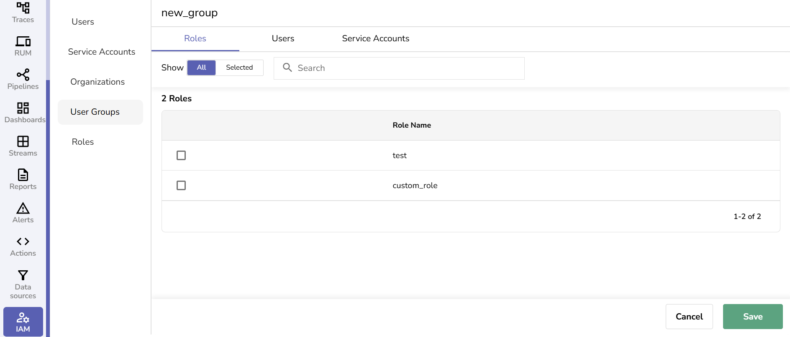
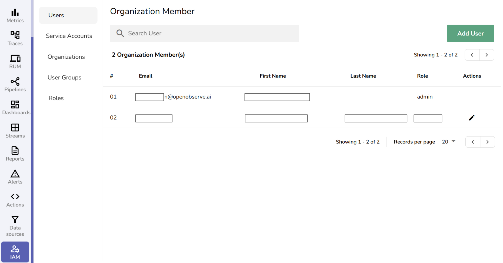
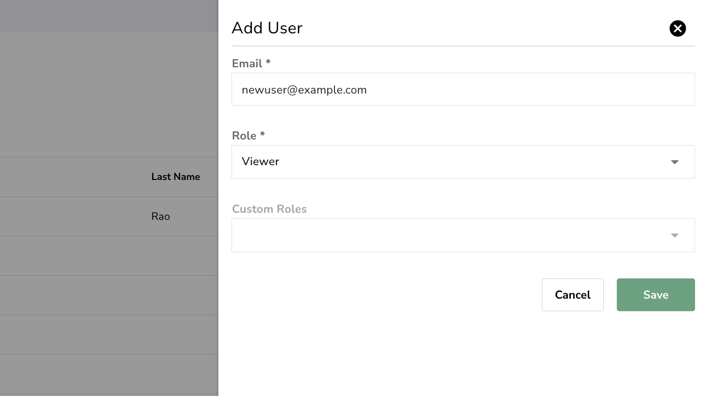
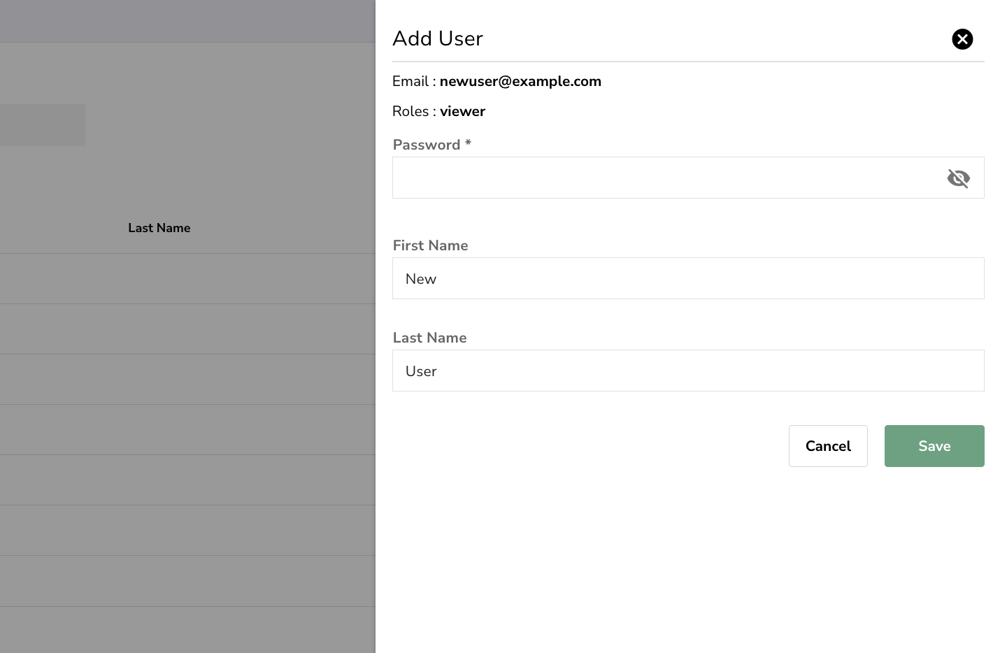
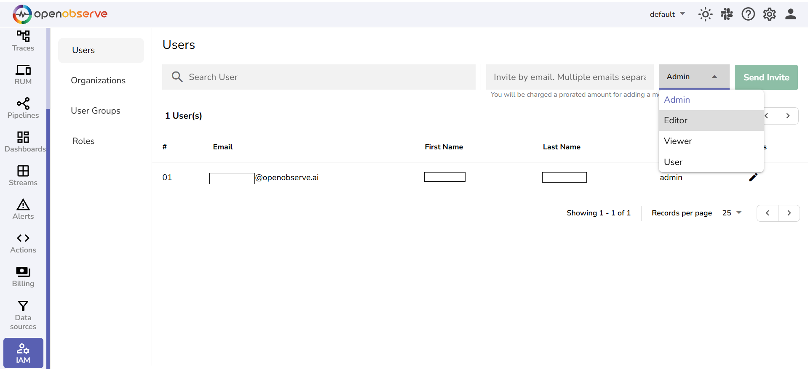

This guide provides an overview of Role-Based Access Control (RBAC), its features, and how it is implemented in OpenObserve.

!!! info "Availability"
    This feature is available in Enterprise Edition and Cloud. Not available in Open Source.

    - **Enterprise version**: RBAC requires manual configuration using [OpenFGA](https://openfga.dev/api/service). Learn more about [enabling RBAC in OpenObserve Enterprise](enable-rbac-in-openobserve-enterprise.md).
    - **Cloud version**: RBAC is preconfigured and does not require setup.
    - **Open-source version**: RBAC is not supported. All users have unrestricted access to all features.

## Overview

OpenObserve uses RBAC to manage what actions users can perform based on their assigned roles. Instead of giving all users the same level of access, RBAC ensures that each user can only access the features and data relevant to their role.

## How OpenObserve Implements RBAC

OpenObserve uses OpenFGA, an authorization system, to manage role-based access control.

### Workflow

1. OpenObserve sends API requests to the OpenFGA server to store and retrieve RBAC-related data.
2. The OpenFGA server maintains role relationships and permissions in a database.
3. When a user attempts to perform an action, OpenObserve queries OpenFGA to check whether the action is allowed.
4. OpenFGA evaluates the role relationships and returns a **true** or **false** response:
  **True**: The user can perform the action.
  **False**: The user cannot perform the action.

## RBAC in OpenObserve  

RBAC in OpenObserve is managed through the **Identity and Access Management (IAM)** panel, which provides features for administering users, roles, service accounts, and user groups.

## Permissions

RBAC permissions define what actions users can perform:

- **List**: View records without modification.
- **Get**: Retrieve specific details of a resource.
- **Create**: Add new resources.
- **Update**: Modify existing resources.
- **Delete**: Remove resources.

## Roles

### Predefined User Roles

OpenObserve provides the following predefined roles:

- **Admin**: Full access to all settings and data, including user management.
- **Editor**: List, get, create, update, and delete access. Cannot manage users.
- **Viewer**: Read-only access. No create, update, or delete permissions.
- **User**: No access. Receives an "Unauthorized Access" warning upon login.

**Note:** The **Root User** is the highest-privileged account in OpenObserve with full access across all organizations. Each OpenObserve installation has one root user, created during setup by providing the email and password as environment variables.

### Custom User Roles

Admins can create custom user roles in OpenObserve to define more granular access policies.

**To create a custom role**:

1. Go to the **IAM** panel and select the **Roles** section.
2. Click the **Add Role** button.
3. Enter the custom role name. Use only alphanumeric characters (A-Z, a-z, 0-9) and underscores (_). Spaces are not allowed. **Custom role names must not match predefined roles such as Admin, Editor, Viewer, or User**.
4. Click **Save**.
5. Click the edit icon on the custom role to assign permission to specific features and assign users and service accounts to the custom role.
6. Click **Save**.

## Service Accounts  

A service account in OpenObserve is a non-human account used for API access, automation, and integrations. Each service account is assigned a **token** for authentication.

- **Enterprise version**: Service accounts have no permission by default. Admins must assign roles to the service accounts explicitly.
- **Open-source version**: Service accounts have full access by default.
- **Cloud version**: Service accounts are not supported.

**To add a service account**:

1. From the **IAM** panel, select **Service Accounts**.
2. Click **Add Service Account**.
3. Enter the **Email, First Name,** and **Last Name**.
4. Click **Save**.
5. A **token** is generated for the service account.
6. After the service account is created, assign the necessary **roles** and **permissions**. This step is required for the service account to make API calls and access specific services in OpenObserve.

**Note:**

- You can generate a new token at any time by selecting the appropriate service account from the Service Accounts page and clicking the refresh icon next to it.
- Ensure that the assigned roles provide only the minimum required access based on the use case.

## User Groups

User groups allow admins to manage permissions collectively.

**To add user groups**:

1. From the **IAM** panel, select the **User Groups** section.
2. Click the **Add Group** button, add a group **Name**, and click **Save**.
3. To add users to the group and assign roles, click the edit icon.
4. From the **Roles, Users,** and **Service Accounts** tabs, select the list of users and service accounts that need to be assigned with appropriate roles.
5. Click **Save**.

## Users

Users are organization members with assigned roles that determine their access and actions within OpenObserve. Their permissions depend on the role assigned to them, such as **Admin, Editor, Viewer, User,** or **Root User**.

**Note:** As of February 2025, only the **root user** can invite new users to an **Organization** in OpenObserve.  

**To add a user to an organization**:

1. Navigate to **IAM > Users**.
2. Click **Add User**.
3. Enter the user’s email address.  
   
4. Select one of the predefined roles- **Admin**, **Editor**, **Viewer**, or **User**.
5. Optionally, assign one or more custom roles to extend permissions.
6. Click **Save**.
7. If the user does not already exist, you will be prompted to set a password, first name, and last name.  
If the entered email address already belongs to an existing user, the system will show a message:
`User is already part of the organization`.  

After you save the changes, the new user gets listed in the **Users** page. 
Use the Actions column to edit and delete the user. 

**Note:** In the **Cloud version**, any user can invite new users by entering their email addresses, separated by commas or semicolons, selecting a role, and clicking **Send Invite**.  

