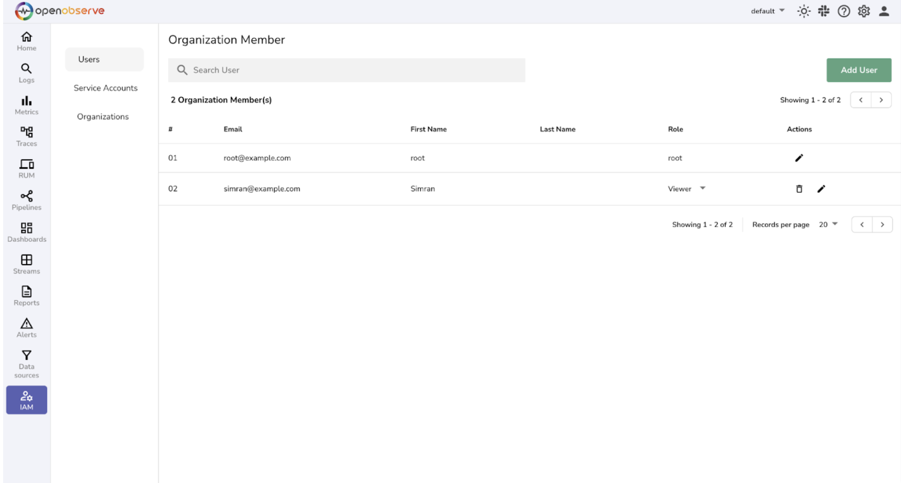
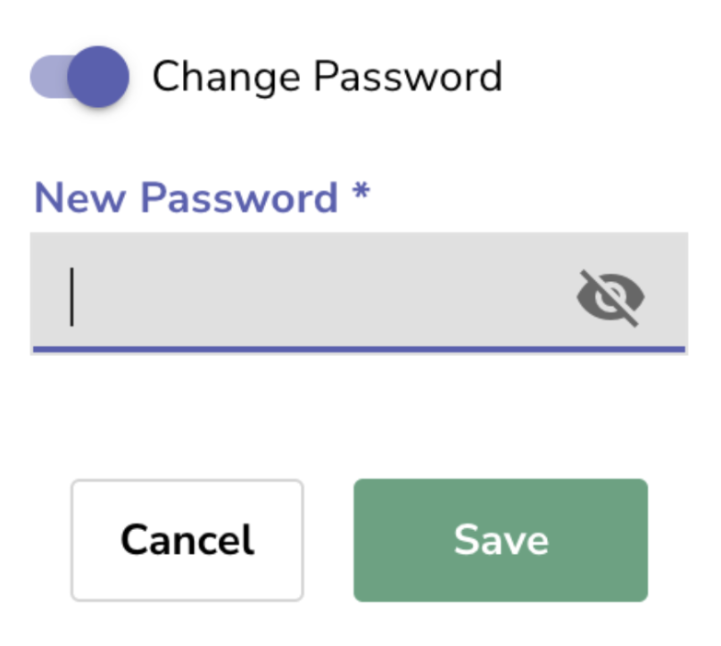

# Updating Usernames and Passwords in OpenObserve

Managing credentials in OpenObserve is critical for securing your observability platform. Incorrect or outdated credentials can block access, cause downtime, or expose your system to security risks. This page explains how to update usernames and passwords through the UI or CLI, and provides best practices for secure credential management.


## Overview

OpenObserve provides multiple ways to manage user credentials:

* [UI-based](#updating-passwords-via-the-openobserve-ui) updates for users and roles
* [CLI-based](#resetting-the-root-password-via-cli) root password reset if locked out

## Updating Passwords via the OpenObserve UI

Use the OpenObserve UI to manage users easily.

**Steps:**

1. Log in as an administrator.
2. Navigate to **IAM → Users**. Click the **Edit** icon under **Actions** for the user you want to update.
    
3. Enable **Change Password** and enter the new password.
    {:style="height:300px"}
4. Click **Save Changes**.
5. Log out and verify that the updated credentials work.

> **Tip:** You can also update user roles at the same time to enforce correct permissions.


## Resetting the Root Password via CLI

If you are locked out of the root account, you can reset the root password from the CLI.

**Steps:**

1. Set environment variables for the new root credentials:
    ```bash
    export ZO_ROOT_USER_EMAIL="root@example.com"
    export ZO_ROOT_USER_PASSWORD="NewStrongPassword123"
    ```

2. Run the reset command from your OpenObserve installation directory:
    ```bash
    ./openobserve reset -c root
    ```

3. After the reset completes, log in with the updated root credentials.

> **Note:** For Docker or Kubernetes deployments, set the environment variables inside the container or pod before running the reset command.


## Best Practices

* Update usernames, passwords, or roles via the UI whenever possible.
* Update root and user passwords periodically; rotate API keys or service accounts.
* Use long, complex, and unique passwords. Avoid reusing passwords across environments.
* Back up your metadata database, especially before manual or DB-level changes.
* Use dedicated users with least privilege; reserve root for emergencies.

## Next Steps

* Set up [alerts](../alerts/alerts.md) for failed logins to detect potential security issues.
* Review [RBAC and role assignments](../identity-and-access-management/enable-rbac-in-openobserve-enterprise.md) to ensure least-privilege access.
