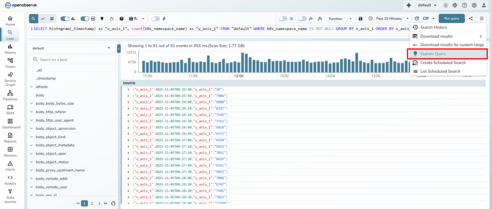
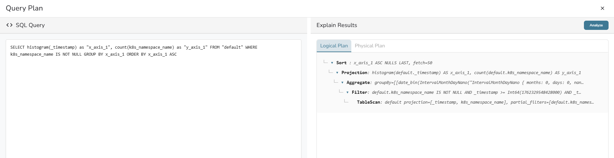
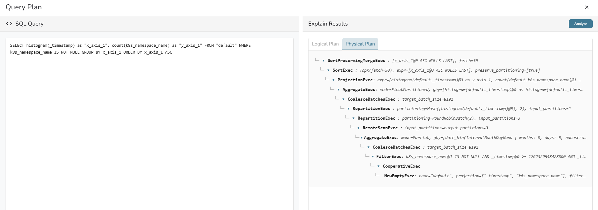
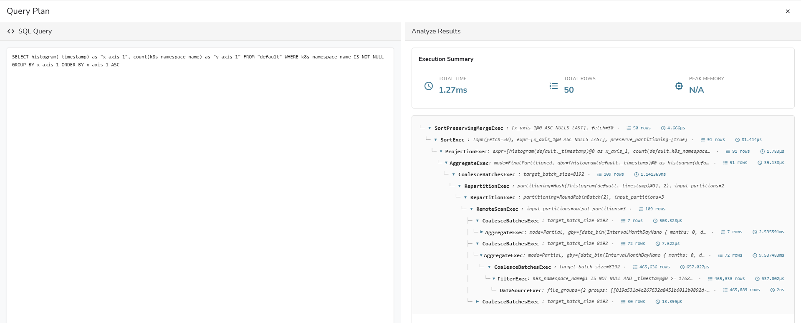
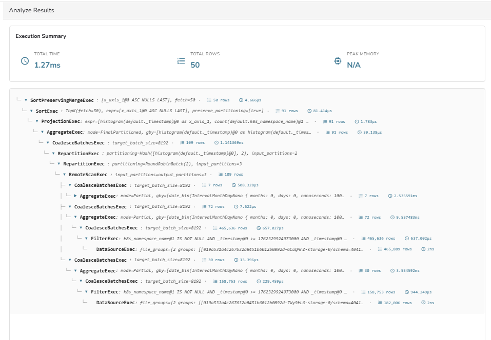

This document explains how to use the Explain Query and Analyze Query features in OpenObserve to view and understand your SQL query execution plans. 

## Overview 
OpenObserve provides Explain Query and Analyze Query tools to help users understand how SQL queries are processed internally. These options display the logical and physical query plans generated by OpenObserve's query engine and show how data flows through different execution stages. The Analyze view additionally provides execution time, row counts, and memory usage for each operation.

??? "How to access Explain Query"
    ## How to access Explain Query

    1. From the left navigation panel, click **Logs**. 
    2. In the SQL editor at the top, write your SQL query.
    3. Select the time range in the time range selector.
    4. Click the **Run query** button to execute your query. 
    5. After the query completes and results are displayed, click the **More Actions menu** (≡) at the top-right corner. 

    
    6. Select **Explain Query** from the dropdown menu. 
    7. A Query Plan window opens displaying. The left panel shows your original SQL query for reference. The right panel shows two tabs, **Logical Plan** and **Physical Plan**. 
    
    <br>

    

??? "How to access Analyze Query"
    ## How to access Analyze Query

    1. First, open the Explain Query page following the steps above. 
    2. Click the **"Analyze"** button in the top-right corner of the Query Plan window. 
    3. The **Analyze Results** section displays with: 
    

        - **Execution Summary**: Overall performance statistics at the top 
        - **Execution Tree**: Detailed per-operator performance data below


## Understanding query plans

### How to read the execution tree


The execution tree displays operators from top to bottom on your screen, but you should **read it from bottom to top** to understand the flow of execution.

!!! note "Why bottom to top?"

    - The **bottom** of the tree shows where execution **starts**. 
    - The **top** of the tree shows where execution **ends**.
    - Data flows **upward** through each operator.

**Visual guide:**

```
┌─────────────────────────────────┐
│ SortPreservingMergeExec         │ ← Final results
└─────────────────────────────────┘
              ▲
              │ 
              │
┌─────────────────────────────────┐
│ ProjectionExec                  │
└─────────────────────────────────┘
              ▲
              │
┌─────────────────────────────────┐
│ FilterExec                      │
└─────────────────────────────────┘
              ▲
              │
┌─────────────────────────────────┐
│ DataSourceExec                  │ ← Starts here
└─────────────────────────────────┘
```

!!! note "Tree navigation"

    - Click arrow icons (▼ ▶) to expand or collapse sections.
    - Indentation shows parent-child relationships.

> **Note:** For detailed technical explanations about operators and query execution, refer to:
> - [DataFusion EXPLAIN documentation](https://datafusion.apache.org/user-guide/sql/explain.html)
> - [Reading Explain Plans guide](https://datafusion.apache.org/user-guide/explain-usage.html)

---

## Explain Query

The Explain Query option shows how OpenObserve interprets and executes a SQL query. It displays two views: 

- Logical Plan
- Physical Plan

### Logical Plan

The Logical Plan shows the sequence of operations your query follows. It represents the high-level structure of your query.


!!! note "Common operators you will see:"

    - **Projection**: Related to columns selected in the `SELECT` clause
    - **Aggregate**: Related to GROUP BY and aggregate functions (`SUM`, `COUNT`, `AVG`, etc.)
    - **Filter**: Related to `WHERE` clause conditions
    - **TableScan**: Related to the data source in the `FROM` clause
    - **Sort**: Related to `ORDER` BY clause
    - **Limit**: Related to `LIMIT` clause

!!! note "You can use the logical plan to:"

    - Verify that the operations match your SQL query structure.
    - Confirm that your dataset and time range are being applied.

### Physical Plan

The Physical Plan shows how OpenObserve executes your query, including the specific execution operators used.


!!! note "Common operators you will see:"

    - **DataSourceExec**: Reads data from storage
    - **RemoteScanExec**: Reads data from distributed partitions or remote nodes
    - **FilterExec**: Applies filtering operations
    - **ProjectionExec**: Handles column selection and expression computation
    - **AggregateExec**: Performs aggregation operations
    - May show `mode=Partial` or `mode=FinalPartitioned`
    - **RepartitionExec**: Redistributes data across partitions
    - May show `Hash([column], N)` or `RoundRobinBatch(N)`
    - **CoalesceBatchesExec**: Combines data batches
    - **SortExec**: Sorts data
    - May show `TopK(fetch=N)` for optimized sorting
    - **SortPreservingMergeExec**: Merges sorted data streams
    - **CooperativeExec**: Coordinates distributed execution

---

## Analyze Query

The Analyze Query option displays execution details for each operator in the physical plan.


### Execution Summary

Shows overall query execution information:

- **Total Time**: Time taken to execute the entire query 
- **Total Rows**: Total number of rows processed 
- **Peak Memory**: Memory usage during execution 

### Execution Tree

Displays each operator involved in the query execution as a hierarchical tree with execution details.

**Every operator node shows:**

- **Operator name**: Such as ProjectionExec, AggregateExec, or FilterExec
- **Mode or parameters**: Such as aggregation mode (Partial, FinalPartitioned) or partition count
- **Rows processed**: Number of rows output by the operator
- **Execution time**: Time taken by that operator

!!! note "Visual indicators:"

    - Row counts are shown with an icon next to each operator.
    - Execution times are shown in microseconds with an icon next to each operator.
    - The tree uses indentation to show parent-child relationships.

### Using analyze results

The analyze results help you understand query performance by showing:

- How many rows each operator processes
- How much time each operator takes
- Where in the execution tree operations occur

Compare row counts and execution times across operators to understand your query's behavior.

