This page explains how to run your first log search in OpenObserve by selecting an organization and stream, setting a time range, executing a query, applying VRL transformations, adjusting display settings, and saving or exporting the results. 

> Before you begin, make sure you have the required access to use the **Logs** page. Learn more about [access control](index.md/#access).
> Ensure that at least one stream with data is available in your organization. Learn more about streams. 

## Get Started with Logs
To start using the **Logs** page:

1. Select the **organization** from the dropdown at the top.
2. In the **Logs** page, choose a log stream using the stream selector.
3. Set the time range using the time range selector.
4. Click **Run query** to view the logs for the selected time range.
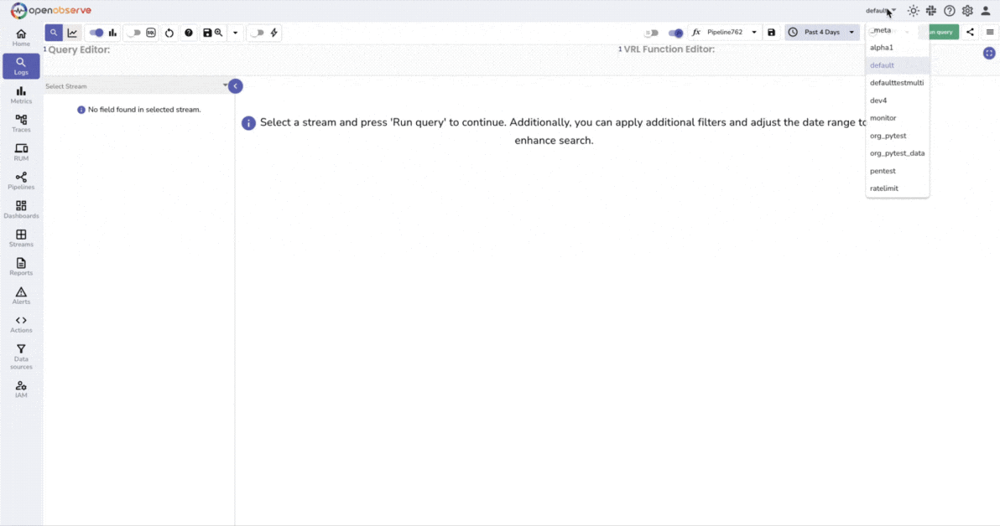

This is the minimum setup required to explore log data for the selected time range. 


## Use the Query Editor
The **Query Editor** allows you to define filters, expressions, and transformations on your log data.

**Toggle Between Query Modes**: Use the **SQL mode** toggle to switch between two editor modes: 
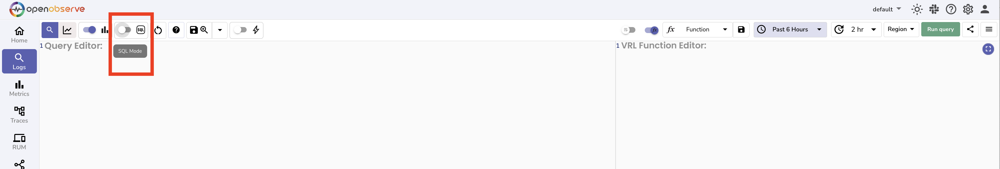

- **Non-SQL mode**: When the toggle is off. Use this mode to apply filters, functions such as `match_all`, or other field-based conditions without writing full SQL. Learn more about [SQL references](https://openobserve.ai/docs/sql_reference/). 
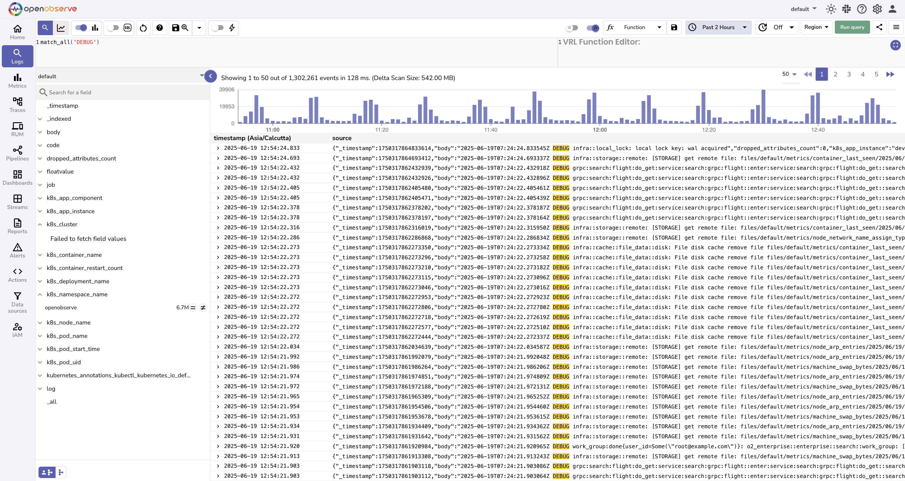

- **SQL mode**: When the toggle is on. It enables full SQL syntax. You can write complete SQL queries to control the selection, filtering, and ordering of log records.

    For example,

    ```sql
    SELECT * FROM "default" where k8s_namespace_name = 'openobserve'
    ```

    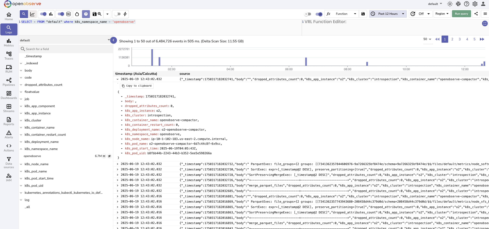

Toggling between these modes updates the behavior and syntax of the query editor.


## Set Time Range
Click the time range selector to define a time window for your query:

1. Choose a relative range such as **Past 1 hour** or **Past 7 days**. Or select an absolute range using the calendar. 
2. Click **Apply**. 

**Relative:** <br>
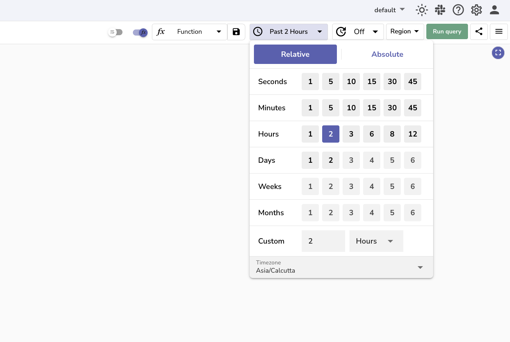
**Absolute:**<br>
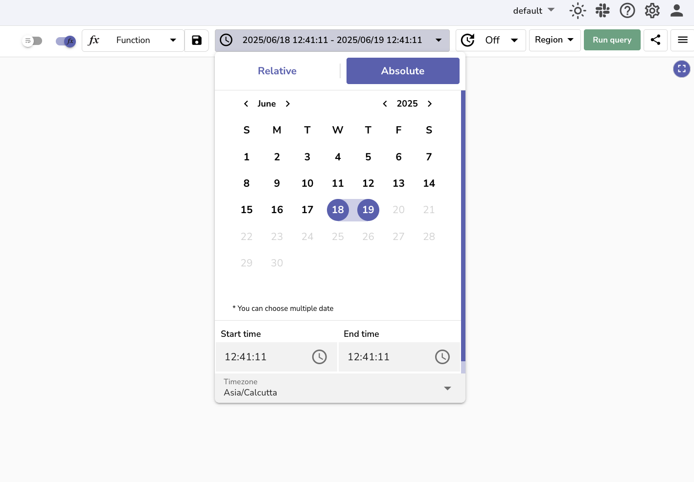
This setting limits the query to logs that fall within the selected time range, which helps reduce the amount of data scanned and improves query speed.

## View and Explore Logs
After the query runs successfully, the results table shows all log entries that match the selected stream, time range, and query conditions.
Click a row to expand the full log record. 
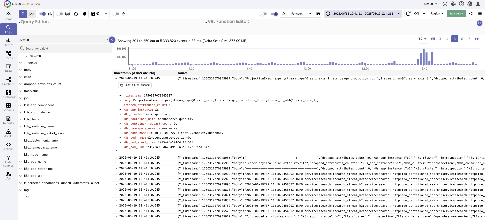

## Use the Histogram and Chart
- The histogram displays log event distribution over time. Use the **Histogram** toggle to hide it when not needed.
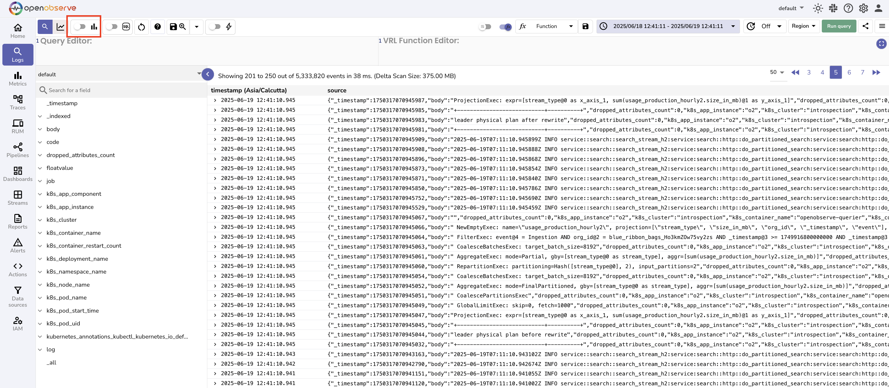
- The **Visualize** toggle enables or disables the chart panel, which allows you to plot logs using the available chart options for visual analysis.
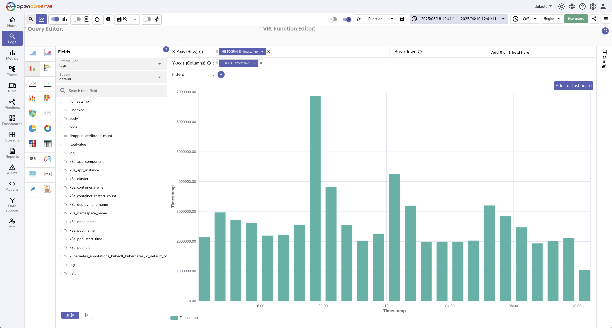

These tools help you quickly identify trends or activity spikes within the selected time range.


## Transform Logs with VRL
Click the **VRL Function Editor** toggle to write and apply a VRL function to the query output.

1. Go to the VRL Function Editor. 
2. Select a saved function or write one manually. Learn more about [VRL functions](https://openobserve.ai/docs/user-guide/functions/). 
3. Run the query to apply the transformation. 
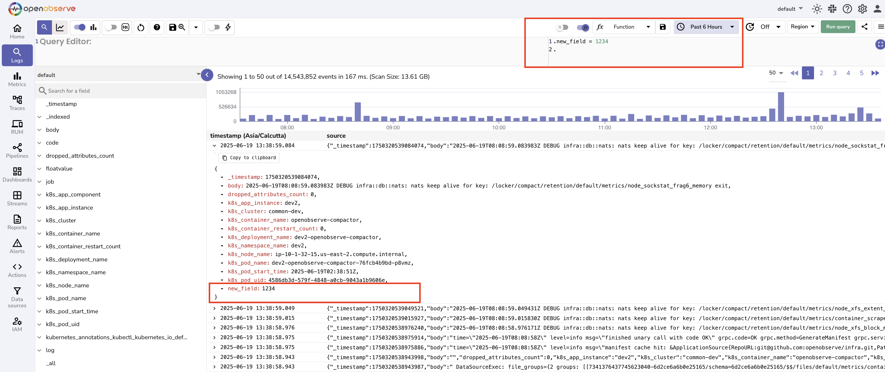

## Adjust Display Options

- **Wrap Table Content**: Toggle to enable word wrapping in the results table.
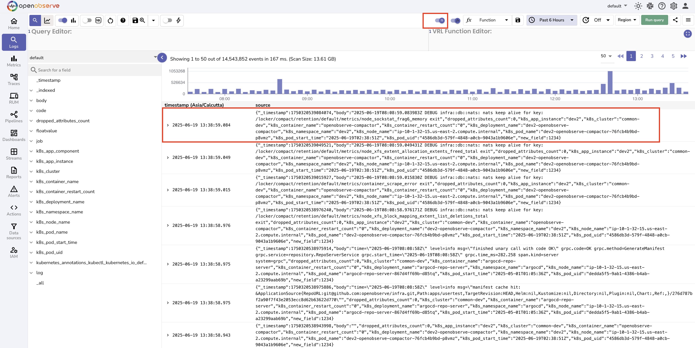
- **Auto Refresh**: Set a refresh interval to update query results continuously. 
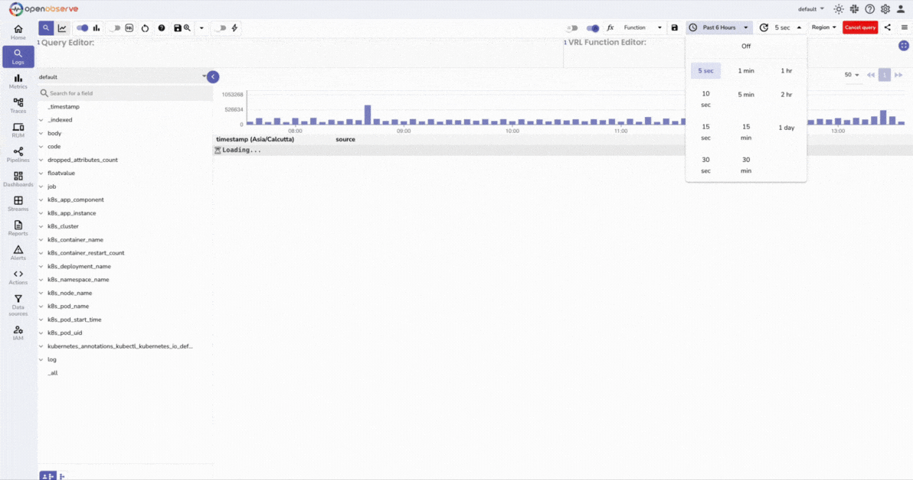
These options help customize the view for your analysis needs.


## Save and Reuse Views
To save a query and its configuration:

1. Click the **Save View** icon.
2. Enter a name in the dialog box.
3. Click **Save**.
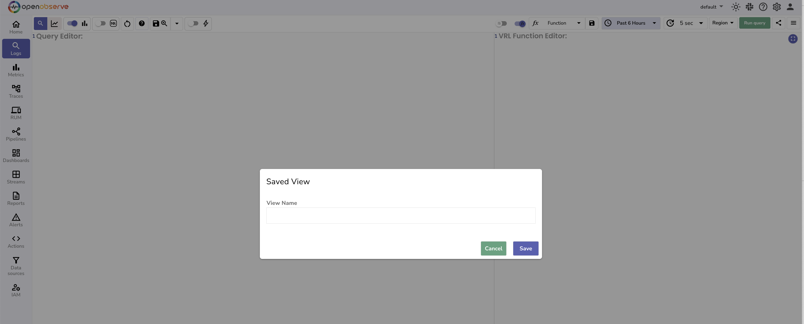

Use the dropdown next to the **Save** icon to reopen saved views at any time.

## Export and Schedule Searches

Click the more options menu or the three-bar icon to access:

1. **Search History**: View your recently executed queries. 
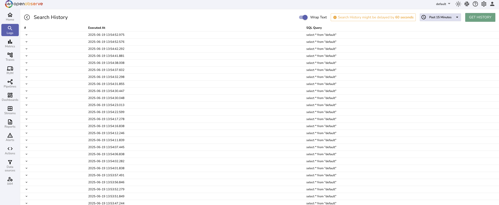

2. **Download results**: Export results for the current query in csv format. 
3. **Download results for custom range**: Export logs for a different time range. 
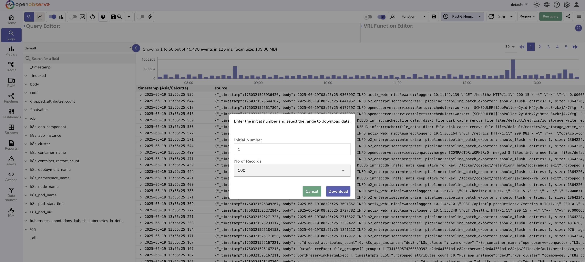

4. **Create Scheduled Search**: Set up recurring queries. 
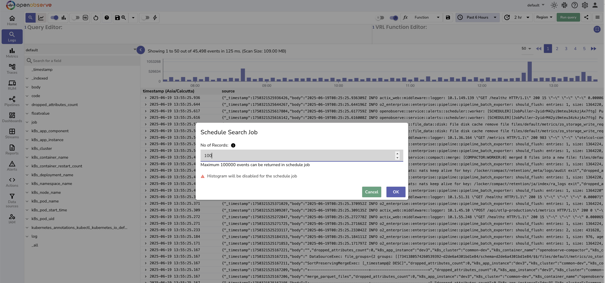

5. **List Scheduled Search**: View and manage scheduled searches. 
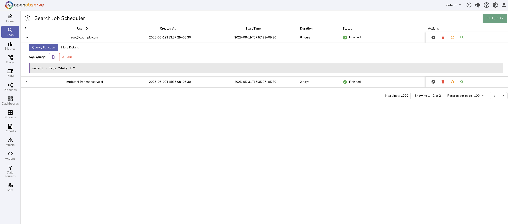

## Next Steps

- To learn how to visualize logs, refer to the [Dashboards](../dashboards/index.md) documentation. 
- To learn how to monitor logs continuously, refer to the [Alerts](../alerts/index.md) documentation. 

