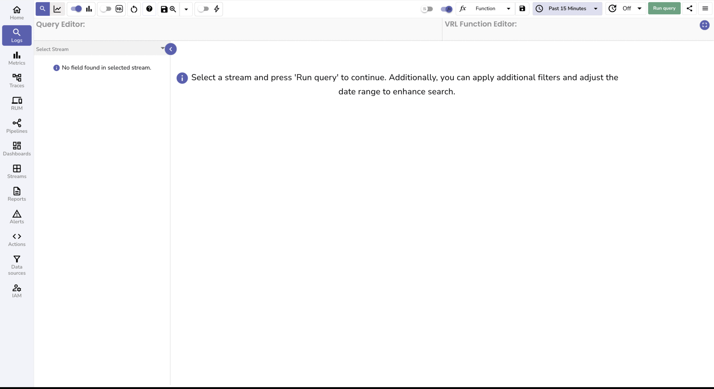
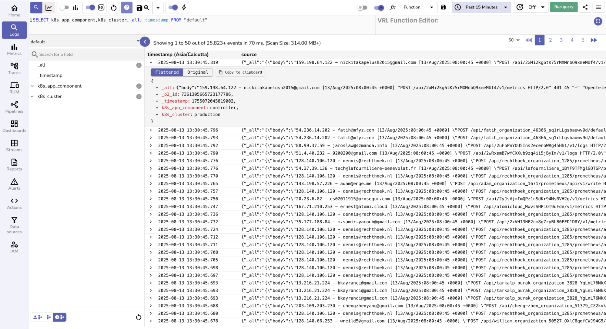
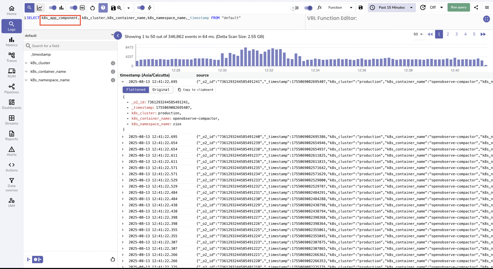

This guide explains how to use Quick Mode with Interesting Fields in OpenObserve to optimize log searches and improve query performance.

## Overview
Quick Mode is a performance optimization in OpenObserve that speeds up log searches by limiting the query to a small set of fields called Interesting Fields. Instead of scanning all fields in a stream, Quick Mode selects only the fields you mark as interesting, reducing query time, especially in streams with a large number of fields.

## Enable Quick Mode and select Interesting Fields

1. Go to the **Logs** page.
2. Select the desired stream from the left panel.
3. In the top toolbar, turn on **Quick Mode**.
4. The **Interesting Fields** button appears at the bottom left along with the **All Fields** button. If the selected stream has **User Defined Schema (UDS)** fields, the UDS button also appears. By default, `_timestamp` is included in the **Interesting Fields** list.
5. Use the **All Fields** or UDS fields toggles to navigate to the field you want to add to the **Interesting Fields** list.
6. Click the **i** icon beside a field name to mark it as an **Interesting Field**. The icon fills to indicate the field is now in the **Interesting Fields** list. 
7. Click **Run Query** to view logs for all current Interesting Fields.
8. Optional. Turn on **SQL mode** to view and edit the prebuilt query that lists only your **Interesting Field**s. If you add a new field to the SQL query while **Quick Mode** is on, that field is automatically added to the **Interesting Fields** list.

## How Quick Mode and Interesting Fields work together
- **Quick Mode** uses the **Interesting Fields** list to limit the query to those columns only.
- Changing the **Interesting Fields** list changes which columns are returned in Quick Mode.
- If you turn Quick Mode off, results follow schema rules: with UDS on you see only UDS fields and with UDS off you see all fields.
- When UDS fields are defined, adding `_all` as an Interesting Field returns a combined text field containing values from all non-UDS fields, which you can parse as needed.

## Environment variables controlling Quick Mode defaults
- `ZO_QUICK_MODE_ENABLED=true`: Enables **Quick Mode** by default.
- `ZO_FEATURE_QUICK_MODE_FIELDS="kubernetes_namespace_name,kubernetes_container_name"`: Sets the default **Interesting Fields** list.

## Auto-add behavior in Quick Mode
When **Quick Mode** is enabled, running a query that references a field which is not already marked as an **Interesting Field** causes that field to be added to the **Interesting Fields** list automatically.

## When to Use Quick Mode
- When working with streams that have hundreds or thousands of fields.
- When you need to quickly search for patterns or values in a small subset of fields.
- When troubleshooting or validating logs using specific key fields.

## Best practices
Keep the number of **Interesting Fields** small to maximize performance gains, because scanning fewer fields reduces query execution time.

## Troubleshooting
**Issue**: Some fields are missing when **Quick Mode** is turned on.  
**Cause**: If you notice that some fields are missing when **Quick Mode** is enabled, this is expected behavior. **Quick Mode** limits results to the fields marked as **Interesting Fields**. 
**Solution**: To view all available fields, click the **All Fields** button at the bottom-right corner.

- By default, only `_timestamp` is included in the **Interesting Fields** list.
- Any other fields must be added manually by marking them as **Interesting Fields**.
- You can also turn on SQL mode to edit the query. Adding a field to the SQL query while **Quick Mode** is on automatically adds that field to the **Interesting Fields** list.

