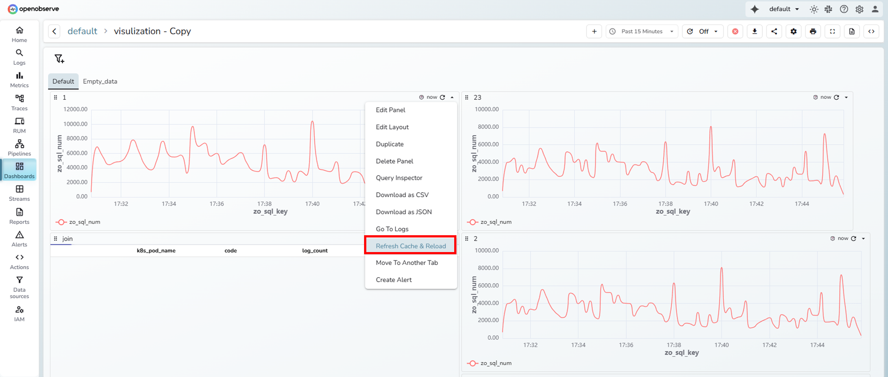

# Refresh Cache and Run Query

## Overview

The Refresh Cache and Run Query option allows users to manually clear existing cached results for a query and execute it again using the most recent data. This feature ensures query accuracy in scenarios where cached results may be outdated due to delayed ingestion or cache corruption.

---

## Why this feature exists

When OpenObserve executes a query, it caches the results on disk to speed up future query execution. Any repeated execution of the same query for the same time range retrieves data directly from this cache. However, in some cases the cached data may not reflect the latest state of the system. Common scenarios include:

* Delayed ingestion: New logs arrive after the cache has already been created, so the cached result misses this late data.
* Cache corruption or invalid cache: System or storage issues may cause incomplete or corrupted cache entries.

In such cases, users can use Refresh Cache and Run Query to invalidate the old cache and rebuild it with updated results.

---

!!! note "Where to find it"
    It is available in both **Logs** and **Dashboards**.

    **Logs page**:
    

    1. Navigate to **Logs** in the left navigation panel.
    2. Select the required stream.
    3. Define your query in the query editor.
    4. Select your time range.
    5. Click the dropdown attached to the **Run query** button. 
    6. Select **Refresh Cache and Run Query**.

    This clears the cache for the selected query range and reloads results using the latest ingested data.

    **Dashboard panels**:
    
    
    1. Navigate to **Dashboards** from the left navigation panel.
    2. Open the folder containing your dashboard.
    3. Select the desired dashboard.
    4. Locate the panel for which you want to refresh the cache.
    5. Open the panel configuration dropdown and select **Refresh Cache and Reload**.

    This removes any cached data for the query in that panel and re-executes the underlying query to fetch updated results.

---

!!! note "Who should use this feature"

    The feature is primarily designed for system administrators or advanced users who are aware of delayed ingestion or caching anomalies within their clusters or regions. They can use this control to refresh cached data for affected time windows.

    Regular users typically do not need to use this option unless instructed by an administrator.

---

## How it works

When you select Refresh Cache and Run Query, the following operations occur:

1. OpenObserve identifies the cache entry corresponding to the specific query, start time, and end time.
2. The system deletes this cache entry from disk.
3. The query runs again against the source data, bypassing the cache.
4. The query results are written back to the cache with the updated values.

This process ensures that the next time the same query is executed for the same time range, the result will come from the refreshed cache.

---

## Example scenario

Assume you run a query for the last three hours and find that the result count at 9:00 a.m. is 3,173. The result is now cached. Even if you rerun the same query multiple times, it continues to return 3,173 from the cache.

Later, additional data for that time period arrives due to ingestion delay, and the actual count should now be 3,373. Since the system continues to read from cache, you will still see 3,173 until you refresh it.

When you select Refresh Cache and Run Query:

- The existing cache for that query and time range (with 3,173) is deleted.
- The query runs again directly from the raw data.
- The new result 3,373 replaces the old cache entry.

You now see the updated result, and future runs use this refreshed cache.

---