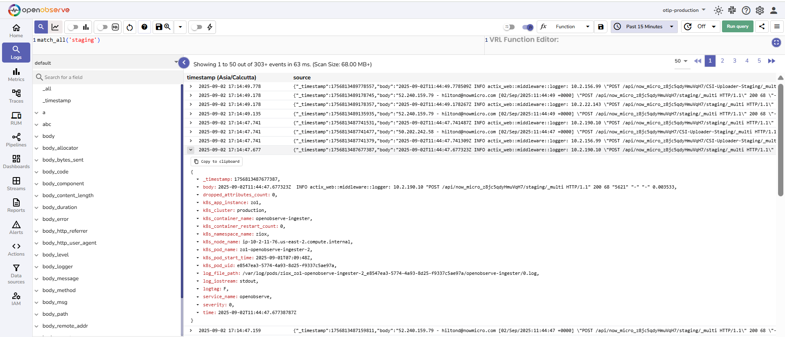
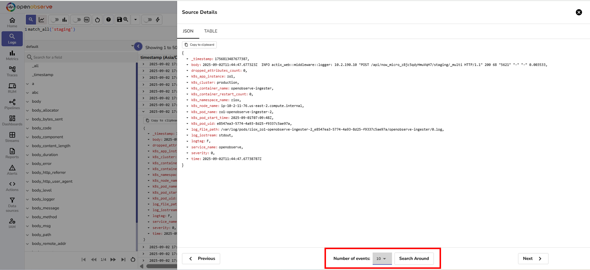
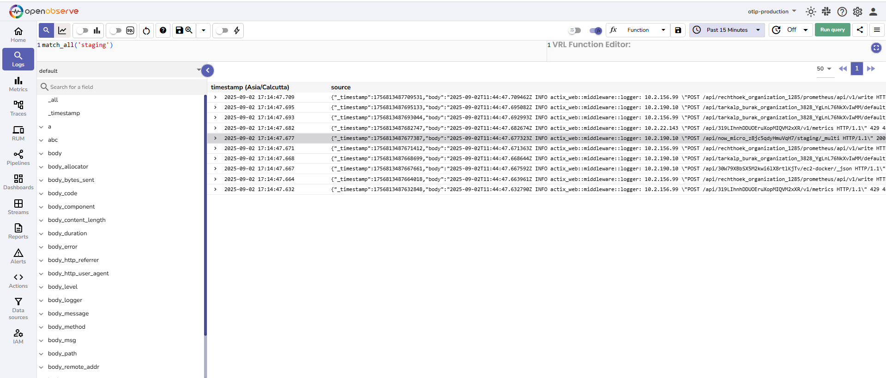
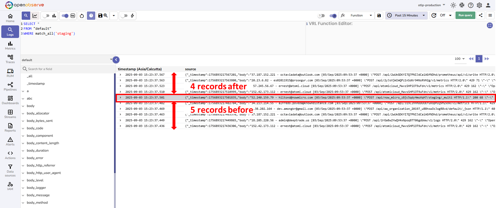

# Search Around in Logs

This page explains how to use the Search Around feature to view surrounding logs for a selected record.

## Overview
Search Around helps you view log entries immediately before and after a selected record. This feature gives additional context for debugging and troubleshooting by showing surrounding logs.

!!! "Who can use it"
    The feature is available to all users with access to the **Logs** page.

## How it works
1. You first locate the target record, often by applying filters to narrow results.
2. When you open Search Around, the system fetches records stored immediately before and after that log entry.
3. The retrieved records ignore the filters added to the query, so you see the raw surrounding logs.
This behavior helps reveal events leading up to and following the issue.

## How to use
1. Go to **Logs** and run a query to locate the record you want. 

2. Click the record to open the **Source Details** screen.

3. The **Search Around** option is available at the bottom of this screen.
4. Choose how many events you want to see before and after the record.
5. Click **Search Around**.

Review the surrounding events to understand what happened just before and after the selected record.
Note that the search around shows results without the original filters added in the query. 
