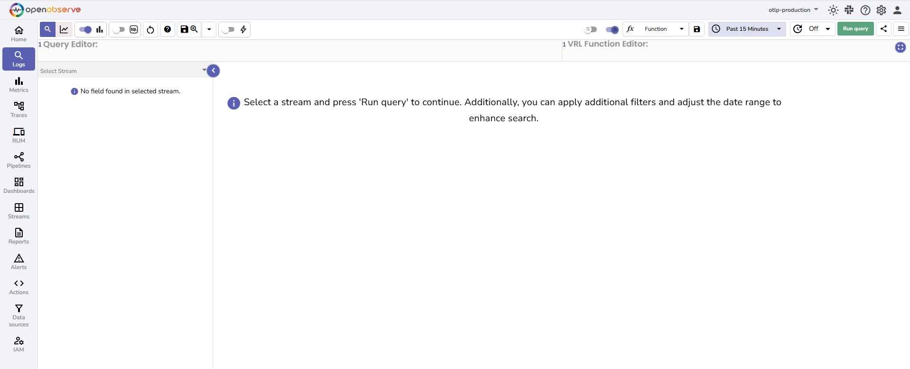

# Search Around in Logs

This page explains how to use the Search Around feature for a selected log record.

## Overview
The Search Around feature fetches stored log entries that are immediately before and after a selected record. The results are based only on the timestamp of the selected record and do not include any filters from the original search query. This behavior gives you additional context for debugging and troubleshooting. 

!!! note "Who can use it"
    The feature is available to all users with access to the **Logs** page.

---

## How to use
1. Navigate to the **Logs** page in your OpenObserve instance.

2. Choose the log stream that you want to query.

3. In the query editor, write an SQL query to fetch the desired logs. You can add filters to the query to narrow down the logs. For example,
```sql
SELECT * 
FROM "default"
WHERE match_all('staging')
```

This query retrieves logs where any text field contains the keyword `staging`.  
4. Select the time range for the query.

5. Click **Run Query** to view the queried records.

6. From the results, click the target record to open the **Source Details** view. 

7. Locate the **Search Around** option available at the bottom of this screen.

8. Choose how many records you want to retrieve in total, including the selected record. For example, when you select 10, the result set contains 10 records in total, including the selected record. The split is 5 records before the selected record and 4 records after.
9. Click **Search Around**.

The search around results are shown without applying the filters from your original query. For example, in the image below, the following log record from the search around result does not contain the keyword staging, even though the original query used `match_all('staging')`. 


