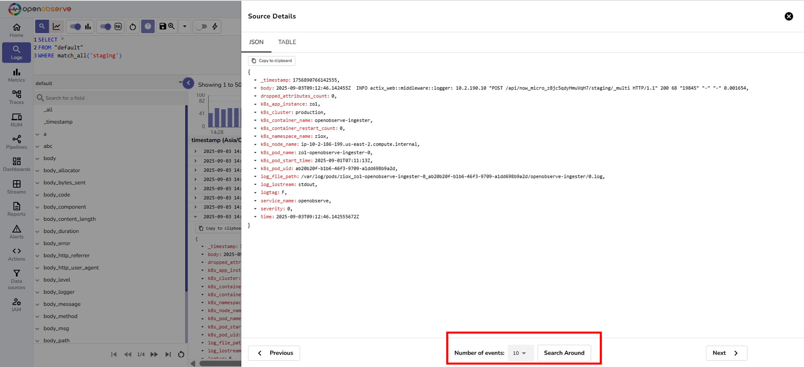

# Search Around in Logs

This page explains how to use the Search Around feature to view surrounding logs for a selected record.

## Overview
Search Around helps you view log entries immediately before and after a selected record. This feature gives additional context for debugging and troubleshooting by showing surrounding logs.

!!! note "Who can use it"
    The feature is available to all users with access to the **Logs** page.

---

## How to use
1. Navigate to the **Logs** page in your OpenObserve instance.

2. Choose the log stream that you want to query.

3. In the query editor, write an SQL query. For example, 
```sql
SELECT * 
FROM logs 
WHERE field_name = 'value'
```
This query retrieves logs where the specified field matches the given value.
You can also use text search functions such as: `match_all('staging')`. This query retrieves logs where any text field contains the keyword `staging`.  
4. Select the time range for the query.
5. Click **Run Query** to display matching records.

6. From the results, click the target record to open the **Source Details** view. This view shows the complete log entry and all its fields. 

7. Locate the **Search Around** option available at the bottom of this screen.
8. Choose how many events you want to see before and after the record.
9. Click **Search Around**.

Review the surrounding events to understand what happened just before and after the selected record.
Note that the search around shows results without the original filters added in the query. 


!!! note "Note"
    The Search Around feature retrieves surrounding records directly from the database, based only on the timestamp of the selected record. It does not reapply the filters that you used in your original query. This behavior ensures that you see the actual sequence of logs around the record. 