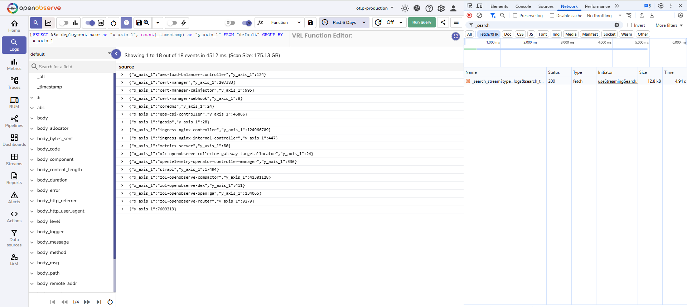
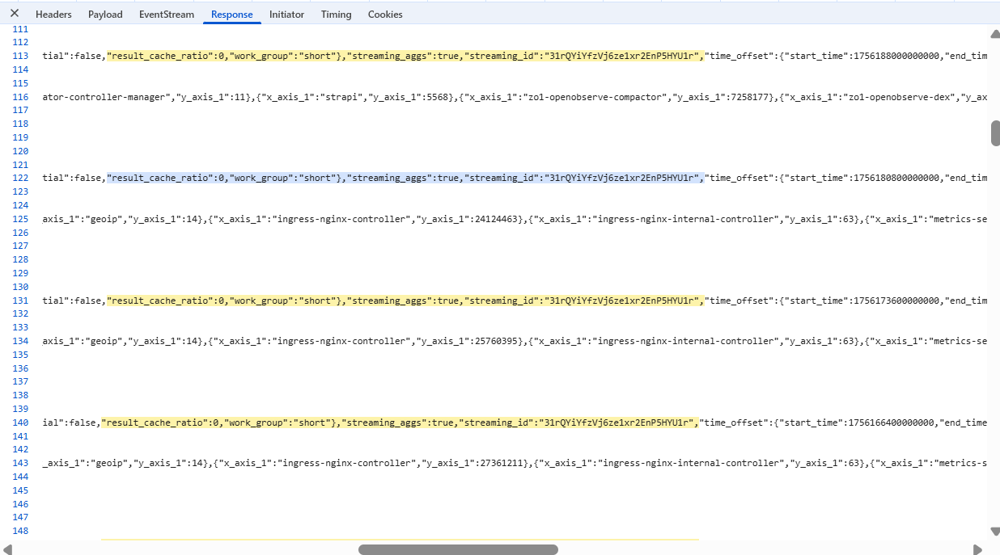
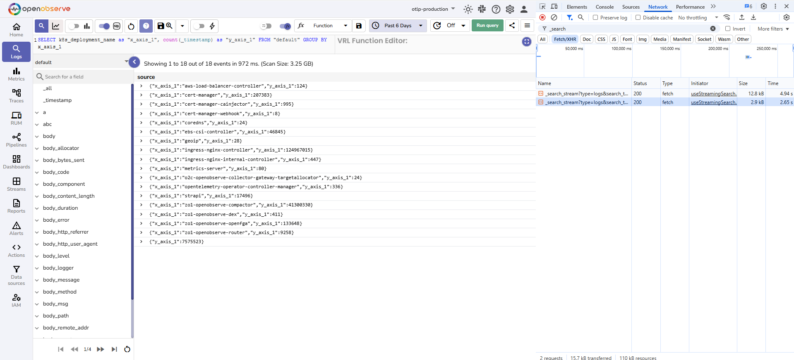
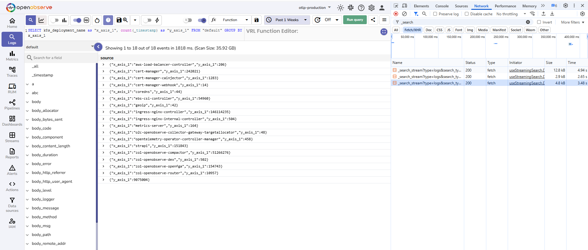
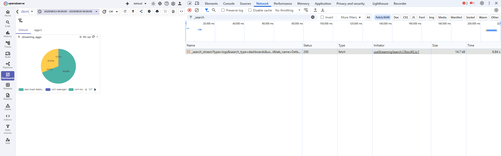
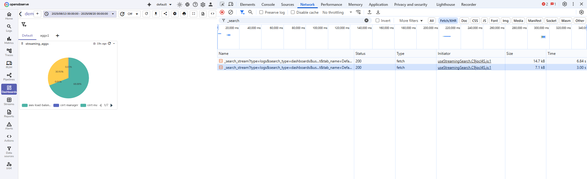
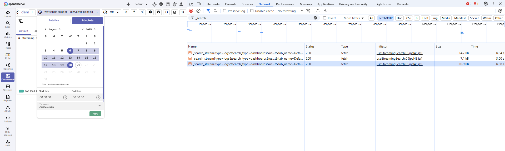
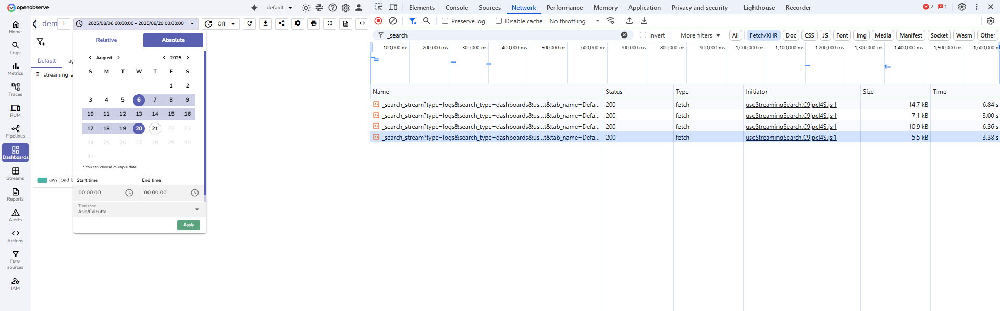

This page explains what Streaming Aggregation is and shows how to use it to improve query performance with aggregation cache in OpenObserve.

> This is an enterprise feature. 

=== "Overview"

    ### What is streaming aggregation?

    Streaming aggregation in OpenObserve enables **aggregation cache**. When atreaming aggregation is enabled, OpenObserve begins caching the factors required to compute aggregates for each time partition during query execution. These cached values can then be reused for later queries that cover the same or overlapping time ranges.

    ??? "Why aggregation cache matters"

        Aggregation queries often scan large volumes of historical data. Without caching, every query recomputes all partitions of the requested time range, even if the results were already computed before. 
        Aggregation cache works by:


        - Caching the factors required to compute aggregates, such as sums and counts, rather than the final aggregate values.
        - Reusing these stored values when a later query requests the same partitions.
        - Computing only the missing partitions and combining them with cached results.

        This approach reduces repeated computation and lowers dashboard latency while preserving accuracy.

    ??? "Relationship between streaming aggregation and aggregation cache"

        - **Streaming aggregation** is the feature toggle in Enterprise settings.
        - **Aggregation cache** is the mechanism that becomes active when streaming aggregation is enabled.

    !!! Note "Who can use it"
        All Enterprise users. 

    !!! Note "Where to find it"
        To enable aggregation cache: 

        1. Go to **Management > General Settings**.  
        2. Turn on the **Enable Streaming Aggregation** toggle.
        3. Select **Save**.

    !!! Note "Environment variables"

        | Environment Variable                             | Description                                                                                                                                | Default Value                     |
        | ------------------------------------------------ | ------------------------------------------------------------------------------------------------------------------------------------------ | --------------------------------- |
        | `ZO_FEATURE_QUERY_STREAMING_AGGS`                | Enables or disables streaming aggregation. When set to `true`, aggregation queries use the aggregation cache.                              | `true`                           |
        | `ZO_DATAFUSION_STREAMING_AGGS_CACHE_MAX_ENTRIES` | Defines the maximum number of cache entries stored in memory for streaming aggregations. Controls how many partition results are retained. | `10000`                           |
        | `ZO_DISK_RECORD_BATCH_CACHE_MAX_SIZE`            | Sets the maximum size for record batch cache on disk. By default, it is 10 percent of the local volume space, capped at 20 GB.             | 10 percent of volume, up to 20 GB |
        | `ZO_DISK_AGGREGATION_CACHE_ENABLED`              | Enables or disables disk-based aggregation cache. When set to `true`, cached aggregation results are persisted to disk for reuse.          | `true`                            |
        | `ZO_DISK_CACHE_DELAY_WINDOW_MINS`                | Defines the delay window in minutes before writing cached results to disk. Helps avoid frequent disk writes for fast-changing queries.     | `10` minutes                      |

    ---

    ## How it work

    ### First run: partitioning and caching aggregate factors
    When an aggregation query runs for the first time, OpenObserve divides the requested time range into fixed-size partitions. Each partition is processed separately. Instead of storing the final aggregates, OpenObserve caches the factors required to compute the aggregate. For example, it caches sums and counts, which can later be combined to produce averages.

    These results are cached in memory for quick access and also persisted on disk. This creates the initial **Aggregation cache** for the query stream.

    ### Later runs: reuse of cached partitions

    When another query runs with the same stream, filters, and grouping, OpenObserve checks the cache. If the requested time range overlaps with existing partitions, it reuses the cached results and computes only the missing partitions. Results remain accurate because cached sums, counts, and other stored values can be combined with new results to compute the final aggregates.

    !!! Note "How does it handle late-arriving data?"

        To account for late-arriving data, OpenObserve applies a delay window before writing results into the cache. This ensures that partitions include the latest available data and reduces the risk of missing delayed events.
        The delay window is configured through the environment variable, `ZO_STREAMING_AGGREGATION_DELAY_SECONDS`. The default value is 60 seconds. You can adjust this value depending on how much late-arriving data you expect.

    ---

    ## Query Behavior
    When aggregation cache is enabled, OpenObserve writes intermediate results into disk as Arrow IPC files. These files store values that can be safely combined later instead of full raw logs.
    Example query
    ```sql
    SELECT avg(response_time), sum(bytes), count(*)
    FROM access_logs
    WHERE status = 200
    ```

    ### First run
    Suppose the query time range covers two partitions, A and B. The system scans both partitions fully. It caches sums and counts for each partition.

    | Partition | SUM(bytes) | COUNT(*) | SUM(response_time) | AVG(response_time) |
    | --------- | ---------- | --------- | ------------------- | ------------------- |
    | A         | 3000       | 30        | 1500                | 50                  |
    | B         | 5000       | 50        | 2500                | 50                  |

    ### Later runs

    - When you run the same query again for the same or overlapping range, the system fetches results from cached partitions.
    - If there is a new partition C, only C is scanned. Cached results for A and B are reused.
    - Results are then merged safely.

    | Partition | SUM(bytes) | COUNT(*) | SUM(response_time) |
    | --------- | ---------- | --------- | ------------------- |
    | A         | 3000       | 30        | 1500                |
    | B         | 5000       | 50        | 2500                |
    | C         | 4000       | 40        | 1600                |
    | **Final** | **12000**      | **120**       | **5600**                |

    ### How averages are calculated

    - **SUM(bytes)** is computed as `3000 + 5000 + 4000 = 12000`.
    - **COUNT(*)** is computed as `30 + 50 + 40 = 120`.
    - **AVG(response_time)** is computed from merged sums and counts: `5600 ÷ 120 = 46.67`.

    ---
    ## Cached file names 
    Cached file names reflect the start and end timestamps of the partition. For example:
    ```
    /data/openobserve/cache/aggregations/default/logs/oly/
        13018130667245808899_30/
            1756116000000000_1756117800000000.arrow
    ```
    ---

    ## Guarantee of accuracy
    Because the cache stores mergeable components such as sums and counts, the results remain mathematically correct after combining cached and new partitions. This ensures that averages, sums, and counts always produce the same output as if the full query had been executed over raw logs.

    ---

    ## Cacheability of Queries
    Not all queries can benefit from aggregation cache. For a query to be cacheable, OpenObserve must be able to store and safely merge intermediate results across partitions.

    ### Supported aggregate functions
    The following aggregates are directly supported for caching:

    - `min`
    - `max`
    - `sum`
    - `count`
    - `avg`
    - `median`
    - `array_agg`
    - `percentile_cont`
    - `summary_percentile`
    - `first_value`
    - `last_value`
    - `[approx_distinct](https://datafusion.apache.org/user-guide/sql/aggregate_functions.html#approx-distinct)`
    - `[approx_median](https://datafusion.apache.org/user-guide/sql/aggregate_functions.html#approx-median)`
    - `[approx_percentile_cont](https://datafusion.apache.org/user-guide/sql/aggregate_functions.html#approx-percentile-cont)`
    - `[approx_percentile_cont_with_weight](https://datafusion.apache.org/user-guide/sql/aggregate_functions.html#approx-percentile-cont-with-weight)`
    - `[approx_topk](https://openobserve.ai/docs/sql-functions/approximate-aggregate/approx-topk/)`
    - `[approx_topk_distinct](http://openobserve.ai/docs/sql-functions/approximate-aggregate/approx-topk-distinct/)`

=== "How to use"

    ## How to use streaming aggregation
    **Example query**
    ```sql
    SELECT 
        k8s_deployment_name as "x_axis_1", 
        count(_timestamp) as "y_axis_1"  
    FROM "default"  
    GROUP BY x_axis_1
    ```
    
    You can apply the aggregation query in any place where queries are executed, such as Logs or Dashboards. To measure load time, check cacheability, and verify cache usage, use your browser’s developer tools. Right-click the browser, select Inspect, open the Network tab, and filter by Fetch/XHR.

    The following example is performed with Streaming Search enabled. Aggregation cache works the same when Streaming Search is disabled.

    **Step 1: Run the aggregation query** <br>

    1. Go to the **Logs** page. 
    2. In the SQL query editor, enter the aggregation query.
    4. Select a time range, for example Past 6 days.
    5. Select **Run Query**.
    The results show event counts per deployment. 

    

    **Step 2: Check if the query is eligible for caching** <br> 
    After the first run, if `streaming_aggs` is true and `streaming_id` has a value, the query is eligible for caching. You can check these fields in the query response by using your browser developer tools. Open **Network**, select the `_search_partition` entry, and view the **Response** tab to confirm the values.

    

    **Step 3: Run the query again with overlapping time** <br>

    Select a time window that overlaps with the earlier run, for example Past 6 days or Past 1 week, and run the query again. Cached partitions are reused and only new partitions are computed, which reduces execution time.

    Second run shows the result for the Past 6 days. 
     
    Third run shows the result for the Past 1 week. 
    

    **Step 4: Confirm cache reuse on later runs**

    Use your browser developer tools. <br>

    1. In the Network tab of your developer tool, select one of the later runs. 
    2. Open **Response**.
    3. Capture the following details:  

    - `streaming_aggs` must be true
    - `streaming_id` must have a value
    - `streaming_output` must be true
    - `result_cache_ratio` per partition:

        - `100` means the partition came from aggregation cache.
        - `0` means the partition was computed on this run.

    **Notes:**

    - The first successful run does not reuse aggregation cache because nothing has been stored yet.
    - Ratios other than 0 or 100 indicate general result caching, not aggregation cache.

    ---

## Performance benefits
Streaming aggregation is enabled in all the following test runs:

**Test run 1**:

- Time range: `2025-08-13 00:00:00 - 2025-08-20 00:00:00`
- Time taken to load the dashboard: `6.84 s`
- `result_cache_ratio` is `0` in all partitions


**Test run 2**:

- Time range: `2025-08-13 00:00:00 - 2025-08-20 00:00:00` 
- Time taken to load the dashboard: `3.00 s`
- `result_cache_ratio` is `100` in all partitions


**Test run 3**:

- Time range: `2025-08-6 00:00:00 - 2025-08-20 00:00:00`
- Time taken to load the dashboard: `6.36 s`
- `result_cache_ratio` is `100` for partitions that cover the time range `2025-08-13 00:00:00 → 2025-08-20 00:00:00` and `result_cache_ratio` is `0` for the rest of the partitions 


**Test run 4**: 

- Time range: `2025-08-6 00:00:00 - 2025-08-20 00:00:00` 
- Time taken to load the dashboard: `3.38 s`
- `result_cache_ratio` is `100` for all partitions 


---

## Limitations

- Very complex queries may not be eligible for cache reuse yet. Examples include joins, nested subqueries, heavy window functions, and large unions
- The first run pays full computation cost to populate the cache
- Reuse depends on partition availability. Eviction due to capacity limits can reduce reuse.

--- 

## Troubleshooting

1. **Second run is not faster**

    - **Cause**: The query was not cacheable or the first run did not complete. 
    - **Fix**: Align time windows and filters with the first run. Verify `streaming_aggs` and `streaming_id`. After a successful first run, confirm `result_cache_ratio` equals `100` on some partitions.

2. **Different panels do not benefit**

    - **Cause**: Time windows or filters differ. 
    - **Fix**: Use the same windows and the same filters across panels that analyze the same stream.


