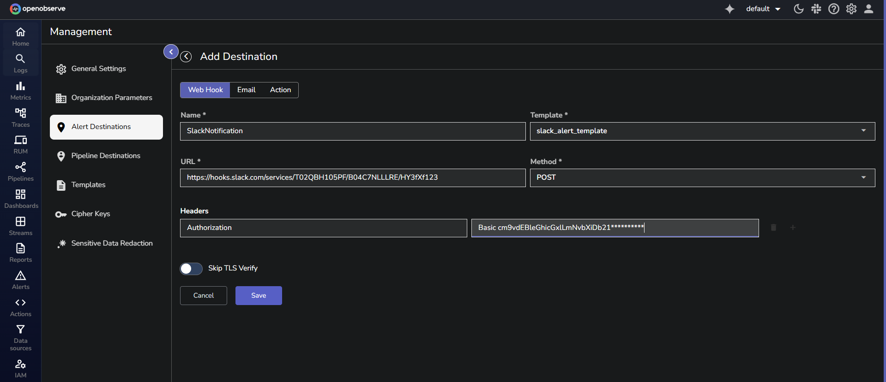
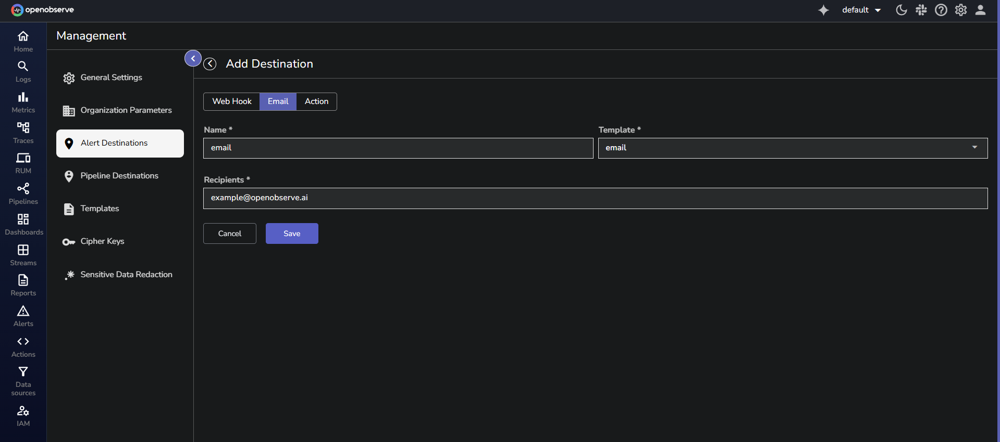
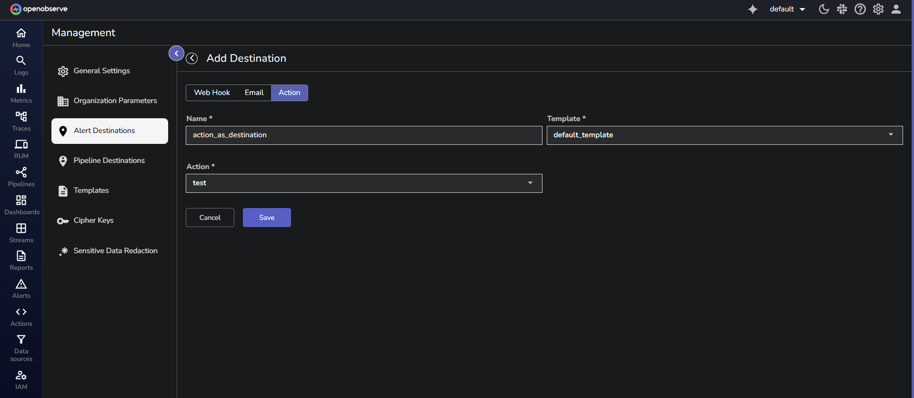

In OpenObserve, **Destinations** define how and where alert notifications are delivered when an alert is triggered. Destinations are reusable. You can assign a destination to one or more alerts to manage notifications efficiently.

## Configure Alert Destinations 

The **Destinations** section provides three configuration options. Select a destination type to view configuration instructions.

=== "Webhook"
    When the alert gets triggered, OpenObserve will send alert data to an external system using an HTTP POST request. Use this option to integrate with services that support webhook ingestion. You can customize the request payload using templates to match the format expected by the target system. 
    
    ???  "View use cases."
        You can use this destination to:

          - Create incident tickets in **Jira Service Management** or **ServiceNow**.
          - Send notifications to **Slack** or **Microsoft Teams channels**.

    **Steps to Configure Webhooks as Alert Destination:** 

    1. Go to **Management > Alert Destinations**. 
    2. In the **Add Destination** page, click **Webhook**.
    3. Fill in the following details:
       
      
        - **Name**: Enter a descriptive name for the Webhook destination. For example, SlackNotifications. Note that characters such as `,`, `:`, `?`, `/`, `#`, and `spaces` are not allowed.
        - **Template**: Choose a predefined alert message template from the dropdown menu.
        - **URL**: Specify the Webhook endpoint URL where notifications will be sent. For example, `https://hooks.slack.com/services/T02QBH105PF/B04C7NLLLRE/HY3fXf123`
        - **Method**: Select the HTTP method (`POST`, `GET`, or `PUT`) depending on the Webhook's requirements.
        - **Headers (Optional)**: Add custom headers in key-value format. For example, authentication tokens or content type. For example, 
            ```
            Key: Authorization  
            Value: Basic cm9vdEBleGFtcGxlLmNvbTpDb21wbGV4GFzcy  
            ```
        - **Skip TLS Verify**: Enable this option if the endpoint uses self-signed certificates or if you want to bypass SSL verification.
    6. Click **Save** to create the Webhook destination.

=== "Email"
    When the alert gets triggered, OpenObserve will send alert notifications to one or more email addresses using SMTP. Use this option when email is the preferred channel for receiving alerts. You must configure the email delivery settings under your OpenObserve SMTP setup. The alert payload can be formatted using a predefined template.
  
    ???  "View use cases."
          You can use this destination to:

          - Notify on-call team members or distribution lists.
          - Route alerts to incident mailboxes used by helpdesk.
    
    **Prerequisites:**
    
    ??? "1. Set up an email account for sending alerts."
        To send email alerts using Gmail SMTP, you must create an App Password. Follow these steps:

        1. Sign in to your Gmail account.
        2. Go to **Google Account Settings** > **Security**.
        3. Under **Signing into Google**, enable **2-Step Verification** (if not already enabled).
        4. After enabling 2-Step Verification, go to the **App Passwords**.
        5. In the **App Passwords** page, enter a name for your app, such as SMTP, and click **Create**.
        6. Copy the generated App Password and store it securely. You will need it during configuration.

        **Test Your Gmail SMTP Configuration** <br>
        Use an online tool such as [Mailmeteor’s SMTP Test Tool](https://mailmeteor.com/smtp-test) to verify your configuration. <br>To test:

        1. Go to Mailmeteor's SMTP Test Tool and select the email provider.
        2. The tool fills in the SMTP server as `smtp.gmail.com` and port `587`.
        3. Enter your Gmail address and the **App Password** you created earlier.
        4. Click **Test Configuration**. 

        If successful, you will receive a test email in your inbox. This confirms your Gmail SMTP configuration is working.
    
    ??? "2. Configure environment variables to enable email alerts through SMTP in OpenObserve."
        Choose your deployment type and configure the environment variables accordingly:
      
        - **For Single Node Deployment**: You need to pass SMTP configuration parameters when starting OpenObserve. Below is the command to configure OpenObserve to send email alerts via Gmail:

        ```yml linenums="1"
        ZO_SMTP_ENABLED=true \
        ZO_SMTP_HOST="smtp.gmail.com" \
        ZO_SMTP_PORT=587 \
        ZO_SMTP_USER_NAME="your-gmail-address@gmail.com" \
        ZO_SMTP_PASSWORD="your-app-password" \
        ZO_SMTP_FROM_EMAIL="your-gmail-address@gmail.com" \
        ZO_SMTP_ENCRYPTION="starttls" \
        ZO_ROOT_USER_EMAIL="root-user-email" \
        ZO_ROOT_USER_PASSWORD="root-user-password" \
        ./openobserve

        ```
        Replace the placeholders with your actual credentials and email addresses.

        - **For High Availability (HA) deployment**: Configure the above environemnt variables in the values.yaml file
        - **For Cloud**: No additional configuration required. 
    
    ??? "3. Set up an alert template."
        This allows you to define the content and layout of the alert message.
        
        1. In OpenObserve, go to **Management > Templates**.
        2. Click **Add Template** to create a new email template. 
        3. In the template creation screen:
          

            - Select **Email** as the template type.
            - Enter a name for the template.
            - Fill in the **Title** and **Body** fields.
          
            Title Example:
            ```
            [Alert: {alert_name}] - Severity: {alert_type}
            ```
            Body Example:
            ```
            {
              "alertname": "{alert_name}",
              "stream": "{stream_name}",
              "organization": "{org_name}",
              "alerttype": "{alert_type}",
              "severity": "critical"
            }
            ```
    ??? "4. Ensure that the recipient is part of the appropriate organization"
        1. From the left-nevigation menu, go to **IAM** (Identity and Access Management) > **Users**.
        2. Click **Add User**.
        3. Enter the user’s email address, role, password, and name.
        4. Click **Save**. 
      After the user is added, they become eligible to receive email alerts.
    
    **Steps to Configure Emails as Alert Destination:** <br> 
    
  
      1. Go to **Management** > **Alert Destinations**. 
      2. In the **Add Destination** page, click **Email**.
      3. Enter a name for the destination.
      4. Select an email template to define the alert content.
      5. Enter the recipient’s email address.
      6. Click **Save**.
      
    This creates the email as alert destination. 

=== "Actions"
      When an alert gets triggered, OpenObserve executes a Real-time Action script. Use this destination type when the alert data needs to be processed or routed using custom logic.Action scripts are stateful. They can retain values across executions, enabling more advanced workflows than webhook or email destinations.

    ???  "View use cases."
          For example, you can use this destination to:
        
          - Send the alert to Slack, and also ingest a structured copy of the alert into a custom stream in your organization
          - Track how often a specific alert has triggered, then write aggregated metrics, such as trigger count per hour, to a stream for trend analysis.
    
    **Prerequisites:**
      
      1. Create the real-time action script as per your requirement. For more details, visit the [Create and Use Real-time Actions](../actions/create-and-use-real-time-actions.md) page.
      2. Create the alert template.

    **Steps to Configure Actions as Alert Destination:** 
    

      1. Go to **Management > Alert Destinations**. 
      2. In the **Add Destination** page, click **Actions**.
      3. Enter the name of the destination.
      4. Select the template. 
      5. Select the real-time action. 
      6. Click **Save**. 
     
