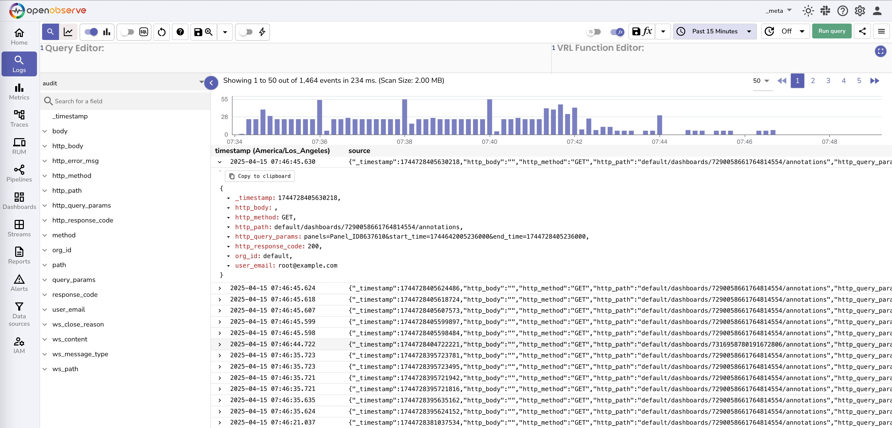

# Audit Trail

> **Note:** This feature is applicable to the Enterprise Edition.

The capture details of all the API calls made and push it to audit stream in `_meta` org.

To enable the Audit trail is available in enterprise edition and can be enabled by setting the environment variable `O2_AUDIT_ENABLED=true` . This will 

All API calls except ingestion are logged that allows for understanding each and every activity within OpenObserve. Since the data is in a regular log stream, you can build dashboard for analytics as well as build alerts if you need them.
