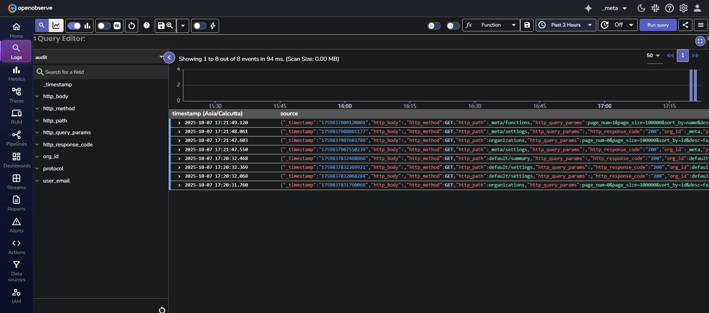

# Audit Trail

!!! info "Availability"
    This feature is available in Enterprise Edition and Cloud. Not available in Open Source.
    
## What is Audit Trail
Audit Trail records user actions across all organizations in OpenObserve. It captures non-ingestion API calls and helps you monitor activity and improve security.

!!! note "Who can access"
    All Enterprise Edition users with access to the `_meta` organization can use Audit Trail.

!!! note "Where to find it"
    Audit events are published into the `audit` stream under the `_meta` organization.

## Configuration
| Environment Variable        | Description                                                      | Default |
| --------------------------- | ---------------------------------------------------------------- | ------- |
| `O2_AUDIT_ENABLED`          | Enables audit logging                                            | `false` |
| `O2_AUDIT_BATCH_SIZE`       | Number of audit records to batch before publishing               | `500`   |
| `O2_AUDIT_PUBLISH_INTERVAL` | Interval in seconds after which unpublished audits are published | `600`   |

## How it works
When audit logging is enabled using the `O2_AUDIT_ENABLED` environment variable, OpenObserve collects details of every non-ingestion API call made by users across all organizations. These events are stored temporarily in memory. Once the number of events reaches the batch size or the publish interval is reached, they are sent to the `audit` stream in the `_meta` organization. From there, you can view, query, or use them in dashboards and alerts.

!!! note "Example"
    The following example shows a captured audit event from the `audit` stream:
  

!!! note "Use cases"
    Because audit events are stored in a log stream, you can:

    - Build dashboards to track user activity
    - Configure alerts to detect unusual trends