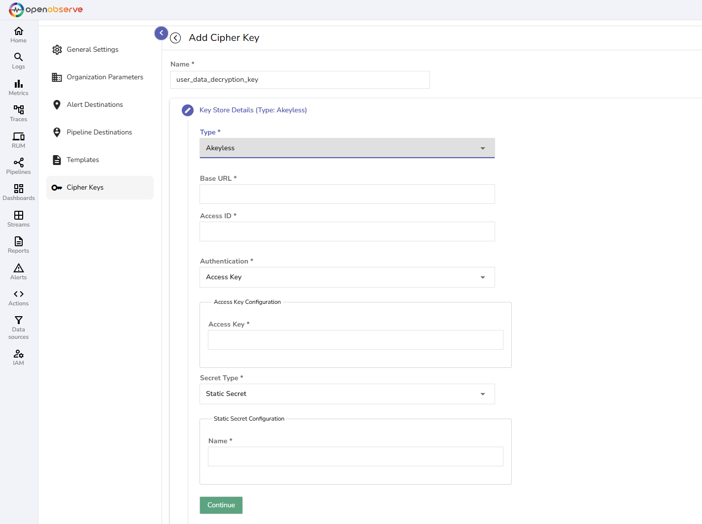
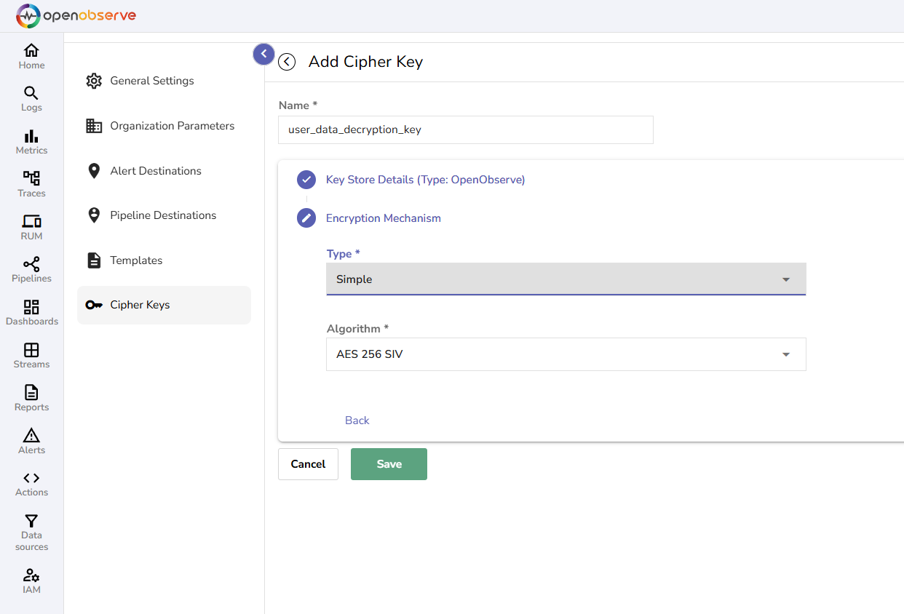

OpenObserve uses Cipher Keys to decrypt encrypted logs during search queries. This feature is essential for handling sensitive data stored in encrypted formats while still enabling effective log search and analysis, without storing decrypted data on disk. 

> **Note:** The Cipher Keys feature is only available in the OpenObserve Enterprise Edition.

## How to Create Cipher Keys

Follow these steps to create and configure Cipher Keys in OpenObserve:

### Step 1: Navigate to the Cipher Keys Section

1. From the top navigation bar, click the gear icon (**Management**).  
2. Select **Cipher Keys**.


### Step 2: Create a New Cipher Key

1. On the Cipher Keys page, click **Add Cipher Key**.  
2. **Enter the required details:**

    - **Name:** The key name must be **unique**. Colons (“:”) are not allowed in the Cipher Key name.   
    - **Key Store Type:** Choose where the encryption key will be stored:

        - **OpenObserve (Local)**: Stores the encryption key directly in OpenObserve’s database. If you select **OpenObserve**, paste your encryption key in the **Secrets** field. [Learn how you can encrypt the key before storing it in the OpenObserve database for additional security](#cipher-key-storage-in-openobserve).
     
        - **Akeyless**: Allow using Akeyless as an external key management system to store keys. If you select Akeyless, enter the Base URL of the Akeyless API, Access ID, Authentication details - Access Key or Lightweight directory access protocol (LDAP), and Secret Types - [Static](https://docs.akeyless.io/docs/static-secrets) or [Distributed Fragments Cryptography (DFC)](https://docs.akeyless.io/docs/zero-knowledge).
      


3. Click **Continue**. 

### Step 3: Select the Encryption Mechanism

Choose an encryption method:

- **Simple**: Choose if encryption is done using Advanced Encryption Standard (AES). From the dropdown, select the algorithm as `AES-256 SIV`.  
- **Tink KeySet**: Choose if the encryption is done using Google Tink.

  
After you have filled in all the details, click **Save**. Your new Cipher Key is now available to use in OpenObserve.

## How to Use Cipher Keys to Decrypt Encrypted Logs

After creating the Cipher Key, write queries using the `decrypt()` function in the following formats to decrypt encrypted logs:

```SELECT decrypt (<field name which is encrypted>, ‘<Name of the Cipher Key>’ ) as <name the decrypted log field> from <stream name>;```

Let’s say you have the following setup:

- You have a stream called `user_activity_stream`.  
- You have an encrypted field named `user_data` that contains sensitive information.  
- You created a Cipher Key called `user_data_decryption_key` to decrypt the logs.  
- You want to name the decrypted field `decrypted_user_data` in the query results.

The query to decrypt and retrieve the logs would look like this:  
```SELECT decrypt(user_data, 'user_data_decryption_key') as decrypted_user_data FROM user_activity_stream;```

Additionally, you can use the `decrypt()` function:

- **With the WHERE clause**: The following query retrieves the `user_id` from the `user_activity_stream` where the decrypted `user_data` matches the string '`John Doe`':  ```Select user_id from user_activity_stream where decrypt(user_data,'user_data_decryption_key') = 'John Doe';``` 
- **With match* functions**: The following query will decrypt the `user_data` field using the `user_data_decryption_key` and match the decrypted value with `'John’:` ```SELECT user_id FROM user_activity_stream WHERE str_match_all(decrypt(user_data, 'user_data_decryption_key'), 'John Doe’);```  
- **With the LIKE clause**: This query will decrypt the `user_data` field using the `user_data_decryption_key` and return results where the decrypted data contains the substring '`John`': ```SELECT user_id FROM user_activity_stream WHERE decrypt(user_data, 'user_data_decryption_key') LIKE '%John%';```

**Note:** 

- The time the data was ingested does not affect decryption.   
- When working in a super cluster, Cipher Keys created in one cluster are visible and usable in other clusters. 

## How to Manage Cipher Keys

 
To update or delete a Cipher Key, click the edit or delete icon under the **Actions** column, respectively.

## Cipher Key Storage in OpenObserve 

When using **OpenObserve** as the encryption key (secret) storage option, you can encrypt the secret before storing it in the OpenObserve database by setting the following environment variables:

- **`ZO_MASTER_ENCRYPTION_ALGORITHM`**: Set it to `aes-256-siv`.   
- **`ZO_MASTER_ENCRYPTION_KEY`**: Set it to the encryption key you want OpenObserve to use to encrypt the secret. This must be a valid `aes-256-siv` key. Tink Key cannot be used here.

**Important Note:** 

- To set up the above environment variables for Cipher Keys in OpenObserve’s database, first delete the existing Cipher Keys to avoid errors.   
- If `ZO_MASTER_ENCRYPTION_KEY` is changed, the existing secret associated with `ZO_MASTER_ENCRYPTION_KEY` is no longer visible and usable. 

## Failure Modes in Cipher Key Management

- **Invalid Key Value During Update:** If you provide invalid values while updating a Cipher Key, the system will display an error message and prevent the update from being saved. The existing Cipher Key value remains unchanged and valid. Ensure that the values you enter are correct.   
- **Duplicate Cipher Key Names:** Ensure that each Cipher Key name is unique.  
- **Invalid Characters in Cipher Key Name:** Ensure that theCipher Key names do not contain colons (":").   
- **Incorrect Encryption Key Type (Simple or Tink):** When storing encryption keys, ensure you use the correct key type (Simple or Tink). If an incompatible key type is used, the system will show an error, and the key remains unsaved.  
- **Invalid Akeyless Credentials:** If you enter invalid Akeyless credentials during Cipher Key creation or update, the system will reject the operation and show an error message. Correct the credentials and try again.    
- **Error in DFC Configuration:**

    - For DFC without an Initialization Vector (IV), the system accepts any IV value except an empty one. An empty IV will trigger an error.  
    - For DFC with an IV, the IV used for encryption must match exactly. A mismatch will result in an error during key creation or update.

## Failure Modes While Using `decrypt()` Function in Log Search 

- **Data is Not Encrypted (Plain Text):** If the data is in plain text and not encrypted, the system will return the data as-is. Ensure that the data is encrypted if you intend to use the `decrypt()` function.  
- **Data Not Encrypted With the Given Encryption Key:** If the data is not encrypted with the key you used to create the Cipher Key, the system will return the encrypted data as-is without decryption. Verify the encryption method and correct usage of the encryption key.  
- **No Permission on the Given Encryption Key:** If you do not have permission to use the encryption key, the system will deny access and display an error message stating that you do not have permission. To resolve this, contact your administrator for access to the encryption key.

## Limitation

- **Cipher Key Usage (March 2025):** Cipher Keys are currently used for decryption, and OpenObserve is working to expand their functionality to support encryption as well.   
- **decrypt() Function Scope (March 2025)**: As of now, the `decrypt()` function is limited to log search. OpenObserve is in the process of extending its capabilities to additional areas for broader application. 

