This page explains how to create and manage **Cipher Keys** in OpenObserve and how to use them to decrypt encrypted log data during search queries. 
The **Cipher Keys** feature is essential for handling sensitive data stored in encrypted formats while still enabling effective log search and analysis, without storing decrypted data on disk. 

!!! info "Availability"
    This feature is available in Enterprise Edition and Cloud. Not available in Open Source.

## Create Cipher Keys

Follow these steps to create and configure **Cipher Keys** in OpenObserve:

??? "Step 1: Navigate to the Cipher Keys section"

    1. From the top navigation bar, click the gear icon to open the **Management** page.  
    2. Select **Cipher Keys**.

    
    

??? "Step 2: Create a New Cipher Key"

    1. On the **Cipher Keys** page, click the **Add Cipher Key** button.  
    2. Enter the required details:

        - **Name:** The key name must be **unique**. Characters such as colon, question mark, slash, hash, and spaces are not allowed.   
        - **Key Store Type:** Choose where the encryption key will be stored:

            - **OpenObserve (Local)**: Stores the encryption key directly in OpenObserve’s database. If you select **OpenObserve**, paste your encryption key in the **Secrets** field. [Learn how you can encrypt the key before storing it in the OpenObserve database for additional security](#cipher-key-storage-in-openobserve). <br>
            

            - **Akeyless**: Allow using Akeyless as an external key management system to store keys. If you select Akeyless, enter the Base URL of the Akeyless API, Access ID, Authentication details - Access Key or Lightweight directory access protocol (LDAP), and Secret Types - [Static](https://docs.akeyless.io/docs/static-secrets) or [Distributed Fragments Cryptography (DFC)](https://docs.akeyless.io/docs/zero-knowledge). <br>
            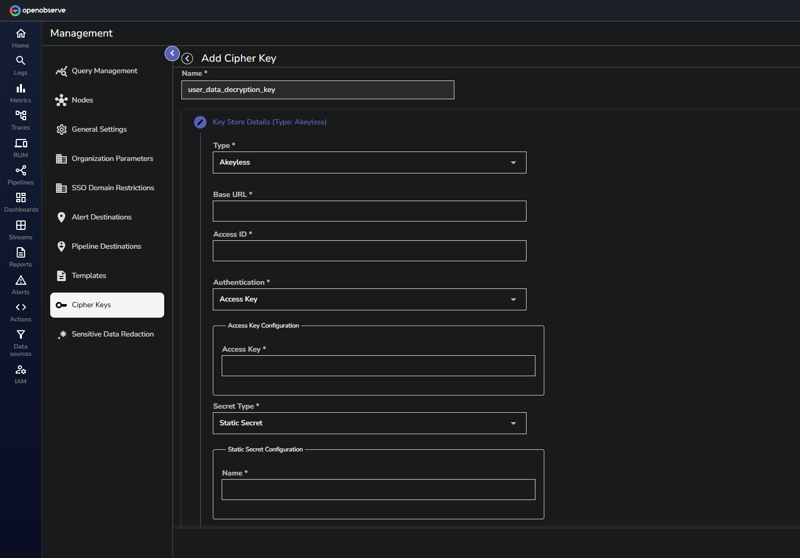 

    3. Click **Continue**. 

??? "Step 3: Select the Encryption Mechanism"

    Choose an encryption method:

    - **Simple**: Choose if encryption is done using Advanced Encryption Standard (AES). From the dropdown, select the algorithm as `AES-256 SIV`.  
    - **Tink KeySet**: Choose if the encryption is done using Google Tink.
    <br>

    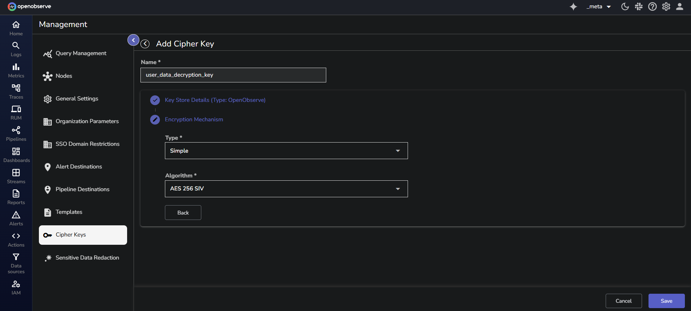

    After you have filled in all the details, click **Save**. Your new **Cipher Key** is now available to use in OpenObserve.
    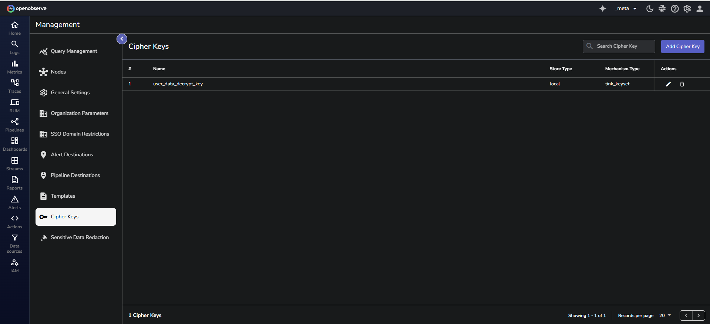

---

## Query Encrypted Logs with `decrypt` and `decrypt_path`

To retrieve original values from encrypted logs, use the `decrypt()` and `decrypt_path()` functions. These functions operate at query time and do not write decrypted data to disk.
??? "Use the `decrypt` function"
    ### Use the `decrypt` function
    The `decrypt()` function performs brute-force decryption. It attempts to decrypt any sub-string in the input that appears to be **base64-encoded**. If the decryption is successful, the sub-string is replaced with the decrypted output. If not, the sub-string is retained unchanged.

    !!! warning
        The `decrypt()` function can be slower on larger input fields due to its brute-force behavior. For inputs smaller than 500 characters, performance degradation is typically around 10 percent. However, for inputs exceeding 10,000 characters, the slowdown can increase to 50 to 100 percent. Avoid using this function on unnecessarily large fields unless required.

    !!! node "Syntax"
      ```sql
      decrypt(encrypted_field, 'cipher_key_name') 
      ```
      Here: 

      - `encrypted_field`: The field containing the encrypted value.
      - `cipher_key_name`: The name of the **Cipher Key** used during encryption.

    **Example** <br>
    **Sample Encrypted Dataset**: The following log entries exist in the `customer_feedback_encrypt` stream: 
    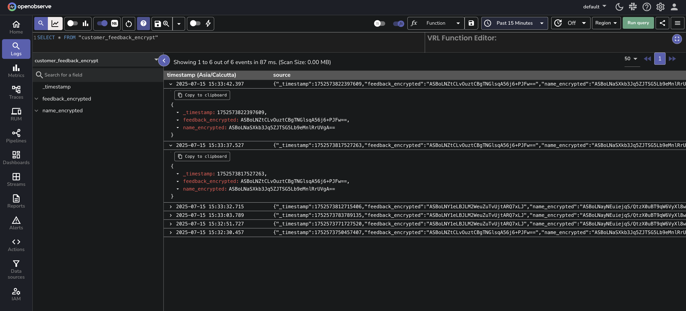

    **1. Decrypt a single field** <br>

    ```sql
    SELECT
      decrypt(name_encrypted, 'customer_feedback_key') AS name
    FROM "customer_feedback_encrypt"
    ```
    This returns the decrypted value of the `name_encrypted` field. 
    <br>
    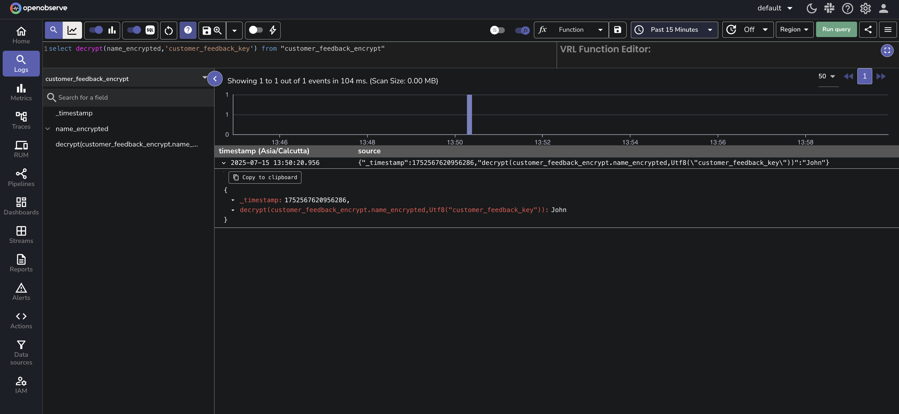

    **2. Decrypt multiple fields** <br>
    ```sql
    SELECT
      decrypt(name_encrypted, 'customer_feedback_key') AS name,
      decrypt(feedback_encrypted, 'customer_feedback_key') AS feedback_text
    FROM "customer_feedback_encrypt"
    ```
    This returns decrypted values for both `name_encrypted` and `feedback_encrypted`. 
    <br>
    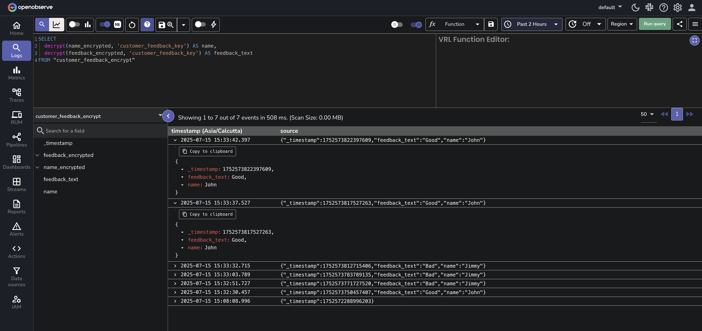


---
??? "Use the `decrypt_path` function"
    ### Use the `decrypt_path` function
    Use `decrypt_path()` to decrypt a specific value nested inside a JSON field. The field itself must be a valid JSON object. The path specifies the location of the encrypted value inside that object. The function will apply decryption only at that path.

    !!! node "Syntax"
        ```sql
        decrypt_path(encrypted_field, 'cipher_key_name', 'path')
        ```
        Here: 

        - `encrypted_field`: A JSON object or nested data structure that contains encrypted values at various paths. 
        - `cipher_key_name`: The name of the Cipher Key used during encryption.
        - `path`: A dot-delimited string that specifies the location of the encrypted value within the nested JSON structure. Use '.' to return the entire decrypted object.


    **Example:**

    If a log entry from the `encrypted_logs` stream contains:

    ```json
    {
      log: {
        "a": {
          "b": {
            "c": "ENCRYPTED_STRING"
          }
        }
      }
    }
    ```
    And `ENCRYPTED_STRING` decrypts to `xyz` using the cipher key `my_key`. Then the following SQL query: 

    ```sql
    SELECT decrypt_path(log, 'my_key', 'a.b.c') AS decrypted_value FROM "encrypted_logs"
    ```
    returns: 

    ```json
    {
    decrypted_value: xyz
    }
    ```

    **Sample Encrypted Dataset**: The following records exist in encrypted format in the `customer_feedback_nested` stream. Each record has multiple encrypted fields at different nesting levels:
    <br>
    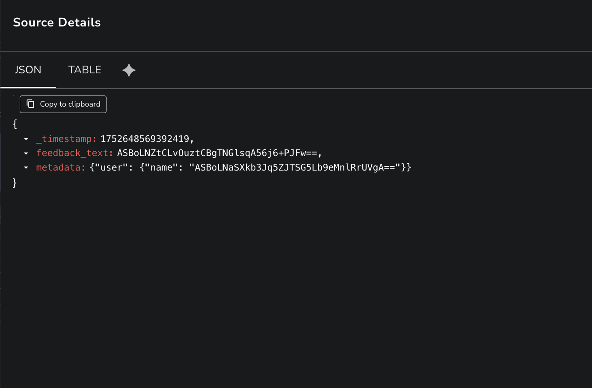

    **1. Decrypt a top-level field**
    The `feedback_text` field contains an encrypted plain-text value. To retrieve its original value, use `decrypt_path()` with the path set to '.'.
    ```sql
    SELECT
      decrypt_path(feedback_text, 'customer_feedback_key', '.') AS feedback_text_decrypted
    FROM "customer_feedback_nested"
    ```
    <br>

    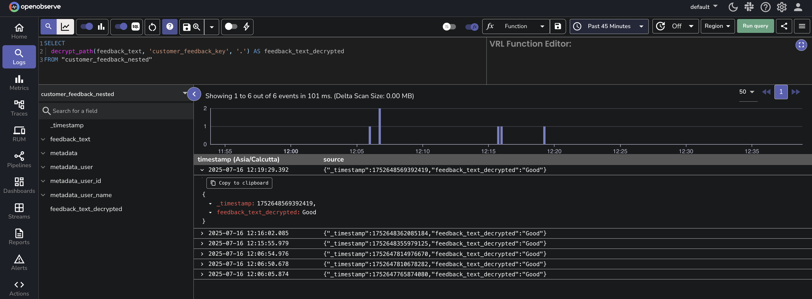

    **2. Decrypt a nested field**
    To retrieve the decrypted value of `name`, you can write the query as shown below: 
    ```sql
    SELECT
      decrypt_path(metadata, 'customer_feedback_key', 'user.name') AS name
    FROM "customer_feedback_nested"
    ```
    <br>

    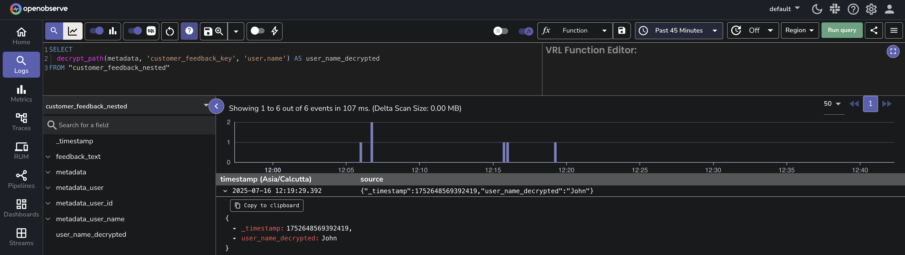

    !!! Info "Path Examples for `decrypt_path()`"
        The `decrypt_path()` function allows you to specify exact JSON paths to selectively decrypt fields.  <br>
        The following examples show how to define the path in the decrypt_path() function for different JSON structures, including nested arrays and objects.

        - Decrypt tokens in an array of sessions
        **Input:**

        ```json

        {
        "sessions": [
            { "id": "1", "token": "ENC(...)" },
            { "id": "2", "token": "ENC(...)" }
        ]
        }
        ```
        **Path**: `sessions.*.token` <br>
        This path decrypts the token field in each object within the sessions array.

        - Decrypt nested fields in a multi-level array
        **Input:**

        ```json
        {
        "data": [
            {
            "details": [
                { "secure": "ENC(...)" },
                { "secure": "ENC(...)" }
            ]
            }
        ]
        }
        ```
        **Path:** `data.*.details.*.secure` <br>
        This path decrypts every secure field in each nested details array within the data array.


---


## Use `decrypt` and `decrypt_path` with Filter Clauses
You can use the `decrypt()` and `decrypt_path()` functions inside `WHERE` clauses to filter logs based on decrypted values. This enables querying on encrypted fields without storing or exposing the decrypted content.

- **With the WHERE clause**: The following query retrieves the `name_encrypted` from the `customer_feedback_encrypt` stream where the decrypted value of the `name_encrypted` field matches the string '`John Doe`'. Note that the expected result is still in encrypted form.  

```
Select name_encrypted from "customer_feedback_encrypt" where decrypt(name_encrypted,'customer_feedback_key') = 'John';
```
<br> 
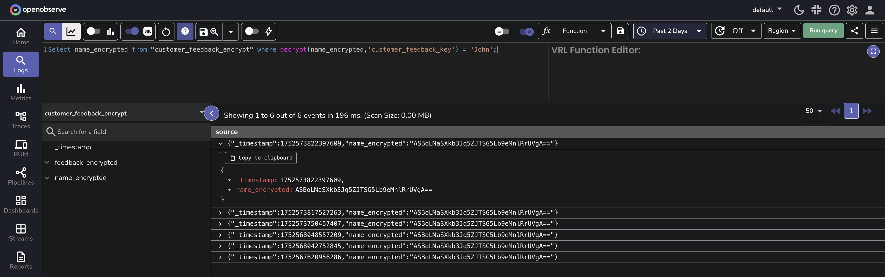

- **With the LIKE clause**: This query will decrypt the `user_data` field using the `user_data_decryption_key` and return results where the decrypted data contains the substring '`John`': 
```
SELECT user_id FROM user_activity_stream WHERE decrypt(user_data, 'user_data_decryption_key') LIKE '%John%';
```
<br>
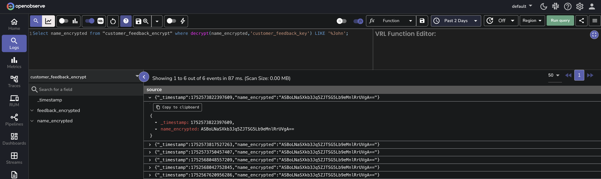

!!! Note
    - The time the data was ingested does not affect decryption.   
    - When working in a super cluster, **Cipher Keys** created in one cluster are visible and usable in other clusters. 

## Manage Cipher Keys

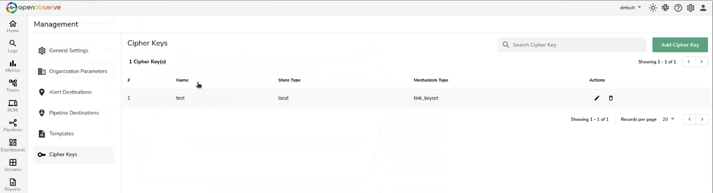 <br>
To update or delete a Cipher Key, click the edit or delete icon under the **Actions** column, respectively.

## Cipher Key Storage in OpenObserve 

When using **OpenObserve** as the encryption key (secret) storage option, you can encrypt the secret before storing it in the OpenObserve database by setting the following environment variables:

- **`ZO_MASTER_ENCRYPTION_ALGORITHM`**: Set it to `aes-256-siv`.   
- **`ZO_MASTER_ENCRYPTION_KEY`**: Set it to the encryption key you want OpenObserve to use to encrypt the secret. This must be a valid `aes-256-siv` key. Tink Key cannot be used here.

!!! info "Important Note"
    - To set up the above environment variables for **Cipher Keys** in OpenObserve’s database, first delete the existing **Cipher Keys** to avoid errors.   
    - If `ZO_MASTER_ENCRYPTION_KEY` is changed, the existing secret associated with `ZO_MASTER_ENCRYPTION_KEY` is no longer visible and usable. 

## Failure Modes

**While managing Cipher Keys**:

- **Invalid Key Value During Update:** If you provide invalid values while updating a **Cipher Key**, the system will display an error message and prevent the update from being saved. The existing Cipher Key value remains unchanged and valid. Ensure that the values you enter are correct.   
- **Duplicate Cipher Key Names:** Ensure that each **Cipher Key** name is unique.  
- **Invalid Characters in Cipher Key Name:** Ensure that **Cipher Key** names do not contain colons.
- **Incorrect Encryption Key Type (Simple or Tink):** When storing encryption keys, ensure you use the correct key type (Simple or Tink). If an incompatible key type is used, the system will show an error, and the key remains unsaved.  
- **Invalid Akeyless Credentials:** If you enter invalid Akeyless credentials during **Cipher Key** creation or update, the system will reject the operation and show an error message. Correct the credentials and try again.    
- **Error in DFC Configuration:**

    - For DFC without an Initialization Vector (IV), the system accepts any IV value except an empty one. An empty IV will trigger an error.  
    - For DFC with an IV, the IV used for encryption must match exactly. A mismatch will result in an error during key creation or update.


**While using `decrypt` function in Log search**: 

- **Data is Not Encrypted (Plain Text):** If the data is in plain text and not encrypted, the system will return the data as-is. Ensure that the data is encrypted if you intend to use the `decrypt()` function.  
- **Data Not Encrypted With the Given Encryption Key:** If the data is not encrypted with the key you used to create the Cipher Key, the system will return the encrypted data as-is without decryption. Verify the encryption method and correct usage of the encryption key.  
- **No Permission on the Given Encryption Key:** If you do not have permission to use the encryption key, the system will deny access and display an error message stating that you do not have permission. To resolve this, contact your administrator for access to the encryption key.

## Limitation

- **Cipher Key Usage (March 2025):** **Cipher Keys** are currently used for decryption, and OpenObserve is working to expand their functionality to support encryption as well.   
- **decrypt() Function Scope (March 2025)**: As of now, the `decrypt()` function is limited to log search. OpenObserve is in the process of extending its capabilities to additional areas for broader application. 


