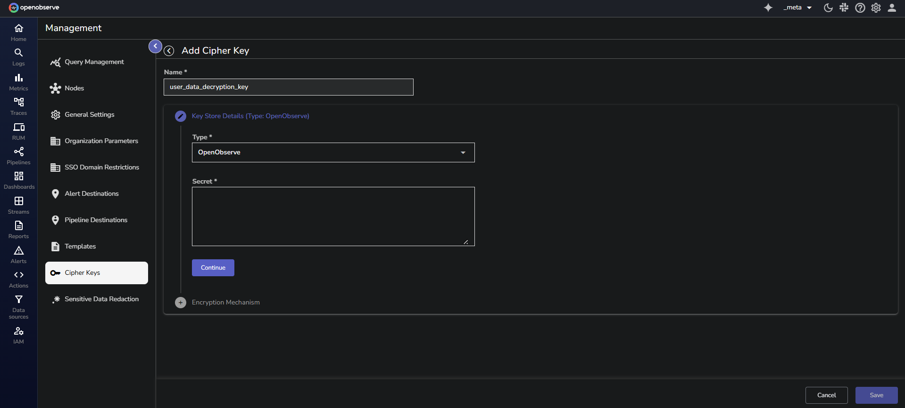

OpenObserve uses **Cipher Keys** to decrypt encrypted logs during search queries. This feature is essential for handling sensitive data stored in encrypted formats while still enabling effective log search and analysis, without storing decrypted data on disk. 

> **Note:** This feature is available aplicable to Enterprise Edition.

## Create Cipher Keys

Follow these steps to create and configure **Cipher Keys** in OpenObserve:

??? "Step 1: Navigate to the Cipher Keys Section"

    1. From the top navigation bar, click the gear icon to open the **Management** page.  
    2. Select **Cipher Keys**.

    

??? "Step 2: Create a New Cipher Key"

    1. On the **Cipher Keys** page, click the **Add Cipher Key** button.  
    2. Enter the required details:

        - **Name:** The key name must be **unique**. Characters like :, ?, /, #, and spaces are not allowed.   
        - **Key Store Type:** Choose where the encryption key will be stored:

            - **OpenObserve (Local)**: Stores the encryption key directly in OpenObserve’s database. If you select **OpenObserve**, paste your encryption key in the **Secrets** field. [Learn how you can encrypt the key before storing it in the OpenObserve database for additional security](#cipher-key-storage-in-openobserve). <br>
            

            - **Akeyless**: Allow using Akeyless as an external key management system to store keys. If you select Akeyless, enter the Base URL of the Akeyless API, Access ID, Authentication details - Access Key or Lightweight directory access protocol (LDAP), and Secret Types - [Static](https://docs.akeyless.io/docs/static-secrets) or [Distributed Fragments Cryptography (DFC)](https://docs.akeyless.io/docs/zero-knowledge). <br>
             

    3. Click **Continue**. 

??? "Step 3: Select the Encryption Mechanism"

    Choose an encryption method:

    - **Simple**: Choose if encryption is done using Advanced Encryption Standard (AES). From the dropdown, select the algorithm as `AES-256 SIV`.  
    - **Tink KeySet**: Choose if the encryption is done using Google Tink.
    <br>

    

    After you have filled in all the details, click **Save**. Your new **Cipher Key** is now available to use in OpenObserve.

---

## Query Encrypted Logs with `decrypt` and `decrypt_path`

You can retrieve original values from encrypted logs using the `decrypt()` and `decrypt_path()` functions. These functions operate at query time and do not write decrypted data to disk.

### Use the `decrypt` function
Use the `decrypt()` function when the encrypted field contains a non-nested value value. 

**Syntax** <br>
```sql
decrypt(encrypted_field, 'cipher_key_name') from "stream_name"
```
Here: 

- `encrypted_fiel`d: The field containing the encrypted value.
- `cipher_key_name`: The name of the **Cipher Key** used during encryption.
- `stream_name`: The name of the stream where the encrypted data is present. 

**Sample Encrypted Dataset** <br>
The following log entries exist in the `customer_feedback_encrypt` stream: 
<br>


**1. Decrypt a single field** <br>

```sql
SELECT
  decrypt(name_encrypted, 'customer_feedback_key') AS name
FROM "customer_feedback_encrypt"
```
This returns the decrypted value of the `name_encrypted` field. 
<br>


**2. Decrypt multiple fields** <br>
```sql
SELECT
  decrypt(name_encrypted, 'customer_feedback_key') AS name,
  decrypt(feedback_encrypted, 'customer_feedback_key') AS feedback_text
FROM "customer_feedback_encrypt"
```
This returns decrypted values for both `name_encrypted` and `feedback_encrypted`. 
<br>


---

### Use the `decrypt_path` Function
Use the `decrypt_path()` function when the encrypted content is a structured object, such as a JSON map, and you want to retrieve only a specific nested value.

**Syntax** <br>
```sql
decrypt_path(encrypted_field, 'cipher_key_name', 'path')
```
Here: 

- `encrypted_fiel`d: The field containing the encrypted value.
- `cipher_key_name`: The name of the Cipher Key used during encryption.
- `path`: The location inside the decrypted result to extract.

    - Use '.' to return the entire decrypted object.
    - Use a specific **dot-delimited path** to a key to extract a nested field from the decrypted object.
    This is required when the decrypted value is a JSON object and you only need part of it.


**Sample Encrypted Dataset** <br>
The following records exist in encrypted format in the `customer_feedback_nested` stream. Each record has multiple encrypted fields at different nesting levels:
<br>


**1. Decrypt a top-level field**
The `feedback_text` field contains an encrypted plain-text value. To retrieve its original value, use `decrypt_path()` with the path set to '.'.
```sql
SELECT
  decrypt_path(feedback_text, 'customer_feedback_key', '.') AS feedback_text_decrypted
FROM "customer_feedback_nested"
```
<br>


**2. Decrypt a nested field**
To retrieve the decrypted value of `name`, you can write the query as shown below: 
```sql
SELECT
  decrypt_path(metadata, 'customer_feedback_key', 'user.name') AS name
FROM "customer_feedback_nested"
```
<br>


---


## Use `decrypt` and `decrypt_path` with Filter Clauses
You can use the `decrypt()` and `decrypt_path()` functions inside `WHERE` clauses to filter logs based on decrypted values. This enables querying on encrypted fields without storing or exposing the decrypted content.

- **With the WHERE clause**: The following query retrieves the `name_encrypted` from the `customer_feedback_encrypt` stream where the decrypted value of the `name_encrypted` field matches the string '`John Doe`'. Note that the expected result is still in encrypted form.  

```
Select name_encrypted from "customer_feedback_encrypt" where decrypt(name_encrypted,'customer_feedback_key') = 'John';
```
<br> 


- **With the LIKE clause**: This query will decrypt the `user_data` field using the `user_data_decryption_key` and return results where the decrypted data contains the substring '`John`': 
```
SELECT user_id FROM user_activity_stream WHERE decrypt(user_data, 'user_data_decryption_key') LIKE '%John%';
```
<br>


!!! Note
    - The time the data was ingested does not affect decryption.   
    - When working in a super cluster, **Cipher Keys** created in one cluster are visible and usable in other clusters. 

## Manage Cipher Keys

 <br>
To update or delete a Cipher Key, click the edit or delete icon under the **Actions** column, respectively.

## Cipher Key Storage in OpenObserve 

When using **OpenObserve** as the encryption key (secret) storage option, you can encrypt the secret before storing it in the OpenObserve database by setting the following environment variables:

- **`ZO_MASTER_ENCRYPTION_ALGORITHM`**: Set it to `aes-256-siv`.   
- **`ZO_MASTER_ENCRYPTION_KEY`**: Set it to the encryption key you want OpenObserve to use to encrypt the secret. This must be a valid `aes-256-siv` key. Tink Key cannot be used here.

!!! info "Important Note"
    - To set up the above environment variables for Cipher Keys in OpenObserve’s database, first delete the existing Cipher Keys to avoid errors.   
    - If `ZO_MASTER_ENCRYPTION_KEY` is changed, the existing secret associated with `ZO_MASTER_ENCRYPTION_KEY` is no longer visible and usable. 

## Failure Modes

**While managing Cipher Keys**:

- **Invalid Key Value During Update:** If you provide invalid values while updating a Cipher Key, the system will display an error message and prevent the update from being saved. The existing Cipher Key value remains unchanged and valid. Ensure that the values you enter are correct.   
- **Duplicate Cipher Key Names:** Ensure that each Cipher Key name is unique.  
- **Invalid Characters in Cipher Key Name:** Ensure that theCipher Key names do not contain colons (":").   
- **Incorrect Encryption Key Type (Simple or Tink):** When storing encryption keys, ensure you use the correct key type (Simple or Tink). If an incompatible key type is used, the system will show an error, and the key remains unsaved.  
- **Invalid Akeyless Credentials:** If you enter invalid Akeyless credentials during Cipher Key creation or update, the system will reject the operation and show an error message. Correct the credentials and try again.    
- **Error in DFC Configuration:**

    - For DFC without an Initialization Vector (IV), the system accepts any IV value except an empty one. An empty IV will trigger an error.  
    - For DFC with an IV, the IV used for encryption must match exactly. A mismatch will result in an error during key creation or update.


**While using `decrypt` function in Log search**: 

- **Data is Not Encrypted (Plain Text):** If the data is in plain text and not encrypted, the system will return the data as-is. Ensure that the data is encrypted if you intend to use the `decrypt()` function.  
- **Data Not Encrypted With the Given Encryption Key:** If the data is not encrypted with the key you used to create the Cipher Key, the system will return the encrypted data as-is without decryption. Verify the encryption method and correct usage of the encryption key.  
- **No Permission on the Given Encryption Key:** If you do not have permission to use the encryption key, the system will deny access and display an error message stating that you do not have permission. To resolve this, contact your administrator for access to the encryption key.

## Limitation

- **Cipher Key Usage (March 2025):** Cipher Keys are currently used for decryption, and OpenObserve is working to expand their functionality to support encryption as well.   
- **decrypt() Function Scope (March 2025)**: As of now, the `decrypt()` function is limited to log search. OpenObserve is in the process of extending its capabilities to additional areas for broader application. 


