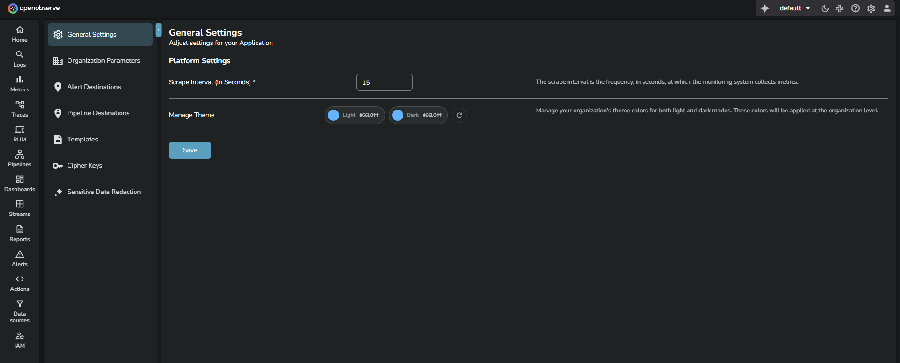
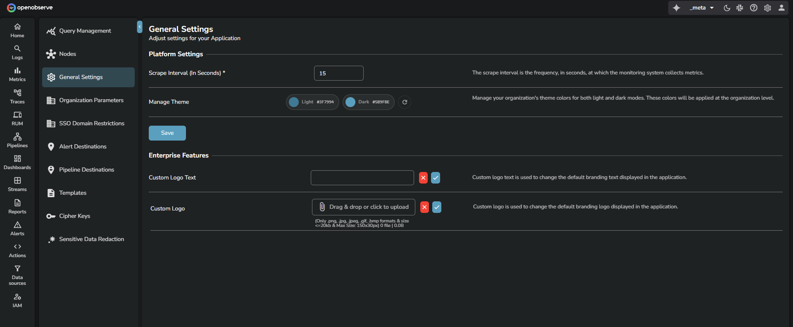

## General settings
This page explains how to use the settings available under General Settings in OpenObserve. These settings allow you to configure scrape interval, theme colors, and Enterprise branding. 

## What you can do in general settings
General settings provides the following configuration options:

- Scrape interval
- Theme configuration for light and dark modes
- Enterprise branding features such as custom logo text and custom logo

!!! note "Note"
    `_meta` organizations can access all settings. Regular organizations see only the options allowed for their specific license and permissions.

### Scrape interval
> This setting is available for all organizations.

The scrape interval defines how often the monitoring system collects metrics. Enter the number of seconds and select Save.

### Theme configuration
Theme configuration allows you to manage the default colors for light mode and dark mode for your organization. When you save these values, they are applied across the UI for all users in the organization.

You can set the following fields:

- Light mode color
- Dark mode color

Select **Save** to apply the changes.

### Theme configuration using environment variables
You can also configure the default theme colors at the system level. These values become the initial defaults for all organizations.

- `ZO_DEFAULT_THEME_LIGHT_MODE_COLOR`: Sets the default color used in light mode. Default:"#3F7994"
- `ZO_DEFAULT_THEME_DARK_MODE_COLOR`: Sets the default color used in dark mode. Default: "#5B9FBE"

If these variables are set, the UI loads these colors automatically unless overridden by an organization through the General Settings page.

### Enterprise branding
Enterprise branding options appear only in the `_meta` org when Enterprise features are enabled.

 

**Custom logo text**
Use this field to replace the default OpenObserve text shown in the header. Enter the required text and save the changes.
 

**Custom logo**
Upload a custom branding logo to replace the default OpenObserve logo in the header.

- Supported file formats: PNG, JPG, JPEG, GIF, BMP
- Maximum file size: 20 KB
- Maximum dimensions: 150 by 30 pixels

After uploading the file, select the save icon to apply the logo.